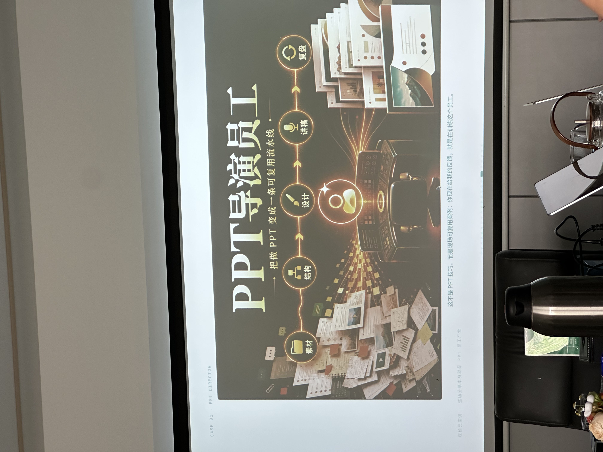
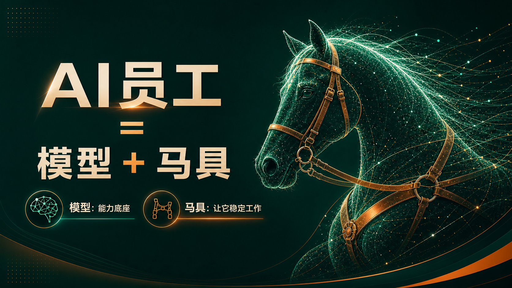
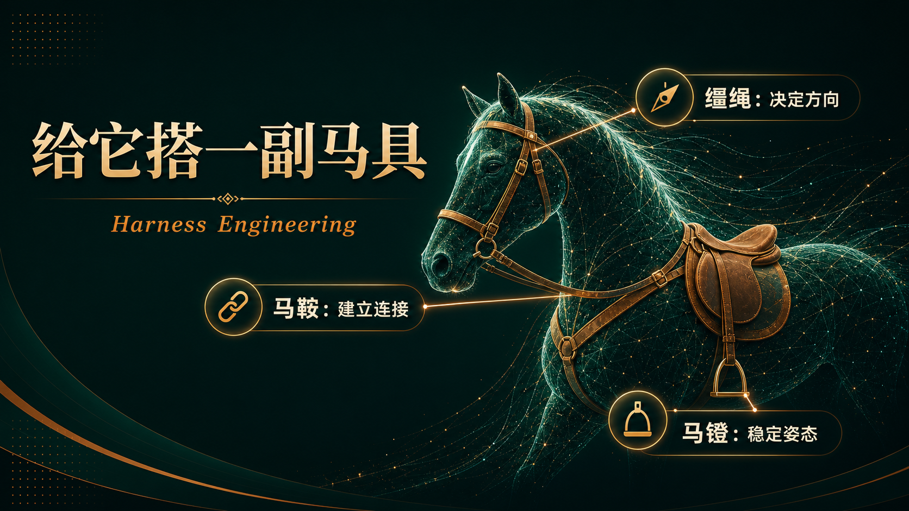
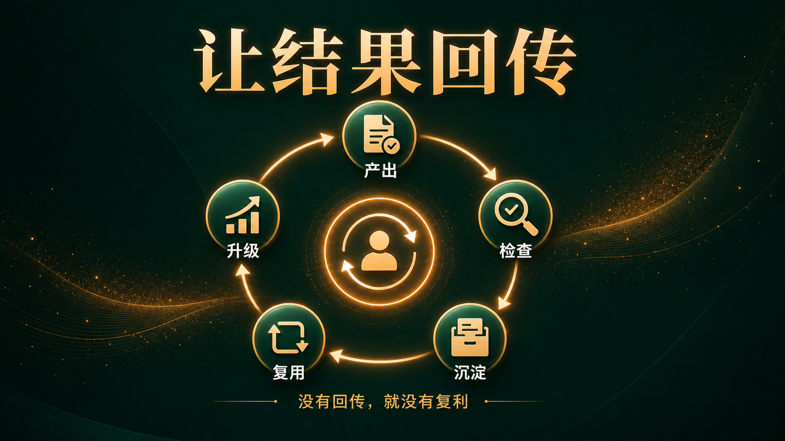
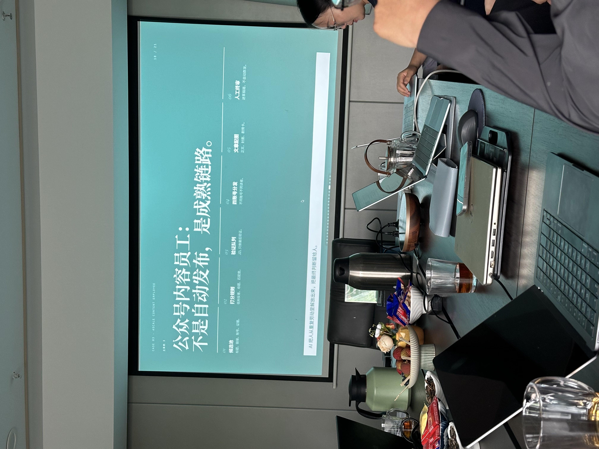
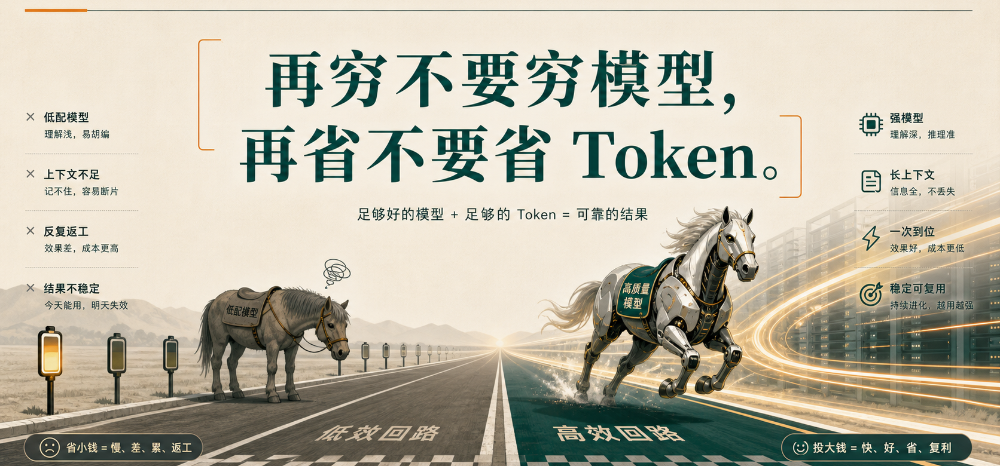
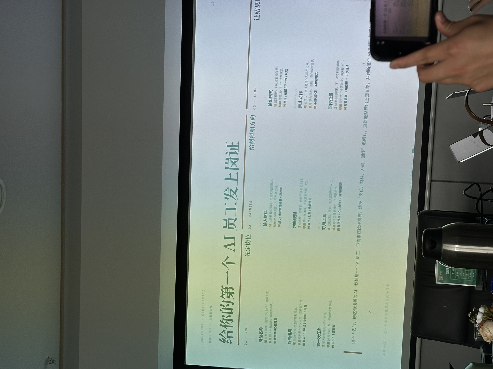
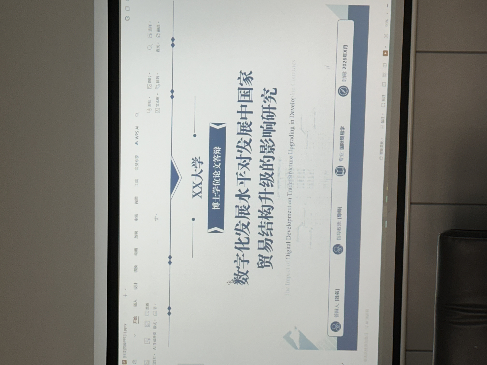
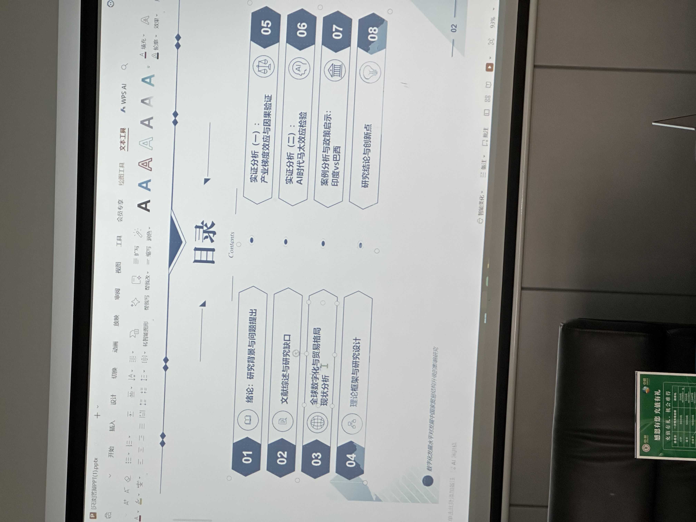
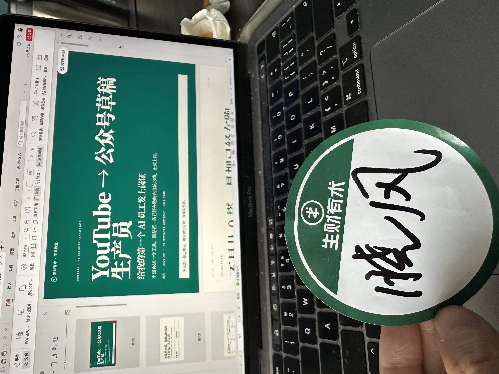

> 2026.05.23 · Saturday, took the high-speed rail from Nanjing to Suzhou for a small offline meetup.

---

## 1. The Biggest Disconnect: It's Not That You Don't Know How to Use AI, It's That AI Doesn't Have a Job

This meetup was in Suzhou, and I specifically traveled from Nanjing for it. A nearly four-hour round trip, and on the way back, I thought to myself: it was worth it.



The theme was "Issuing an Employment Certificate to AI." Halfway through the session, the organizer said something that really struck me:

> **"Many people aren't failing at using AI; rather, their AI doesn't have a specific job. You ask a question, it answers; the next day you open it, and it acts like it's meeting you for the first time."**

I reflected on my own situation. My desktop is cluttered with dozens of prompts, SOPs, Skills, and notes. It looks rich, but for every single task, I have to piece together the workflow all over again—which one to call first, how to fill in the parameters, and if I miss a step, I have to start over.

**AI is like a bunch of loose tools; it has never truly become an employee.**

---

## 2. A Formula: AI Employee = Model + Harness

The core of the entire sharing session boiled down to one formula:

> **Agent = Model + Harness**



The model is the horse; it determines the upper limit of capabilities. The harness determines whether it can run steadily toward your goal.

The harness can be broken down into three components:



- **Reins** — Giving direction: Letting AI know the goals, constraints, and judgment rules.
- **Saddle** — Connecting data and tools: Giving AI access to files, knowledge bases, and permissions.

- **Stirrups** — Stabilizing output and feedback loops: Fixing the delivery format so the results can be inspected and fed back into the system.

In practice, this means "three strands of rope": **First provide the facts, then provide the direction, and let the results be fed back.**

**The most crucial part is the feedback loop.** A one-off Q&A is just outsourcing. Only when the results return to your files, spreadsheets, or knowledge base does it create compound interest. Without a feedback loop, you are starting from zero every time.



---

## 3. Quotes I Wrote Down Repeatedly

Throughout the sharing and discussions with group members, there were a few quotes I copied directly into my notebook:



**"No matter how poor you are, don't skimp on the model; no matter how much you want to save, don't skimp on Tokens."**
— Skimp on the model, and the AI's reasoning gets flaky; skimp on tokens, and the evidence gets cut off. You might think you're saving a few bucks, but you'll end up spending much more on rework and misjudgments.



**"There's no secret to using AI other than using it a lot. The results of spending 8 hours a day versus 8 minutes a day are completely different."**
— You can only perceive the boundaries of AI's capabilities through extensive use.

**"You need to talk to people who have achieved results; your circle matters."**
— This isn't a new saying, but it's especially fitting for AI. A true expert can open your eyes with just one small piece of advice.

**"Get used to pouring cold water on AI."**
— AI models hallucinate. Key decisions require cross-validation across different models, and more importantly, you must proactively question it.

**"Everything can be CPS (Cost Per Sale). Don't touch heavy-investment projects; focus on asset-light operations."**
— This was another member's perspective. It sounds like a crossover from e-commerce, but its essence aligns perfectly with "issuing an employment certificate to AI": find lightweight workflows that can compound, and avoid getting bogged down in heavy investments.



---

## 4. Practical Experience from Group Members (By Industry)

The second half of the meetup was spent exchanging specific strategies. Here are a few that I found directly applicable:



**Regarding Accounts and Models**
Genuine overseas accounts aren't actually that expensive. If you think they are too pricey at first, you can spend a few bucks on a shared or temporary account to test the waters; it doesn't matter if it gets banned. If you have the means, just upgrade to Pro. Absolutely do not skimp on the model. CC and Codex each have their uses, and CC can call other models (including domestic ones).

**Regarding Tool Combinations**
For copywriting, Claude is the top choice as it's less likely to be detected as AI; GPT is versatile but feels very "AI-generated." Doubao's voice input works better than WeChat's, and its expert mode can even serve as a great companion tool for parents. Use Claude for human-like processing for Xiaohongshu/WeChat Official Accounts. After writing a monetization post, throw it to AI for multiple rounds of review.

**Regarding Industry Applications**
- **Beauty Industry:** AI for bulk distribution; Xiaohongshu (Little Red Book) is the main battlefield.
- **Sales:** AI for DingTalk prospecting copy, combined with custom mini-programs + ready-made development boards.
- **Matrix Operations:** Use social media assistants for commenting, **but the publishing step must be manual to avoid risk control flags.**
- **Infrastructure:** Don't use residential broadband; use multiple broadband lines + overseas soft routers.

**An Interesting Perspective:** There are fewer than 20 million people in mainland China who can bypass the firewall. This means that as long as you can proficiently use Claude/GPT, you are already in a relatively small, advantageous pool.



---

## 5. The Assignment I Submitted: YouTube → Official Account Draft Producer

The unified assignment for the meetup was: **Issue an "employment certificate" to a small task that will repeat this week, and let it run a real task tomorrow.**

I didn't build from scratch; instead, I formalized the messy workflow I was already running into a proper employee:

- **Position:** YouTube → Official Account Draft Producer (Focusing on AI/Marketing topics)
- **Result:** Deliver 1 ready-to-publish Official Account draft within 24 hours.
- **MVP (Minimum Viable Product):** Tomorrow, manually input 1 URL, run the full process, and have the result wait in the draft box.

A 7-step assembly line, with each step tied to a Skill:

```text
Extract Transcript → Rewrite Article → Image Prompt → Generate Image 
→ Compress to webp → Remove Watermark → Send to Draft Box
```

Tomorrow, I'll take 10 minutes to start it, let the AI run in the background for 20 minutes, and then spend another 10 minutes manually reviewing it. **No automatic publishing; it stops in the draft box, waiting for my confirmation.**

After it runs stably 5 times, I will upgrade it: subscribe to channel monitoring, model topic judgment, image template library, and multi-platform distribution. **I will only change one thing at a time.**



---

## 6. What I Took Away Wasn't a Concept, But a Small Employee Ready to Work Tomorrow

The most useful sentence of the entire sharing session was the closing one:

> **"Leaving with one real, small task is more important than leaving with ten advanced concepts."**

Over the past half-year, I've watched too many AI tutorials and tried too many tools. My desktop got more and more cluttered, but my efficiency didn't truly increase. Today, I finally understood the reason—**without a job position, there is no accumulation; without accumulation, you are always in the beginner's village.**

If you feel the same way, take 10 minutes tonight and write an employment certificate for the small task you repeat most often:

```text
The employee I built is:
It is responsible for:
I feed it:
It outputs:
I feed back to:
Next round's improvement:
```

Only when you can fill out "Next round's improvement" has the AI truly joined your team.

---

**The upper limit of AI depends on your imagination, but the lower limit of AI depends on the employment certificate you issue to it.**

— Xiaofeng, Written on May 23, 2026, on the high-speed train from Suzhou back to Nanjing.
