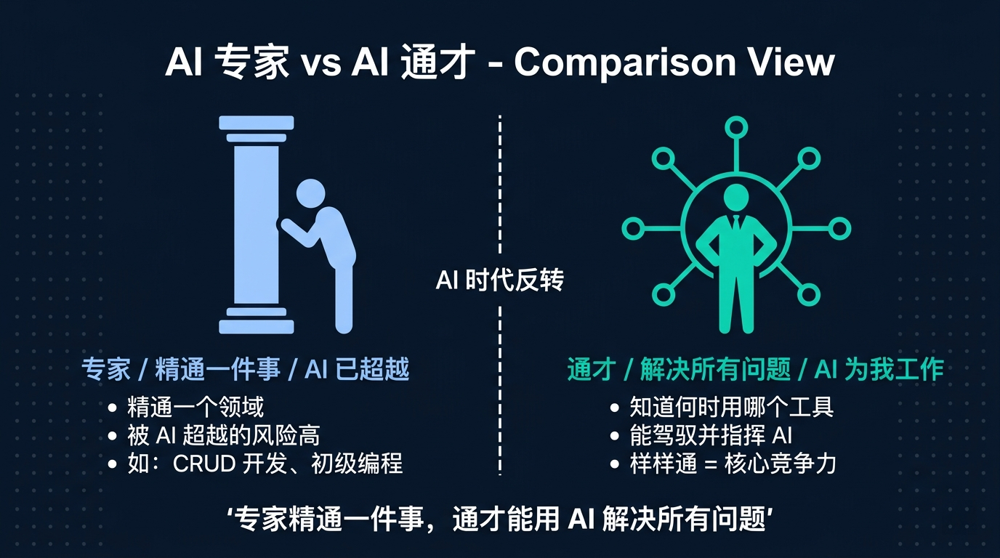
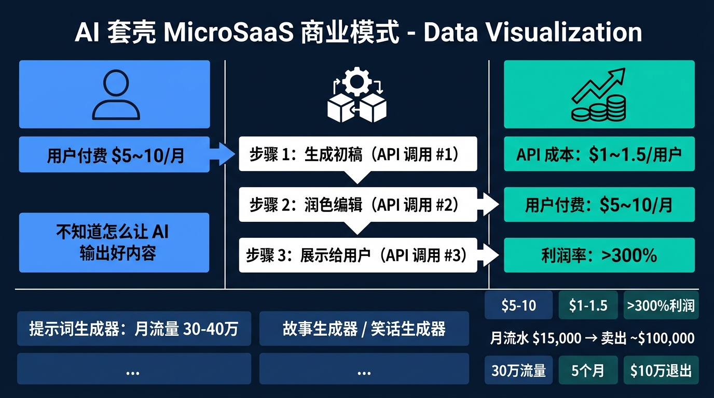
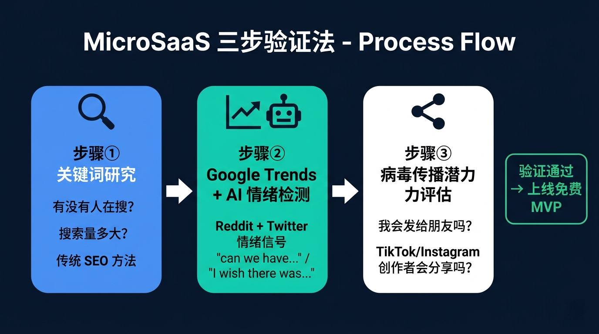
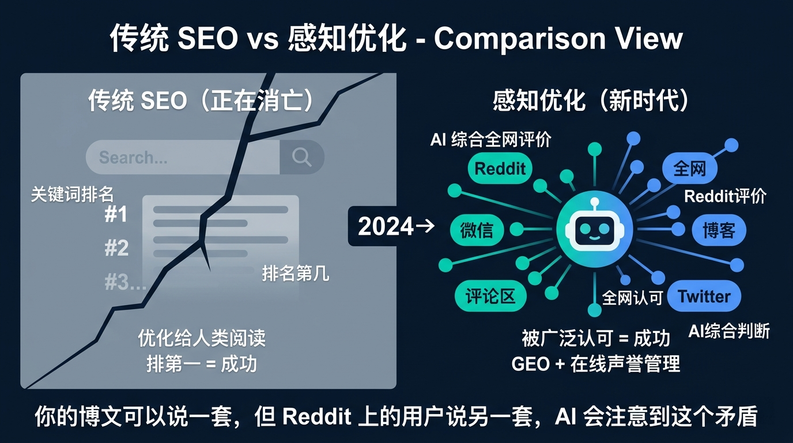
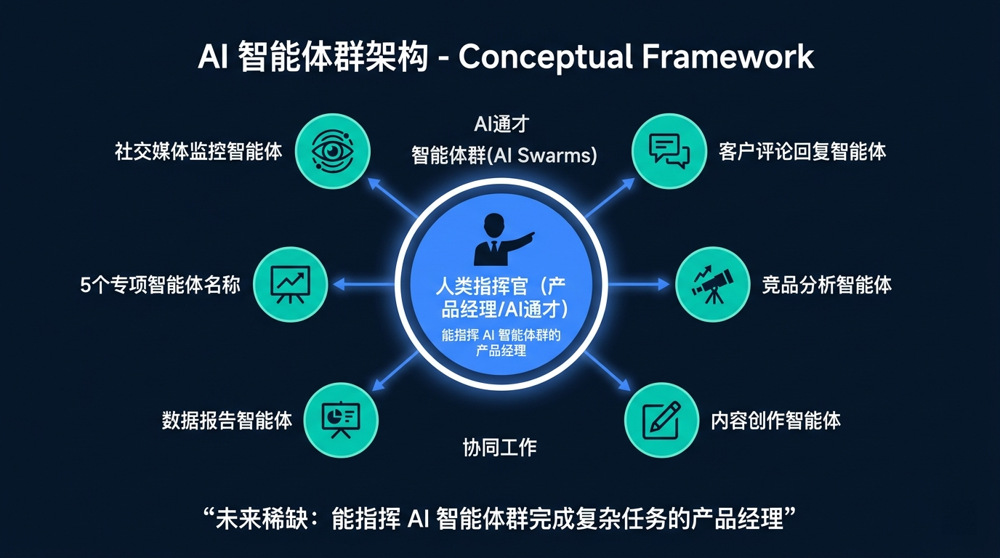

> I recently listened to a podcast featuring Deepak, an Indian builder who bills himself as an "AI generalist."

> The host met him at an SEO summit in Vietnam, was blown away by his talk on **AI swarms**, and brought him on for over an hour. By the end, I had torn down and rebuilt a lot of my assumptions about SEO.

---

Deepak is Indian; he splits time among New Delhi, Southeast Asia, and the Himalayas. On LinkedIn he calls himself an **AI generalist**—not an AI specialist, but a *generalist*.

In 2023 he started shipping MicroSaaS products in batches. Within five months he sold one project doing about $15K MRR for roughly $100K, then repeated the playbook many times over. "The last exit was November 2025. I'm still at it," he says.

He also runs a prompt-generator site with 300K–400K visits a month and thousands in passive income—and refuses to sell it, because that is where he met his wife.

This article distills the best of that conversation.

---

## Part 1: Why an AI generalist can be worth more than an AI specialist

The host opens by asking: you always say "AI generalist"—why not just call yourself an AI expert?

His answer stuck with me:

**"A specialist masters one thing. A generalist uses AI to solve every problem."**

AI is moving too fast for anyone to be an expert in every niche. A generalist, in his framing, knows what is happening across the ecosystem and can quickly match a problem to a solution.

"More importantly," he says, "AI has already surpassed specialists in many domains. Take software—on typical CRUD apps, AI often outwrites many mid-level developers. Front end, back end: aim it well and it delivers. So where is *your* value? **In whether you can direct AI and make it work for you.**"

The old insult "jack of all trades, master of none" flips in the AI era, he argues, because knowing *when* to use which tool is exactly what steering AI is about.

---

## Part 2: From SEO roots to MicroSaaS at scale

Deepak's SEO story starts in 2014, still in college.

He learned monetization on Tumblr with AdSense, then moved to WordPress and built Fedo.com around marketing and advertising—essentially reworking Kotler's *Marketing Management* into ultra-long-tail pages that linked back to hub content.

By 2019 he ranked #1 on Google for "marketing" and "advertising," with traffic north of 3M visits a month.

"That's the year I bought the house I still live in," he says.

So why pivot to MicroSaaS?

**"Because the SEO industry, as we knew it, was running out of runway."**

The web is entering an **agent era**. He cites a figure: about 60% of browsing behavior is no longer human—it is agents like Claude Code, OpenAI's Operator, Google's WebMC, automating search and tasks.

**"When your user is not a human, why optimize for human reading experience?"**

In 2023 he started building AI wrappers.

---

## Part 3: Why "wrapper" MicroSaaS could charge money

Many people treat "AI wrapper" as a slur—a thin API skin with a paywall.

Deepak reframed it for me.

**In 2023, users did not know how to use AI.**

They had just heard of ChatGPT and had no prompt craft. The pain was simple: model output was bad, and they did not know how to fix it.

His team **wrote prompts that actually worked** and packaged them so users only filled in a few fields to get strong output.

One API call for a draft, a second for polish, a third to present the result—three steps. Users paid roughly $5–10/month; API cost per user was about $1–1.5, for margins north of 300%.

They shipped story generators, joke generators, prompt generators, and some NSFW vertical niches—absurdly specific and simple, but at the time people paid.

**The breakout was the prompt generator.**

It does 300K–400K visits a month on a DR 71–level keyword cluster and sits in Google's top three.

"How much did you spend on SEO?" the host asks.

"No more than about $1,000 on links—maybe five to ten quality placements."

"And then?"

"TikTok creators started making videos about the tool on their own. That brought something like 100K visits in a month—and it snowballed."

---

## Part 4: A three-step validation loop—no wasted dollars

His validation loop is deliberately short:

**Step 1: Keyword research.** Classic SEO due diligence—is anyone searching, and at what volume?

**Step 2: Trends + social signal.** Beyond Google Trends, he runs a custom agent that scrapes Reddit and Twitter for phrases like "can we have..." and "I wish there was..." to see if demand is real and rising.

**Step 3: Shareability.** Many founders skip this; Deepak treats it as core: **Would I send this to a friend? Would I bookmark it and come back?**

He says most of his MicroSaaS never relied on heavy paid acquisition—distribution came from creators on TikTok and Instagram. Those creators were not always his ICP, but they reached people who were.

**Moz research separates "link creators" from "buyers,"** he notes. "You need link creators to *want* to share; they bridge you to real buyers."

---

## Part 5: Five months, $100K, then rinse and repeat

The first exit was intro-driven.

The buyer was building something similar but could not rank; CAC was brutal. Deepak's asset was printing ~$10K net a month, and the buyer offered about a 10× multiple—roughly $100K.

"Why not push for more?" the host asks.

"I tried; they would not budge. Five months of work for $100K felt fine," he laughs—"and it was a risky niche that could die any day."

On the second exit he got smarter.

He sold a project doing under $5K MRR—but negotiated roughly **20×**, again landing near $100K.

"You know why the second time was 20×?" he says. "Because I already knew what the market would pay."

Since then: spot need → validate → ship a free MVP → add payments → grow traffic → find the right buyer → exit.

The latest successful exit was November 2025. He is still building.

---

## Part 6: SEO is not dead—but the SEO you learned is on life support

Back to SEO.

His take: **classical search-engine optimization has hit an historical inflection point.**

Not because tactics stopped working—because *search behavior* is being rewired.

Gen Z often does not start on Google for purchases: TikTok for reviews, Instagram for visuals, Reddit for honest takes, Pinterest for inspiration. Different intent, different surfaces—and Google is sidelined in many of those journeys.

The deeper shift is AI.

Take OpenAI's Deep Research: one query can mean 10 or 20 searches, pulls from many sources, and returns a **synthesized narrative**—not a page of blue links.

**Your ranking position matters less and less.**

What matters instead?

Deepak's term: **Perception Optimization**.

---

## Part 7: What perception optimization means

"When an AI agent searches on behalf of a user, it may read 10 or 20 results and synthesize. It is not only checking where you rank—it is reading **how the open web feels about you**: forums, social mentions, comment sections, Reddit threads."

"Your blog can say one thing; if Reddit says another, the model notices the tension and may stop recommending you."

He gives a real example: an Indian protein-bar brand backed by a Bollywood star spent heavily on SEO blog content—all glowing. Reddit was scathing.

Result: ChatGPT would not recommend the brand.

His team rolled out "GEO + online reputation agents"—when negative posts appeared, agents reached commenters via DMs or replies, aiming for takedowns or product make-goods.

**SEO quietly became reputation and perception engineering.**

---

## Part 8: SEO becomes "conversational engine optimization"

Will SEO die?

His answer was nuanced.

"SEO dies the day humans stop being curious. As long as people hunt for answers, there is something to optimize—but the *object* of optimization changes."

He proposes a successor frame: **Conversational Engine Optimization (CEO)**—not chief executive officer, but optimizing for conversational answer engines.

Search was never only Google keywords. Before Google, people used libraries, friends, experts. That was all search.

Now questions go to Claude, GPT, Perplexity—tools that gather web evidence and answer in prose.

**In that chain, you do not win only by ranking #1; you win by being credibly endorsed across the web.**

Are you discussed on Reddit? Positively on X? Present in the communities your buyers trust? Getting organic recommendations from creators?

That is the new SEO.

---

## Part 9: AI swarms and the future of work

At the Vietnam summit, Deepak's talk was titled **AI Swarms**.

The model he deploys for clients is not a single chatbot but **a system of agents**: one watches social mentions, one handles comment replies, one tracks competitors, one drafts content, one refreshes reporting.

They coordinate as a swarm.

His punch line: **the scarce role is not "developer" but "product manager who can orchestrate agent swarms on complex jobs."**

"There are plenty of developers—and AI can already spit out a lot of CRUD," he says. "The leverage is translating client needs into executable agent task lists and running the whole choreography. **PM matters more than hands-on coding now.**"

What about non-technical people?

**Become a domain expert first,** he advises **then** automate that expertise with AI tools.

If you lead marketing, you may never write code—but you should know what n8n can automate, what Make can chain, where Claude Code helps with scripts, and which reports an agent can run daily.

That is the generalist path.

---

## Part 10: How he stays current without drowning

Near the end, the host asks how he keeps up.

His rhythm:

- **Monday–Friday:** Daily use of major AI tools—Runway, Claude, Gemini, Cursor—so he feels the real limits.
- **Weekends:** Deep dives on new tools, not surface skimming.
- **Wednesdays:** **No AI at all.**

Wait—none?

"Yes. The more I defaulted to AI, the more my own judgment atrophied. I need to **reclaim** my brain on a schedule. Tools are tools—you must not become the tool's accessory."

He goes further: **every three months, 10–12 days in the Himalayas, offline.**

His agents handle email, inbound, and lightweight client comms while he is gone.

Once he emerged right after DeepSeek R1 dropped; the whole timeline was on fire. He missed the peak FOMO.

"How'd that go?" the host asks.

"It was fine—that was FOMO, not signal," he laughs. "I came back clearer on what actually mattered next."

---

## Closing: the future belongs to people who direct AI

After the episode, a few conclusions felt sharper:

**1. SEO is not dead, but obsessing over "Google rank #1" will matter less.** What grows in importance is **managing how the open web talks about you**—perception optimization.

**2. The MicroSaaS window is still open—but shorter.** Wrappers worked in 2023 because users could not prompt. That gap is closing; the next wave may be **agent configuration and ops**.

**3. The scarcest role may be product management for AI systems**—not generic "AI expert," but someone who maps business needs to agent workflows and runs execution end to end.

**4. Scheduled disconnection is a productivity strategy, not laziness.** The noisier the feed, the harder it is to think.

Deepak closed with a line worth saving:

**"AI is already world-class across domains. Your only move is learning to make it work *for* you. That is not a crisis—it is an opportunity—if you choose to be the person who gives the orders."**

---

*Edited from the SEO Action Show podcast; condensed for reading.*
