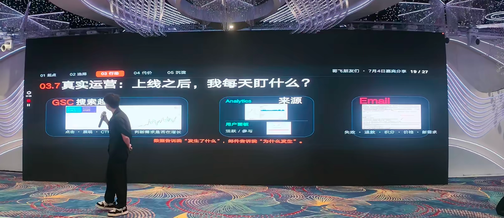
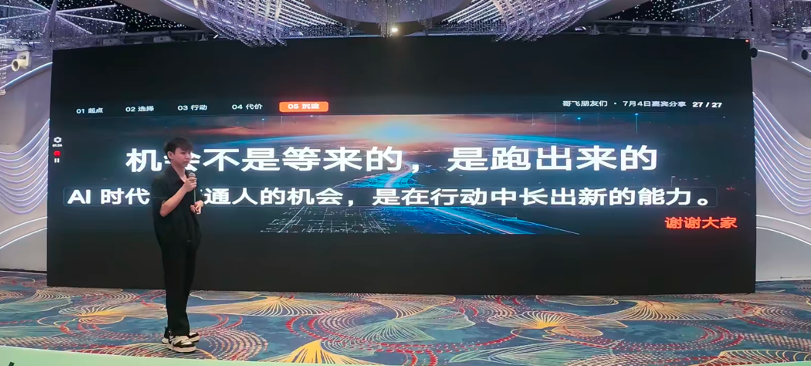

# From Construction Sites to Global Markets: Building a RMB 60K/Month AI Business Solo

> At the "**Gefei’s Friends, Mid-Year Sharing Exchange, Shenzhen Station**", an independent developer of AI-powered global entrepreneurship**brought about a sharing of the theme "**How People complete a career transition through AI-powered global entrepreneurship - from the construction industry to the growth path of AI independent developers**".
> >
> A year ago, he ran 20 projects, managed 20 people a day; a year later, he made 60,000 monthly products, developed, designed, operated, served, and collected data. He had no technical background, no global experience, no friends around him who were doing al or program -- he summed up the road as five words: **Do it, do it.**

---

## I. Starting point: from "stable poverty" to "naked rhetoric"

To be honest, he had just left his home at that time last year, when he was the Deputy General Manager at a construction company in Guangdong — two years to climb up, and two years to build. The chairman of the company knew he was going to leave, "tried to stay," but he chose to leave.

**The trigger point was "the bottleneck of linear growth."**He found himself investing more and more energy, and the project stopped after him, and he had less and less time to spend with his family — which is contrary to his long-sought goal of "liberating time."

> He laughed that he was in a "stable poverty" situation -- not a small amount of money from his home, but the ceiling of the entire industry.

And what's more interesting is that he's really "naked" -- he doesn't even know what to do when he resigns. One of his classmates suggested that he "can understand AI," so he started looking for information on various communities and knowledge planets. Until then, his message was completely closed -- one person ran 20 projects at the same time, doing business outreach, and never had time to know the outside world.

### About anxiety: don't get kidnapped by trafficking.

In particular, many people are worried about short videos, "Ai is here and is out of school," and they're encouraged by "someone's short-term admissions."

> His proposal is: **Don't be influenced by external factors, and think more about how to allow one step at a time to sink and grow. **Embrace AI.

---

## ii. Choice: Why AI-powered global entrepreneurship?

### Zero basics can do things.

He started with "Zero Foundations, Zero Backgrounds" -- none of his friends did AI, nor did any of his friends do the program. After joining the Gefei’s community, he made 60,000 monthly.

The core of his judgment is that one person is a team during the IAI era.**Products, development, design, operation, customer service, data can now be handled by one person.

- lunch a spot fast enough to throw one up in two hours;
- If you can change the API, you can almost recapitulate it.
- The payment of access is now less than 10 minutes away;
- I'll be able to run with a field name on the line.

### AI's real threshold is not technology.

It is believed that now the threshold for AI is very low -- pages can do, functions can run, returns can generate.**The real threshold is "judgment":**

- To judge whether demand is real - **Don't go to the education market, to embrace the market **;
- (a) To determine whether the product is sustainable - not one-time;
- Burden of losses and error of test — cash flow must be kept safe.

> He gave the example: "A little bit of a programmer," and now the other way around -- a lot of programmers are looking for an idea. **With a mastery but no real need, it's the most common problem at the moment.**

### Long-termist choice

His life had changed — he had been tied up in one project before; now he was flying around the country, where he wanted to work, so he could sleep until he woke up.

> "If I hadn't had this meeting today, I could have gone around now, totally enough."

---

## III. ACTION: THE MINORITY OF A PERSON

### 3.1 Five steps to run the closed circle

The minimum closed ring of a person's product is summed up in five steps:

| Steps | Key Actions |
| --- | --- |
| **Looking for needs** | Find a market-tested demand, don't create demand. |
| **Made product** | One page to solve one problem, quick delivery. |
| **Flowing** | SEO, input, social media - each method varies from person to person |
| **Delivery** | Available products, users willing to pay on a continuous basis |
| **Customs captured** | Mail communication, retention of users, extended repurchases |

> He warned that the newcomers must run the route first, not at a point. Each link will have a pit, but they will go over it and know where it is, and soon after.

### 3.2 Day-to-day launch a site SOP:8 to start a project

The SOP, which started its project, was broken down into two phases, eight steps:

**Construction phase (1-4): addressing "Link on-line"**

1. **Search for demand**: search for competitions, analyze markets.
2. **With template**: with a mature template such as Shipany, fast-tracked, not from zero;
3. (a) **Add function**: use Skills + AI API to move API directly, not to train models;
4. **Check on-line**: database connection, user login, account storage, deployment, payments — one-by-one inspection.

**Operational phase (5-8): Solve "Is there anyone coming, are you willing to pay?"**

5. **See data**: SC (Search Console), GA (Google Analytics), Clarity — read every day;
6. **Do SEO**: page optimization, content updating, backlinks - though boring but must be done on a continuous basis;
7. **Flows**: SEO + Google Ads — Must spend money on investment once it's done;
8. **Customs captured**: mail communication, user feedback, promotion of re-purchase - all potential customers are willing to send mail.

### 3.3 Demand-seeking: only validated

It has been repeatedly stressed that:**The demand for products must be validated by the market and not go to the education market.**

His competition was analysed in the following terms:

- Find an application scenario + a model to call API;
- Analysis of the flow of competition stations, countries of origin, SEOs;
- If the competition is made in only one country, **one country is to be cut into **;
- You do more, and then you'll get a feeling -- you'll see a station, and you'll see if you can crush it.

> "We're not copying it, we learn it, we go beyond it -- **imitate it, we go beyond **."

### 3.4 Making a product: a page to solve a problem

I'm sure I've compared my location to a "roadside stand" rather than a "high-end restaurant":

- (b) Users search in, and are able to use, meet immediate needs and pay directly if they feel they are available;
- **Do not look at overseas markets from a domestic perspective **— many overseas users do not have a three-way line, search in front, work, solve problems and pay;
- He forgot to cancel it after six months of paying, and then he sent an e-mail saying, "Could you cancel me," and he didn't ask for a refund.

> "So I made a few months of money for nothing."

### 3.5 lanch a spot speed and flow validation

- **launch a site**: a less complex demand is discovered, and the station should be online and backlinks should be sent in two hours;
- **Flow validation**: 7 days to clear the flow and determine if there are any visitors;
- **Pay validation**: 30 days without paying, think about whether it's worth continuing, or turn around.

> He revealed that he had bought dozens of domain names, which, apart from repeating them, were basically online, reaching 8-9. Even some of his stations had forgotten when they were doing it -- suddenly yesterday, he came back and checked out that API had been taken up and the users were using it.

### 3.6 SEO: slow start, but worthy of insistence

I've shared his true feelings for doing SEO:

- The first two months, backlinks, the flow may have been zero — many people have given up at this stage;
- But there are several of his stations where he gave up the renewal, and backlinks are still there, **and then the flow just jumped in a few months.**
- The natural flow that SEO brings is "very good" -- no cost, the user pays.

> "The cell phone was ringing last year in skiing -- the cable car was ringing, the middle break was ringing. It's really not true."

He's been watching three things every day:

| Data Sources | Indicators of concern | Role |
| --- | --- | --- |
| **GSC Search Trends** | Click, Show, CTR | Assessing whether demand is growing |
| **Analytics Source** | User panels, active/participated | Understanding user behaviour |
| **Email feedback** | Failure, refund, points, prices, new needs | I found out why it happened. |

> **Data tells me "what's going on," email tells me "why" **

### 3.7 Google Flow: 100 000 tuition fees to buy judgement

He said he only started seeing Google Ads this year and spent $100,000 on school fees.

- He doesn't think it's expensive -- "What I'm going to buy is a market judgment to determine whether it's sustainable. If it's sustainable, it's worth 100,000, 200,000, hundreds of thousands."
- The stream can quickly verify the demand — it may be the same day it is dropped and it may be the same day;
- ROI fluctuates - occasionally hitting 6 or 0.1. But running through turns out to be useful on a lot of projects.

> "Not everyone needs 100,000 to learn. I'm just learning a little slower, but I'm sure this is the right way."

---

## IV. Cost: THREE THROUGH THROUGH THROUGH THROUGHS

The government has not avoided the pits that it has stepped on, and has reminded its partners to avoid them ahead of time.

### Pit 1: Paying account number sealed - the cost of repeated switching

- The first one and a half months of Stripe's seal;
- Cutting to another platform and being sealed;
- If we cut to the third platform, we'll feel like we're going to have problems.
- Moving back to Stripe...

**Each switch loses a large number of subscribers**and a stable MRR is suddenly zero reconstruction.

> His coping strategy: **has a few more payment accounts **— with family, friends, and many others. One is sealed and the next is not destroyed.

### Pit 2: Subscription Configuration Error - Deadly Details of Periodic Parameters

When he used a payment platform, he found that there was a "subscription cycle" parameter - not knowing how many payments had been made before. The result was a few months of subscriptions, the number of cycles was set at 1,**all subscriptions became one-time payments**.

> A large number of subscribers were lost before he discovered it, but he chose to keep going: "My route is longer, and there is no need to get to the point of loss."

### Pit 3: Score distribution failed - toggle the chain reaction at payment

Every alternative payment channel, the credit system may fail. He stepped on the pit twice, until he received the new payment.

### Response principle: payment safety

| Policy | Points |
| --- | --- |
| **Additional account number** | We've got multiple payment platforms, one sealed, and we've got backups. |
| **Numeracy and Quota** | I'm gonna use one-time income to raise a certain amount of money, then I'm gonna get into the stream. |
| **Noted compliance** | Stripe, we're working very hard right now. |

---

## V. Sedimentation: the bottom logic of the growth route

I'm sure my growth is a four-step route:

| Phase | Actions | Key outputs |
| --- | --- | --- |
| **01 Do as ** | Fast launch a spot, backlinks, ads | There's something to run first. |
| **02 Runaway** | Get the clicks, sign up, pay the bill. | Validation route is feasible. |
| **03 Rewind** | Look at the data, ask questions, adjust the details. | You know where to optimise. |
| **04 Formation of judgement** | You know what to do, you know what to do. | Establishing their own decision-making framework |

> **Many approaches can be found in the Gefei Forum and guest-sharing; what is really scarce is continuous implementation.**

### Three sediment dimensions.

1. **Demand certified**: the product has to be produced in a proven demand — "I saw the market demand, and I decided to do it";
2. **Available value**: Accumulated capabilities and human veins are reusable resources — "His sentence may have made me step on less than a pit";
3. **The amplifiable model**: sustainable, replicable products, no one-time trading.

---

## VI. CONCLUSION: Opportunities are not waiting, they are running away.

The sharing ends in two words:

> **chance didn't wait, it ran away.**
> >
> **AI opportunities for ordinary people of the age are the emergence of new capacities in action.**

He reminds you not to be anxious about AI being too fast and having plenty of opportunities -- but the opportunity is not to wait, but to do it with a sense of being able to do it. Longen the timeline, growing up with new capabilities, is the greatest opportunity for ordinary people in the AI era.

---

> This paper is based on the well-shared version of "How people complete their career transition through global AI entrepresurship - the growth path from the construction industry to AI independent developers ", "Gefei’s Friends, Mid-Year Sharing Exchange Shenzhen Station (2026.07.04-07.05).
