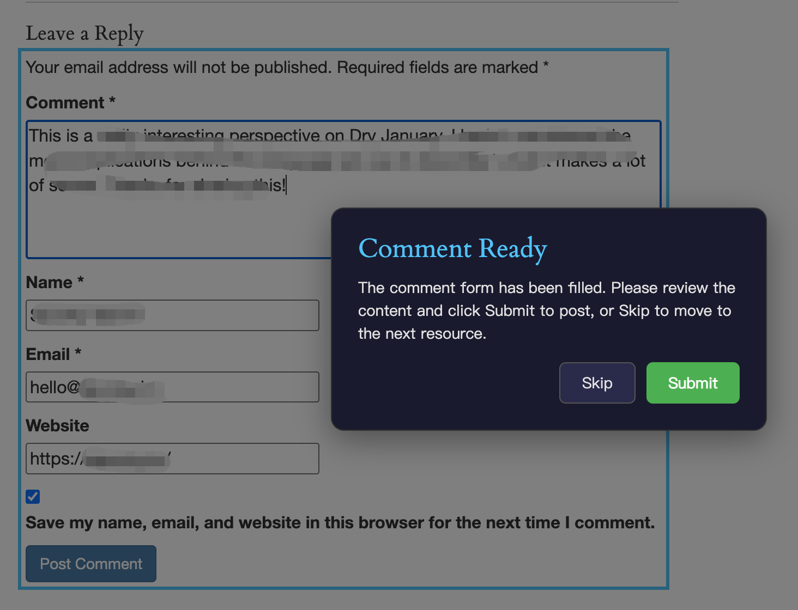

> This article is based on insights shared by [Gefei](https://x.com/gefei55) in his community group. Credit and thanks to Gefei for sharing this knowledge.

## Semi-Automated Blog Comment Posting — How Does It Work?

Here's a demo of the semi-automated posting workflow. The tool generates the comment content and fills in all the form fields automatically. All I need to do is click the Submit button.

If you switch to fully automatic mode, you don't even need to review — it posts directly.

---

## Gemini 2.0 Flash Is Incredibly Cheap

Claude recommended Gemini 2.0 Flash for this task. After analyzing pages and testing comments — 143 requests total — it cost only 6 cents. Essentially free.

| Metric | Value | Model |
|--------|-------|-------|
| Spend | $0.0628 | Gemini 2.0 Flash |
| Requests | 143 | Gemini 2.0 Flash |
| Tokens | 591K | Gemini 2.0 Flash |

---

## Beginners: Don't Rush Into Automation

Some people, especially beginners, fall into a mental trap — thinking they're not making money because they haven't automated everything yet.

But I'd argue the opposite: **it's precisely because you're trying to automate everything as a beginner, instead of getting your hands dirty first, that you're not getting positive feedback.**

Take Goldfish Evan for example — he built a side business by doing things manually, step by step:

When asked whether he submits to directories and tool sites manually or has an automated solution, Goldfish Evan replied: **"I'm still doing it manually."**

Another user mentioned building a browser auto-fill tool and looking for developers who actively build backlinks to try it out.

The takeaway? **Even someone earning $4,000+/month is still submitting backlinks manually.** Get the feel for it first, then think about automation.

---

## The 6 Prerequisites for Automation

The prerequisite for automation is that you clearly understand why something needs to be done a certain way, know how to do it well, and can break it down into steps — only then can you have a program do it for you.

Taking the automated blog comment backlink scraping and posting plugin as an example, you need to know and have done all of these:

1. **Use Semrush and Ahrefs to check backlinks** — You can view any domain's backlink list and know how to filter out SPAM links.
2. **Use browser extensions to simulate actions** — Semrush and Ahrefs APIs are hard to work with, but browser extensions can simulate human actions: open pages, intercept API requests, handle pagination, etc.
3. **Identify blog comment backlinks** — What they are, how to spot them, how to post them, and how to collect them.
4. **Scrape comments to find more resources** — By scraping all comments on a blog post, you can discover other webmasters who also post blog comment backlinks, revealing more target sites.
5. **Expand your resource library in a loop** — Take those sites back to Semrush or Ahrefs to check their backlinks, returning to step 1 to find even more postable blog comment backlink resources.
6. **Semi-automate comment posting** — Understand the nuances: different sites have different ways to leave links, and you need AI to recognize each format.

**If you haven't personally posted blog comment backlinks — and posted enough of them — you won't know any of this. And you won't be able to get AI to help you build a plugin that scrapes and posts backlinks automatically.**

If you don't understand the process at all and just tell your AI Agent "help me post blog comment backlinks," it simply won't know how to do it efficiently and with quality.

---

## Backlink Resource Results

After running for one morning, analyzing **841 backlinks** across several websites, the tool found **226 resources** that can be posted to without login or registration. Most are blog comment backlinks, with a few being profile page backlinks.

A quick note: don't fixate on the 841 number — we only need the 226 usable resources. And if we keep crawling, we'll find even more.

Some community members have said they don't know how to find postable backlink resources. My answer has always been: the methods are right here in our community — you just haven't put them into practice.

**With just one morning's work, without me even watching, the program filtered out 226 usable resources on its own.**

### Resource Type Breakdown

| Type | Count |
|------|-------|
| Blog Comment (blog_comment) | 159 |
| Profile (profile) | 67 |
| **Total** | **226** |

### Top 10 Source Websites

These are the competitor websites analyzed via Ahrefs, ranked by the number of usable backlink resources discovered:

| Source Website | Resources Found |
|----------------|----------------|
| loklokhd.app | 24 |
| level-devil.net | 18 |
| purbleplaceonline.com | 18 |
| ageofwargame.io | 16 |
| leveldevilgame.com | 15 |
| quordle-wordle.com | 15 |
| geometrydash-subzero.io | 15 |
| thenarcissisttest.com | 14 |
| crazy-cattle-3d.com | 13 |
| thwordle.app | 12 |

### Sample Resources

Here are some of the filtered backlink resources, so you can get a feel for the data quality:

| Type | URL |
|------|-----|
| blog_comment | https://joaniesimon.com/grilled-lemon-garlic-potato-kabobs/grilled-potato-kabobs-with-lemon-and-garlic/ |
| blog_comment | https://syncedreview.com/2024/09/09/microsofts-fully-pipelined-distributed-transformer-processes-16x-sequence-length-with-extreme-hardware-efficiency/ |
| blog_comment | https://www.madrimasd.org/blogs/matematicas/2024/02/11/150483 |
| blog_comment | https://pixel77.com/typography-rules-technique/ |
| blog_comment | https://www.bakerella.com/sweets-for-the-season/ |
| profile | https://www.mycomics.de/profil/tedcrane.html |
| profile | https://wallhaven.cc/user/lauralehman |
| profile | https://bordeaux.onvasortir.com/profil_msg_inexistant.php |
| profile | https://jobs.hyperisland.com/company/georgiana-al-usa |
| profile | https://snipplr.com/users/mcleanross?language=all |
