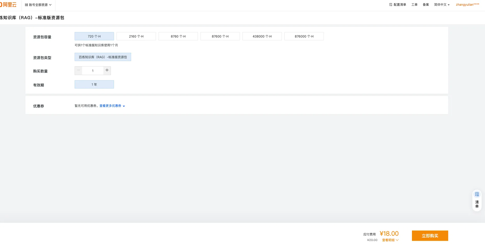
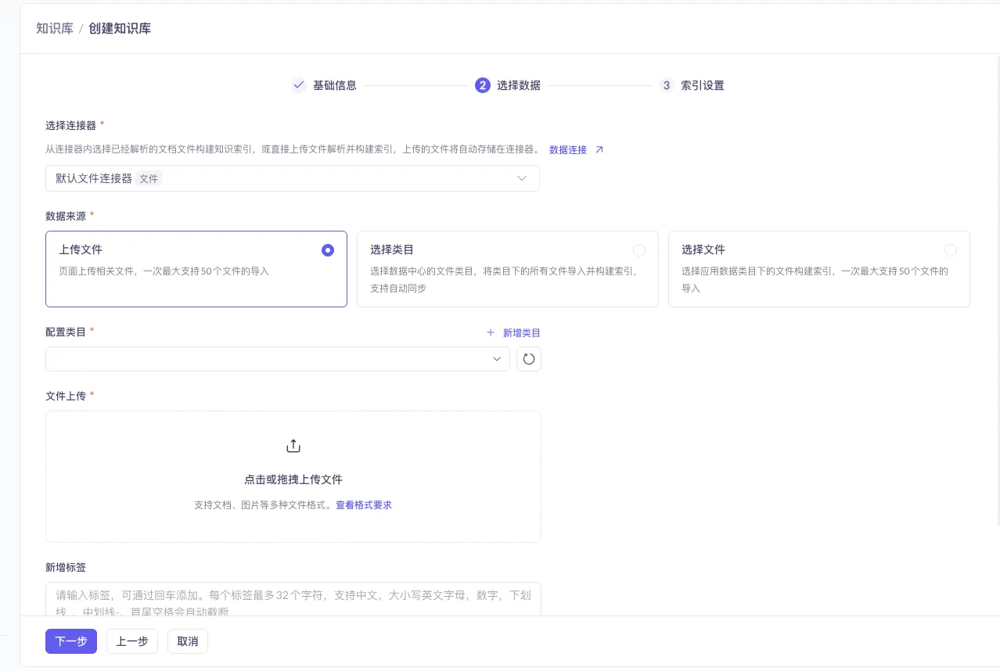
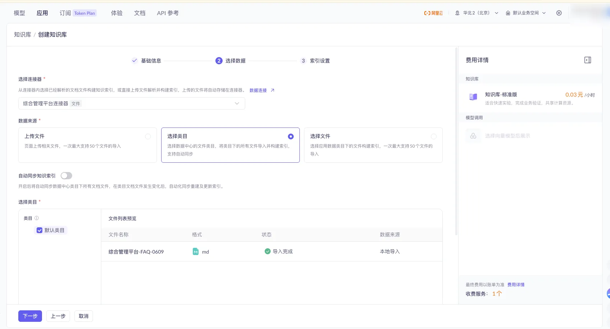
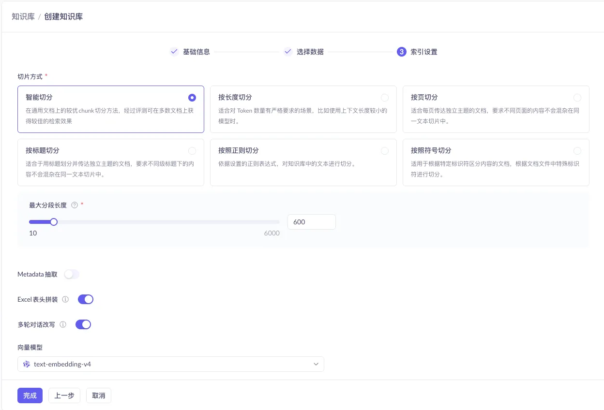
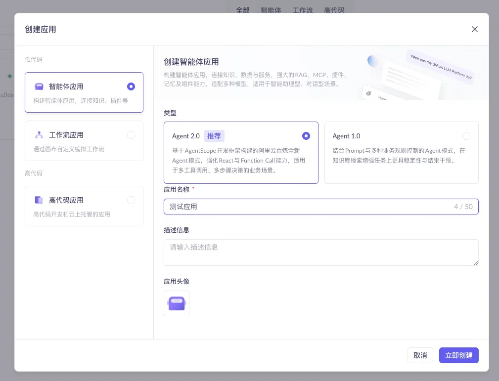
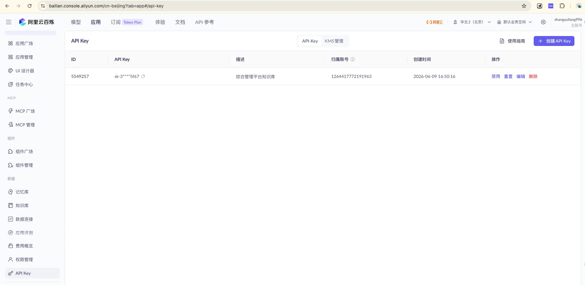

> Feed your company's product manuals, operating procedures, and error-code references to an LLM, and turn it into a 7×24 always-on, accurate "business support / ops assistant." This post is my complete from-scratch record of building exactly that — follow along and it'll work end to end.
>
> It's a long read, so bookmark it first. Every platform operation comes with a screenshot, and the advanced sections include ready-to-use Spring Boot code.

## What You'll Get From This Post

- Create a knowledge base (RAG) from scratch on **Aliyun Bailian** and bind it to an agent application
- Integrate this AI app into your own system via an **HTTP / SSE streaming interface**
- Use a **custom plugin** so the AI can not only search documents but also query **live business data** (is a device online, how many alerts a site has today)
- Write a **backend SSE proxy in Spring Boot**: hide the API Key, apply unified authentication, and **log every user query**
- A set of **content-writing and maintenance principles** that make the knowledge base "more accurate the more you use it," plus the **compliance red lines** you must read before uploading

---

## 1. First Things First: What Exactly Is a Knowledge Base / RAG?

A knowledge base supplements an LLM with **private material** it doesn't otherwise know (your company's product manuals, operating procedures, internal rules). The underlying technology is called **RAG (Retrieval-Augmented Generation)**: before answering, the model retrieves relevant content from the knowledge base, then generates an answer grounded in that material — which makes it more accurate.

Remember this one key insight:

> **The model does not read your system code, nor your database. It only knows the text we feed into the knowledge base.**

So the ceiling on answer quality = the quality of your knowledge-base content. Write it clearly and it answers accurately; leave something out and it either can't answer or makes things up. The good news: **whether the answers are accurate is entirely in our hands** — you don't need to understand the algorithms, you just need to express your business knowledge in clear text.

This also leads to the division of labor between the two capabilities below. Keep this table in mind — we'll come back to it repeatedly:

| Question type | Who handles it | Example |
| --- | --- | --- |
| Static, explanatory, procedural | **Knowledge base** | "How do I add a device?" "What does this error code mean?" |
| Dynamic, real-time, needs live lookup/computation | **Plugin** | "Is device A online right now?" "How many alerts does site #3 have today?" |

---

## 2. Hands-On: Create a Knowledge Base on Bailian

### 2.1 Enter Knowledge Base Management

Log in to the **Aliyun Bailian platform**, click **Applications → Knowledge Base** in turn to open the knowledge base management page, then click **"+ Create Knowledge Base"** at the top right.


> Activate "Applications" at the top (①), select "Knowledge Base" on the left (②), and click the blue "+ Create Knowledge Base" at the top right (③) to start.

### 2.2 Pricing Note: Buy a Resource Pack

> 💡 **A resource pack is recommended** — it's more cost-effective than pay-as-you-go.



> Standard-tier resource pack: 720 unit-hours for ¥18.00 (original price ¥20.00), valid for 1 year, ideal for new-user testing/validation or lightweight apps. Capacities range across 720 / 2160 / 8760 / 87600 and more.


> Knowledge bases come in two tiers: the **Flagship** tier supports unlimited documents and tens-of-thousands QPS, suited for high concurrency; the **Standard** tier shares compute resources, ideal for quick experiments and business validation. The Standard tier is enough early on.

### 2.3 Basic Configuration

For this step, just remember two key choices:

- **Knowledge base type**: choose **"Document Search"** (supports a mix of documents, images, and Excel — the broadest coverage)
- **Use case**: choose **"Basic Document Q&A"** (chunk-based retrieval — a perfect match for the "heading-per-entry" writing style, fast, economical, and the most controllable)


> The other types (Data Query / Image Q&A / Audio-Video Search) and other use cases (Rich Image-Text Replies / Visual Understanding / Instant Q&A) are for specialized scenarios — you won't need them for a general FAQ early on.

### 2.4 Select Data: First Build Your Own File Connector

At the "Select Data" step, **it's recommended to create your own file connector**. Click **"Data Connection ↗"** to enter the connector configuration page.



> Click the "Data Connection ↗" text link below the "Select Connector" area to jump to the connector configuration page.

Once the connector is created, upload your knowledge-base files into it.


> The connector's file list page: use "Import Data" at the top to upload new files, and "Default Category" on the left to switch or add categories.

Back in the creation flow, select the connector you just created, set the data source to **"Select Category,"** and check the uploaded files.



> Checking "Default Category" imports all files under that category. ⚠️ You can turn on the **"Auto-Sync Knowledge Index"** switch so the index updates automatically whenever files in the category change (it's off in the screenshot — enable it as needed).

### 2.5 Index Settings: Defaults Are Fine



> For the final step, keep the **default configuration** (vector retrieval + default embedding model) and just click "Finish" — your knowledge base is now built.

---

## 3. Create an Agent Application and Bind the Knowledge Base

The knowledge base is just a "material library." To let users converse with it, you need to build an **application** on top of it.

### 3.1 Enter Application Management


> On the "Application Management" page, click **"+ Create Application"** at the top right.

### 3.2 Choose the Application Type: Agent + Agent 2.0



> Choose **"Agent Application,"** and set the mode to **Agent 2.0 (Recommended)**. Agent 2.0 is built on the AgentScope framework and strengthens ReAct and Function Call capabilities, **making it suited for the complex multi-tool-call, multi-step decision scenarios we'll need later** (i.e., the plugin capability in Section 5). After filling in the application name, click "Create Now."

### 3.3 Configure the Application: Bind the Knowledge Base, Write the Persona


> In the "Planning" module, do three things: **① Select a model**; **② Write the prompt** (give it a persona and answering rules, e.g., "You are the ops assistant for the integrated management platform; answer based on the knowledge base, and clearly say you don't know when there's no basis"); **③ Link the knowledge base** (attach the one you built in Section 2 — you can set a similarity threshold to filter out low-relevance content).

### 3.4 Publish and Test


> The full configuration interface contains four modules — **Planning / Skills / Memory / Replies** — and you can type questions to test results directly on the right. Once tuned, click **"Publish"** at the top right to publish — only after publishing can external interfaces call it.

---

## 4. Integrate Into Your Own System: HTTP + SSE Streaming Calls

Once the app is published, you can integrate it into your own website / app via HTTP.

### 4.1 Get the Two "Keys": API Key and Application ID



> Create / view keys under "API Key Management." When calling, put it in the request header: `Authorization: Bearer <your API Key>`.


> Get the **Application ID** from the app card on the "Application Management" page, and fill it into the call URL: `https://dashscope.aliyuncs.com/api/v1/apps/{appId}/completion`

### 4.2 Interface Reference

| Item | Content |
| --- | --- |
| Method | `POST` |
| URL | `https://dashscope.aliyuncs.com/api/v1/apps/{appId}/completion` |
| Auth | Request header `Authorization: Bearer <API Key>` |
| Streaming output | Add request header `X-DashScope-SSE: enable` |
| Incremental output | Add `"incremental_output": true` to `parameters` in the body |
| Multi-turn conversation | Pass back the previous `session_id` in `input` (auto-expires after 1 hour of inactivity) |

### 4.3 Why Use SSE Streaming Responses?

With `X-DashScope-SSE: enable`, the server no longer "holds" the full answer until it's complete — it **pushes as it generates**, sending an event for each small chunk produced. This is mainly for the experience:

- **Typewriter effect**: text is "typed" out character by character, consistent with mainstream AI chat products;
- **Lower perceived wait**: a full answer often takes 10+ seconds; non-streaming users face a 10-plus-second blank screen, while in streaming mode the first characters usually appear within 1–2 seconds;
- **Easy to interrupt mid-stream**: users can stop as soon as they see the opening is off.

> 💡 For background tasks, batch processing, and similar scenarios that don't need character-by-character display, you can skip this header and return the full result in one shot — the processing logic is simpler.

One more key parameter, **`incremental_output`**:

- `false` (default): each chunk returns **the full text so far** (I → I like → I like apple), so the frontend has to overwrite;
- `true` (recommended): **returns only the newly added segment** (I → like → apple), so the frontend just concatenates. The backend proxy below uses `true`.

### 4.4 Call Example (curl)

```bash
curl --location --request POST \
  'https://dashscope.aliyuncs.com/api/v1/apps/{appId}/completion' \
  --header 'Authorization: Bearer sk-xxxxx' \
  --header 'X-DashScope-SSE: enable' \
  --header 'Content-Type: application/json' \
  --data-raw '{
    "input": { "prompt": "What is data sync for?" },
    "parameters": { "incremental_output": true }
  }'
```


> When testing with Postman, click "Code" at the top right to auto-generate a curl command — handy for integrating into your code.

### 4.5 Response Fields

```json
{
  "output": {
    "session_id": "5ba5ba152b924ee1912867baf3cbfd62",
    "finish_reason": "null",
    "text": "The data sync feature is mainly used for CWB-4..."
  },
  "usage": {},
  "request_id": "a52c9719-46c0-9208-a18e-6ec86e76dd4d"
}
```

| Field | Description |
| --- | --- |
| `output.text` | AI reply content (returned segment by segment in SSE mode) |
| `output.session_id` | Session ID; pass it back in multi-turn conversations to keep context |
| `output.finish_reason` | Finish reason; `null` while not finished |
| `request_id` | This request's ID (provide it to Aliyun when troubleshooting) |

---

## 5. Advanced ①: Use a Plugin to Let the AI Query "Live Business Data"

By this point, the AI can answer the **static knowledge written into the knowledge base**. But some questions are **dynamic**:

> "Is device A123 online right now?" "How many alerts does site #3 have today?"

These **should not be written into the knowledge base** — the data changes constantly, so anything you write becomes outdated immediately. The right approach: let the AI **query your backend interface in real time**. Bailian's **custom plugin** is exactly for this.

### 5.1 The Principle: It's Essentially a Function Call

You "register" one of your backend HTTP interfaces as a plugin and describe what it does in natural language. During a conversation, the LLM **decides on its own** whether to call it, **extracts the parameters** from the user's question, calls it, gets a JSON result, and then phrases it into human language.

There's a rule here that's identical to the knowledge base:

> **How well the "description" of a plugin / tool is written directly determines how accurately the model calls it.** Describe it clearly and give examples so it knows when to call and how to fill the parameters.

### 5.2 First, Prepare a Business Interface (Spring Boot)

Say we want the AI to query a device's live status — first write an ordinary query interface:

```java
@RestController
@RequestMapping("/api/biz")
public class DeviceController {

    private final DeviceService deviceService;

    public DeviceController(DeviceService deviceService) {
        this.deviceService = deviceService;
    }

    /** Called by the Bailian custom plugin: query a device's live status */
    @GetMapping("/device/status")
    public DeviceStatus status(@RequestParam String deviceId) {
        return deviceService.getStatus(deviceId);
    }

    /** Keep the output structure as flat as possible with self-explanatory field names, so the LLM can understand and organize it */
    public record DeviceStatus(
            String deviceId,
            boolean online,
            int batteryPercent,
            String lastReportTime
    ) {}
}
```

### 5.3 Register It as a Plugin on Bailian

Go to the **"Plugins"** page in the Bailian console (under the Applications tab, "Component Management / Plugins"), and follow the official three-step flow:

**Step 1 · Create the plugin**

- **Plugin name**: e.g., `Device Status Query Tool`
- **Plugin description**: state the purpose clearly in natural language to help the LLM decide when to call it. e.g.: `Query a device's real-time online status, battery level, and last report time by its device ID.`
- **Plugin URL**: your service domain, e.g., `https://api.yourcompany.com`
- **Authentication**: if the interface needs auth, turn on the switch, choose `bearer`, and enter the Token

**Step 2 · Create the tool** (a plugin can host multiple tools, corresponding to multiple interfaces)

| Config item | What to fill in |
| --- | --- |
| Tool name | `queryDeviceStatus` |
| Tool description | Natural language + **give examples** — the more specific, the better the recall |
| Tool path | `/api/biz/device/status` (appended after the plugin URL) |
| Method | `GET` |
| Input parameters | `deviceId`, with parameter mode set to **"LLM Recognition"** |
| Output parameters | `online` / `batteryPercent` / `lastReportTime`, each with a clear description |

> ⚠️ Two easy pitfalls:
> - **The "parameter mode" of input parameters**: for things the user can say out loud (device ID), choose **"LLM Recognition"** to let the model extract it from the question automatically; for things like "current logged-in user ID" or "tenant ID" that are **injected by the caller and should not be guessed by the model**, choose **"Business Pass-Through,"** passing them via the `biz_params` field during the API call.
> - **GET request inputs do not support the Object type**; and sub-properties of an Object type cannot be empty, or publishing will error out.

**Step 3 · Test → Publish**

Click "Test Tool," fill in the parameters and run it; once it passes, click "Publish." **Only "Published" tools can be called by the application.**

### 5.4 Connect the Plugin to the Agent Application

The new Agent 2.0 attaches plugins via the **MCP service** in two steps:

1. On the plugin card, click **"Publish as MCP Service"**;
2. Go back to the agent application's **orchestration page**, click "+" in the **MCP block**, switch to "Custom MCP," and **add** the service you just published.

Then test in the chat box on the right: "Is A123 online now?" — if the model automatically calls the plugin and gives a live answer, you're done. Finally, don't forget to **re-publish the application**.

> Summary: **the knowledge base handles "what it is and how to do it," the plugin handles "how it is right now."** One static, one dynamic — only together do they make a truly useful business assistant.

---

## 6. Advanced ②: A Spring Boot Backend SSE Proxy + Query Logging

In Section 4 we called Bailian directly with curl. But **in production you must never let the frontend connect to Bailian directly** — you must add a layer of **backend proxy** in between.

### 6.1 Why This Proxy Layer Is a Must

1. **API Key security**: once `sk-xxx` is written into the frontend, it's effectively public — it'll be scraped and abused, and model calls are **billed in real money, by usage**. The key belongs only on the server.
2. **Unified auth / rate limiting**: validate your own system's login state at the proxy layer and rate-limit per user to block malicious flooding.
3. **Query logging** (the focus of this section): who, when, asked what, got what answer, how long it took — all persisted to the database.
4. **Fallbacks / rewriting**: sensitive-word filtering, context supplementation, and exception fallbacks all happen at this layer.

The architecture is simple:

```text
Browser ──SSE──> Spring Boot proxy ──SSE(X-DashScope-SSE)──> Bailian DashScope
                     │
                     └──> Database (logs each query)
```

The proxy **forwards the upstream SSE to the frontend as it receives it** (the typewriter effect is fully preserved), while **accumulating the complete answer** in memory and writing a log when it finishes.

For the tech stack, use **Spring WebFlux**: it's built for streaming — calling the upstream with `WebClient` and returning a `Flux<ServerSentEvent>` to the frontend is the most natural fit.

### 6.2 Dependencies and Configuration

```xml
<!-- pom.xml -->
<dependency>
    <groupId>org.springframework.boot</groupId>
    <artifactId>spring-boot-starter-webflux</artifactId>
</dependency>
<dependency>
    <groupId>org.springframework.boot</groupId>
    <artifactId>spring-boot-starter-data-jpa</artifactId>
</dependency>
<dependency>
    <groupId>com.mysql</groupId>
    <artifactId>mysql-connector-j</artifactId>
    <scope>runtime</scope>
</dependency>
```

```yaml
# application.yml
dashscope:
  base-url: https://dashscope.aliyuncs.com
  app-id:  ${DASHSCOPE_APP_ID}
  api-key: ${DASHSCOPE_API_KEY}   # ⚠️ Inject from an env var; never hard-code, never commit to Git
```

```java
@Configuration
public class WebClientConfig {

    @Bean
    public WebClient dashScopeWebClient(@Value("${dashscope.base-url}") String baseUrl) {
        return WebClient.builder()
                .baseUrl(baseUrl)
                // The accumulated SSE content can be large, so raise the buffer limit
                .codecs(c -> c.defaultCodecs().maxInMemorySize(4 * 1024 * 1024))
                .build();
    }
}
```

### 6.3 The Core: The Streaming Proxy Service

```java
@Service
public class ChatProxyService {

    private static final Logger log = LoggerFactory.getLogger(ChatProxyService.class);

    private final WebClient dashScopeWebClient;
    private final QueryLogRepository logRepository;
    private final ObjectMapper objectMapper = new ObjectMapper();

    @Value("${dashscope.app-id}")  private String appId;
    @Value("${dashscope.api-key}") private String apiKey;

    public ChatProxyService(WebClient dashScopeWebClient, QueryLogRepository logRepository) {
        this.dashScopeWebClient = dashScopeWebClient;
        this.logRepository = logRepository;
    }

    /** Returns a stream of "incremental text fragments," forwarding to the frontend while accumulating the full answer internally */
    public Flux<String> streamChat(String userId, String prompt, String sessionId) {
        long start = System.currentTimeMillis();
        StringBuilder answer = new StringBuilder();   // accumulate the full answer
        String[] session   = { sessionId };           // must be mutable inside the closure, so use a length-1 array
        String[] requestId = { null };

        Map<String, Object> input = new HashMap<>();
        input.put("prompt", prompt);
        if (sessionId != null && !sessionId.isBlank()) {
            input.put("session_id", sessionId);        // multi-turn conversation
        }
        Map<String, Object> body = Map.of(
                "input", input,
                "parameters", Map.of("incremental_output", true)   // increments only
        );

        return dashScopeWebClient.post()
                .uri("/api/v1/apps/{appId}/completion", appId)
                .header(HttpHeaders.AUTHORIZATION, "Bearer " + apiKey)
                .header("X-DashScope-SSE", "enable")
                .contentType(MediaType.APPLICATION_JSON)
                .accept(MediaType.TEXT_EVENT_STREAM)
                .bodyValue(body)
                .retrieve()
                .bodyToFlux(new ParameterizedTypeReference<ServerSentEvent<String>>() {})
                .mapNotNull(sse -> extractText(sse.data(), answer, session, requestId))
                .filter(s -> !s.isEmpty())
                // Normal completion: write a success log
                .doOnComplete(() -> saveLog(userId, prompt, answer.toString(),
                        session[0], requestId[0], System.currentTimeMillis() - start, true))
                // Error: write a failure log to aid troubleshooting
                .doOnError(err -> {
                    log.error("Bailian call failed userId={}, prompt={}", userId, prompt, err);
                    saveLog(userId, prompt, answer.toString(),
                            session[0], requestId[0], System.currentTimeMillis() - start, false);
                });
    }

    /** Parse one upstream SSE data(JSON) segment, accumulate the full answer, and return this incremental fragment */
    private String extractText(String data, StringBuilder answer,
                              String[] session, String[] requestId) {
        if (data == null || data.isBlank()) return "";
        try {
            JsonNode root = objectMapper.readTree(data);
            JsonNode output = root.path("output");
            if (output.hasNonNull("session_id")) session[0]   = output.get("session_id").asText();
            if (root.hasNonNull("request_id"))   requestId[0] = root.get("request_id").asText();
            String fragment = output.path("text").asText("");
            answer.append(fragment);
            return fragment;
        } catch (Exception e) {
            log.warn("Failed to parse SSE data: {}", data, e);
            return "";
        }
    }

    /** JPA is blocking, so run it on the boundedElastic scheduler to avoid stalling the WebFlux event loop */
    private void saveLog(String userId, String prompt, String answer, String sessionId,
                         String requestId, long latencyMs, boolean success) {
        Mono.fromRunnable(() -> {
            QueryLog row = new QueryLog();
            row.setUserId(userId);
            row.setPrompt(prompt);
            row.setAnswer(answer);
            row.setSessionId(sessionId);
            row.setRequestId(requestId);
            row.setLatencyMs(latencyMs);
            row.setSuccess(success);
            row.setCreatedAt(LocalDateTime.now());
            logRepository.save(row);
        }).subscribeOn(Schedulers.boundedElastic()).subscribe();
    }
}
```

### 6.4 The Public Interface (Re-wrap Fragments as SSE for the Frontend)

```java
public record ChatRequest(String prompt, String sessionId) {}

@RestController
public class ChatController {

    private final ChatProxyService chatProxyService;

    public ChatController(ChatProxyService chatProxyService) {
        this.chatProxyService = chatProxyService;
    }

    @PostMapping(value = "/api/chat/stream", produces = MediaType.TEXT_EVENT_STREAM_VALUE)
    public Flux<ServerSentEvent<String>> stream(
            @RequestBody ChatRequest req,
            @RequestHeader(value = "X-User-Id", defaultValue = "anonymous") String userId) {

        return chatProxyService.streamChat(userId, req.prompt(), req.sessionId())
                .map(fragment -> ServerSentEvent.builder(fragment).event("message").build())
                .concatWithValues(ServerSentEvent.<String>builder().event("done").data("[DONE]").build());
    }
}
```

### 6.5 Persist the Query Log

```java
@Entity
@Table(name = "query_log", indexes = @Index(name = "idx_user_time", columnList = "userId,createdAt"))
public class QueryLog {

    @Id @GeneratedValue(strategy = GenerationType.IDENTITY)
    private Long id;

    private String userId;
    @Column(length = 1000) private String prompt;
    @Lob   private String answer;
    private String sessionId;
    private String requestId;
    private long   latencyMs;
    private boolean success;
    private LocalDateTime createdAt;

    // getters / setters omitted
}

public interface QueryLogRepository extends JpaRepository<QueryLog, Long> {}
```

The corresponding table-creation statement:

```sql
CREATE TABLE query_log (
  id          BIGINT AUTO_INCREMENT PRIMARY KEY,
  user_id     VARCHAR(64),
  prompt      VARCHAR(1000),
  answer      MEDIUMTEXT,
  session_id  VARCHAR(64),
  request_id  VARCHAR(64),
  latency_ms  BIGINT,
  success     TINYINT(1),
  created_at  DATETIME,
  INDEX idx_user_time (user_id, created_at)
);
```

> If you want it "fully reactive and non-blocking," you can swap JPA for **Spring Data R2DBC** and drop the `boundedElastic` step. This post uses the more familiar JPA for readability.

### 6.6 Frontend: Read SSE and Render Character by Character

```javascript
async function ask(prompt, sessionId) {
  const resp = await fetch('/api/chat/stream', {
    method: 'POST',
    headers: { 'Content-Type': 'application/json', 'X-User-Id': currentUserId },
    body: JSON.stringify({ prompt, sessionId })
  });

  const reader = resp.body.getReader();
  const decoder = new TextDecoder();
  let buffer = '';

  while (true) {
    const { value, done } = await reader.read();
    if (done) break;
    buffer += decoder.decode(value, { stream: true });

    // SSE events are separated by blank lines; lines starting with data: are the payload
    const events = buffer.split('\n\n');
    buffer = events.pop();                 // the tail may be half an event, keep it for next time
    for (const evt of events) {
      const line = evt.split('\n').find(l => l.startsWith('data:'));
      if (!line) continue;
      const text = line.slice(5).trim();
      if (text === '[DONE]') return;
      appendToUI(text);                    // append char by char, typewriter effect
    }
  }
}
```

### 6.7 The Real Value of Logs: Making the Knowledge Base Better the More You Use It

Logging isn't for show. Its most valuable use is to **pull out queries where `success=false` or the answer was vague**:

- Things users asked but the knowledge base didn't cover well → exactly the **new entries to add** (this echoes the "driven by real questions" maintenance principle in the next section);
- High-frequency questions → prioritize polishing them, or even turn them into quick shortcuts;
- Average latency and call volume → the basis for capacity planning and cost accounting.

---

## 7. Inner Skills: How to Write Knowledge-Base Content That's Actually Useful

Anyone can click around a platform — **what truly determines the experience is how the content is written.** This part is the essence distilled from repeated trial and error.

### 7.1 Six Core Principles for Writing Content

1. **One question per answer, and one answer says one thing**: don't stuff multiple topics into a single answer; split into smaller questions when needed.
2. **Answers should carry their own context and stand alone**: during retrieval, fragments are extracted individually and fed to the model, so don't write "as mentioned above" or "same as before" — spell out the key information.
3. **Write questions the way users actually ask them**: retrieval matches against the question (Q), so list 2–3 phrasings for the same question (formal, colloquial, fault-style).
4. **Use precise wording, avoid vagueness**: use less "maybe," "probably," "generally speaking"; be explicit with the numbers, conditions, and steps that matter.
5. **Put applicable conditions up front**: for answers that only hold under specific conditions, write the condition at the start and flag it with ⚠️.
6. **Clear structure, good use of headings**: one heading per question (e.g., `## How to Return Items`), which aids chunking and retrieval and makes maintenance easier.

When writing a new entry, just copy this template and fill it in:

```text
### [Module/Number] Short question title
**Q (with 2-3 phrasings):** Formal phrasing? / Colloquial phrasing? / Fault-style phrasing?
**Applicable conditions:** ⚠️ Only applies to… (write "none" if there are none)
**A:**
1. Step one…
2. Step two…
**Related:** See "XXX"
```

### 7.2 Directory Skeleton: Layered From "Core High-Frequency" to "Peripheral Background"

Layer by priority and place new content in the matching chapter. **Do P0 first, P1 next, P2 backfilled as needed**:

- **Part 1 · System Usage Guide [P0]**: stops repeated questions of "how do I use this feature"
- **Part 2 · Troubleshooting & Ops [P0]**: written as "symptom → possible cause → troubleshooting steps → solution"
- **Part 3 · Product Overview [P1]**: lets sales / newcomers quickly understand "what we have"
- **Part 4 · System Integration & Interaction [P1~P2]**: how data flows and who connects with whom
- **Part 5 · Industry Background & Glossary [P2]**: serves as a shared dictionary to unify terminology

> **Backfill principle**: don't dream up what to write — **let it be driven by real questions**: whenever someone asks, distill it into an entry on the spot. (Remember the logs from Section 6? That's your "source of questions.")

### 7.3 Storage Structure: Connector → Category → File

In Bailian it's a three-tier structure:

- **Connector**: a big repository, corresponding to one knowledge source (e.g., "Integrated Management Platform Connector")
- **Category**: a partition within the repository, ideally mapping to the layers above
- **File**: the actual unit that gets parsed, chunked, and retrieved

**File-splitting suggestion**: one file per "second-level module" (e.g., `business-center.md`, `device-faults.md`) — don't cram everything into one giant file, nor fragment it down to one entry per file. The benefits: more precise retrieval, easier maintenance, and a single file's error doesn't drag others down.

**Parsing settings**: for FAQs split by Markdown headings, **split by heading / level** so each Q&A is kept together as much as possible.

### 7.4 Evolution Path: Don't Build a Big Framework Right Away

1. **Stage 1 (Foundation)**: polish the content quality of a single knowledge base — how good the answers are comes entirely down to how good the content is;
2. **Stage 2**: structure the knowledge base with "categories + multiple files";
3. **Stage 3**: expand to "multiple knowledge bases organized by department," maintained collaboratively by each department, with the maintainer shifting from "sole author" to "rule-setter + reviewer";
4. **Stage 4**: upgrade the experience to "rich image-text + tool calls" (i.e., what Sections 5 and 6 of this post do).

> A mature multi-department knowledge base is "the result of running it for a while," not a framework you must build from day one. **Get the content right first, then talk about scaling.**

---

## 8. Compliance & Security: Read Before Uploading ⚠️

This section is the easiest to overlook, but **getting it wrong is a big deal** — be sure to read it first.

1. **Data leaving the boundary**: uploading to Aliyun Bailian = content entering a third-party public cloud. Before any sensitive content involving technical parameters, frequencies, device models, military-related matters, etc., **you must first confirm whether the confidentiality level permits uploading to a public cloud**.
2. **Tiered handling**: clarify what may be uploaded, what needs to be de-identified, and what is forbidden — don't apply a blanket rule.
3. **Account and region**: confirm which enterprise account to use, the data storage region, and whether internal approval / filing is required.
4. **Permissions and sharing**: for multi-department or external access, set member permissions per internal regulations (such operations should be performed by the responsible person on the platform).
5. **Deletion is irreversible**: deleted files cannot be recovered — be careful and have the operation done by the person responsible.

**Checklist to confirm with leadership / relevant departments:**

- [ ] For this kind of material, does the confidentiality level permit uploading to a public cloud?
- [ ] If partially permitted: what may be uploaded, what needs de-identification, what is forbidden?
- [ ] Which company account to use? Any requirements on the data storage region?
- [ ] Is an internal approval or filing process required?
- [ ] For later multi-department or external access, how will permissions be defined?

---

## Closing Thoughts

The build order of this whole thing is essentially the table of contents of this post: **build the knowledge base → build the app → integrate the interface → query live data with a plugin → backend proxy + logs → continuously maintain the content.**

But the real core is just one sentence: **the ceiling on answer quality is the quality of your content.** The platform, interfaces, and proxy are all scaffolding — distilling your business knowledge into clear text and continuously backfilling it with real questions is what determines whether this thing turns out "useful."

If this post helped you, feel free to like, share, and pass it along to friends who are also tinkering with AI assistants 👇

> Quick notes: ⚠️ Model calls are pricey, so control the frequency; 💡 vector storage is free, use it with confidence; 🔗 you must create your own file connector to upload data; 📊 keep the index settings at defaults; 📦 a resource pack is recommended over pay-as-you-go.

(The end. This tutorial is revised on an ongoing basis as the platform updates.)
