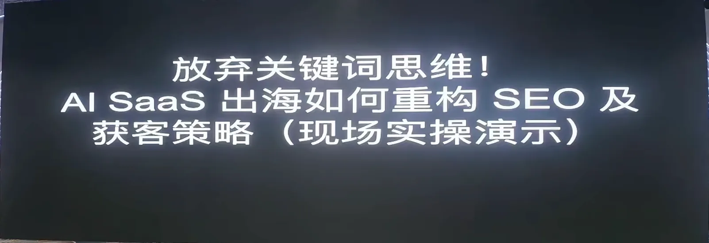
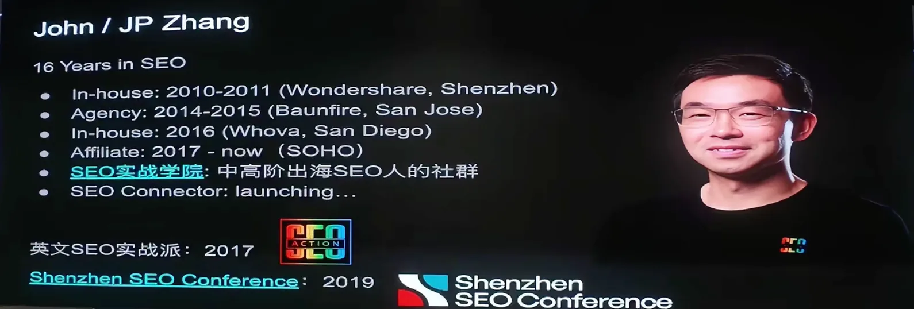
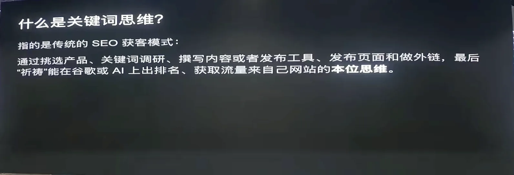
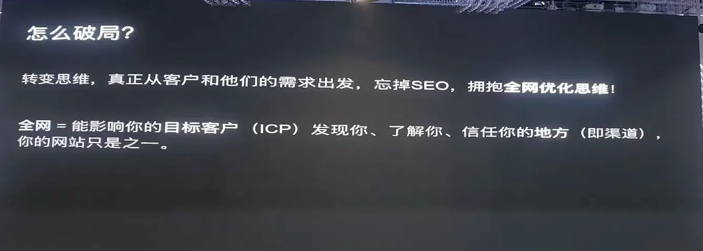
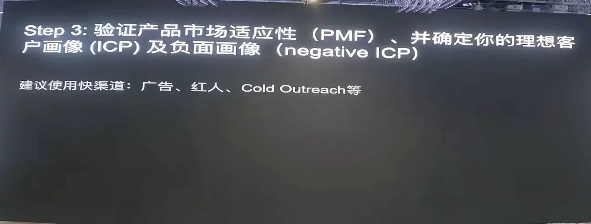
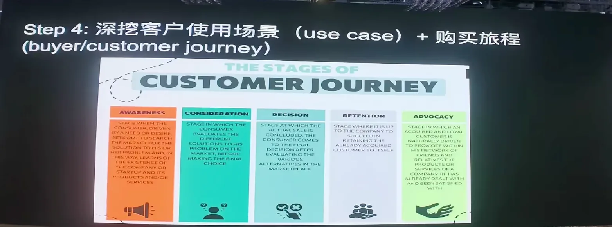
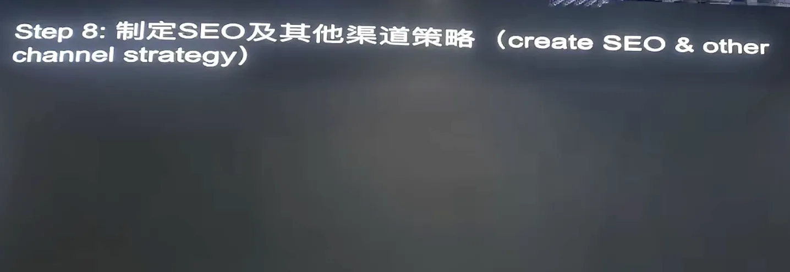
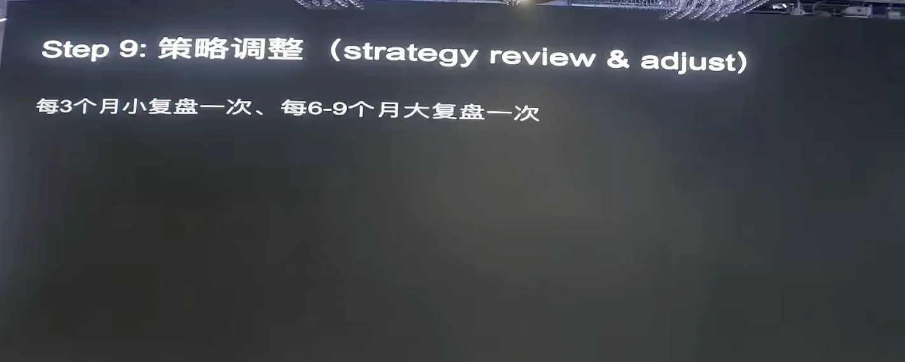
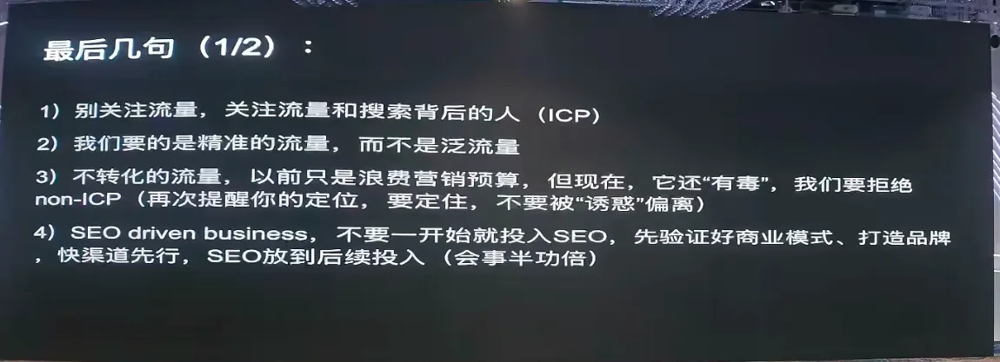

# Stop Thinking in Keywords: Rebuilding SEO and Customer Acquisition for Global Markets

> At the "**Gefei’s Friends, Mid-Year Sharing Meeting Shenzhen Station**", the CEO ' s founder of the field team, John, brought about a macro- and strategic-level sharing and fielded AI to demonstrate how to construct a global outreach program from zero.
> >
> His core judgment is: **The conventional "Keyword Zone" style of "Keyword Zone" and "Live flow to the website Zoom Transformation" is going to fail in the AI era.**In particular, in the areas of B2B, foreign trade, electricity, and so on, Google AI Overview is "flying"; the AI small tool track is not that rolling yet, but sooner or later it will be out of date.
> >
> The alternative he offered was to switch from website to web-based optimization**— the site is just one of the contacts, the discussions on LinkedIn, YouTube, and the brand recognition in AI may be more influential in client decision-making than your website.

---

## I. WHO IS HE?

John (JP Zhang) started making money from his website in 2013 and became a contact with SEO during his studies in the United States (San Francisco). He was a SEO Manager in 2014-2016, in Silicon Valley and Santiago, respectively; he returned to the establishment of SEO-related companies in 2017, and was the founder of SEO and SEO. Around April 2025, he re-started his business in the United States for about 10 years.

> At the beginning of the meeting, he thanked Gefei for his invitation and mentioned that the Shenzhen Field was one of their aims — the September General Assembly target of 600 people.

---

## Two, what's "keyword thinking"?

John did two small surveys at the scene: about half of the people admitted that their process was "see first the keyword, see first the amount of the tool, build stations, write content" and about 80 percent the "select product, choose Keyword, write again".

He called this pattern **his own mind**:

1. From Keyword;
2. Writing articles or building land pages;
3. Importing traffic into websites;
4. Conversion on the website.

> Nature:**All traffic instruments are centred around "Crowding users to the website"**, which is the centre of the narrative.

---

## iii. Why is it getting worse and worse?

John, with more than a decade of SEO experience, has summed up a few of the after-effects:

**1. Poor tool data**
Semrush, Ahrefs, GSC data are not matched to actual tracking tools - delayed and biased.

**2. Keyword will never be finished**
Google used to count: 15% of the search word Rio every day is new (and now probably even higher). There's also the "emerging keyword" in the Gefei’s community -- because it never ends.

**3. SERP is getting crowded**
Even if first in the ranking, users may have to fall down one to two screens to actually see your results — up front is paid ads, AI Overview, YouTube, People Also Ask... A SEO peer has done extreme tests: tools show first in the ranking, actual users slide to the tenth in the search results. Google is getting less and less willing to give you free traffic.

**.4. User behaviour has changed**
- Client travel is different, sometimes simpler, but mostly more complex;
- 80% of decision-making in the B2B field is under the iceberg, and marketing tools can't track -- all you can see is the tip of the ice.
- Users are now probably**searching for them using AI**, which, no matter how beautiful your website is, cross-checks on its own to YouTube and Reddit;
- Users are often not here to "know the product", but to verify the credibility of the answer given by AI**— the narrative of the website and the answer given by AI are inconsistent and trust is lost.

**5. Europe-American User Immunisation
John's been overseas for years, and his observation is that people in the US and America tag field can recognize SEO promotion/software at once, creating immunization. Sometimes it's worse to be SEO than not to do -- leaving a bad impression on potential clients that "the company will only write promotions."

> The root cause:**AI came, the user behavior changed, and you're not using the model of "showing traffic to the website, talking to yourself on the site" anymore.**

---

## New thinking: from being on the ground to being on the whole network

The alternative framework proposed by John is **Internet-wide optimization of thinking**:

> Anything that affects the target client's perception of you is optimized -- from "not knowing you" to "not knowing you", to "thinking you", to "downline", to "continue working together."

**The website is just one of them, not the center.**Sometimes your LinkedIn profile is more influential than the website -- because LinkedIn talks about you, and it represents a third-party perspective; and your website is all about "market writing" in the eyes of clients.

He's going to teach us nine steps about how to recreate the SEO and the winning strategy.

---

## V. Reconstructing the SEO and the client 's nine-step approach

### Step 1: Clear operational positioning

In one sentence:**What I offer, for whom, and for what value, is not the same as the competition.**

That's what the American Business School used to say, **Elevat Pitch**-- you and the investors are in the elevator for 20 seconds, can you tell me exactly what you do?

> Key:**Consistency.**If this is not clear, who are your clients?

The traditional approach may take several months (user research + competition analysis + self-analysis). John quotes a British guest at the SEO conference: **Know Your Customer → Know Your Company → Know Yourself**, the three intersections are business positioning.

### Step 2: Draw business models

Nine grids are standardized using business models: who the customer is, value claims, channels, partners, cost structures, revenue sources... Now there's AI, a single order.

### Step 3: Validation of product market convergence (PMF)

We have a location, we have a business model, we have a real market test -- is your ideal client the way you think? This step is about output:
- **Ideal client portrait (ICP)**
- **Negative client image**(Why look for negative image? Because these people make you lose money and stay away from them)

### Step 4: Combine user 's journey / Convert funnel

You're going wherever the customer goes. You're going to turn the funnel from a commercial point of view; you're going to go through the user's journey from a client's point of view — the two are going to go hand in hand.

### Step 5: Identifying channels

Online + underline. John specifically cautions: **Don't blow all your energy online, sometimes cheaper, faster, and higher. **Many small cities in the West have local meetup, which is less than online below the line, and gets first-hand feedback.

### Step six: Develop a corporate client strategy

### Step 7: setting the marketing budget

- No money, no time, no time, no time to change.
- The money doesn't have time to buy time (advertising, hiring);
- **Boss, don't push it yourself.**You're a navigator.

### Step 8: Develop a strategy for the breakdown of channels

SEO, social media, fee advertising, Email Marketing, Red Man, Partnership, Cold Outreach SEO is just one of the channels oforganic; sponsorship of congresses, advertising is a paid channel. How and how each channel works, depending on the seventh-step budget allocation.

### Step 9: Periodic strategy adjustments

AI is too fast for industry to change, and it is suggested that**every three months is a small review, 6-9 months is a review (not more than one year)**. Sometimes markets in the Blue Sea, 6-9 months ago, have become the Red Sea – turning around and even considering that selling might be a better option than carrying.

---

## VI. On-site presentation: an hour of competition with AI

John showed the whole process live in 15-20 minutes. Case background:

- SEO top operator **Eli Schwartz**(Product-Led SEO author) advertises an AI Humanizer tool called **WriteHuman**on LinkedIn;
- John's trial found that it was just fine-tuning words and did not really retain a personal style;
- He decided:**One person, no team, no budget, from China, to compete with WriteHuman.**
- Product name**JDChumanize**, locational differentiation.

### Step 1: Operational positioning (AI support)

He throws the first few Google searchers into Google Gemini, lets AI analyze the competition and then enter:

> "I'm a man from China, I'm programmed, no team, no money, how can I be different from a rival?"

AI directly exported the location (he didn't change a word):

- **Ideal client**: Personal HF output, IP creators, proxies
- **Value proposition**: efficient maintenance of the individual brand voice and saving of manual effacement time
- **Differentiation**: the competition is "Let the machine sound like a human being" **We're**Make the machine sound like the user himself**
- **Pricing**: subscriptions at high unit cost (due to high cost of high frequency users cancel)
- **Excluded**: Student Party has all been removed — they're negative client portraits

> *We propose personal voice AI for high-frequency constent creators.*

### Step 2: Business model canvass

By the same order, all nine cells are exported -- including a free experience with a "sonic capsule", a professional version of $15-29/month, a fee for a capsule, two months for a purchase.

### Step 3: Three types of ideal clients + negative image

**Three types of ICP:**
1. **Indie Bloger / Newsletter author**— Make money with words, AI comes out and wants to use AI but fears losing its personal style;
2. **B2B founder/ world of work**- Need to make personal IPs for LinkedIn, Twitter, high-frequency postings with high pay and willingness to buy time; even use EA (Exclusive Assistant) to process content and use AI if it is cheaper;
3. **Ghost Writer / Agency**— Writing for Big Boss, need to be consistent.

**Commons of the three categories of people**: making money with words, pains at the "mechanical smell".

**Negative image (to stay away):**
- **Student Party**: White clients, no loyalty, no free rating, and scam -- "Fire easy to end" -- ten times the price of a bad rating to recover;
- **Head of the Black Hat Station and the forwarder**;
- **One-time user**: not coming back when you get a job.

> John also shared a technique: students should not be paid customers, but they can use them to raise the ratio of user interaction and direct access to the website**to reduce the ratio of SEO traffic -- which is more resistant to the updating of Google core algorithms. Helpful Content Update in September 2023 and Core Update in March 2024, which knocked out 99 per cent of the world's content stations; he had friends who earned $5,000 a day and stayed awake two nights after the algorithm was updated.

### Step 4: B2B Founder's User's Tour (selected on site for this type of ICP)

- **Cognitive phase**: this man saw your contrast when brushing LinkedIn/Tweet - not to Google search "AI humanizer" but to plant grass like John saw Eli Schwartz's post;
- **Assessment phase**: not price, only efficiency - "Can I spend less than five minutes?" He's worth $100-200/hour, saves 10 minutes and wants to pay $20;
- **Aha Moment**: Throw a voice in it and the system returns to a LinkedIn explosive sticker he wrote -- "This is it!"
- **Retention phase**: maintenance of high quality output for three minutes per day, even business mail using your tools, becoming your champion and recommending it to other bosses at the industry summit.

### Step five: How do we do it?

| Conversion phase | What to do? |
| --- | --- |
| Cognition | Social Media Ongoing Post (LinkedIn has algorithms, keep frequencies and access); Cold Outreach sends LinkedIn private letters to B2B top operator (inMail can also be sent without friends) |
| Evaluation | A comparison of the site page: `JDChumanize vs WriterHuman vs Google Gemini ` **is not for Google first, but for education AI (GEO)** |
| Decision-making | Product Driver + Email Marketing |
| Retention | Product experience + community |

> GEO: When users ask through AI "I'm XX Identity, Budget XX, recommend an AI humanizer", AI recommends you first -- because your narratives on websites, backlinks, social media are consistent.

**SEO strategy (as one of the channels, not all):**
- Priority given to**competition comparison page + long end embellishment**: `quickbar alternative for creators ' (not chasing high-volume keyword `best AI humanizer ' ), but adding for high-volume keywords / for personal branding for more accurate and less difficult user drawings);
- (a) Long end of scenery: `How to make AI write like me on LinkedIn ', `ChatGPT sounds too romantic for B2B posts ';
- **Parasite SEO**: When the new station does not have access to it, the content is posted on LinkedIn, Medium, Reddit, using the power of the platform - "Premote" is not a derogatory term.

**Marketing budget (zero budget version):**
- Tell AI, "Not a penny, just a minute," AI gives a six-month plan: marketing costs are about $600, and MRR $2900, 6 months cumulatively earns $10,000 -- not counting the value of the website's own assets.

---

## VII. CONCLUSION: Several Cognitives Worth Taking

### 1. Precision of flows, not general flows

The flow is not as good as it is. It attracts the wrong flow, even the toxic -- it brings you down, it consumes the customers, it lowers the AI's perception of your brand.

### All in--

Two years ago John shared a metaphor:**SEO, like climbing, looking at 800 meters above sea level, but the best point for SEO is about 300 meters -- when your brand has a certain visibility and is not yet in the big brand phase, SEO takes you up to 600 meters, and it is impossible to take you directly from 0 to 8848.

> Another metaphor: when apple trees are small, you have to jump up and pick them up, grow up to the side of your mouth and use a pole -- **don't start with SEO, not after.**

### 3. The EMD (accurate matching of domain names) is extremely risky in the branding age

When you register a domain name, you expect to be first in line, with Google algorithms updated very, very rich. Most of the benefits of algorithms now come from brand sites.

### Outcome = Directional Strategy + Implementation + Luck

- (a) The wrong direction, and the effort is in vain — moving from a home-grown thinking to a whole-of-the-world thinking;
- (a) The right direction but the poor results, which may be a question of implementation;
- And even if it is in the right direction and implemented, it will take a little patience and luck -- five years ago it was completely different from what it is now.

### Don't be a developer, an entrepreneur.

What you do is not a tool, it's an asset, it's an asset, it's of commercial value.

- Today's machete is a low probability of getting a machete a year later;
- To analyse your growth, or even**growth,**- it may be the best time to cash/sell when growth slows down;
- John shared the lessons: Content stations valued over $1 million, were left unsold, and at least 95 percent of the value was lost.

### 6. Try not to work alone.

Business start-ups are not 90 per person, and it takes a lot of partners to do it — to provide emotional value, complementarities, and to carry it together much easier than one person.

---

> This paper is based on the sharing of the founders of the SEO field based on the "Gefei’s Friends, Mid-Year Sharing, Shenzhen Station (2026.07.04-07.05)", a live view, framework and case presentation, recitation and distillation, for cross-references between Gefei’s community partners and Global Expansion colleagues, and does not represent the platform's position. The paper deals with specific practices such as SEO strategies, backlinks operations, grey hats, etc., and makes its own determination of compliance and risk; if reproducing or quoting, please indicate the source and contact the author's authorization.
