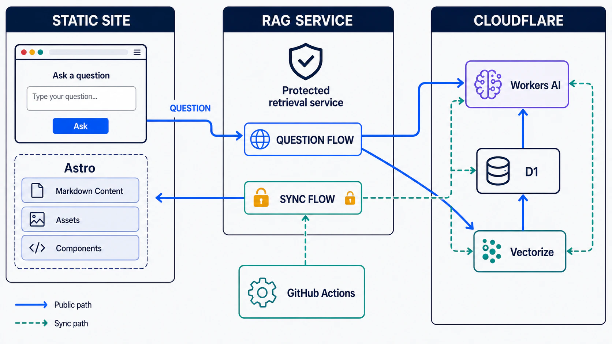
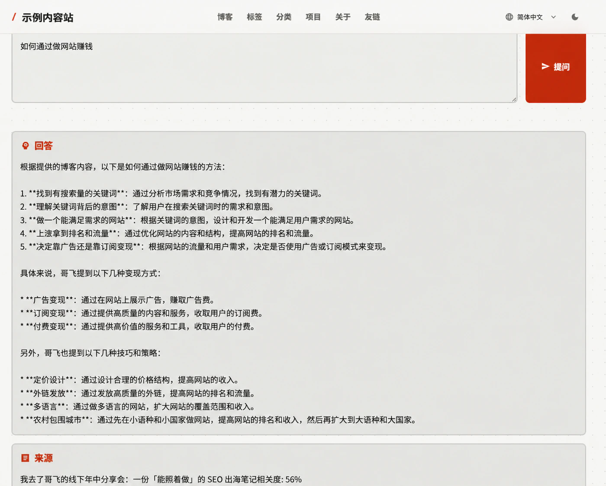

A bilingual content site can be generated statically with Astro. Static sites are inexpensive, stable, and easy to cache, but they naturally know how to display articles—not understand them or answer questions about them.

To let readers ask questions such as “Which AI programming lessons are covered here?” or “Which deployment approach did that article recommend?”, the system adds RAG (Retrieval-Augmented Generation) question answering. Instead of asking a model to answer from memory, it first retrieves relevant passages from the content index, then requires the model to answer only from that evidence and return its sources.

The difficult part was not connecting a chat model. It was keeping the knowledge base aligned with a changing blog. If a new post is not indexed, the AI cannot know about it. If an edited or deleted post leaves old vectors behind, the AI can cite stale information. The resulting design therefore solves two problems together: **reliable answers at query time and automatic consistency at publishing time.**

## 1. Overall Architecture: Static Experience, Independent RAG Service



The system is deliberately split into two independent layers:

- the content layer contains English and Chinese MDX posts, the static question UI, and the GitHub Actions workflow;
- the RAG layer runs on Cloudflare Workers and handles retrieval, question answering, and protected index management.

The frontend remains completely static. Its question page collects input and sends a structured request to an independent RAG service:

```json
{
  "lang": "en",
  "question": "What have I written about AI programming?",
  "topK": 5
}
```

The browser never accesses a database directly and never receives a write credential. Embedding, retrieval, database reads, and model inference all happen on the service side.

The service combines three Cloudflare capabilities:

1. **Workers AI** generates embeddings for questions and article chunks, then produces the final answer;
2. **Vectorize** stores 768-dimensional vectors and performs cosine-similarity retrieval;
3. **D1** stores readable chunk text, titles, URLs, language, tags, and other metadata.

Vectorize answers “Which chunks are semantically closest?” while D1 answers “What original text and URL belong to those IDs?” Keeping vectors and source text separate reduces vector metadata and makes debugging and citations straightforward.

## 2. How Articles Enter the Knowledge Base

The synchronization script scans `src/content/blog/{lang}/{slug}/index.mdx` and processes each post as follows:

1. Read title, description, date, tags, and categories;
2. remove MDX imports, code blocks, image links, HTML tags, and Markdown syntax;
3. split cleaned text into roughly 1,800-character chunks with 200 characters of overlap;
4. hash `contentId + chunk index + chunk text` with SHA-256;
5. combine the language prefix and first 24 hash characters into a stable chunk ID;
6. write batches of 32 chunks through a protected management channel.

Overlap matters because a complete idea may cross a chunk boundary. Without overlap, both neighboring chunks can contain only half a sentence. A small shared context makes either chunk more useful when retrieved.

The service uses `@cf/google/embeddinggemma-300m` by default to create a 768-dimensional embedding, then:

- upserts source text and metadata into D1;
- upserts the vector plus `lang`, `source`, and `content_id` metadata into Vectorize.

The management channel accepts at most 64 chunks per request and requires an administrator credential. The client intentionally sends 32 at a time to keep embedding requests and edge execution pressure moderate.

## 3. How One AI Answer Is Produced


A question moves through six stages.

### 1. Validate the request

The service accepts `question`, `lang`, and `topK`. Questions are limited to 1,000 characters. `topK` defaults to 5 and is clamped between 1 and 10.

### 2. Embed the query

The question is formatted as a question-answering query and embedded with the same model used for documents. Queries and documents must share one vector space for their semantic distance to be meaningful.

### 3. Search Vectorize with a language filter

The service runs cosine-similarity search with `filter: { lang }`. Chinese questions search Chinese posts and English questions search English posts. This prevents translations from competing and keeps source links consistent with the reader’s current language.

### 4. Hydrate matches from D1

Vectorize returns IDs and similarity scores. The service then loads titles, URLs, original chunk text, and metadata from D1 in one batch. In other words, vectors select candidates; the relational database restores the context the model can read.

### 5. Apply a confidence gate

The default minimum score is `0.45`. When no result exists or the top score is below that threshold, the system does not invite the model to improvise. It explicitly tells the reader that the indexed blog does not contain enough reliable evidence.

This gate is more effective than merely prompting “do not hallucinate,” because irrelevant context can itself encourage a model to assemble a plausible but unsupported answer.

### 6. Generate from context and return sources

When retrieval passes the threshold, the service combines matched titles, URLs, and text into a Context and instructs `@cf/meta/llama-3.1-8b-instruct-fast` to:

- use only the supplied blog context;
- say when the context is insufficient;
- add citation markers such as `[1]` and `[2]`;
- never invent facts, links, or opinions.

Generation is deliberately conservative: temperature `0.2`, with at most 900 tokens. Sources are deduplicated by URL, and the response includes the answer, titles, links, and similarity scores. The query and matched chunk IDs are also written asynchronously to `ask_events`, providing a record of what real readers want to know.

### The complete answer loop in the interface



This live Chinese-interface screenshot turns the backend sequence into three reader-visible areas: a question input at the top, a grounded answer in the middle, and the matched source article with its relevance score at the bottom. The site identity in the screenshot has been anonymized.

The answer and source panels are intentionally separate. Readers can get the conclusion quickly, then use the article title and relevance score to decide whether to inspect the original material. This reinforces an important idea: the answer is backed by traceable content evidence rather than generated from the model alone.

## 4. Automatic Article Sync with GitHub Actions


The first version had a working upsert script, but it had to be run manually. Publishing and indexing were separate workflows, so it was easy to forget the second one and end up with content visible on the site but unknown to the AI.

Synchronization now runs inside the content project’s deployment workflow:

```text
push main → build Astro → deploy GitHub Pages → sync knowledge base
```

The sync job declares `needs: build-and-deploy`, so it runs only after the website deploy succeeds. A failed build cannot index content that was never published. Checkout uses `fetch-depth: 0` because incremental synchronization needs complete Git history.

### Added posts

The script reads each new file, cleans and chunks it, generates IDs, and upserts the chunks. Repeating the same upsert is idempotent, so reruns do not create duplicates.

### Edited posts

The script reads the post at both the `before SHA` and `HEAD`, then calculates the old and new chunk sets:

- every new chunk is upserted;
- IDs present only in the old set are stale and deleted.

The order is deliberately **upsert first, delete second**. If synchronization stops halfway through, the index may temporarily retain old content, but it will not delete an entire article before only half of its replacement has been written.

### Deleted posts

The deleted file no longer exists in the working tree, but it remains in Git history. The script reads it with `git show <before SHA>:<path>`, reconstructs its previous chunk IDs, and uses the protected management channel to remove records from both D1 and Vectorize.

### Retries and visible failure

Every administration request has a 60-second timeout and retries up to three times. When the synchronization credential is missing, the Actions job fails clearly instead of silently skipping synchronization. A visible red build is safer than a knowledge base that remains stale for months.

## 5. Why Full Reconciliation Still Matters

Incremental synchronization compares two adjacent revisions. If one Actions run fails completely and the next run processes only a newer diff, the missed changes could remain absent indefinitely.

A manually triggered workflow therefore performs full reconciliation:

1. scan and upsert every current article;
2. use a protected paginated query to retrieve remote content IDs;
3. compare repository IDs with remote IDs;
4. delete orphan IDs that exist only remotely.

Incremental sync keeps normal publishing efficient. Full reconciliation provides eventual consistency and self-healing. It should be run during initial activation, after changing chunking rules or embedding models, or whenever missing data is suspected.

## 6. Security Boundaries

Public and administrative capabilities are intentionally separated:

- question answering and search can be public, with input limits and CORS controls;
- write, delete, and index-listing capabilities require an administrator credential;
- the credential is stored as a deployment-platform Secret;
- GitHub Actions uses the same credential for automatic synchronization;
- the token is never included in frontend output or committed to Git.

Readers may access the public question interface, but they can only ask questions—not modify the knowledge base.

## 7. Current Trade-offs

This implementation is sufficient for a personal blog, but its limitations are explicit:

- character-based chunking could evolve into heading-, paragraph-, and token-aware semantic chunking;
- code blocks are currently removed, so technical code questions would benefit from a separate code index or preservation strategy;
- Vectorize mutations are asynchronous, creating a short delay before newly published content becomes searchable;
- full reconciliation regenerates every embedding, making it reliable but more expensive than incremental sync;
- index versions, synchronization run records, and per-article checksums would improve observability.

## Conclusion

The valuable part of adding AI Q&A to a content site is not the new text box. It is the reliable knowledge pipeline behind it: articles remain the source of truth, GitHub Actions detects changes, the RAG service handles embedding and retrieval, D1 and Vectorize each serve a focused role, and the language model answers only when reliable evidence has been found.

Once additions, edits, and deletions propagate automatically—and failed runs can be repaired through full reconciliation—the AI feature stops being a demo and becomes a genuine part of the publishing system.
