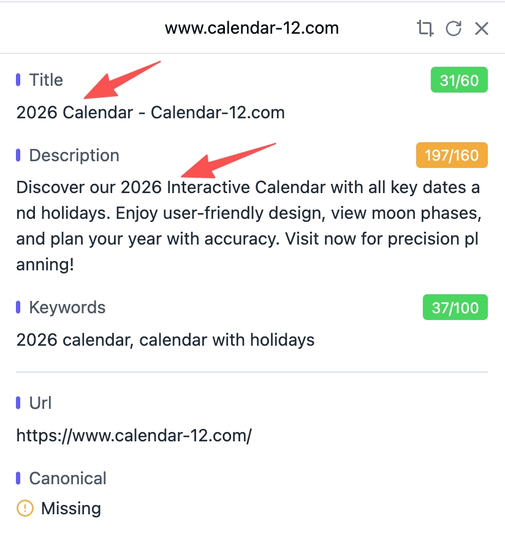
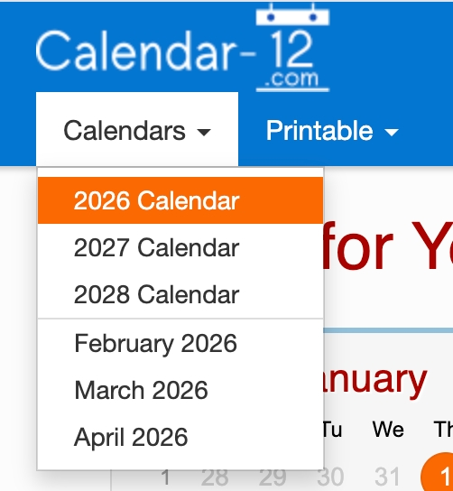
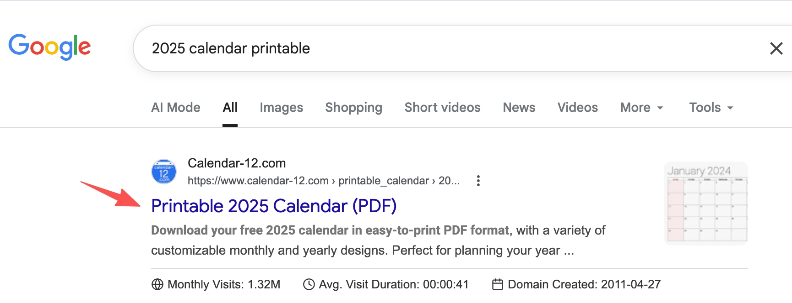
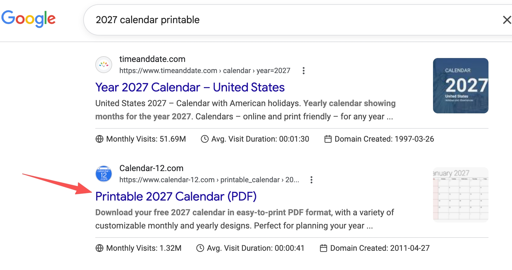
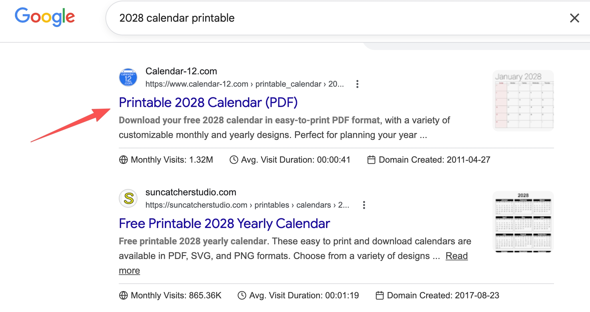
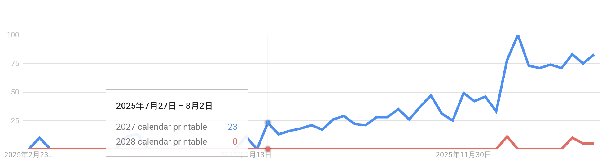

Today I reviewed a case shared by GeFei, and it’s one of the clearest long-term SEO playbooks I’ve seen.

The site is `calendar-12.com`:
- Launched in 2011
- Still alive after ~15 years
- Around **1.32M monthly visits**, mostly from search

---

## 1) What traffic does this site capture?

Mainly predictable yearly keyword clusters, for example in 2026:

- `2026 calendar printable`
- `calendar 2026`
- `2026 calendar`
- `printable calendar 2026`
- `2026 printable calendar`

These terms are powerful because:
1. demand repeats every year,
2. demand starts growing **before** the target year arrives.

---

## 2) Homepage strategy: dynamic year, not static copy

A natural question: if the title is “2026” now, was it “2025” last year?

Current homepage metadata uses 2026:

Archive.org snapshots show 2025 on 2025-12-13:

So the homepage year is dynamically updated by code.  
This keeps the homepage aligned with current-year intent.

And the first screen instantly shows the current year calendar:

---

## 3) The real moat: yearly landing page matrix

This site is not “homepage-only SEO.” It builds dedicated pages for each year.

You can see future-year entries in navigation:

SERP behavior confirms this:

- `2026 calendar printable` → 2026 landing page

- `2025 calendar printable` → 2025 landing page

- `2027 calendar printable` → 2027 page already competing

- `2028 calendar printable` → 2028 page also present

---

## 4) Why 2027/2028 pages must be built early

This is the key lesson.

Many teams wait until 2027 to publish a 2027 page. That’s late.
Search demand usually appears earlier than expected.

Trend evidence:

- `2026 calendar printable` started rising during 2025

- `2027 calendar printable` already had demand in late 2025

Early publishing gives pages time to accumulate:
- crawl/index history,
- user behavior signals (CTR, dwell, return),
- internal/external link equity,
- trust through stable updates.

---

## 5) Practical takeaway: for predictable keywords, timing is the edge

This is not a trick. It’s execution discipline:

1. dynamic homepage year for current intent,
2. yearly page matrix for long-tail and future intent,
3. launch 1–2 years early,
4. let user signals accumulate,
5. benefit from compounding domain/page authority.

> If demand is predictable, publish before demand peaks — not after.

---

## 6) Reusable checklist (beyond calendars)

For any predictable, cyclical keyword space:

- Build yearly keyword clusters (head + variants)
- Keep homepage dynamic and yearly pages persistent
- Publish at least 1 year early (ideally 1.5–2 years)
- Refresh content quarterly and strengthen internal links
- Track indexation, rankings, CTR, and engagement

Long-term SEO winners often don’t win by “hacking.”  
They win by **early positioning + compounding data + consistency**.
