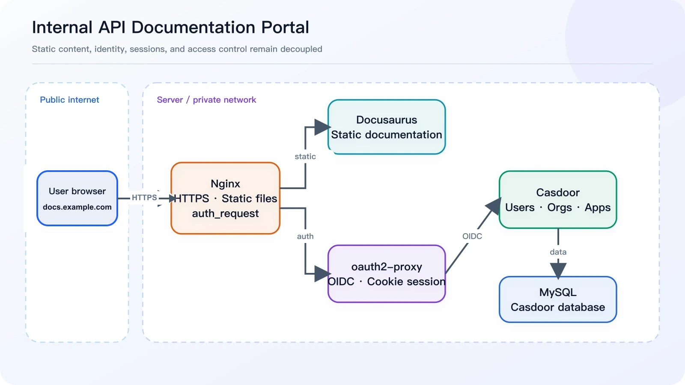
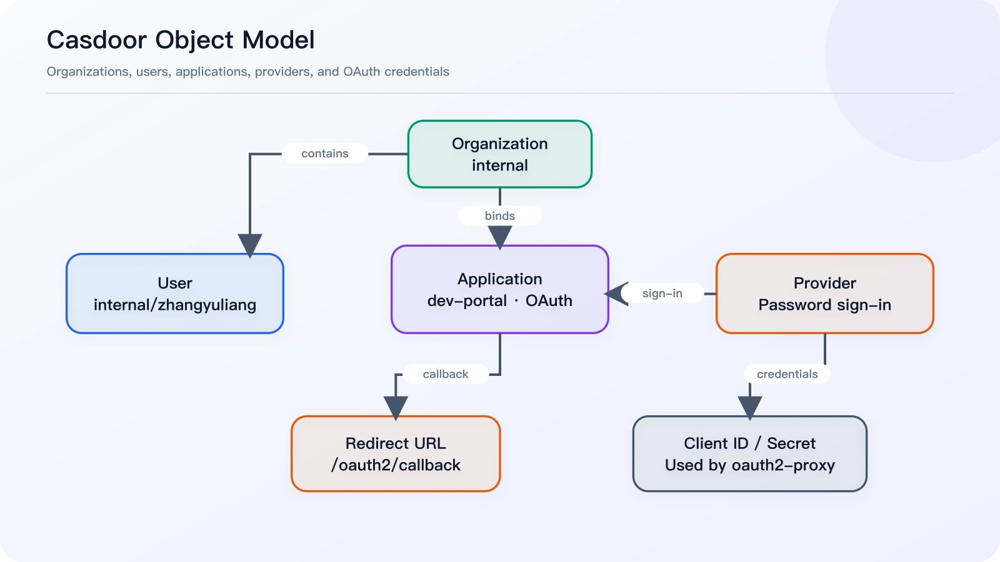
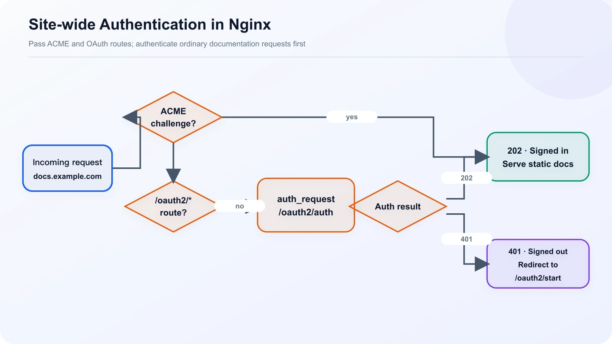
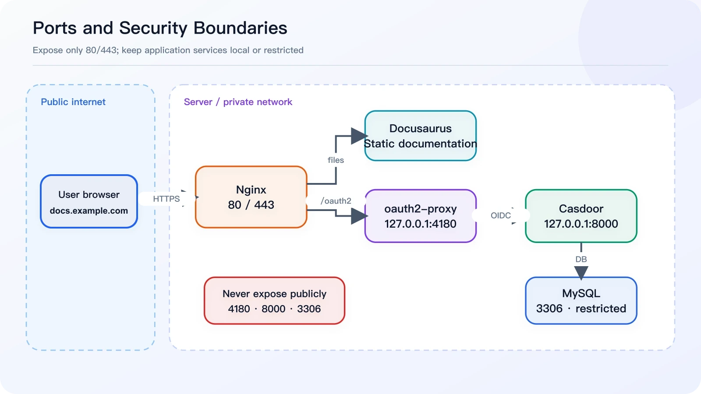
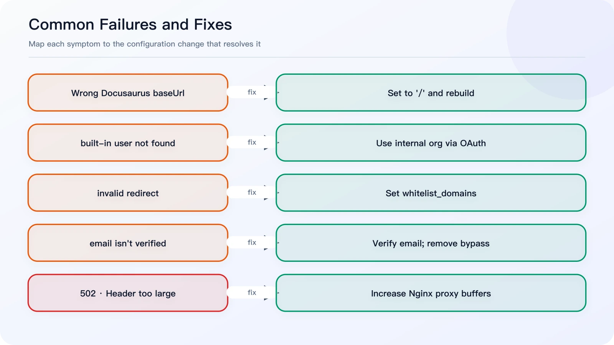
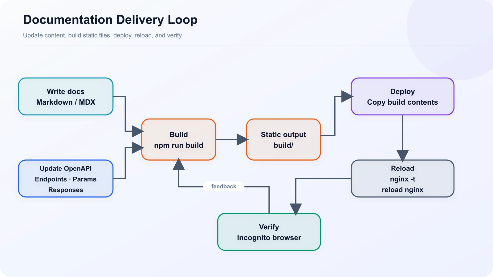

We wanted a maintainable internal documentation site for HTTP APIs, Kafka messages, authentication guides, error codes, deployment manuals, troubleshooting notes, and release history.

Docusaurus is an excellent static documentation generator, but a static site has no server-side authorization layer. Putting login checks in the browser would be insecure and would force the documentation project to own responsibilities that belong elsewhere. I therefore split the system into four layers:

| Component | Responsibility |
| --- | --- |
| Docusaurus | Generate and serve the static documentation |
| Casdoor | Manage organizations, users, applications, and sign-in |
| oauth2-proxy | Handle OIDC login, callbacks, and Cookie sessions |
| Nginx | Terminate HTTPS, proxy requests, serve static files, and protect the whole site |



*Figure 1: Overall architecture. The browser talks only to Nginx; the static files, authentication proxy, and identity service stay on the server side.*

The final request flow looks like this:

```text
User opens https://docs.example.com
  ↓
Nginx issues an auth_request
  ↓
oauth2-proxy checks the session
  ↓ not signed in
Redirect to https://auth.example.com for Casdoor authentication
  ↓
Callback to https://docs.example.com/oauth2/callback
  ↓
oauth2-proxy sets a Cookie; Nginx serves the Docusaurus files
```

The setup uses two subdomains: `auth.example.com` for Casdoor and `docs.example.com` for the protected documentation site.

## 1. Deploy Docusaurus

Running `npm run build` produces a `build/` directory. Deploy the **contents of that directory**, not the directory itself:

```text
/var/www/openapi-docs/index.html
/var/www/openapi-docs/404.html
/var/www/openapi-docs/assets/
/var/www/openapi-docs/docs/
```

Do not end up with `/var/www/openapi-docs/build/index.html`.

Because the site is served from the domain root, configure `docusaurus.config.ts` as follows:

```ts
export default {
  url: "https://docs.example.com",
  baseUrl: "/",
};
```

Using `baseUrl: '/openapi/'` makes the browser report that the configured base URL does not match the actual path. After fixing it, rebuild and deploy:

```bash
npm run build

rm -rf /var/www/openapi-docs/*
cp -r build/* /var/www/openapi-docs/
chown -R www-data:www-data /var/www/openapi-docs
nginx -t
systemctl reload nginx
```

Before clearing the directory, verify the target carefully and use the backup or atomic-release policy appropriate for your production environment.

## 2. Deploy and Configure Casdoor

Casdoor provides centralized authentication. For the first phase, we only enabled password login and deliberately postponed third-party providers to keep the system simple.

Casdoor is available publicly at `https://auth.example.com`, while its container port is bound only to `127.0.0.1:8000` and exposed through Nginx. Complete these steps in its admin console:

1. Create an organization named `internal`.
2. Create a user in that organization, such as `internal/zhangyuliang`.
3. Create an OAuth application named `dev-portal` and bind it to `internal`.
4. Enable the password provider.
5. Set the Redirect URL to `https://docs.example.com/oauth2/callback`.
6. Save the generated Client ID and Client Secret for oauth2-proxy.



*Figure 2: Casdoor's object model. A user belongs to an organization; the application binds the organization and login provider, then supplies its callback and credentials to oauth2-proxy.*

Do not use `https://auth.example.com/oauth2/callback`. The callback is handled by oauth2-proxy on the documentation domain, not by Casdoor itself.

One detail can be confusing: opening `https://auth.example.com/login` directly takes you to the `built-in` organization's login page. Entering `zhangyuliang` there makes Casdoor search for `built-in/zhangyuliang`, not `internal/zhangyuliang`.

To test an internal user directly, open:

```text
https://auth.example.com/login/internal
```

Normal users do not need this URL. When they visit the documentation site, oauth2-proxy starts the correct OAuth flow automatically.

## 3. Configure oauth2-proxy

oauth2-proxy connects Nginx to Casdoor. In this setup, it lives under `/opt/oauth2-proxy/`, with its configuration at `/opt/oauth2-proxy/oauth2-proxy.cfg`:

```toml
http_address = "0.0.0.0:4180"
provider = "oidc"
provider_display_name = "Casdoor"

client_id = "replace with the Casdoor Application Client ID"
client_secret = "replace with the Casdoor Application Client Secret"

oidc_issuer_url = "https://auth.example.com"
redirect_url = "https://docs.example.com/oauth2/callback"
scope = "openid email profile"

email_domains = [ "*" ]
whitelist_domains = [ "docs.example.com" ]

# Temporary compatibility option while email addresses remain unverified
insecure_oidc_allow_unverified_email = true

cookie_name = "_oauth2_proxy_docs"
cookie_secret = "replace with a randomly generated cookie secret"
cookie_secure = true
cookie_httponly = true
cookie_samesite = "lax"

reverse_proxy = true
skip_provider_button = true
set_xauthrequest = true

upstreams = [
  "static://202"
]
```

Generate a Cookie secret with:

```bash
openssl rand -base64 32 | tr -- '+/' '-_'
```

Use this Docker Compose file:

```yaml
services:
  oauth2-proxy:
    image: quay.io/oauth2-proxy/oauth2-proxy:v7.15.3
    container_name: oauth2-proxy
    restart: unless-stopped
    ports:
      - "127.0.0.1:4180:4180"
    volumes:
      - ./oauth2-proxy.cfg:/etc/oauth2-proxy/oauth2-proxy.cfg:ro
    command:
      - --config=/etc/oauth2-proxy/oauth2-proxy.cfg
```

Start it and inspect the logs:

```bash
cd /opt/oauth2-proxy
docker compose up -d
docker logs -f oauth2-proxy
```

Check the authentication endpoint:

```bash
curl -I http://127.0.0.1:4180/oauth2/auth
```

An unauthenticated request should return `HTTP/1.1 401 Unauthorized`. That response confirms the endpoint is working.

## 4. Protect docs.example.com with Nginx



*Figure 3: Nginx authentication flow. ACME and OAuth routes are passed through, while ordinary pages use auth_request and continue according to a 202 or 401 response.*

There are only three essential routing rules:

- allow `/.well-known/acme-challenge/` for certificate validation;
- proxy `/oauth2/` to oauth2-proxy;
- authenticate `/` through the internal `/oauth2/auth` endpoint before serving Docusaurus files.

The complete configuration is below. Replace the certificate paths for your environment:

```nginx
upstream docs_oauth2_proxy_backend {
    server 127.0.0.1:4180;
    keepalive 32;
}

server {
    listen 80;
    server_name docs.example.com;

    location ^~ /.well-known/acme-challenge/ {
        root /www/server/stop;
        allow all;
    }

    location / {
        return 301 https://$host$request_uri;
    }
}

server {
    listen 443 ssl http2;
    server_name docs.example.com;

    ssl_certificate /etc/ssl/example.com_bundle.pem;
    ssl_certificate_key /etc/ssl/example.com.key;
    ssl_protocols TLSv1.2 TLSv1.3;
    ssl_session_cache shared:SSL:10m;
    ssl_session_timeout 10m;
    ssl_prefer_server_ciphers on;
    ssl_ciphers HIGH:!aNULL:!MD5;

    add_header Strict-Transport-Security "max-age=31536000" always;
    error_page 497 https://$host$request_uri;

    access_log /var/log/nginx/docs.example.com.access.log;
    error_log /var/log/nginx/docs.example.com.error.log;

    root /var/www/openapi-docs;
    index index.html;
    client_max_body_size 50m;

    proxy_buffer_size 256k;
    proxy_buffers 16 256k;
    proxy_busy_buffers_size 512k;

    location ^~ /.well-known/acme-challenge/ {
        root /www/server/stop;
        allow all;
    }

    location ^~ /oauth2/ {
        proxy_pass http://docs_oauth2_proxy_backend;
        proxy_http_version 1.1;
        proxy_set_header Host $host;
        proxy_set_header X-Real-IP $remote_addr;
        proxy_set_header X-Scheme $scheme;
        proxy_set_header X-Forwarded-Proto $scheme;
        proxy_set_header X-Forwarded-For $proxy_add_x_forwarded_for;
        proxy_set_header X-Auth-Request-Redirect $scheme://$host$request_uri;

        proxy_buffer_size 256k;
        proxy_buffers 16 256k;
        proxy_busy_buffers_size 512k;
    }

    location = /oauth2/auth {
        internal;
        proxy_pass http://docs_oauth2_proxy_backend;
        proxy_http_version 1.1;
        proxy_set_header Host $host;
        proxy_set_header X-Real-IP $remote_addr;
        proxy_set_header X-Scheme $scheme;
        proxy_set_header X-Forwarded-Proto $scheme;
        proxy_set_header X-Forwarded-For $proxy_add_x_forwarded_for;
        proxy_set_header X-Forwarded-Uri $request_uri;
        proxy_set_header Content-Length "";
        proxy_pass_request_body off;

        proxy_buffer_size 256k;
        proxy_buffers 16 256k;
        proxy_busy_buffers_size 512k;
    }

    location / {
        auth_request /oauth2/auth;
        error_page 401 = @oauth2_start;

        auth_request_set $auth_user $upstream_http_x_auth_request_user;
        auth_request_set $auth_email $upstream_http_x_auth_request_email;
        add_header X-Auth-User $auth_user;
        add_header X-Auth-Email $auth_email;

        try_files $uri $uri.html $uri/ /404.html;
    }

    location @oauth2_start {
        return 302 /oauth2/start?rd=$scheme://$host$request_uri;
    }

    location ~ ^/(\.user\.ini|\.htaccess|\.git|\.env|\.svn|\.project|LICENSE|README\.md|package\.json|package-lock\.json|yarn\.lock|pnpm-lock\.yaml)$ {
        return 404;
    }

    location ~ ^/\.well-known/.*\.(php|jsp|py|js|css|lua|ts|go|zip|tar\.gz|rar|7z|sql|bak)$ {
        return 403;
    }
}
```

Apply the configuration:

```bash
nginx -t
systemctl reload nginx
```

At the network boundary, only Nginx ports 80 and 443 should be public. Keep oauth2-proxy on 4180 and Casdoor on 8000 bound to localhost, and restrict MySQL port 3306 with a security group or firewall.



*Figure 4: Port and security boundaries. Only ports 80 and 443 are public; 4180, 8000, and 3306 are not exposed directly to the internet.*

## 5. Five Problems We Encountered



*Figure 5: Five access failures and the corresponding fixes.*

### 5.1 Incorrect Docusaurus baseUrl

**Symptom:** the page reports `Current configured baseUrl = /openapi/`.

**Cause:** the site was built for `/openapi/` but served from the domain root.

**Fix:** set `baseUrl: '/'`, rebuild, and replace the deployed static files.

### 5.2 Casdoor's default login searches the built-in organization

**Symptom:** Casdoor says `built-in/zhangyuliang` does not exist.

**Cause:** `/login` belongs to the `built-in` organization by default.

**Fix:** continue using `built-in/admin` for administration and place documentation users under `internal`. In production, let oauth2-proxy initiate login instead of opening `/login` manually.

### 5.3 oauth2-proxy reports an invalid redirect

Log message:

```text
Rejecting invalid redirect "https://docs.example.com/": domain / port not in whitelist
```

Add this setting:

```toml
whitelist_domains = [ "docs.example.com" ]
```

### 5.4 oauth2-proxy rejects an unverified email address

The log says `email in id_token (...) isn't verified` because Casdoor returned `email_verified=false`.

As a temporary workaround, set `insecure_oidc_allow_unverified_email = true`. The long-term fix is to mark the user's email as verified in Casdoor and then remove this permissive option.

### 5.5 Nginx returns 502 after the login callback

The error log contains:

```text
upstream sent too big header while reading response header from upstream
```

The Cookie and headers written during the oauth2-proxy callback can exceed Nginx's default buffers. Add the following settings globally and inside both `/oauth2/` and `/oauth2/auth`:

```nginx
proxy_buffer_size 256k;
proxy_buffers 16 256k;
proxy_busy_buffers_size 512k;
```

## 6. Post-deployment Verification

First, check Casdoor's OIDC discovery endpoint:

```bash
curl -I https://auth.example.com/.well-known/openid-configuration
```

It should return 200. Then test oauth2-proxy:

```bash
curl -I http://127.0.0.1:4180/oauth2/auth
```

It should return 401 while you are signed out. Finally, open `https://docs.example.com` in an incognito window. The complete flow should be:

```text
Redirect to auth.example.com
  ↓
Enter credentials for a user in the internal organization
  ↓
Complete sign-in and return to docs.example.com
  ↓
View the Docusaurus documentation site
```

## 7. Ongoing Maintenance

Once authentication is stable, routine maintenance is mostly about Docusaurus content. The deployment flow can be wrapped in a script:



*Figure 6: Documentation maintenance flow, covering content updates, build, deployment, and production verification.*

```bash
#!/usr/bin/env bash
set -e

APP_DIR="/opt/openapi-docs"
WEB_DIR="/var/www/openapi-docs"

cd "$APP_DIR"
npm run build

rm -rf "$WEB_DIR"/*
cp -r build/* "$WEB_DIR"/
chown -R www-data:www-data "$WEB_DIR"

nginx -t
systemctl reload nginx

echo "Docusaurus docs deployed."
```

For production, you can improve this further by deploying to timestamped release directories and switching a symlink. That keeps the previous version available for a fast rollback.

## Conclusion

This architecture keeps the documentation site entirely static while assigning identity, sessions, and access control to dedicated components. Casdoor centralizes users, oauth2-proxy owns the OIDC session, and Nginx protects the whole site. No login code is needed inside Docusaurus, and the authentication layer can later protect other internal tools such as n8n, ShowDoc, Hoppscotch, or RuoYi.

At the end of the first phase, anonymous users cannot reach the documentation, authenticated users can browse it normally, and content remains decoupled from access control. The next priority is no longer rebuilding the login system; it is continuously improving the documentation until the site becomes a genuinely reusable internal developer portal.
