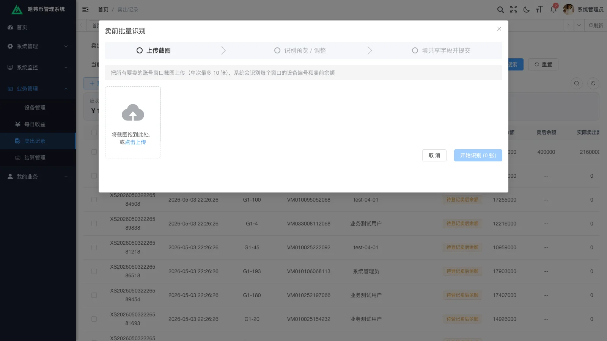
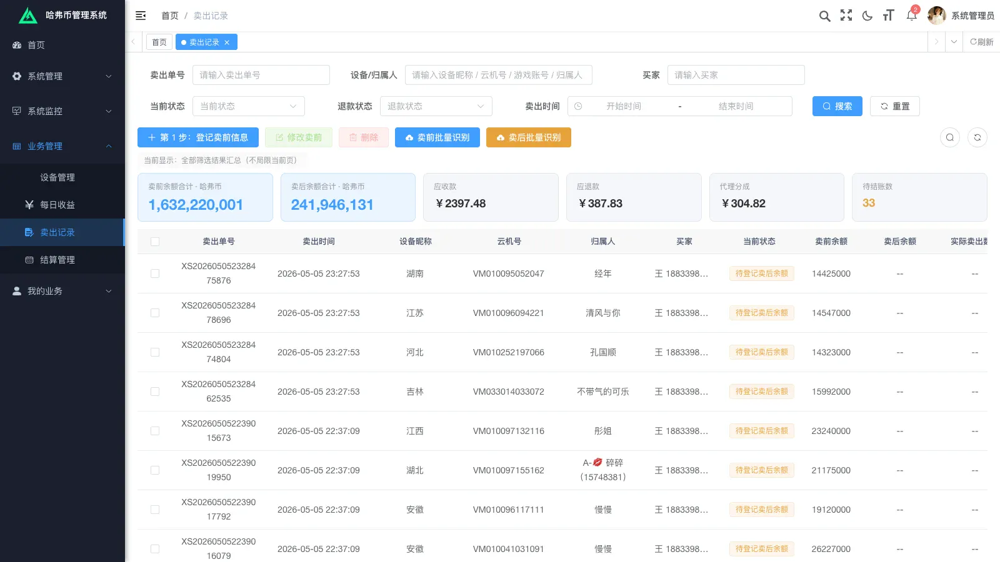
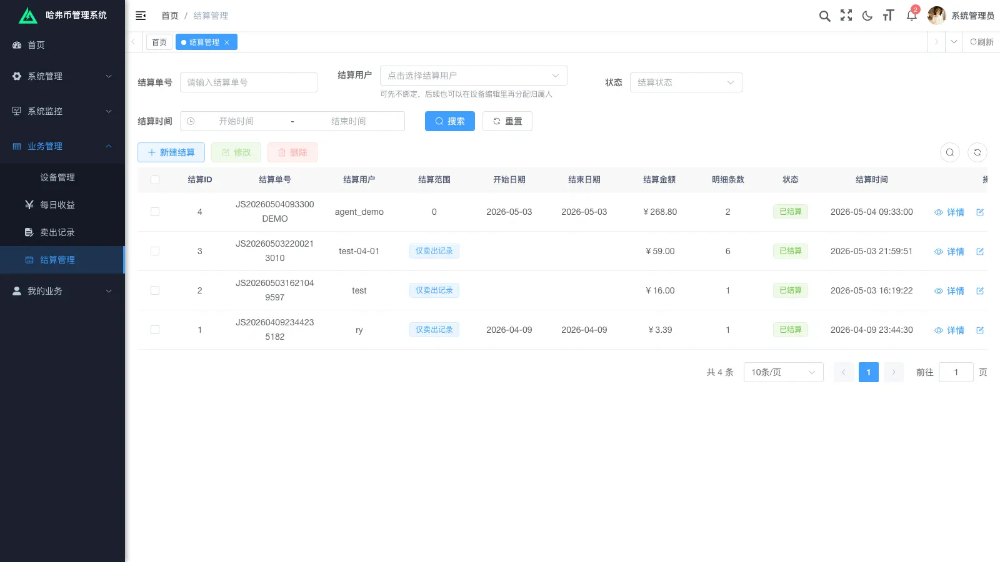
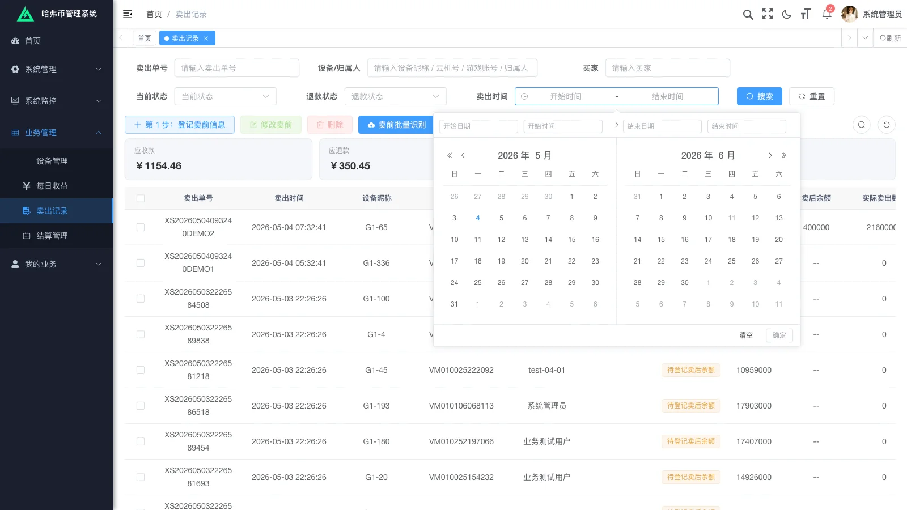

# Half a Month, 5 Iterations, ¥0.29 OCR: A Full-Stack Project Killed by Platform Policy

## 1. Project obituary

Last month I built an internal admin system for a friend. About two weeks elapsed, five rounds of requirement iteration, primary developer was Claude Code, with Alibaba DashScope's vision model wired in for image recognition.

The day after the fifth-round delivery, my friend's WeChat account got banned across the board — a 10-year-old account — and the project shut down completely the same day.

Not a single line of code changed. The system died.

This retrospective covers three things:

1. Just how strong AI coding has gotten in 2026
2. How to manage five rounds of conversational feedback into executable requirements
3. What happens when the engineering is right but the business judgment is wrong

---

## 2. What the system did

The business was simple: **an internal admin for tracking revenue across game accounts.**

Every day, the operations staff faced a pile of screenshots spat out by third-party software — account balances, output details — that they had to retype into Excel by hand and then reconcile. Error rates were high, the turnaround was slow. Our job was to systematize the whole thing: device, account, daily output, sale record, settlement statement — five primary tables wired together; screenshots auto-recognized into structured data, auto-inserted, auto-reconciled.

Sketched as a data model, roughly:

```
device ──┬── account ──┬── daily_income
         │             └── sale_record ── settlement
         └── operator
```

Stack in one line: **RuoYi-Vue admin scaffold (forked) + Alibaba DashScope qwen-vl-max + Claude Code as the primary developer.**


---

## 3. Stack picks and trade-offs

### Why RuoYi

The client had a tight budget and a short delivery window. RuoYi ships permissions, dictionaries, code generators, menus, and audit logs out of the box. Writing a permission system from scratch and *then* building the business on top of it would have eaten at least 60% more time. There was no reason not to reuse it.

The cost of forking is that upgrading the RuoYi base later becomes risky, but the client has no plans for major version upgrades. Trade-off cleared — RuoYi was the right pick.

### Why Alibaba DashScope qwen-vl-max

Candidates were GPT-4V, Gemini, Alibaba DashScope, and Zhipu GLM-4V. Why DashScope won:

- **Domestic compliance**: a domestic B2B client needs data on in-country pipes — non-negotiable
- **Accurate on Chinese screenshots**: the third-party software produces a lot of Chinese text and numbers; qwen-vl-max recognizes them well
- **Cheap billing**: token-based, ~800–900 tokens per screenshot, friendly unit price
- **Easy integration**: a single DashScope SDK call — no elaborate prompt engineering required

### Why not Spring AI / LangChain

In this project the AI did exactly one well-scoped thing: turn images into structured fields. Wrap a `RestTemplate` around DashScope's HTTP API and you're done. The benefits of Spring AI — multi-model routing, agent orchestration, vector retrieval — were all unused here. Pulling in a heavy framework only adds noise.

The engineering principle: **one fewer layer is always better.**

### YingDao RPA MCP (kept on the bench)

There's a `yingdao_mcp_server/` directory in the repo. The original idea was to automate the third-party software too — Claude Code drives YingDao via MCP to click and screenshot. The client eventually said "ops can just click around every day, no need for full automation," so it never shipped. The code stays as a backup.

---

## 4. AI dev velocity stress test: ¥0.29 for 150 recognitions

This is the most counter-intuitive part of the project.




**From the DashScope console:**
- Models invoked: 1 (qwen-vl-max)
- Total successful calls: 150
- Total tokens: 127K
- Average per request: 849 tokens

**From the Alibaba Cloud monthly bill:**
- Amount due: **¥0.29**
- Discount applied: ¥0
- Promotion hit: no

A full **150 multimodal image recognitions**, including repeated regression testing during full-stack integration, **for ¥0.29 total.** Token economics has dropped to "essentially free for small projects."

Claude Code's role was even more direct this time:

- **Design phase**: had conversations with me to break down requirements, drafted design docs
- **Coding phase**: wrote services, mappers, XML, Vue components, Element Plus forms
- **Integration phase**: reproduced bugs from client screenshots, read mapper SQL to tighten datetime filtering precision
- **Documentation phase**: produced an *Operator Manual* and an *Admin Manual* — both with embedded screenshots (the admin manual is 40k+ Chinese characters)

My role was closer to "product + architect + client liaison." **Writing code stopped being the bottleneck on this project.**

But fast code generation does not mean fast delivery. The real bottleneck is in the next section.

---

## 5. Managing five rounds of iteration

Client feedback came in shapes like this:

- **Voice notes**: "This version's a bit messy, the rest doesn't matter, we need totals now — based on the rows you tick, sum up the pre-sale total balance and the post-sale total balance"
- **Text**: "When adding a device, also record who entered it — default to the current logged-in user, but allow editing"
- **Screenshots**: 3 error screenshots + a one-liner "settlement status didn't follow"

Unstructured. Ambiguous. Mixed media. **Implement what you heard literally and you'll redo it.**

The process I imposed on myself: every round, transcribe the client's exact words **line by line into a confirmation document**, then split each line into three columns:

| Our reading | Current implementation | Pending client confirmation (Q&A options) |

Then I make the client **tick a box** under each Q — instead of describing what they want from memory.

Two real cases.

### Case 1: checkbox aggregation

Client's exact words: "**The most, most** important thing is to display total in-game-currency based on what's ticked — we need to report this to the boss."

Implement that literally and you'd build "sum of balances for ticked rows." But broken down, there were at least three pending decisions:

- **Q1.1** What about the four existing summary cards? Keep all / replace all / keep some (which ones — the client has to point them out)
- **Q1.2** When nothing is ticked, what shows? Display 0 / a grayed-out hint / auto-aggregate the current page
- **Q1.3** After paginating, do tick states persist? Persist (cross-page aggregation) / reset (cleared on page change)

Every one of these is a real fork in the road. If you don't force them out into the confirmation doc, the client says "this isn't what I wanted" after the build, and you redo it.



### Case 2: ambiguous field naming

The client sent screenshots: "the settle status on sale records isn't syncing with what's done in the settlement module."

I read the source: the backend `BizSettlementServiceImpl.syncSettlementBizRecords()` is correct — it picks `BizSettlementItem.bizType='SALE'` and sets the corresponding `BizSaleRecord.settle_status` to 1, binding `settlement_id`. **But** the frontend list column was labeled "Settled Flag," and its prop was `settledFlag` (a manual-mark field), **not** `settleStatus` (the auto-synced field). Two columns with similar names, different semantics — what looks like "didn't sync" is actually "we're showing you the wrong column."

Implementing the client's literal request — "fix the backend sync logic" — would be the wrong fix. **The real bug was the frontend showing the wrong field; or, more honestly, the two fields' naming / semantics need refactoring.**

If this kind of ambiguity isn't reconciled in the confirmation doc — aligning "what the client says didn't change" with "which line of code didn't actually run" — you'll iterate forever.

### Lesson

AI made code 10× faster to write. But **translating the client's spoken feedback into a hardened requirement** — AI can't help with that. That step is still on you, forcing the client to tick the right box rather than imagining what they meant.

This is also where the real moat lives in the AI era for freelancers. Anyone can let AI write code. Requirement clarity and product judgment are not commodities.

---

## 6. The engineering shipped, but the business died

Morning of 2026-05-07, fifth-round delivery wrapped. `CHANGES.md` listed six main changes plus one optimization, all merged, all building cleanly:

1. Datetime filters now support hour-minute-second precision
2. Column rename (Cloud-machine ID → Device ID)
3. Refund flow automated (removed the manual confirmation button)
4. Operator reward semantics changed from "ratio" to "fixed amount"
5. Device-management default reward semantics adjusted accordingly
6. Manual editing supported in OCR batch recognition
7. OCR recognition precision tweaked (small-value threshold filter)





That same week, my friend's WeChat account got swept up in a mass ban — a 10-year-old account. Project shut down the same day.

Not a line of code changed. System offline.

### The actual lesson

Beyond the technical assessment, you have to do a **platform risk assessment.**

When taking on freelance work or a friend's project, people fixate on technical feasibility, budget, and timeline. One category of risk is reliably ignored: **on the channels this business depends on (WeChat, Douyin, Alipay, app stores), is the business compliant? Or in a gray zone? Or sitting in a policy window that could close any day?**

If it fails this question, no amount of AI-accelerated coding saves you from the bill.

What I'll do next time: add a step to the project kickoff — **platform-dependency list + policy-stability self-assessment**:

- List every platform the revenue path depends on
- Tag each one: white / gray / black
- Anything gray-or-worse: either decline, or take the deposit in full upfront and write platform-risk allocation into the contract
- Pre-agree on the exit mechanism if platform policy shifts

This isn't a legal problem — it's **part of project feasibility.**

---

## 7. Closing

AI dev velocity = the accelerator.
Platform policy = the brake + the emergency stop.

The two aren't sequenced — **brakes come before the accelerator. Always.**

In 2026, "development is too expensive" is mostly an excuse. But "the project failed because the engineering wasn't done" is even more of one.

This wasn't a technical failure. It was a business-judgment failure.

Next time, I do that part first.
