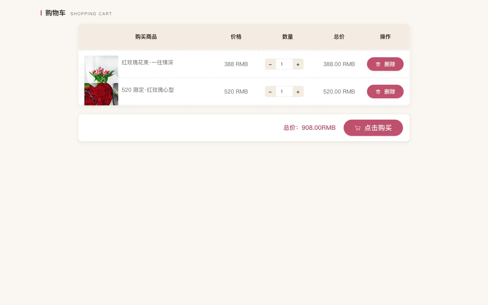

> TL;DR — Right before the May Day holiday I picked up a freelance graduation-project gig: a flower e-commerce site. **Front and back end were driven entirely by Claude Code, 4–5 days, 4–5 iteration rounds. Final delivery: a working system + 30+ figures for the thesis + a defense slide deck.** The buyer turned around and referred me a second job.

This is a "how I used AI to finish a freelance gig" retrospective. Not a tutorial — observations and methodology.

## 1. What the gig looked like

Just before the May Day holiday, a friend handed me a graduation-project gig titled "June Floral Online Sales Website." The stack:

- **Backend**: Spring + SpringMVC + MyBatis-Plus (textbook SSM), Druid connection pool, MySQL 5.7
- **Storefront**: jQuery + Layui + Vue 2 — old-school three-piece mashup
- **Admin**: Vue 2 + Vue Router + Element UI, a standard admin SPA
- **Auth**: Token-based, with a custom interceptor injecting `userId / role / tableName / username` into the session

Business-wise, it's a flower shop: products (fresh flowers / floral materials / preserved flowers), orders (with refunds and returns), inventory (inbound / outbound linkage), customer-service chat, news, and a user center.

First impression after opening the repo: **this thing is half-baked.**

- The storefront homepage was 2015-vintage gray with a serif font
- Half the admin buttons returned 500
- The order-status flow was broken
- Refunds weren't implemented at all
- Documentation (user manual, ER diagram, slides) — none of it existed

The sane move was to either pass on the gig or rewrite it from scratch. But I had Claude Code in my pocket, so I took it.

## 2. The plan: why I touched the front end first and the back end last

My first counter-intuitive call: **storefront UI → admin UI → backend code.** Backwards from what most people would do.

Textbooks say nail the data model first, then build the UI. When you're working with Claude Code, that order is wrong.

**Reason 1: the smaller the verifiable surface, the fewer mistakes the AI makes.**

When Claude Code edits a `Home.vue`, I open the browser and see the result instantly. When it edits a transactional method that touches three tables, I have to run `mvn`, build the WAR, deploy to Tomcat, and only then can I see whether it worked. The first feedback loop is 5 seconds; the second is 5 minutes. While the AI still makes mistakes, **shortening the verification loop matters more than anything else.**

**Reason 2: shipping the UI first makes describing later requirements cheaper.**

Most of the backend's business fields and logic were actually correct — they were just hidden behind a terrible UI. Leave them alone. Polish the UI first. Once it's done, when I describe a new requirement I can point at a concrete page and say "this cart needs batch checkout," instead of abstractly saying "add a `selected` field to the cart entity." **Anchor the conversation in things the user can see** and the probability of AI misinterpretation drops by an order of magnitude.

**Reason 3: psychological payoff.**

A finished storefront is immediately gratifying — ugly to pretty, in under a day. As a freelancer that kind of positive feedback is necessary, because the hard fights come next.

## 3. Phase 1: Storefront overhaul (Day 1)

My opening prompt to Claude Code on the storefront homepage went like this:

> "This is the storefront of a flower e-commerce site. Stack: jQuery + Layui + Vue 2. The current UI is way too dated. Redo the entire storefront aesthetic: take visual cues from Xiaohongshu and Reflower, soft pink / cream palette, the overall feel should be refined, young, boutique. Start with the homepage (`Home.vue`); we'll batch the rest later. Constraints:
> 1. Don't touch the backend APIs or data structures
> 2. Don't introduce any new UI library (work with the existing Layui + Vue 2)
> 3. Preserve the existing routes and data bindings
> 4. Use SCSS to extract a skin file so we can re-skin the whole thing later"

Constraints 3 and 4 are the key. **They draw a fence around Claude Code** — no schema changes, no new dependencies. Those two became the implicit precondition for every page-overhaul prompt that followed.

Claude Code's first delivery was usable as-is:


I reused the same prompt template for the product list, detail page, cart, and order pages:





The full storefront — 14 pages — **done in one day.**

## 4. Phase 2: Admin overhaul (Day 2)

The admin work is grunt work. A dozen-plus CRUD modules (flower info / inbound / outbound / material picking / orders / users / comments / news / customer service), each one a textbook Element UI three-section layout: search bar + table + action buttons.

Strategy was simple: **polish one as the template, then have Claude Code propagate the style.**

I first finalized `admin-flower.vue` (pink skin, rounded table corners, grouped action buttons), then told Claude Code:

> "Use `admin-flower.vue` as the template. Apply the same style to every list page under `admin/src/views/`. Constraints:
> 1. Don't change routes, don't touch API calls
> 2. Extract mixins / components where it's natural, but don't over-engineer
> 3. After you're done, list every modified file so I can spot-check a few"

It rewrote a dozen pages in a single context. I spot-checked 4 of them — all good.


Admin overhaul: **end of Day 2.**

## 5. Phase 3: Filling in the backend (Day 3–4)

By this point the UI looked production-ready, but a lot of features were still broken. The worst offenders:

1. **Order status flow**: the chain "Awaiting payment → Paid → Awaiting shipment → Shipped → Completed" had broken links
2. **Refunds / return-and-refund**: not implemented at all
3. **Inventory linkage**: the `kucun` field on the flower-info table didn't auto-update with inbound / outbound events
4. **Payment**: the original code hard-coded "deduct balance" with no payment-simulation flow

This is the phase where I started touching backend code — Spring MVC controllers, MyBatis-Plus mappers, the service layer.

My collaboration mode with Claude Code shifted. Earlier it was "follow the template"; here it became "implement this business logic." I'd start by writing out the full business flow in plain prose:

> "User checkout flow: cart → pick address → submit order (generate order number, deduct inventory, do NOT deduct balance, status = Awaiting payment) → simulated payment (deduct balance, status = Awaiting shipment) → admin ships (status = Awaiting receipt) → user confirms receipt (status = Completed).
>
> Refund flow: in 'Awaiting shipment' or 'Awaiting receipt' status, the user can initiate refund-only or return-and-refund. Once admin approves, status becomes Refunded and inventory rolls back.
>
> Inventory linkage: inbound order approved → `kucun += quantity`; outbound order approved → `kucun -= quantity`; order creation / refund rollback both need to be linked.
>
> Now tell me: in the current code, which parts of this flow are already implemented, which are missing, and which are wrong. Don't change anything yet — just produce the list."

Making it **audit first, implement second** is the key for complex business logic. Claude Code spits out something like:

```
- OrderController#createOrder: missing inventory deduction, missing transaction
- OrderController#refund: this method doesn't exist at all
- XianhuarukuService#audit: implemented, but doesn't trigger inventory linkage
...
```

Once the list was on the table, I described how to fix each item one by one, and Claude Code implemented them one by one. After every item I'd open the browser, run through the flow, and only move on once it passed.

By the end of Day 3 and Day 4: the full order chain + refunds + inventory linkage were done.


The biggest takeaway from this phase: **Claude Code is not magic.** The clearer your description, the more accurate its work; if you're vague, it guesses, and bad guesses mean rollbacks. So the most valuable skill in this phase isn't fancy prompt engineering — it's the ability to write business logic clearly. That's experience, not patter.

## 6. Phase 4: Docs + thesis + slides (Day 5)

For a graduation project you don't just deliver code — you also deliver the thesis and a defense.

The thesis needed a pile of figures — ER diagrams, business-flow diagrams, interaction diagrams — thirty or forty in total. Code can't do this part, so I switched to **Claude Cowork** (Anthropic's other product, focused on content collaboration).

> **The Claude Code vs. Claude Cowork split:**
> - Writing code, reading code, running commands, editing files → Claude Code
> - Drawing diagrams, building slides, writing thesis paragraphs, content creation → Claude Cowork
>
> My experience over the last two years: don't mix the two. Code isn't great at visual creation; Cowork isn't great at running environments. Each does its own thing — that's the most efficient setup.

The thesis ER diagram, business-flow diagrams, supplementary diagrams (drawio format), database schema (docx), and user manual (md + html) were all produced by Cowork. My job was to review them and fix awkward field names and wrong arrow directions.

Last on the list: a defense slide deck. Cowork generated an outline straight from the thesis chapters → I edited it → exported to pptx.

End of Day 5, all deliverables ready:

- A working SSM + Vue flower e-commerce system
- A v1.0 user manual (HTML + screenshots)
- 30+ thesis figures (ER / flow / interaction)
- A database schema docx
- A defense slide deck

## 7. The buyer referred me another gig

Within a week of delivery, the buyer pushed me a second small gig — **just a defense slide deck, no code.** Even easier: end-to-end Claude Cowork, half a day to ship.

Which led me to a business-side observation: **delivering with AI gets you absurdly high repeat-purchase rates.** It's not about price — AI doesn't put much downward pressure on prices in this market. It's about "fast" and "reliable." Once a buyer realizes you can deliver what they want when they want it, they keep coming back.

## 8. A few practical Claude Code lessons

Distilling what I tripped over so I can reuse next time:

**1. Make the AI audit first, then implement.** For complex business logic, don't let it dive straight into changes. Have it produce a list — what's missing, what's wrong, what's already correct — review it, then have it act.

**2. Hard constraints beat soft preferences ten to one.** "Don't touch the schema," "don't add new dependencies," "don't modify the API contract" — Claude Code respects these rigorously. "Make the code style elegant" — it drifts.

**3. Propagate style with templates.** Polish one page, then make it the template. Way faster than trying to describe "the style" verbally.

**4. Keep the verification loop short.** Have the AI work in territory where you can see results in 5 seconds — front end, config, docs. Don't let it edit a transaction spanning three tables in one shot before you can verify anything.

**5. Split Code and Cowork.** Code for code; docs / diagrams / slides for Cowork. Both are Claude, but the tool surface is different — switching is cheaper than mixing.

**6. Your ability to describe business flow sets the ceiling.** Once the task moves into "implement complex business logic," AI doesn't think for you. Clear description → accurate work; vague description → guesswork.

## 9. One observation

After finishing the whole project, my biggest takeaway:

> **For "standardized, simple development" today, AI is already better than the vast majority of people.**

Graduation projects — uncomplicated business, mature stack, clear deliverables — are designed as practice for students. But the floor of what Claude Code does on this kind of work already exceeds the ceiling of what most students can do.

That changes the standard for evaluating a developer. **The old metrics were speed, quality, and style of writing code. The metric worth watching now is whether they can wield AI well.**

Someone who knows how to use AI ships a working flower e-commerce site in five days. Someone who doesn't is still debugging an NPE on day five.

The gap is no longer "can you write code" — it's "can you write code with AI."

---

My honest take: for this kind of straightforward development and task work, AI already does it better than most people — what we need to do is use it well.

If you also do freelance / graduation projects / side gigs, drop a comment about how you use Claude Code. I plan to take more gigs like this; once I do, I'll write a more detailed methodology.
