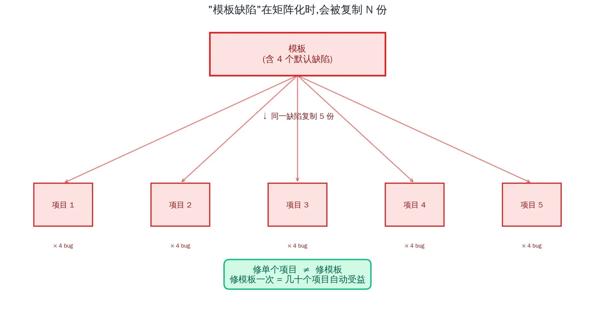

> This isn't a cost-cutting tutorial. It's a retrospective on five projects sharing one template and falling into the same trap — and a meditation on where the real leverage lives when you're trying to scale to dozens of projects.

## The Setup

One weekday morning in early May I opened my Cloudflare billing inbox and saw this:

```
Invoice IN-64514070
Date of issue: May 7, 2026
Amount due: $6.44 USD
```


Not a lot of money. But the trend was the thing that put me on alert:

| Month | Total | of which CPU overage |
|---|---|---|
| March (first month) | $5.00 | $0.00 |
| April | $5.94 | $0.94 (46.2M ms overage) |
| **May** | **$6.44** | **$1.44 (72M ms overage)** |

Month-over-month +56%. In absolute terms $1.44 is nothing, but I run several SaaS projects and plan to launch dozens of sites this year. At this growth rate the curve a year out is going to look ugly.

More importantly: **I had no idea what was actually burning that CPU.**

## First Pass: Five Projects Split the Bill Evenly

I opened the Workers dashboard. Five projects, last 24 hours:

| Project | Domain | Requests | CPU per req | Total CPU | Status |
|---|---|---|---|---|---|
| tomodachi-life | islebuddies.com | 2.2k | 675.9 ms | ~1.49M | Active |
| crimsondesert | crimsondeserthq.com | 5.0k | 293.6 ms | ~1.50M | Active |
| curve-rush-2 | curverush2.net | 2.1k | 580.5 ms | ~1.22M | Untouched 42 days |
| aimotiongen | aimotiongen.com | 527 | 728.0 ms | ~0.38M | Untouched 41 days |
| seo-os | seo.frency.me | 379 | 285.8 ms | ~0.11M | Untouched 58 days |


**The top three projects split the bill almost evenly.** That was the counter-intuitive part: you can't just optimize "the one with the most traffic" — three projects contributed nearly equally, but **the optimization paths were completely different**:

- tomodachi-life had high per-request CPU → probably a heavy SSR path
- crimsondesert already had low per-request CPU → mostly request volume
- curve-rush-2 had middling CPU + 42 days unmaintained → the real question was "is this worth saving?"

## Pivotal Moment: From Metrics to Root Cause

tomodachi-life's P90 CPU was 1810 ms but the P50 was only 303 ms — a classic bimodal distribution, meaning some class of "heavy request" was pulling the mean up. I had Claude Code dig into the project and report back:

```
🔴 Root cause: open-next.config.ts has no R2 incremental cache enabled
   All marketing pages default to dynamic = 'auto' because they call
   getTranslations() inside, so Next treats them as dynamic — every
   request runs a full SSR pass.

🔴 H2: getRelatedGuidePosts scans all 45 blog posts on every request
🟠 H3: middleware has 9 console.log calls and recompiles a RegExp each time
🟠 H4: Chinese requests deepmerge a 240KB i18n JSON on every hit
```

I had Claude Code patch the config, deployed it, and… **the metrics barely moved**.

## Trap #1: A Cache HIT Header Can Still Cost You Money

I wrote a quick bash script to curl each URL and inspect the real cache state:

```bash
URL="https://islebuddies.com/zh/guides/personality-types-guide"
for i in 1 2 3 4 5; do
  curl -sI "$URL" | grep -iE "cf-cache-status|x-nextjs-cache|age|cache-control"
done
```

The result made me rethink the whole problem:

```
Run 1: 6.31s  | cf=NA  nextjs=HIT  age=NA
Run 2: 0.81s  | cf=NA  nextjs=HIT  age=NA   ← occasionally fast
Run 3: 5.01s  | cf=NA  nextjs=HIT  age=NA
Run 4: 5.00s  | cf=NA  nextjs=HIT  age=NA
Run 5: 1.28s  | cf=NA  nextjs=HIT  age=NA

cache-control: s-maxage=2, stale-while-revalidate=2592000
cf-ray: ...-SIN
```

`x-nextjs-cache: HIT` *looks* like cache hits, but response times bounce between 1 and 6 seconds. **Why?**

Look closely at the headers:
- `cache-control: s-maxage=2` — Cloudflare's edge only caches for **2 seconds**
- `cf-ray: ...-SIN` — the request lands at the Singapore POP
- R2 bucket is in the US

Meaning: **every request hits the Worker, the Worker reads R2 across the Pacific, then returns the big HTML payload**. `HIT` just means SSR rendering was skipped — **the network round-trip was not**.

This is a classic trap when optimizing black-box systems: **a header saying "success" doesn't mean you saved money**.

## Finding #2: One Template, Five Projects, Same Bug



What really set off alarms was running `verify-cache.sh` against different URL patterns and finding a "failure-by-grouping" pattern:

```
✅ /zh/guides/personality-types-guide  → x-nextjs-cache: HIT
❌ /zh/guides                          → cache-control: no-store
❌ /zh                                 → cache-control: no-store
✅ /en/guides                          → no x-opennext header (pure static!)
✅ /en                                 → no x-opennext header
```

**English: pure static (perfect). Chinese list pages: forced dynamic (disaster).**

Same page template, but the behavior diverges entirely based on locale. This is a subtle interaction between `next-intl`'s `localePrefix: 'as-needed'` and the Next.js App Router — the default locale serves from the static path with no prefix, while non-default locales carry a prefix and hit the Worker.

And the kicker: **all 5 projects were forked from the same mksaas template, so all 5 had this bug.**

## The Real Turning Point: Querying My Account via the Cloudflare API

I then connected the Cloudflare MCP connector to Claude and listed every config in my account via API:

```
Hyperdrive configs:
  - ai-motion-gen (used by aimotiongen)
  - seo-os (used by seo-os)

[end of list]
```

**Only 2 Hyperdrive configs**. But 4 of the 5 projects use the same template, and that template's code says:

```typescript
const sql = postgres(env.HYPERDRIVE.connectionString, ...)
```

In other words, **tomodachi-life and crimsondesert — the two most active projects — had no Hyperdrive binding at all**. But the code was trying to use one.

Opened Observability logs, and there it was:

```
TypeError: Cannot read properties of undefined (reading 'connectionString')
GET /api/auth/get-session [error]
```

`/api/auth/get-session` is Better Auth's automatic client-side polling endpoint — **every visitor's browser calls it on an interval**, each call cold-starts the Worker → `createAuth` → throws TypeError → returns 500.

I stared at the error log for 30 seconds and realized: **this endpoint is burning CPU on every real visitor, and I have never used the login feature**.

## Decision Time: Not All CPU Is Worth Saving

Two paths in front of me:

**Path A**: Configure Hyperdrive properly so Better Auth stops erroring — keep the option of using auth in the future.
**Path B**: Just delete Better Auth, the (protected) route group, all the auth-related APIs — I've never used any of it.

I chose B. islebuddies.com is an SEO content site. I never expected anyone to sign up for it.

The more interesting case was curve-rush-2. It accounted for 26% of the bill, untouched for 42 days — the sitemap showed it was a 168-URL SEO content site about a game called "curve rush 2". I asked Claude Code to scan for full-static migration feasibility:

> Doable. All the blockers are mksaas scaffolding (auth/dashboard/payment) that this project doesn't actually use. Delete those + change next.config to add `output: 'export'` + swap the search implementation, and you'll produce 168 plain HTML files you can throw on Cloudflare Pages. Estimated effort: half a day to a day.

I read the report and… **deleted the project**.

The reasoning was simple: 42 days of neglect meant I'd already given up on it psychologically. **The static migration alone was half a day's work**, and the marginal value of that half day — right now — was lower than starting a new experimental project. **The domain money is spent; sunk cost stays sunk.**

DNS detached, Worker deleted. **26% of the bill's CPU gone instantly.** Cleaner than any code I could have written.

## Results

| Snapshot | CPU per req (tomodachi-life) | May bill projection |
|---|---|---|
| Before | 868.8 ms | $7–8 (at the prior growth rate) |
| After fix + project deletion | 542 ms (**-38%**) | **$5.92** |


I have to be honest about one thing: **the optimization gains got diluted by traffic growth**. Over the same period total requests grew from 9k/day to 13k/day (+47%). Without the Better Auth TypeError cleanup, May's bill would probably have been $7–8.

## The Cheap Savings vs the Valuable Insight

If you only look at the bill, this exercise saved maybe $1–2. As an hourly-rate calculation it's one of the worst trades in the world.

But **the real output isn't the $1 saved**. It's these:

### 1. Template fixes beat project fixes

I have 5 projects on the same mksaas template, all with the same 4 classes of bug:
- R2 incremental cache commented out by default
- middleware running console.log in production
- Better Auth assumes Hyperdrive exists
- localePrefix: 'as-needed' forces non-default locales to dynamic

**These are template defects, not project bugs**. The implication is that I should fork the template, apply every fix once, and start future projects from the fork. **Fix once, dozens of projects automatically benefit** — that's the real leverage at scale.

### 2. The key to AI collaboration isn't "writing code" — it's "scanning projects"

Claude Code's biggest value in this whole exercise wasn't writing code for me. It was — given that **I had no idea what was in any of these projects** — pinpointing the exact file, exact line. For example:

> 🟠 H4 — deepmerge(en, zh) runs on every Chinese request
> `src/i18n/messages.ts:35-37`: zh locale calls `getMessagesForLocale('zh')` and full-deepmerges 121KB + 120KB of JSON every time.

File:line + precise data. I'd never opened that file, but Claude Code found it.

Later I connected the Cloudflare MCP connector and Claude directly queried my Hyperdrive / R2 / Workers configs via API — **confirmed in seconds that 2 projects were missing Hyperdrive bindings**. This kind of machine-assisted investigation is 100× faster than flipping through dashboards.

### 3. Deleting a project beats fixing it

curve-rush-2 was the biggest lesson here. I'd prepared half a day of prompts, a feasibility scan, a migration plan… and chose to delete instead.

**Sunk cost is real, but it can't be allowed to hijack future time**. If you haven't touched a project in 42 days, your body has probably already concluded its future value is low — your reasoning is just running late.

### 4. "Success in the headers" isn't "money saved"

`x-nextjs-cache: HIT` plus `s-maxage=2` *looked* like the cache was working, but the actual wall time was still 4–5 seconds. When optimizing black-box systems, **there's often a chasm between metrics and money**. In the end you have to trust the bill — it's the only feedback signal that doesn't lie.

## What's Next

I'm pausing on CPU for now. $5.92 is fine — diminishing returns from here.


The higher-leverage things:

1. Back-port these fixes into my mksaas-template fork so every future project starts healthy.
2. Run the same cleanup on crimsondesert (same template → same disease, guaranteed).
3. Keep watching the bill trend — the real effect of an optimization only becomes visible 30 days later.

If a year from now I have 30 projects and the bill stays in the $10–20 range, this retrospective's real value will finally show up.

And if a year from now I only have 3 projects and the bill is $8 — then the biggest takeaway from this retrospective will be that it taught me, **earlier than I would have learned otherwise: some projects shouldn't be started, and some should be killed sooner**.

---

**Appendix: Technical cheat sheet**

| Issue | File | Fix |
|---|---|---|
| R2 cache commented out | `open-next.config.ts` | Enable `r2IncrementalCache` |
| Better Auth errors | `src/lib/auth.ts` + missing Worker Hyperdrive | Delete the entire auth module |
| localePrefix dynamic | `src/i18n/routing.ts` | TBD — probably switch to `'always'` |
| middleware console.log | `src/middleware.ts` | Enable `removeConsole` in next.config |
| Template's auth/payment scaffolding | `(protected)/`, `api/auth/`, etc. | Delete it if you don't use it |

**Appendix: Useful tools**

- `verify-cache.sh` — bash script that auto-classifies a URL's cache state (checks `cf-cache-status` / `x-nextjs-cache` / `cache-control`)
- Cloudflare MCP connector — lets AI query your account config directly via API, 100× faster than the dashboard
- Cloudflare Observability — the Workers Logs page; see real error traffic
