> A retrospective on CrimsonDesertHQ. The core data runs through August 1, 2026, and the article was compiled on August 22, 2026. The analysis draws on Git history, site content, GSC, GA, Bing, Similarweb, Semrush, Ahrefs, the AdSense review result, and competitor pages.

**Estimated reading time: 20–25 minutes. The article includes 38 original screenshots and evidence images.**

This is not a growth tutorial about “getting 390,000 impressions in 134 days with an AI-built site,” and there is no SEO secret hidden at the end.

I am going to disclose the keyword `crimson desert`, the domain `crimsondeserthq.com`, the main competitors, third-party traffic estimates, dirty data in the repository, content I later removed, and the exact ways I fooled myself. The reason is simple: this was my project, this is my blog, and the experiment has already missed its window. Hiding the names would only make the retrospective less useful.

If you only want the conclusion, remember this:

> **I validated search traffic. I did not validate that the content was trustworthy, the product was useful, users would return, or any of it could become a business.**

| Validation layer | Signal I had at the time | Retrospective conclusion |
| --- | --- | --- |
| Traffic | 390,614 Google impressions and 5,700 clicks | Passed: genuine search demand existed |
| Content | 59 of 245 articles were later permanently redirected | Failed: scale grew faster than evidence and editorial capacity |
| Product | 354 of 379 structured records were `legacy-unverified` | Failed: the database had a shape, but no trustworthy data asset behind it |
| Business | AdSense rejected the site for “low-value content” | Failed: the site created no durable value the market would recognize |

Of those four validation layers, I completed only the first. Every chart that follows merely explains why.

## Start With the Most Discouraging Data

If someone asked me today, “Is the keyword `crimson desert` still worth pursuing?” I would not lead with 390,000 impressions. I would start with the next four charts.

### The keyword is no longer cheap to enter

On August 1, Semrush estimated about 550,000 monthly searches in the United States and 1.9 million worldwide, with a keyword difficulty of 65—“Hard.”

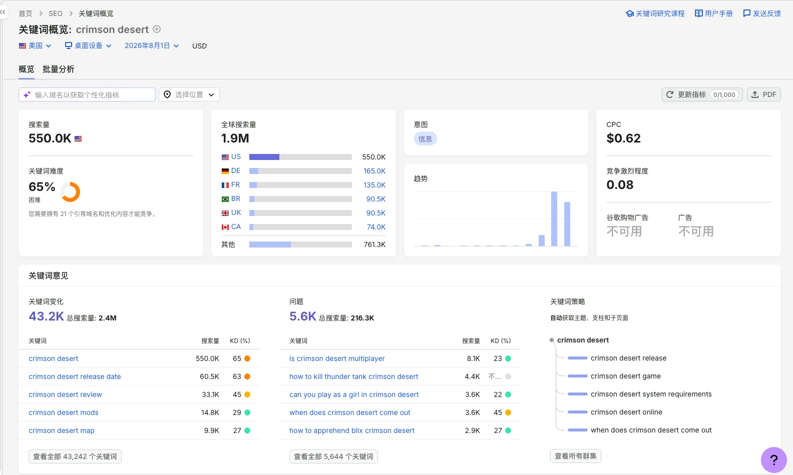

*Semrush snapshot from August: roughly 550,000 monthly US searches, 1.9 million worldwide, and KD 65.*

Ahrefs did not produce the same number, but its conclusion was hardly encouraging: KD 39, rated Hard, with an estimate that reaching the top ten would require followed links from roughly 53 websites.


*Ahrefs snapshot from August: KD 39, with an estimate of roughly 53 websites providing followed links to rank in the top ten. KD values from different platforms are not directly comparable.*

Both screenshots were taken around August 1. They do not reflect the difficulty I saw when choosing the keyword in March. I put them at the beginning to make one reality clear: at least today, a beginner without a brand, backlinks, or product capability cannot simply repeat what I did with a similar domain.

### Competition is rising while search interest keeps falling

The US Google Trends data is even more discouraging. `crimson desert` reached 100 around the late-March launch window, then declined steadily.

To avoid an ungrounded argument over whether “100 is really hot,” I later compared it with `steam`, a term with stable year-round demand. During launch week, March 22–29, the relative interest for `crimson desert` reached 77, briefly exceeding `steam` at 65. By late July, the former had fallen to roughly 5 while the latter remained around 60.

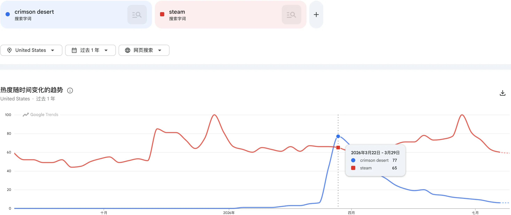

*Google Trends comparison for US web search. It shows both the strength of the launch event and how quickly event-driven demand faded. The two terms are jointly normalized when shown together, so the chart is useful for relative movement, not as a measure of search volume.*


Looking only at the most recent three months, small periodic peaks still appear, but the baseline fell from nearly 100 in early May to roughly 15–20 by the end of July.

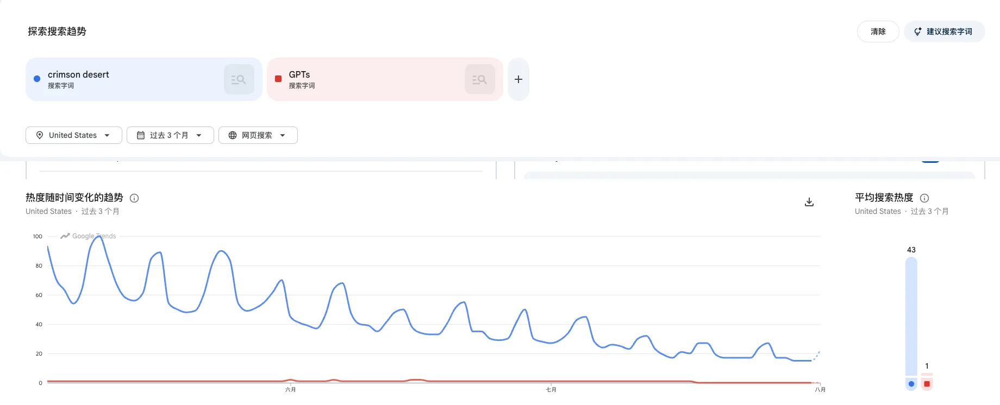

Google Trends values from 0 to 100 are a normalized index, not actual search counts. Semrush monthly volume is also a model-based estimate. A large apparent search total and steadily declining interest are therefore not contradictory. The trend that actually matters is this:

> The cost of competition is rising while incremental demand is shrinking.

For a late entrant, that is harder than merely targeting a “difficult keyword.” You must invest in more content, build more links, and offer a better product to fight over a shrinking pool of new demand.

***

This also explains why I can openly name `crimson desert` and `crimsondeserthq.com`. It is not generosity; there is no arbitrage left to protect. The best timing window has closed, the competitive landscape has settled, an exact-match domain is not a moat, and AdSense classified the existing site as low-value content. I am not revealing a blue-ocean keyword. I am showing you an expired ticket. The same reason is why the 390,000 impressions later in this article are not a trophy: they happened inside a window that has passed and did not compound into a product moat.

***

## 1. Entering in March: The Launch Window and a Low-Difficulty Keyword

After March 15, I started checking game-related terms in Google Trends every day and screening ideas with suggestions from Claude and ChatGPT. I eventually chose `crimson desert`.

My reasoning had three parts:

* The game was scheduled for release on March 20, so demand was about to surge.
* The third-party keyword difficulty I saw in mid-March was generally low, and the search results had not yet solidified.
* General guide sites had subpaths and platform sites had subdomains, but few people had built an independent root domain around the whole game.

Unfortunately, I did not save Semrush or Ahrefs screenshots from the March selection process, so I cannot provide the exact KD from that time. All I can confirm is that the difficulty I saw was generally low. The KD 65 and KD 39 shown above describe the market more than four months later.

On March 20, 2026, I registered `crimsondeserthq.com`, generated the design in Google Stitch, and used Claude Code to build the site on the MkSaaS template. The next day, I submitted it to Google Search Console, Google Analytics, and Bing Webmaster Tools.

The production pipeline was very “2026”:

```text
Find demand with Google Trends
        ↓
Use Claude / ChatGPT for keyword selection and research
        ↓
Generate the product visuals with Google Stitch
        ↓
Implement with Claude Code + MkSaaS
        ↓
Deploy on Cloudflare and connect GSC / GA / Bing
```

The pipeline's greatest strength was speed. Its greatest danger was also speed. In a traditional development process, the cost of design, development, editing, and testing slows mistakes down. Once AI removed that friction, I could manufacture a site that “looked complete” before validating the data sources, understanding the game, or finding a product wedge.

None of the tools were innocent or guilty. Claude, ChatGPT, Stitch, Claude Code, and MkSaaS all did what I asked. The real problem was that I confused “can be shipped” with “deserves to be shipped.”

After 134 days, Google Search Console had recorded 390,614 impressions and 5,700 clicks. Google Analytics showed 9,133 active users. Bing contributed another 1,055 clicks.

Those figures make a convincing headline for an “AI site + SEO cold start” success story. But Google AdSense called the site low-value content. Competitors had built maps, databases, calculators, progress tracking, and community distribution networks. Many pages and records in my repository lacked first-hand verification.

Under a stricter standard, this was a failed experiment that caught a demand window without building lasting value.

| Data source | Date range | Result | What it proves | What it does not prove |
| --- | --- | --- | --- | --- |
| Google Search Console | Mar 20–Jul 31 | 5,700 clicks, 390,614 impressions, 1.46% CTR | Genuine demand existed in search results | Content accuracy, user satisfaction, or brand formation |
| Google Analytics | Mar 20–Aug 1 | 9,133 active users, 35s average engagement | Users genuinely entered the site | They solved their problem or wanted to return |
| Bing Webmaster | Mar 24–Jul 28 | 1,055 clicks, 40,725 impressions, 2.59% CTR | Search traffic existed outside Google | A multi-channel distribution capability had been built |
| Similarweb | Apr–Jun estimate | 17,589 visits, 5,863 per month | A rough indication of scale and the gap from competitors | Precise traffic |
| Semrush | Aug 1 snapshot | 400 organic keywords, 23 referring domains, 38 backlinks | Coverage was growing while authority and links remained weak | First-party traffic |
| AdSense | Before Aug 1 | Review rejected for low-value content | Site value and traffic are not the same thing | Which specific page caused the rejection |

In one sentence: I validated traffic, while content, product, and business validation all failed.


*Site ownership was verified, but AdSense still rejected it for “low-value content.” This is the most important counter-signal in the retrospective.*

## 2. The Real Timeline in Git

The repository includes earlier upstream commits from the MkSaaS template, so the oldest commit cannot be treated as the project's start. The continuous sequence of changes that genuinely belongs to CrimsonDesertHQ begins on March 20.

The first major project-specific change was `6301e1b1`. That commit modified 145 files, adding 6,740 lines and deleting 8,511. The template identity, homepage, navigation, content categories, bosses, mounts, weapons, author information, and deployment configuration were almost all replaced in one day. The diff looked impressive. Four months later, it also exposed the problem: before establishing any fact-checking process, I had already opened three fronts at once—a content site, a database, and a tool product.

From March 20 through July 26, the repository accumulated 106 commits. The first five days alone produced 23, and March 27 produced 10 in one day. Git history cannot measure useful work, but it can show where my attention went with brutal honesty. Early commits centered on adding entries, adding pages, changing images, fixing descriptions, and supplementing SEO—not on player jobs, evidence, or reasons to return.

| Phase | Key commits | What happened in Git | Thinking at the time | Problem revealed later |
| --- | --- | --- | --- | --- |
| Mar 20–24 | `6301e1b1`–`da928df6` | Rebranded the site, added a sitemap, launched boss/mount/weapon data and the first guides | Catch the launch window first | Verification could not keep up with delivery speed |
| Mar 28–Apr 16 | `cce8fe36`–`018ed781` | Repeatedly added weapons, bosses, and mounts while correcting images and descriptions | Build a “complete database” quickly | Frequent corrections showed the source data was unstable |
| May 10 | `58778c30` | Added a 291-line `All Pailune Bosses` topic hub | Capture a long-tail cluster with one complete page | The direction was sound, but still depended on secondary-source aggregation |
| May 11 | `c491daa7` | Removed `/ja/` and `/ko/`, returned 410 for old pages, redirected `/regions`, and unified canonicals | Fix index bloat | Early multilingual expansion had prioritized scale over quality |
| Jun 6–20 | `a4bc35b0`–`a1b2d1d5` | Published content in batches almost every day | Cover more queries with volume | Created many tiny articles, overlapping topics, and verification debt |
| Jul 15 | `e92c45ec` | Optimized high-impression Pailune, Camp, and other guides based on GSC | Improve CTR with data | Optimized entrances without solving the lack of original evidence |
| Jul 26 | `515afe0c` | Launched editorial publication logic and permanently redirected 59 thin articles | Start contracting deliberately | Proved the early URL count was a liability, not an asset |

By July 26, the repository contained 245 content files: 181 remained public, 59 had permanent redirects, and 5 remained unpublished. In other words, almost one quarter of the content was later judged unworthy of remaining as a standalone page.

The structured database was worse. The repository contained 259 weapons, 92 bosses, and 28 mounts—a total of 379 records. Grouped by the verification status in the code:

| Status | Records | Share |
| --- | ---: | ---: |
| `legacy-unverified` | 354 | 93.4% |
| `partial` | 23 | 6.1% |
| `verified-external` | 2 | 0.5% |

These figures may define the project more truthfully than GSC does: **the site looked like a database, but our own code labeled 93.4% of its core data as unverified legacy records.**

The two ratios look even worse side by side:

* Of 245 articles, 59 were later removed or merged: **24.1%**.
* Of 379 database records, 354 were unverified: **93.4%**.

This was not a normal amount of late-stage optimization. The production system itself did not treat evidence as an admission requirement. The publish button existed before the verification workflow, so all that speed eventually became rework.

## 3. It Looked Like a Product, but It Was Only a Shell

Stitch's direction was actually reasonable: a unified brand, prominent search, boss filters, a weapon database, a guide hub, and actionable card metadata. Visually, it packaged the site as a game knowledge product.

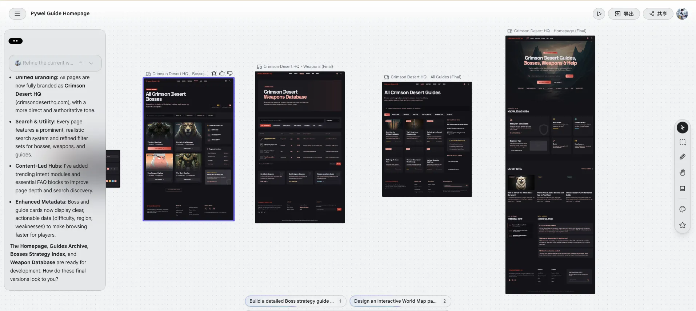

The current homepage is genuinely close to the design: the dark visual style, game hero, search box, category entrances, and knowledge hub all shipped.


For a direct comparison, the next image places the design promise, the live homepage, and the evidence inside an article side by side. It captures the project's mismatch better than anything else: the visual language says “database and tools,” while users mostly land on a collection of articles.


The problem was that visual completeness hid product incompleteness.

The most valuable ideas in the design were the database and tools: filterable bosses, weapon stats, regions, drops, routes, and status. Yet the live `/weapons`, `/bosses`, `/mounts`, and `/regions` routes now permanently redirect to blog category pages. The database components and JSON remain in the code, but users ultimately receive article indexes.

In retrospect, this was product regression:

```text
Stitch concept: searchable, filterable, reusable structured tools
                    ↓
Early implementation: database pages + guides at scale
                    ↓
Current live site: database entrances redirect to blog categories
```

| Design promise | Actual delivery | Why it was insufficient |
| --- | --- | --- |
| Boss filters and strategy index | Boss article category | Users can browse titles but cannot complete tasks by region, weakness, or game version |
| Weapon database | Weapon article category | No reliable stats, acquisition methods, or comparable data |
| Regions and routes | Guide articles | No coordinate maps, route diagrams, or process screenshots |
| Site-wide search | Blog search | Finding a page is not the same as finding an answer |
| Structured cards | Large amounts of unverified JSON | The form was structured, but the facts lacked stable sources and a responsible maintainer |

I used to call this “ship an MVP and fill in the data later.” Now I would call it **borrowing visual credibility**: the pages borrowed the trustworthy appearance of a mature product before delivering the data, verification, and maintenance that a mature product requires.

The highest-traffic Pailune page is representative. It has a polished hero image, an author, and editorial standards added later, but no public source list, route map, coordinate map, or step-by-step screenshots. The repository file still contains three “needs review” comments.


A repository scan of the 245 content files reveals several more problems:

* 101 articles contain traces such as `SOURCES`, `SOURCE`, or `FACT CHECK`, but many are only code comments rather than citations visible to readers.
* 7 articles still contain 35 “needs review” markers.
* No standard Markdown image references were found in article bodies. This does not prove that every article had no images, but it does show that “use original process screenshots to prove the conclusion” never became a consistent editorial rule.
* Many pages depended on AI searching, summarizing, and rewriting official explanations and other guides rather than on my own gameplay, measurements, recordings, and reproducible tests.

AI dramatically increased my page-production speed, but it concealed a risk: content can read coherently without deserving trust.

## 4. My Site Data: The Traffic Was Real, but Traffic Cannot Substitute for Value

### 4.1 GSC: clicks entered a second growth phase while overall interest declined

| Month | Clicks | Impressions | CTR | Weighted average position (approx.) |
| --- | ---: | ---: | ---: | ---: |
| Mar 20–31 | 1,183 | 57,756 | 2.05% | 7.94 |
| April | 865 | 48,492 | 1.78% | 9.19 |
| May | 560 | 44,812 | 1.25% | 10.75 |
| June | 1,429 | 121,446 | 1.18% | 8.74 |
| July | 1,663 | 118,108 | 1.41% | 8.23 |

March contains only 12 days and coincides with the launch peak, so it cannot be compared directly with full months. But the second wave of growth in June and July was real: even as interest in the game declined, more long-tail pages entered the search results.

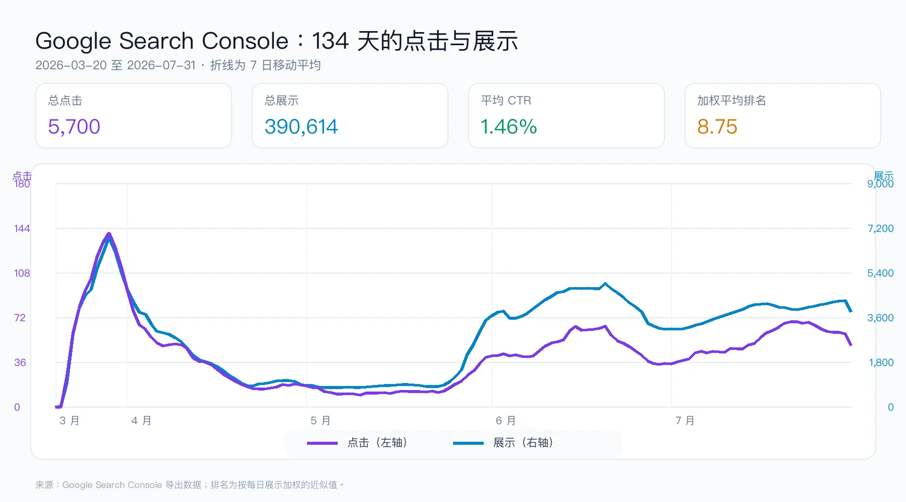

Compared with the preceding 28 days, the most recent 28 days saw impressions decline by about 4.0% while clicks rose by about 13.8%, with CTR improving from 1.19% to 1.41%. Titles, rankings, and page-query fit had improved.

But the conclusion must remain within what the data truly proves: GSC shows that users were willing to click. It does not show that the answer was accurate or that they completed their task.

### 4.2 The traffic came from a cluster of questions, not the head term

Among GSC's top 1,000 queries, 145 Pailune/Pauline variants contributed 487 clicks, while 137 Camp-related queries contributed 205.

| Query | Clicks | Impressions | CTR | Avg. position |
| --- | ---: | ---: | ---: | ---: |
| `pailune bosses` | 68 | 790 | 8.61% | 6.04 |
| `crimson desert classic vs default controls` | 44 | 610 | 7.21% | 3.09 |
| `pauline bosses crimson desert` | 34 | 296 | 11.49% | 6.11 |
| `crimson desert cloudcart failed to summon` | 21 | 1,326 | 1.58% | 8.89 |
| `crimson desert camp upgrades` | 21 | 561 | 3.74% | 8.84 |

The long-tail strategy itself was not wrong. The mistake was expanding “one page covers a cluster of questions” into “every question deserves a rapidly generated page.” The former is a topic hub; the latter easily becomes a second-hand summary of the search results.

### 4.3 GA: users arrived, but did they complete the task?

GA recorded 9,133 active users, 9,141 new users, roughly 44,000 events, and 35 seconds of average engagement per active user.

Google Organic contributed 4,254 active users; Direct, 3,169; Bing Organic, 926; DuckDuckGo, 346; and Yahoo, 90. GA recorded 5,506 `google / organic` sessions, only about 3.4% fewer than the 5,700 clicks in GSC. The two first-party datasets agree directionally.

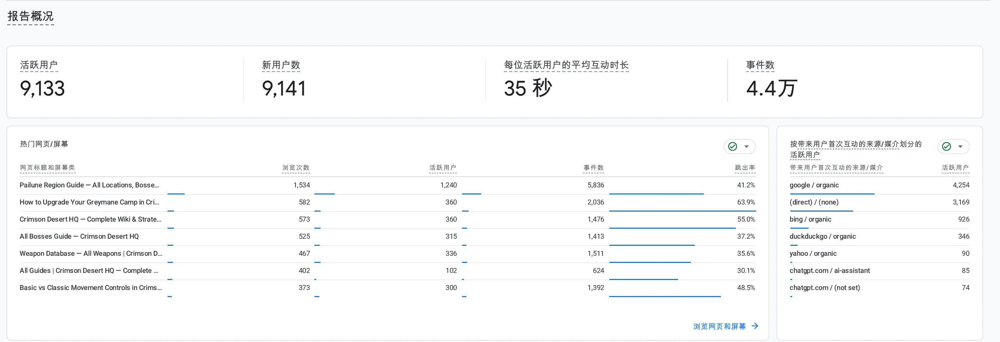

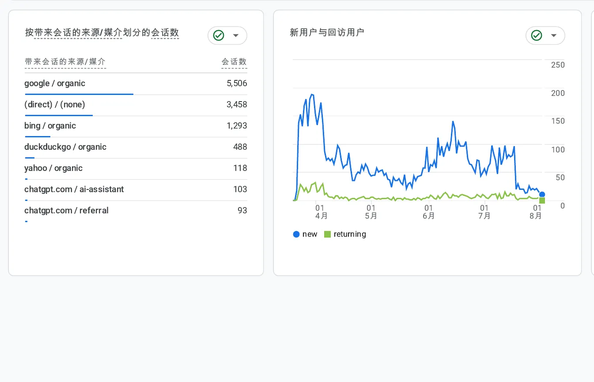

GA also recorded referral traffic from ChatGPT. But the tracking did not consistently capture guide completion, successful on-site searches, related-guide clicks, scroll depth, or reasons for returning. Thirty-five seconds could mean “the answer solved my problem quickly” or “I glanced at it and realized it was useless.”

### 4.4 Bing and third-party tools: additional perspectives

From March 24 through July 28, Bing delivered 1,055 clicks from 40,725 impressions, for a 2.59% CTR.


Bing's scale was far smaller than Google's and the integration cost was low. Its data still exposes a weakness: growth remained overwhelmingly dependent on search engines. We did not create stable return traffic through communities, video, or partnerships.

Now consider third-party estimation tools. Similarweb estimated 17,589 visits from April through June, averaging 5,863 per month, with 1.79 pages per visit, a 21-second average duration, and a 42.74% bounce rate.

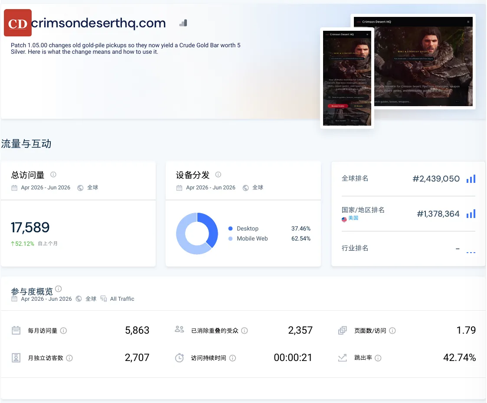

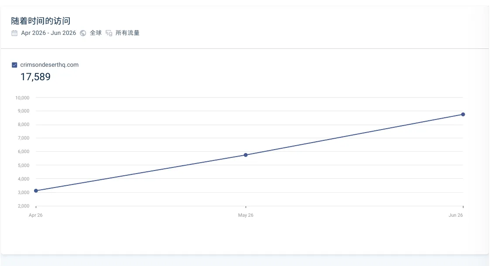

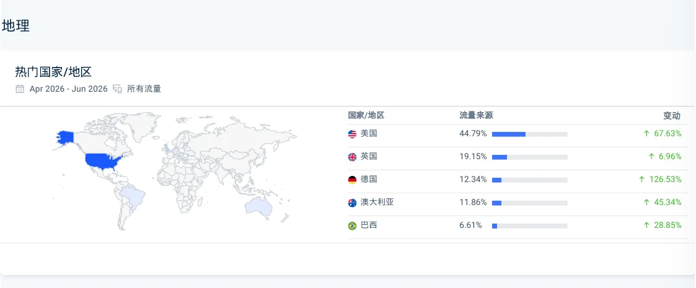

The Semrush snapshot from August 1 showed an Authority Score of 8, estimated organic traffic of 88, 400 organic keywords, 23 referring domains, and 38 backlinks.

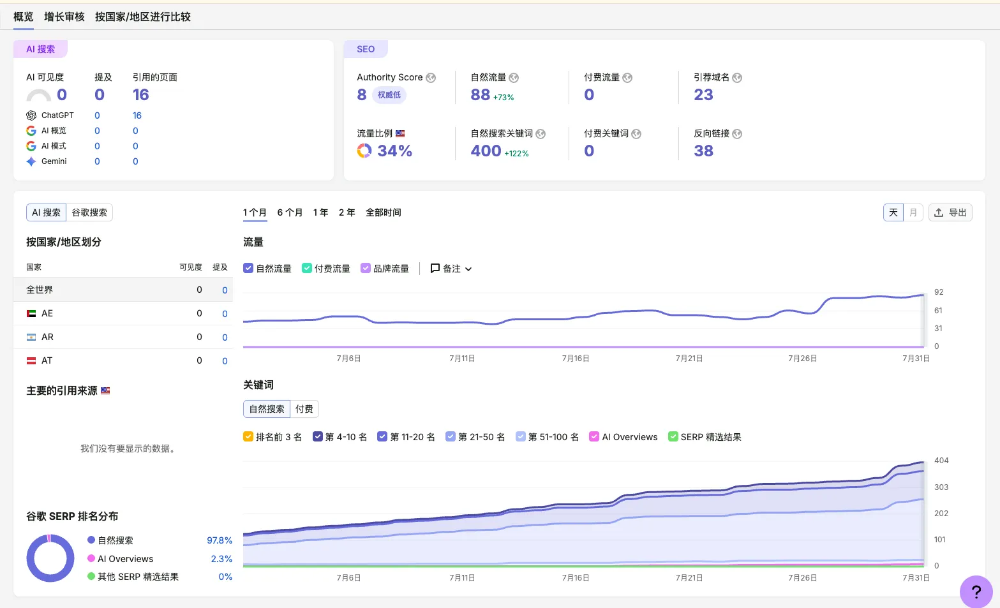

Third-party estimates commonly understate absolute traffic, but they remain useful for understanding relative positions in keyword growth, authority, and link profiles.

## 5. The Competitors Were Not One Kind of Business, but Three Entirely Different Ones

First, a note on comparability: the Similarweb reports for Method and Questlog cover their entire root domains, including other games, so they cannot be compared directly with CrimsonDesertHQ. `crimsondesert.gaming.tools` and `crimsondesert.th.gl` are target-specific subdomains. `crimsondesert.app` and `crimsoncompanionapp.us`, like us, are independent domains.

### 5.1 Start with scale: this was not a narrow loss, but a two-order-of-magnitude gap

First compare only the independent domains and target subdomains that can be aligned directly. Similarweb's estimated total visits from April through June were 17,589 for us and 5.239 million for `crimsondesert.gaming.tools`—about **298 times** ours. In Semrush's August 1 snapshot, its estimated organic traffic was 9.1K and it ranked for 17.2K organic keywords, about **103 times** and **43 times** our figures respectively.


*A composite of four original Semrush screenshots for a quick sense of scale. Refer to each site's original screenshot and the table below for specific figures.*

| Site | Total visits, Apr–Jun | Monthly avg. | Avg. duration | Authority | Organic traffic | Organic keywords | Referring domains | Backlinks |
| --- | ---: | ---: | ---: | ---: | ---: | ---: | ---: | ---: |
| CrimsonDesertHQ | 17,589 | 5,863 | 0:21 | 8 | 88 | 400 | 23 | 38 |
| crimsoncompanionapp.us | 18,620 | 6,207 | 0:16 | 6 | 4 | 71 | 21 | 26 |
| crimsondesert.app | 655,247 | 218,416 | 0:54 | 8 | 210 | 1.7K | 29 | 54 |
| crimsondesert.th.gl | 372,825 | 124,275 | 1:56 | 39 | 4.8K | 2.7K | 42 | 157.7K |
| crimsondesert.gaming.tools | 5.239M | 1.746M | 4:29 | 36 | 9.1K | 17.2K | 72 | 85.7K |

Three reminders are necessary here: Similarweb and Semrush are both third-party estimates; their “traffic” metrics are not the same; and the absolute values may be far off. The point of placing them together is not to calculate revenue but to see the relative direction. When visit depth, session duration, organic keywords, and channel structure all diverge at once, “the tool sites offer more reusable value than ours” is no longer merely a subjective impression.

`crimsoncompanionapp.us` is a valuable counterexample. It offers more feature entrances than we did, yet third-party estimates place it at roughly our scale. That shows that turning a site into a dashboard is not itself the answer. Without real data, a complete task loop, and distribution, a tool interface can be just another kind of shell.

### 5.2 Mature content platforms: Method and Questlog

[Method's Crimson Desert section](https://www.method.gg/crimson-desert) remains primarily editorial, but it has clear categories, real gameplay screenshots, publication dates, and the audience, social accounts, author system, and internal distribution of the established Method brand.


Similarweb estimated 10.46 million total visits across Method's entire domain from April through June, averaging 3.488 million per month, with 2.09 pages per visit and an average duration of 1 minute 17 seconds. Organic search accounted for 63.47%, direct for 22.84%, referrals for 6.59%, and social for 6.13%. Crimson Desert did not generate all that traffic, but the figures show that Method launches a new game section from the foundation of a mature platform.


[Questlog's Crimson Desert section](https://questlog.gg/crimson-desert/en) is closer to a tool-based wiki. Its homepage places Database, Items, Equipment, Character Builder, Knowledge, and Map directly in the main navigation. Search is not blog retrieval; it is a primary product entrance.


Similarweb estimated 7.951 million total visits across Questlog's entire domain from April through June, averaging 2.650 million per month, with 6.23 pages per visit and an average duration of 3 minutes 55 seconds. Its channel mix was also more balanced than a search-only site: 42.42% organic search, 37.22% direct, 12.60% social, and 7.04% referrals.

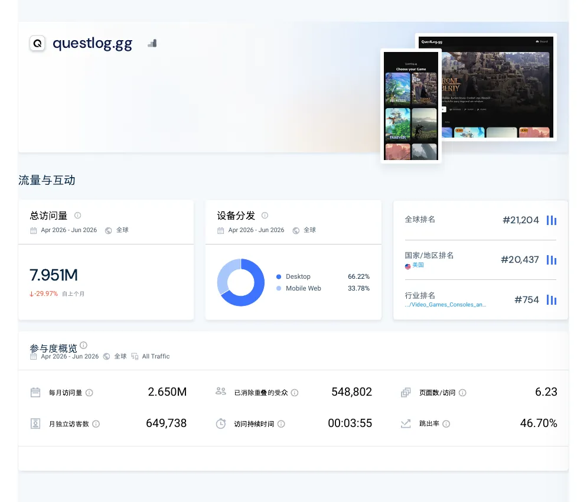

The lessons from these two businesses are entirely different. Method supports content quality with a brand and a complete editorial operation. Questlog treats search content as an entrance to a tool product.

### 5.3 Tool ecosystems: gaming.tools and th.gl

[crimsondesert.gaming.tools](https://crimsondesert.gaming.tools) is not a batch of guide articles. It is a structured game database. Items, Characters, Quests, World, and Game Info are browsable entities, and its Interactive Map links directly to `crimsondesert.th.gl`.


Similarweb estimated 5.239 million visits to the subdomain from April through June, averaging 1.746 million per month, with 4.24 pages per visit and an average duration of 4 minutes 29 seconds. Organic search accounted for 67.20%, but search was not its only channel: referrals contributed 7.84% and social 6.93%.

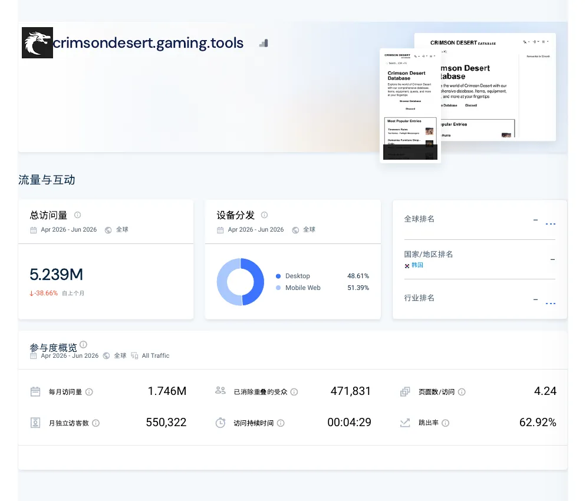

Semrush's snapshot from the same day showed an Authority Score of 36, estimated organic traffic of 9.1K, 17.2K organic keywords, 72 referring domains, and 85.7K backlinks. Its keyword count was roughly 43 times ours. The entities, relationships, and query entrances in its database continually generate indexable pages without requiring an editor to decide what to write next every day.


The core of [crimsondesert.th.gl](https://crimsondesert.th.gl), meanwhile, is an interactive map: 2 maps, 102,665 locations, category filters, player tracking, automatic discovery, and a changelog. Users do not open it to read an article. They use it repeatedly while playing.


Similarweb estimated 372,825 visits over three months for the th.gl subdomain, averaging 124,275 per month, with 2.62 pages per visit and an average duration of 1 minute 56 seconds. Organic search accounted for only 33.31%, while direct traffic contributed 27.37%, social 22.44%, and referrals 15.75%. That is far healthier than our almost total dependence on search.


The two products form a natural network. The database explains “what is this?” and the map answers “where is it?” Those links arise from real player workflows and are much healthier than links stacked manually to increase DR.

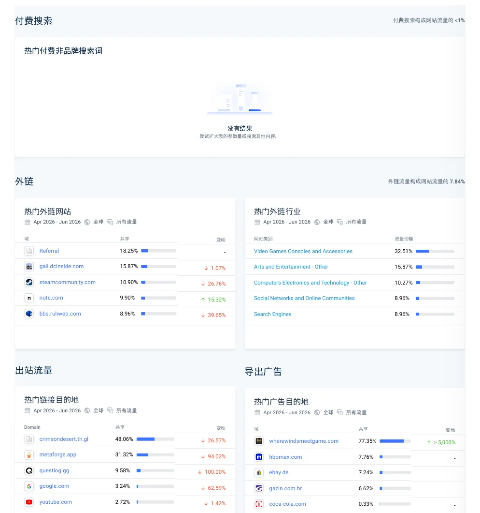

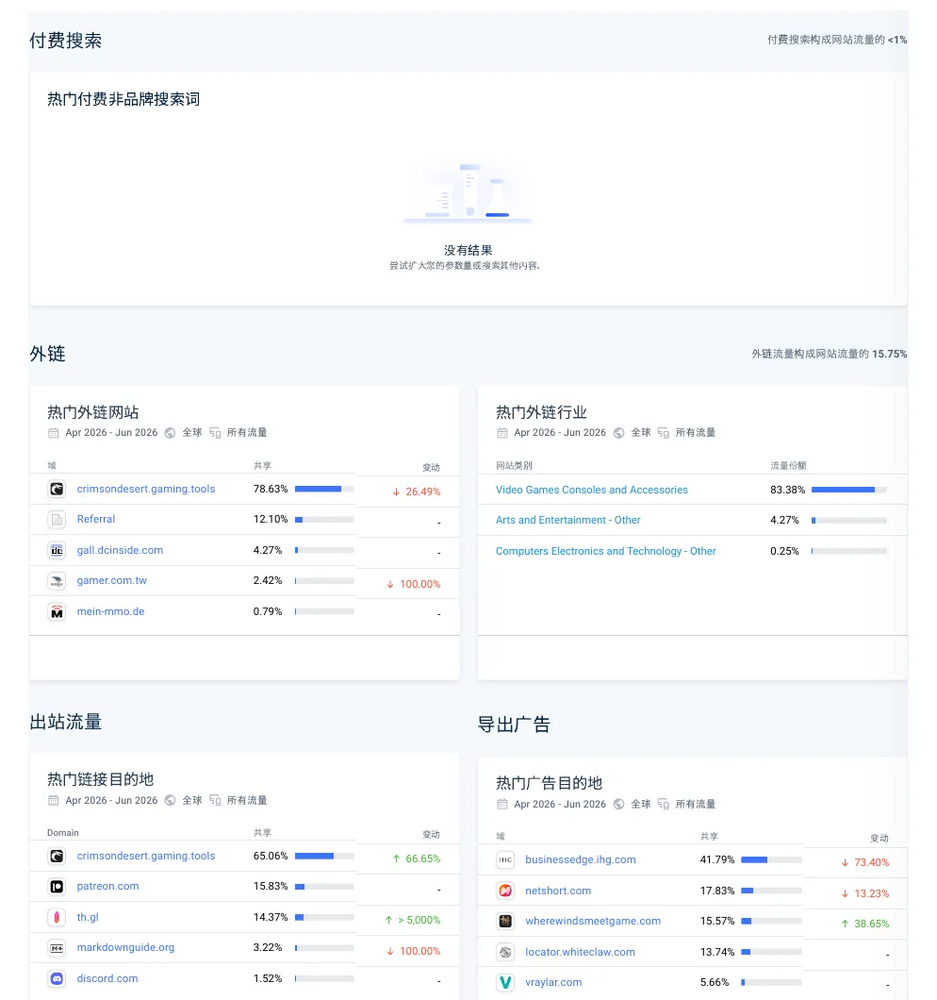

The Semrush snapshot magnifies the difference: th.gl had an Authority Score of 39, estimated organic traffic of 4.8K, 2.7K keywords, 42 referring domains, 157.7K backlinks, and 765 pages cited by AI systems. The platform's root-domain strength and cross-site network clearly contribute, so the 157.7K links should not be interpreted as 157.7K independent high-quality recommendations. Still, the figures show that we were not competing with an isolated small site, but with a tool ecosystem that already had authority and internal linking power.


### 5.4 Independent tool sites: crimsondesert.app and crimsoncompanionapp.us

Like us, [crimsondesert.app](https://crimsondesert.app) uses an independent domain. Unlike us, its homepage centers its value on an interactive map, wiki, crafting calculator, and progress tracking. The live map displays 9,323 markers with region and category filters.


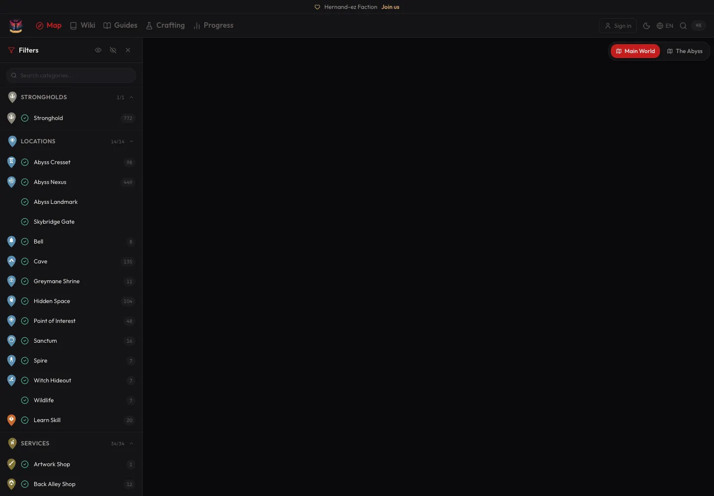

Similarweb estimated 655,247 visits over three months, averaging 218,416 per month, with 3.15 pages per visit and an average duration of 54 seconds. Organic search accounted for 64.92%, direct for 20.45%, referrals for 7.06%, and social for 6.94%.


Semrush gave it the same Authority Score as ours—8—but estimated 1.7K organic keywords, 210 organic traffic, 29 referring domains, and 54 backlinks. Its keyword coverage was roughly 4.25 times ours. Even without a large gap in link volume, structured tools can naturally generate more indexable entities and search entrances.


[crimsoncompanionapp.us](https://crimsoncompanionapp.us) looks even more like a back-office product, with separate entrances for a world map, characters, mounts, camp, skill tree, collectibles, quest log, bosses, codex, weapons, crafting, notes, and a Build Planner.


But “looks feature-rich” does not equal success. Similarweb estimated only 18,620 visits over three months, or 6,207 per month—almost the same order of magnitude as our 5,863—with 2.16 pages per visit and an average duration of just 16 seconds. Semrush estimated only 71 organic keywords and 4 organic traffic.


This competitor matters just as much to my conclusion. Building many interfaces, statistic cards, and feature entrances can still produce a “more product-like shell.” If the data is not trustworthy, the features do not complete real tasks, and users have no reason to return, even a comprehensive dashboard will not earn distribution automatically.

## 6. What the Competitors Truly Had Was More Than Traffic

If you look only at visits, it is easy to conclude, “Their domains are stronger and they have more resources, so I could never win.” That statement is not wrong, but it offers almost no actionable insight. The questions worth answering are why users open them a second time and why peers choose to link to them.

| Site | Task the user completes | Why they might return | Why others might cite it |
| --- | --- | --- | --- |
| Method | Read editorially verified guides | Stable authors, brand, and update process | Established media identity and citable editorial content |
| Questlog | Look up items, equipment, characters, builds, and maps | Player profiles and databases accumulate over time | Data entities and tool entrances fit into other workflows |
| gaming.tools | Search quests, items, characters, and world data | Players repeatedly query it during gameplay | Database pages are natural factual nodes |
| th.gl | Find coordinates, filter markers, and track map progress | Map state and player progress persist | Coordinates and maps are infrastructure for other guides |
| crimsondesert.app | Use maps, a wiki, calculators, and progress tracking | Multiple tasks connect inside one product | Structured markers and computed results can be shared |
| CrimsonDesertHQ | Enter an article from a search result | No persistent state or clear second task | Most information came from the same public sources, with little new evidence |

Our flow was basically a straight line:

```text
Search result → article → leave
```

Mature tool sites create a loop:

```text
The database explains “what is this?”
        ↓
The map answers “where is it?”
        ↓
The tracker records “have I completed it?”
        ↓
Communities and guides keep citing the data
        ↺
```

The backlink gap did not exist merely because I failed to send outreach emails. More fundamentally, we never created an object embedded in someone else's workflow. An AI-aggregated article can answer a question once. A map, dataset, or calculator can become infrastructure for other products, videos, and discussions.

## 7. Four Core Mistakes

### 7.1 I mistook AI's search and synthesis ability for content capability

AI excels at searching, summarizing, rewriting, and adding structure quickly. It cannot automatically supply proof that comes from playing, testing, and capturing the evidence yourself. Much of the project's content reorganized official patches, other guides, and search results through AI, leaving its sources highly overlapping with competitors.

Even if the prose contained no obvious errors, users had little reason to choose our second-hand summary over the original source, an established publication, or an interactive tool. That is the aspect of “low-value content” most worth examining. Low value does not necessarily mean too few words or an ugly page. It often means we added no new information.

### 7.2 I treated rows of data and numbers of pages as assets

379 records sound like an asset, but 354 were labeled `legacy-unverified`. If weapon locations, boss weaknesses, drop rates, or mount attributes cannot be reproduced, every additional record increases maintenance and trust risk. In June, we also published content in batches almost every day. That did expand impressions in the short term. But by July, we had removed 59 articles, and many URLs had become liabilities instead. Every thin page consumed crawl budget and maintenance attention.

In retrospect, a true asset should become more trustworthy over time. If adding pages makes you more afraid to update them, they are simply liabilities.

### 7.3 I completed the visual delivery without finding a product wedge

The Stitch design, homepage, and dashboard made it easy to believe that “the product was finished.” But users needed to complete a specific job: find an item, plan a route, evaluate a build, or record collection progress.

Our positioning kept drifting among wiki, database, guides, news, and troubleshooting. In the end, none became irreplaceable. The contrast with each competitor's clear product wedge could not have been sharper.

### 7.4 I did not build backlinks—or create anything worth linking to

Semrush recognized only 23 referring domains and 38 backlinks. The project had no systematic community distribution, but the deeper problem was that we created nothing people had reason to cite. Original maps, public datasets, and embeddable calculators can attract links naturally. AI-aggregated articles rarely do.

The 390,000 impressions made us believe we were progressing and encouraged us to treat search clicks as the success metric. But search impressions only signal demand. The missing metrics were task completion, voluntary returns, branded search, and non-search traffic. Had we watched those numbers, we would have stopped piling up pages sooner and focused on the data and product.

### AI was not the root cause; the missing verification loop was

It would also be convenient to blame everything on AI: “The content failed because AI generated it.” But replacing Claude and ChatGPT with a group of outsourced editors who had never played the game and only knew how to search and rewrite would probably have produced the same result.

The production system was missing four gates:

1. **Source gate:** Where did this fact come from, and what game version and date does it apply to?
2. **Reproduction gate:** Can I or a trusted person reproduce the same result in the game?
3. **Product gate:** Does this solve a real task, or merely create one more URL?
4. **Distribution gate:** Apart from a search engine, who will actively pass it to the next user?

AI accelerated a pipeline with no gates. It was not the only cause, but it allowed the problem to expand to 245 articles and 379 records in 134 days.

## 8. What Actually Went Right

A failure retrospective that lists only mistakes can easily become hindsight theater. The following actions were valid in themselves; I simply extrapolated them too far.

### 8.1 I found a real event window

A genuine opening for a new site existed around March 20. The Trends peak during launch week, 1,183 GSC clicks in 12 days, and the many question-shaped queries that followed all prove the topic was not imaginary. The mistake was not choosing a term no one searched. It was treating short-term event demand as a long-term asset.

### 8.2 The launch was fast enough

Keyword selection, domain purchase, design, and search-engine submission took only a few days. Speed has real value in trend-driven projects. Next time I will still move quickly, but “launch quickly” will mean launching one verifiable wedge—not opening an entire wiki, database, and content matrix at once.

### 8.3 Long-tail topic hubs worked better than fighting for the head term

The clicks did not come from forcing the homepage to rank for `crimson desert`. They came from specific problems involving Pailune, Camp, control schemes, and summon failures. A topic hub such as `All Pailune Bosses` was the right direction. The mistake was later fragmenting those hubs into many small articles with no independent value.

### 8.4 I connected first-party analytics early enough

Connecting GSC, GA, and Bing on the second day gave me the evidence to overturn my optimistic interpretation. The tracking lacked task completion, successful internal searches, and reasons for returning, but at least the project did not remain at “I feel like the SEO is working.”

These correct actions are worth keeping. They improve the efficiency of an experiment, but they cannot replace product value.

## 9. Three Things I Would Do Next Time

### 9.1 Stop expanding and clean up trustworthiness

First, I would pause AI batch publishing and stop treating URL growth as a goal. I would remove or merge thin pages that have no standalone value. Then I would add the game version, source, verifier, and confidence level to every database record and establish a strict evidence standard—for example, requiring my own video screenshots, explicit cross-verification, or an official source. Updated dates and known uncertainties would be public, and “needs review” content would actually come offline instead of hiding in the code.

### 9.2 Choose one tool wedge

I would stop trying to cover a complete map, wiki, database, and guide site. I would select one task that competitors have not solved well and that I can verify myself. Examples might be a searchable database of mechanics before and after each patch, or an evidence-backed log of changes to boss moves. The tool need not be large, but it must give users a reason to open it a second time.

### 9.3 Treat distribution as part of the product

Distribution must be designed up front: publish original findings on Reddit or Discord instead of dropping article links; give creators citable chart components; connect with external tools through workflow-based links. Until the content has first-hand evidence, the tool has reusable value, users return, and non-search traffic forms, do not touch AdSense. It merely adds ads awkwardly to a low-retention product.

## 10. How I Would Rebuild It If I Could Return to March 20

I would not abandon the opportunity. I would reduce the scope to one tenth of the original.

### Days 0–2: validate one task before building a “complete site”

* Collect 30 verbatim player problems from Reddit, Discord, Steam communities, and search suggestions instead of asking AI to generate categories first.
* Choose one question I can verify personally, such as changes to boss moves, differences in mechanics before and after a patch, or a collectible route through one region.
* Define the fields: source, game version, collection date, screenshot, verifier, confidence level, and known disputes.
* Promise only that one thing on the homepage. Do not show entrances for a map, wiki, database, Build Planner, or anything else not yet delivered.

### Days 3–7: build a wedge worth opening twice

* Publish 10–20 high-confidence records instead of 100 AI-completed ones.
* Require a first-hand screenshot or a verifiable official source for every record.
* Let users filter, save, compare, or inspect version changes, so at least one useful state survives after the article has been read.
* Track more than page views: record successful searches, filter usage, copying, saving, related-task navigation, and seven-day returns.

### Week 2: test distribution before expanding content

* Publish the raw findings in communities and see whether people discuss the data itself or merely the article title.
* Invite guide writers and video creators to identify errors, and allow them to cite the charts or data.
* If no one saves, cites, or returns voluntarily, keep improving the product rather than adding 50 pages to conceal the problem.

### Three stop conditions

Before the first line of scale-oriented code, the first batch of articles, or the first AdSense application, I would require the project to pass three gates:

1. **Users must return:** at least some users come back without a new search.
2. **Peers choose to cite it:** a real creator, community post, or tool site voluntarily references the data.
3. **I am willing to stand behind the data:** every key record has a source, version, evidence, and a clearly responsible maintainer.

If none of the three gates opens, then higher search impressions should be a stronger warning: I may be standing at a traffic entrance, but I have not built a product.

## 11. If You Still Want to Repeat This

The keyword and domain are now fully public. I am not worried about copycats. But disclosure is not a recommendation.

* Do not use August's KD to reverse-engineer my March decision. The third-party difficulty was generally low at the time, but I did not save screenshots. That is an evidence gap this retrospective cannot repair.
* Do not treat 1.9 million global monthly searches as a traffic pool waiting to be distributed to a new site. Brand sites, Steam, Wikipedia, PlayStation, publishers, and established tools already occupy the results.
* Do not assume another exact-match domain will reproduce the outcome. A domain does not solve authority, content evidence, tool data, or distribution.
* Do not treat AI-generated volume as a competitive advantage. Competitors can use AI too. First-hand data, maintenance capability, and user relationships are the scarce resources.
* Do not assume that adding features guarantees success merely because `crimsoncompanionapp.us` has a more complete interface than ours. Task completion and distribution remain hard gates.

If you still want to build something, a better opportunity may be a small task that existing Crimson Desert sites still handle poorly, completed exceptionally well with verifiable data—not another complete site.

***

In retrospect, the experiment was not worthless. It validated that new-site windows genuinely exist around major game launches, that long-tail queries are better than head terms for a cold start, and that AI can dramatically compress design and development time. It also proved something more costly: shipping speed is not content credibility, page count is not a data asset, and search visibility is not a product moat.

**Failure did not mean getting no traffic. It meant that even after the traffic arrived, I still had not built a product users had to revisit, peers wanted to cite, and I was willing to hold myself accountable for.**

## Data Definitions and Sources

* Google Search Console: `crimsondeserthq.com-Performance-on-Search-2026-08-01`, web search, 2026-03-20 through 2026-07-31.
* Google Analytics: `GA-用户行为.pdf`, 2026-03-20 through 2026-08-01.
* Bing Webmaster: `crimsondeserthq.com_SearchPerformanceOverview_All_2026_8_1.csv` and `bing数据.png`, 2026-03-24 through 2026-07-28.
* Similarweb: seven `网站分析与洞见.Apr_2026_-_Jun_2026` PDFs, all covering April through June 2026 and all based on third-party model estimates.
* Semrush and Ahrefs: screenshot snapshots from around 2026-08-01; both are third-party estimates.
* Google Trends: US web search over the past year and the past three months; values are normalized indexes.
* Site screenshots: captured while visiting each website on 2026-08-01. Item counts and marketing language shown on those pages are analyzed as product communication and have not been independently verified here.
* Git and repository statistics: based on the local repository as of 2026-08-01. Article counts come from content files in `content/blog`; structured-data counts come from `verification.status` in `data/weapons.json`, `data/bosses.json`, and `data/mounts.json`.
* “Weighted average position” is an approximation calculated from daily GSC impressions and daily average position. It is not the official aggregate position reported by GSC.
