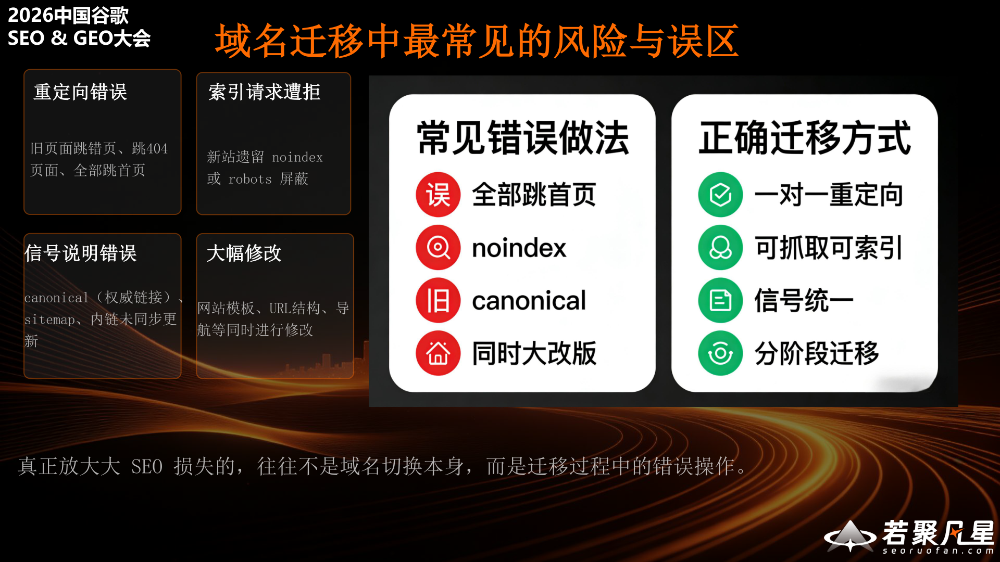
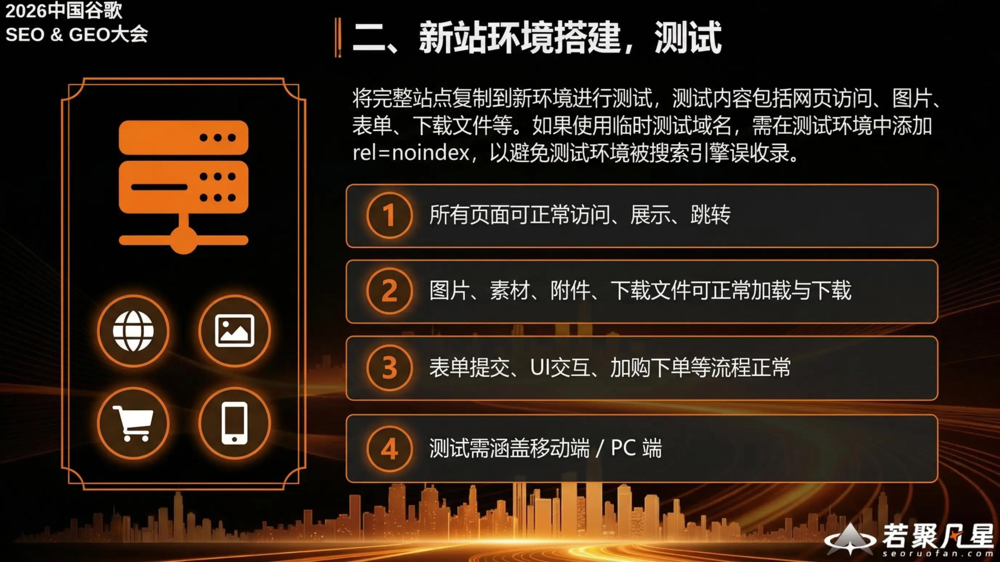
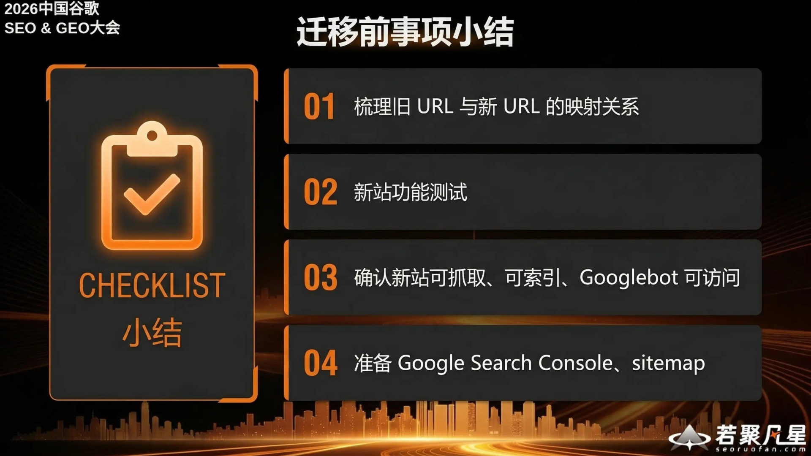
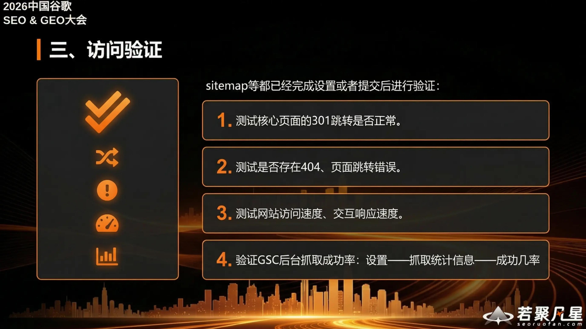
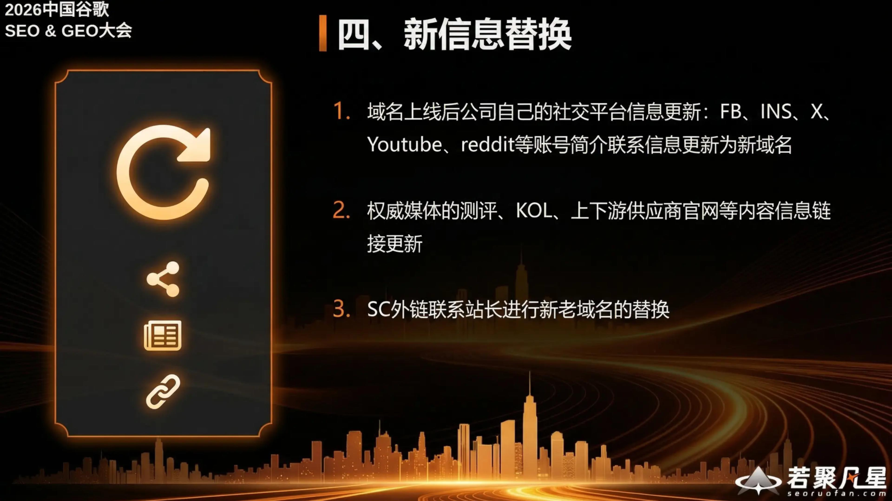
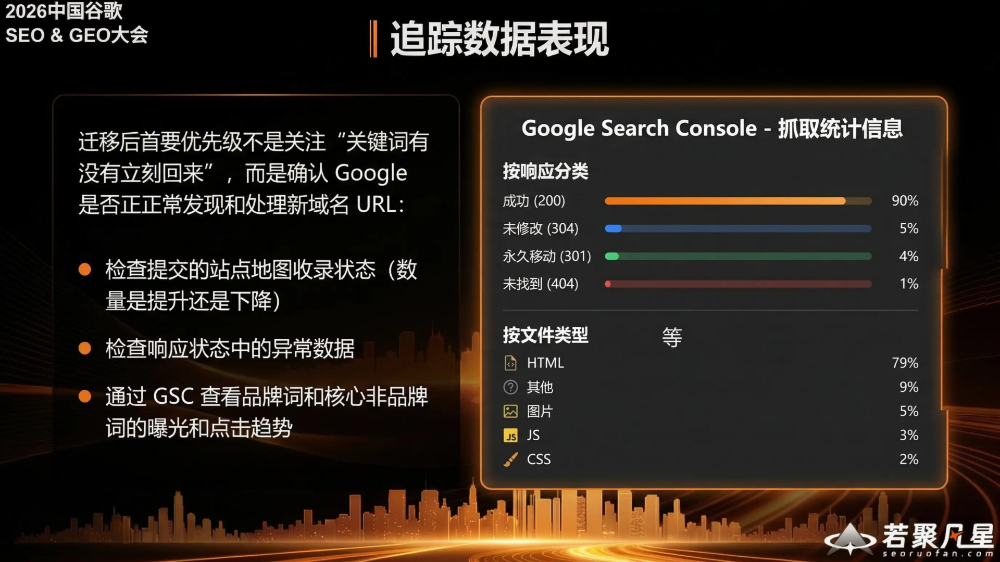
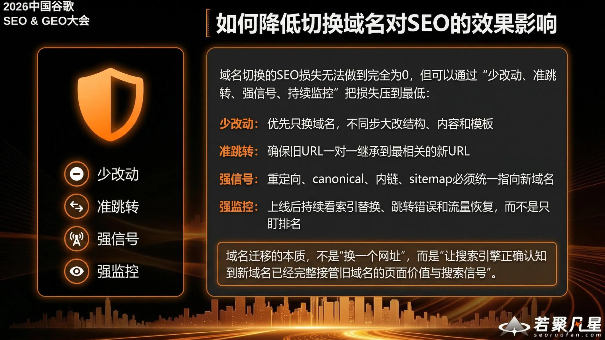

> This article is based on Wang Feng's (Ruoju Fanxing) presentation "How to Minimize the SEO Impact of Domain Migration" at the 2026 China Google SEO & GEO Conference. Domain migration is a challenge many businesses face during brand upgrades or business restructuring. This guide systematically covers the principles, preparation, execution, and monitoring needed to minimize SEO loss.

---

## 1. Why Domain Migration Affects SEO

The core reason domain migration impacts SEO is not that "authority suddenly disappears," but rather that **search engines need to re-understand and re-process the relationship between old and new pages**.

When a domain changes, Google goes through the following process:

- **Domain change**: URLs change, and Google needs to identify the old domain's corresponding new domain, re-establishing trust for the new domain
- **Page changes**: Page addresses change, requiring 301 redirects to inform Google, which then re-crawls and re-indexes
- **Authority transfer**: The old domain's authority is passed to the new domain through 301 redirects

Throughout this process, Google discovers the 301 redirects on old URLs, re-crawls them, re-indexes the content, and eventually transfers rankings to the new domain. **Short-term ranking fluctuations are a normal part of migration** — the key is minimizing the duration of this transition period.

### Common Mistakes vs. Correct Approach

**The biggest SEO losses often come not from the domain change itself, but from mistakes made during the migration process.**

Common mistakes include:
- **Redirect errors**: Old URLs randomly redirecting, returning 404s, or failing to match old site URL patterns and robots rules
- **Index request rejections**: Using noindex, incorrect canonical tags, or making major redesigns simultaneously
- **Signal misconfigurations**: Improper canonical usage, URL parameter confusion
- **Major simultaneous changes**: Redesigning the website at the same time as migrating the domain

The correct migration approach should be:
- **One-to-one redirects**: Every old URL maps to a corresponding new URL
- **Crawlable and indexable**: Ensure the new site is fully accessible to search engines
- **Unified signals**: Redirects, canonicals, internal links, and sitemaps should all be consistent
- **Phased migration**: Don't make too many changes at once

---

## 2. Four Core Principles for Minimizing SEO Impact

Wang Feng summarized four core principles for domain migration:

1. **The inheritance relationship between old and new URLs must be clear** — Build a complete URL mapping table ensuring every old URL has a corresponding new URL
2. **Use 301 permanent redirects to clearly communicate the migration signal** — 301 is the clearest way to tell Google "this page has permanently moved"
3. **Canonical, internal links, sitemap, and other on-site signals must all be aligned** — All signals should consistently point to the new domain
4. **Migration is a continuous process of monitoring and correction, not a one-time action** — Post-launch requires ongoing observation and adjustment

---

## 3. Pre-Migration: Essential Preparation

### 3.1 Map Old URLs to New URLs

The essential pre-migration task is to create a URL mapping based on the old site's sitemap (olddomain.com/sitemap.xml).

Key steps:
- **Create a complete old URL → new URL mapping table**
- **Cover all important pages**: High-traffic pages, core conversion pages, pages with external links, image pages, PDF pages
- **Define the handling method for each URL**: Migrate, merge, retire, or keep
- **Clarify which content is being "migrated," "merged," or "retired"**

The mapping table should include: old URL, new URL, handling method, and notes. For example, the homepage gets a full migration, core conversion pages get migrated, old FAQs get merged into new FAQs, and outdated content gets retired.

### 3.2 Set Up and Test the New Site Environment

Copy the complete site to the new environment for testing. Test content includes web page access, images, forms, downloadable files, etc. If using a temporary test domain, add `rel=noindex` to the test environment to prevent search engines from accidentally indexing it.

Testing checklist:
1. **All pages load, display, and navigate correctly**
2. **Images, assets, attachments, and downloads work properly**
3. **Forms, UI interactions, add-to-cart, and checkout flows function normally**
4. **Test covers both mobile and desktop**

### 3.3 Confirm the New Site Is Crawlable, Indexable, and Accessible to Googlebot

After testing, verify that Googlebot can access the new environment before migration. Any noindex tags or robots blocks used during development must be removed before migration begins.

Key checks:
- **Configure robots.txt properly**: Clearly allow/disallow crawl paths with no accidental blocks
- **Remove noindex**: Ensure the homepage, category pages, product pages, and feature pages have rel=noindex removed and are indexable

### 3.4 Pre-Migration Checklist

Pre-migration checklist:
1. Map old URLs to new URLs
2. Test the new site's functionality
3. Confirm the new site is crawlable, indexable, and accessible to Googlebot
4. Set up Google Search Console and sitemap

---

## 4. Migration Day: Key Actions

### 4.1 Implement 301 Redirects

The first step when migration begins is implementing 301 redirects. Google typically processes 301 redirects faster than other types.

Key considerations:
- **All core domain URLs have 301 redirects enabled**
- **Avoid modifying old URLs**
- **URLs should redirect directly to the final new URL — no redirect chains**
- **Avoid redirecting too many pages to the homepage** (Google treats this as a soft 404)

### 4.2 Ensure the New Site Is Crawlable and Indexable

Immediately after going live, confirm:
1. **Source code inspection confirms noindex has been removed**
2. **robots.txt has no rules blocking crawling**
3. **Use GSC to run crawl tests on pages**
4. **Submit the new sitemap**

### 4.3 Access Verification

After the sitemap and other settings are complete, verify:
1. **Test that 301 redirects for core pages work correctly**
2. **Check for 404 errors or incorrect redirects**
3. **Test site loading speed and interaction responsiveness**
4. **Verify GSC crawl success rate**: Settings → Crawl Stats → Success rate

### 4.4 Update External Information

After the domain goes live, update all external channels:
1. **Social media profiles**: Update FB, Instagram, X, YouTube, Reddit, and other account bios with the new domain
2. **Authoritative media links**: Update links on KOL sites, supplier websites, and other external content
3. **Backlink outreach**: Contact webmasters of linking sites to update old domain references to the new domain

---

## 5. Post-Migration: Ranking Recovery and Performance Monitoring

### Monitor GSC Data

Immediately after migration, monitor crawl data through Google Search Console. Pay attention to crawl frequency, crawl responses, and Googlebot activity to ensure Google is properly discovering and processing pages on the new domain.

### Track Performance Metrics

The top priority after migration is not whether "keywords have come back yet," but confirming that Google is properly discovering and processing new domain URLs.

Key monitoring areas:
- **Check submitted sitemap indexing status** (is the count increasing or decreasing?)
- **Check for anomalies in response status data**
- **Use GSC to monitor impression and click trends for branded and core non-branded keywords**

In Google Search Console's crawl statistics, focus on response category data:
- Success (200) should account for the vast majority (~90%)
- Permanent redirects (301) should be around 5%
- Not found (404) should be kept to a minimum (below 1%)

---

## 6. Summary: Minimal Changes, Precise Redirects, Strong Signals, Strong Monitoring

SEO loss from a domain migration can never be reduced to absolute zero, but it can be minimized through **"Minimal Changes, Precise Redirects, Strong Signals, Strong Monitoring"**:

- **Minimal Changes**: Only change the domain — don't simultaneously overhaul site structure, content, or templates
- **Precise Redirects**: Ensure old URLs have one-to-one mappings to the most relevant new URLs
- **Strong Signals**: Redirects, canonicals, internal links, and sitemaps must all consistently point to the new domain
- **Strong Monitoring**: After launch, continuously monitor index replacement, redirect errors, and traffic recovery — don't just watch rankings

> The essence of domain migration is not "changing a web address," but rather "ensuring search engines correctly recognize that the new domain has fully inherited the page value and search signals of the old domain."
