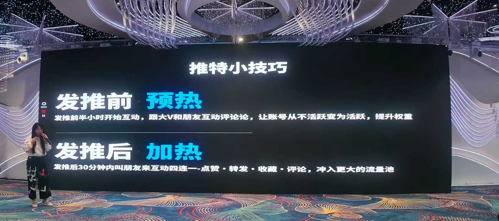
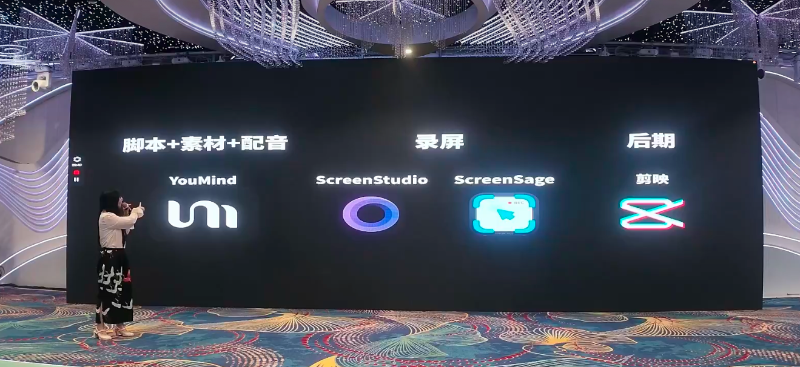
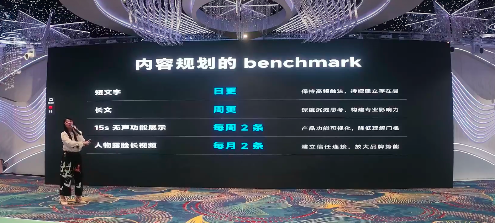

# Everyone Creates: How Employee Advocacy Drives Massive Exposure at Low Cost

> At "**Gefei’s Friends, Mid-Year Sharing, Shenzhen Station**", Youmind Community Operator **Nicole (Taste)**led to a sharing of the theme "**How to do Employee Advocacy, build a social media team Native, low-cost access to mass exposure**".
> >
> Employee Advocacy sounds "high," which is actually the more familiar version of the story -**team account matrix**. Nicole, from the securities industry to the Global Express tool track, has led Euman to a full-time job, with a great pursuit of content and a replicable set of incentives, for over six months, with nearly **135,000 fans**, with hands-on experience: social media x SEO is the low-cost gold partner of the small team.

---

## I, why Employee Advocacy?

Nicole opens with a real question: **The flow is getting more expensive, the price of red people is rising year by year, and advertising costs are increasing.**Is there a better way to find traffic for OPC (one company) or small teams, low cost?

SEO may be one of the answers you have found, but Nicole believes that the Employee Advocacy she's sharing is a gold partner with SEO.

She took the example of the "N-Ra-Calling Station" of Eumann: this assembly station has now become a business routine, and it was originally **from the social media **-

- To do a content in the media that you like to share and to communicate is to be a valuable one**;
- Content such as the "first word assembly station", which users find valuable, collectable, usable and naturally suitable for dissemination;
- The first wave after the website was posted is the team account matrix, which was forwarded together, and then sent by users (UGCs), KOL friends, **the first day of the launch, **— it might take two or three months to see the results, more advantageous than the traditional SEO.

> Nicole noted in particular that social media was not just a diversion tool, but had three main hidden values:**traffic on the first day**,**training in your sense of hot spots**,**fast-track measurement to verify needs**.

The logic of measurement**is particularly clever: if you want to make a new station, you can write a post on the social media saying, "I'm going to do this thing, and you're not interested," and read the post flow and commentary -- low traffic means that demand is not valid, high traffic and much commentary means that demand is worth it.**Recognize demand OK and do a stop, saves a lot of time.**

---

## ii. Nicole's growth experience: from securities company to the head of the Yoman operations

Nicole introduced herself with an interesting career path:

1. **UI Design & Interactive Design Origin**— Extreme pursuit of user experience and extreme control over detail;
2. **Transition to securities firms to do content**— each content is treated as a product, and attention is given to whether it really brings value to the user. The Southern (internal) column was particularly popular at the time, and many users even opened their accounts from other vouchers to the issuer where they were located,**bringing in billions of dollars of conversions to the company (in RMB value);
3. **Added to Eumann, becoming the first to operate**— starting with promotional and tutorial videos in version 0.4, 0.5.

**turning point: limitations of KOL extension**

A CT (Content Tour) on Twitter invited Big V to promote Euman. Nicole, as a brand examiner, found a problem: **Big V has to experience the product in a short time, and then to be superior, it's easy to talk about it.**It's not Big V, but rather the natural limits of this model.

> She concluded that if her team were to promote the product, it would go in depth and continue to promote the multidimensional merits of the product.**This is very important for long-term brands and products.**

So she decided -- she started to do her own account, and she pushed the whole team.

---

## A system of incentives for full staff to do account matrix - a replicable operating manual

Many people ask Nicole, "Why is your company doing so well?" How am I supposed to get my team's little partner to do the content?

She shared the incentives within the U.S.:

### Fan motivation.

| Phase | National | Overseas (tweeting, etc.) |
| --- | --- | --- |
| **1000 under powder** | 1 dollar/ fan | 1 Blade/Face |
| **More than 1000 powder** | 0.2 Dollars/Feeders | 0.2 Blade/Feeders |

Nicole himself was the most motivated person in the company -- **with about $900,000.**

**The design of the mechanism is well thought out**:

- The former 1000 powders are more stimulating, because the hardest part of **account numbers is the first 1,000 powders **;
- (b) Overtake a certain amount of incentives to decrease, avoid excessive bonuses being taken from one person after a surge and make the distribution more even;
- Do "incentive plus bottom" double drive.

### Output bottoming

- **Operating team**: one video per week;
- **R & D team**: two videos per month;
- **Can't do it? Please have a whole group of milk tea!**

### "Everyone wants to be seen."

Nicole was initially worried about colleagues not being very good at doing their stuff and not doing it. But actually speaking, it turns out that **every classmate of the team is willing **– the key is that companies have incentives.

> She explained that if the company did not encourage, the employee feared that the owner felt "not focused enough on his job" and that it was a negative score. When the company had the incentive, people thought, "The company was encouraging me to do the account number," and then they were willing to do it.

**True case**: A fellow researcher from Euman is not very good at content, but can still record video - a selection of 25 AI fields for feed, podcast, Vlog, and Skill.**Even among research students, video can be produced to promote the product and expose it.**

### Outcome

The whole team is now close to 135,000 tons of powder. Although it's not so much like the Big Boss, a lot of people are saying, "You can brush it everywhere" -- because the whole team is doing content.

---

## IV. Question 3 of content

Nicole shares a policy of choice that is very good for a white man:

### 1. Product function

- What's the new function, the new model?
- How many are there?
- I can tell you anything.

### 2. Industry hotspots

- It's all about fire. MCP, it's all about fire. MCP, GPS-4o, minus 2. GPT-4o, minus 2.
- **Same logic as the words: ********************************************************************************************************************************************************************************* * ******* * * * * * * * * * * * * * * * * * * * * * * * * * * * * * *

### 3. Personal content

- There's no need to get the account full product. It'll make the account boring.
- **The personal code is much more expensive than the official name***************************************************************************************************************************************************************************************** * * * * * * * * * * * *** * * * * * * * * * * * * * * * *
- The introduction to myself is a treasure option: to make light and value to you, it will make the account pollination rate higher.

> Nicole puts special emphasis on a mental suggestion: **Just starting with something that does not seek explosive money, but rather quantitative.**from a month to a week, from a week to a week, with 100 first. Building a sense of hand is more important than pursuing explosive money – otherwise it is easy to get anxious and give up because no one looks at it.

---

## V. Three Laws of Exploding: owned Audience x Value x Hotspots

Nicole condensed the method of the explosion into three concentric circles:**not luck, but a replicable path.**

### Law 1: owned heat

Youman is the product of a small group of people who are all in their own company -- the owner, all the engineers, all the students who are in their group, and the user's questions are answered quickly.

- (a) The adhesiveness of the user and the fee-paying user is very high after the creation of the owned audience;
- The content is sent to the group to heat up the users,**the users are very willing to heat you up**— because what you do is to meet their needs and solve their doubts;
- Users praise you, collect, comment in the own environment, and the platform sees you in good content data,**and push to a larger flow pool**.

> For those who make products: if there is an item, it must be built, and it is essential for the explosion.

### Law 2: Value three seconds first.

Nicole gave two examples:

- **"Teach account matrix — 100,000 plus"**: the title directly indicates "100,000 plus" and the user sees it as valuable;
- **"23.7 million powder, nearly 9 million annual income"**: The first three seconds say "9 million" and the user doesn't even read it and collects it immediately.

**Core point**: the value of content is passed directly to users in the first three seconds and communication friction is reduced.

### Law 3: The hot spot is rising.

Nicole shares her own superb case:

- **New Year Lobster Hotspots**: After a few more days of lobster games than anyone else in the past year, trying to learn but finding that there is no systematic tutorial on the Internet, a course article was written in Eumann**for half an hour, **an hour on Twitter — 1.5 hours in total, **more than 7,000 **and top 10 Twitters.**
- **DeepSeek Hotspot**: 100-degree interviews, users around the world are curious, editing and subtitleing, and it's really bad.

> She also added the change in the new algorithm for Twitter: Twitter is now a "global priority" – as long as the target user sets the target language in his mother tongue, and even if you speak Chinese, the overseas user sees a translation of his mother tongue. So**what is known globally is more explosive under the new algorithm.**

---

## VI. THREE TRAINING TECHNOLOGY

### Detonation formula

**Large V interaction + replicable dry goods + interactive heating = explosive**

Twitter is a platform that is easier to make than video — text and map, and is more suitable for people who normally have a job.

### Preheat & Heat after Push

Nicole revealed a little technique that "one million people don't know":

**Before push - preheat**:
- An interactive review with Big V and friends began half an hour before the launch;
- To move the account from inactive to active and to obtain the basis of the account;
- Many people continue to push without traffic, not to fall off the platform, but **without interacting with others,**and there is no base flow pool without active accounts.

**Post-heated —**:
- After 30 minutes, call friends to interact with four companies:**→ **→ - A team of small partners heat each other up;
- Red packs in the Big V group, get some help with heating.

> It's all free play.

### Good for Quote (citation)

Nicole mentioned a Twitter player named "Ay" (over 50,000 powders), whose core method is good use

- **Forwards vs quotes**: forwards are for other people, **in a wave of others**;
- Texts from team partners are forwarded**(to teammates)**, and other billboards are quoted**(to themselves);
- **Technology**: A video was taken when citing it because the Twitter algorithm added additional value to the video.

---

## VII. Video production process - Not very good at expression and can do it

Nicole divided video production into two paths:

### People who are good at expressing themselves.
1. Write an outline (without writing words)
2. I'm going to record it on the side of the outline.
3. More efficient, more natural.

### People who aren't good at expressing themselves (Nicole claims to belong to this category)
1. **Screen first**_ _ _ _ _ _ _ _ _ _ _ _ _ _ _ _ _ _ _ _ _ _ _ _ _ _ _ _ _ _ _ _ _ _ _ _ _ _ _ _ _ _ _ _ _ _ _ _ _ _ _ _ _ _ _ _ _ _ _ _ _ _ _ _ _ _ _ _ _ _ _ _ _ _ _ _ _ _ _ _ _ _ _ → _ _ _ _ _ _ _ _ _ _ _ _ _ _ _ _ _ → _ _ _ _ _ _ _ _ _ _ _ _ _ _ _ _ _ _ _ _ _ _ _
2. And then I'm going to have a script and I'm going to have to tell you what to say.
3. And then I'm going to take a script.**
4. Final**later integration**

> While the second approach is time-consuming, the output video**is clearly, fast and unstalled**and the first three seconds of gold begins with good thought and good value, and users do not jump out and data are better.

### Recommended tool

| Link | Tools | Annotations |
| --- | --- | --- |
| Script + material + sound | **Youmind** | Nicole's own product. "Whether you're going to make an ad." |
| Video | **ScreenStudio** | A lot of people ask her, "What did you get in there?" That's it. |
| Videos (alternation) | **ScreenSage** | Nicole's friends make it more cost-effective and more functional. |
| later editing | **Clip** | Everyone knows that. |

---

## VIII. CONTEXT PLANNING BENCHmark

Nicole gave a rhythm for "work while doing":

| Content Type | Update frequency | Purpose |
| --- | --- | --- |
| **Short text**(tweet) | Daylight | Maintain high-frequency touchdowns and build up a sense of presence |
| **Longitude** | Chow Ming. | Deep-silent thinking, building professional influence. |
| **15s Silent function demonstration** | 2 per week | Visualization of product functions and lowering of the understanding threshold |
| **Face-to-face video** | 2 per month | Building trust links and expanding brand power |

> Long scripts can actually be a script of a long-skinned video, which is repeated several times. 15s of silent video is the simplest -- recording, without any sound, without mirrors, and many companies overseas that do Employee Advocacy are using it.

---

## IX. SUMMARY: COMPLETE LATE, NOT LUCKY, POSSIBLE WAYS

Nicole has reduced the logic to a few key points:

| Principles | Meaning |
| --- | --- |
| **Incentives are the starting point** | The company encourages + fans stimulate + bottom-up mechanisms to get the whole team on the field. |
| **owned education is the foundation** | Create a paid user owning content with heating and data |
| **Values are core** | The first three seconds of the transfer of value, the user wants to collect it if he sees it. |
| **Hot spots are leverage** | I'm gonna borrow it and let the algorithms push more people. |
| **Quantity before quality** | 100 first-hand hands, not a blow-out at first. |

The bottom line of this methodology is entirely dependent on social media algorithms and real users operating without any "go-go-go-go." Nicole also mentioned that whether it's SaaS, tools or electricians, the logic is the same --**a man is gambling, a team is gambling, the bigger the probability, the more likely it is to explode.**

> I wish you all a long ride. The product is red.

---

> This paper is based on the sharing of "How to do Employee Advocacy, build a social media team, get a lot of exposure at a low cost" at "Fifie's friends, Mid-Year Sharing Exchange Shenzhen Station (2026.07.04-07.05)".
