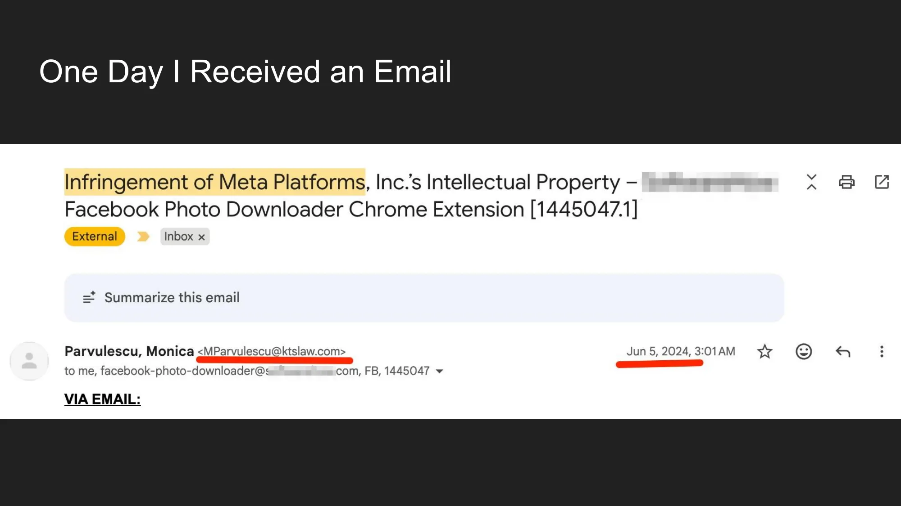
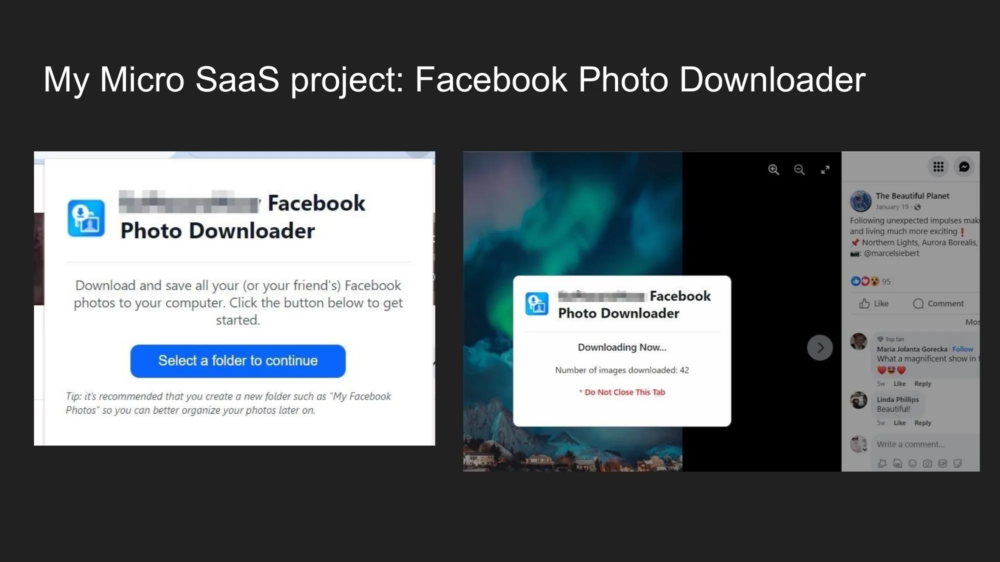
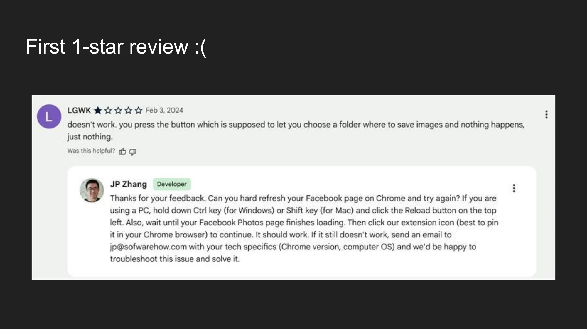
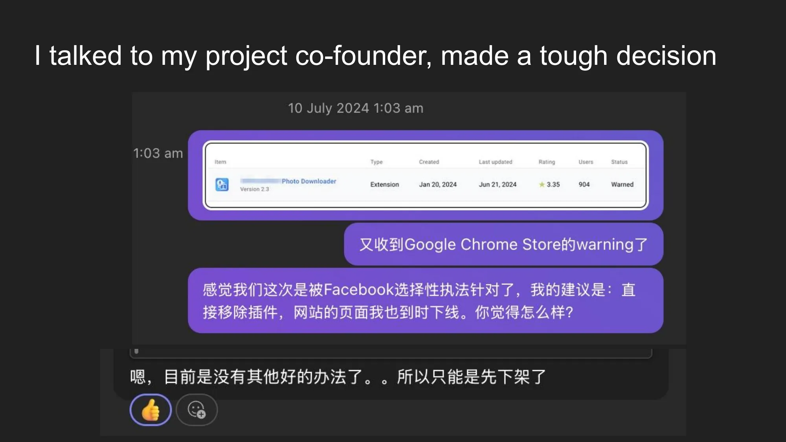
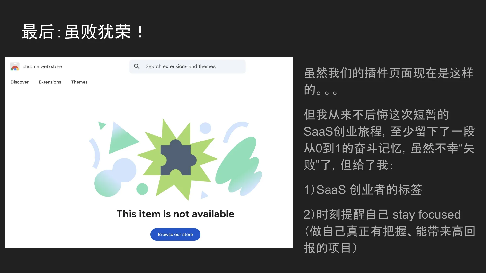

> This article is based on John's talk at the Shenzhen SEO Conference. It's a Micro SaaS startup story that went from project launch to being shut down by a Meta cease-and-desist letter. Though the project ultimately closed, the lessons learned may be more valuable than any success story.

---

## Opening: The Email That Changed Everything

The story doesn't begin with a flash of inspiration — it begins with an email.

One day, John opened his inbox to find an email from the law firm Kilpatrick Townsend & Stockton LLP, with the subject line: **Infringement of Meta Platforms, Inc.'s Intellectual Property — Facebook Photo Downloader Chrome Extension**.

This wasn't a phishing email or some kind of prank. The sender was from a law firm renowned in the intellectual property field, and Meta (Facebook's parent company) was one of their heavyweight clients.

The demands were clear and serious:

**First, immediately remove the "Facebook Photo Downloader" extension from the Chrome Web Store and all other channels. Second, refrain from offering any extensions with similar names, branding, or unauthorized functionality in the future.**

This email directly pronounced the end of a Micro SaaS project that had been running for 8 months.

But before we talk about how it died, let's go back to the beginning — how this project was born and the ambitions it once carried.

---

## What Is Micro SaaS?

Before getting into the story, it's worth discussing what Micro SaaS actually is.

The core of Micro SaaS isn't about building a complex product. Rather, it's about: **finding a real, small problem that exists, developing a micro SaaS as the solution, and making the product as refined as possible.**

It doesn't require a large team, venture funding, or even more than one or two people. The key question is whether anyone is willing to pay for the solution to that "small problem."

In one sentence: **The essence of Micro SaaS isn't about technical complexity; it's about finding a friction point in a real-world workflow and solving it perfectly.**

---

## Project Origin: Facebook Photo Downloader

John's Micro SaaS project was called **Facebook Photo Downloader** — a Chrome browser extension for batch downloading photos from Facebook.

### Who Were the Target Users?

Facebook has **3 billion** users. Within this massive user base, a significant portion had needs like:

- Deactivating their Facebook account and wanting to back up photos
- Having their account banned and wanting to rescue their photo memories
- Wanting to save a deceased family member's Facebook photos as a memorial
- Wanting to batch download photos from friends' albums

These are very real use cases driven by strong emotional needs.

### Where Were the Market Pain Points?

John discovered a series of clear pain points during his research:

**First**, Facebook's built-in "Download Your Information" feature was extremely limited — you couldn't select specific albums to download, it ignored tagged photos, and it didn't support batch downloading friends' photos. Most users could only save photos one by one manually — a terrible experience.

**Second**, existing third-party tools were either broken, outdated, bloated (requiring desktop software installation and account registration), or overpriced. And the downloaded photo quality was often poor.

**There had to be a better solution** — that was John's motivation for starting the project.

### The Solution

John and his development partner designed a Chrome extension with these core features:

- **One-click batch export**: Seamlessly download entire photo libraries
- **Dual source support**: Download both your own photos and friends' photos
- **Granular control**: Select by album or tagged photos
- **Lossless quality**: Preserve original high-resolution metadata

### Why Take on This Project?

John's choice of direction wasn't impulsive — it was based on three key conditions:

**First, he had traffic.** A content site he operated had a high-traffic article about "downloading Facebook photos" that could directly funnel users to the extension.

The article's Google Search Console data was impressive: 3,550 clicks, 264,000 impressions, average ranking of 10.7. Top-ranking keywords included high-intent search terms like "facebook album downloader" and "facebook photo downloader."

**Second, a direct competitor was making money.** A competing product called ESUIT | Photos Downloader for Facebook™ had 70,000 users, a 4.6-star rating (941 reviews), and was a Featured extension on the Chrome Web Store. If a competitor could achieve that scale, it proved the market demand was validated.

**Third, he had a reliable technical partner.** John had a developer friend who was interested in the project and willing to collaborate through a technical equity arrangement.

These three conditions combined — traffic, market validation, and a technical partner — in the Micro SaaS world, this was practically a dream start.

### Business Model

John designed a tiered monetization model:

**Freemium model:** Free users could download up to 300 photos — 100 more than the competitor — to lower the barrier to entry, then convert through an "unlimited" paid plan.

**Value-added services:** Partner with photo book manufacturers to turn users' downloaded digital photos into physical keepsake albums — leveraging the emotional drive behind photo downloading for conversion.

**Subscription cloud backup (SaaS-ification):** Provide an automatic sync service that periodically backs up new Facebook photos to the user's designated cloud storage.

### Market Potential

John half-jokingly said during his talk: Facebook has 3 billion users — even if only 0.01% need this feature, that's 300,000 potential users. For a Micro SaaS, this is definitely not a "micro" business.

In his own words: **"What we're really doing isn't building a complex product — we're filling in the backup feature that Facebook didn't build well, and making some money along the way :)"** — he admitted feeling a bit cocky at the time.

---

## Project Timeline: From Zero to Shutdown in 8 Months

Let's look at the complete timeline of this project:

- **November 19, 2023**: Official project launch
- **December 27, 2023**: Extension v1.0 born
- **January 23, 2024**: Extension submitted to Chrome Web Store
- **January 25, 2024**: Extension approved and officially live
- **February 3, 2024**: Received the first real user review — 1 star
- **February 26, 2024**: Reached 500 downloads (but with a 50% uninstall rate)

### The First 1-Star Review

Less than 10 days after launch, the first negative review arrived. The user reported that "nothing happened after clicking the button."

John responded earnestly as the developer, providing detailed troubleshooting steps and leaving a technical support email address. The attitude was right — but the problem was that the product's stability truly wasn't there yet.

### Negative Reviews Keep Coming

More 1-star reviews followed.

One user bluntly said "Not Working!" Another questioned "Why does this extension need to read my browsing history? Is it a scam?" — this review received 2/2 "helpful" votes, indicating other users shared the same concerns.

### Chrome Web Store Data

Looking at the backend data, installations were growing steadily, reaching a total of 487 installs.

But the uninstall numbers were alarming — 225 uninstalls, a rate approaching 50%.

This meant that for every two users who installed the extension, one quickly uninstalled it. Product retention was a major problem.

### Timeline Continued

- **April 6, 2024**: Finally received the first 5-star real user review

A user wrote: **"I am using v2 and it's outstanding! Kudos to the developers!"** — after months of iteration, the v2 version finally satisfied some users.

- **May 20, 2024**: Launched a "Buy Me a Coffee" donation feature to test users' willingness to pay

After users completed a photo download, a prompt would appear telling them this tool took the developers weeks to build, and if they found it helpful, they could buy them a coffee.

- **June 5, 2024**: Meta's legal team sent the first infringement notice — **but John didn't have time to check his email and missed it!**
- **June 13, 2024**: Meta's legal team sent a follow-up email — this time John saw it
- **July 24, 2024**: Decision made to shut down the project

---

## Why Was It a "Failure"?

John deliberately distinguished between **failure** and **"failure"** in his talk:

**Without the quotes —**

- Duration: 8 months
- Result: Acquired 1,000+ users
- Revenue earned: $0

From a business results perspective, this was indeed a failed project. Time and effort invested, but not a single dollar earned.

**With the quotes —**

- It was a crucial part of John's SaaS entrepreneurial journey
- It accumulated a wealth of lessons learned

---

## Deep Dive: Why Did Meta Target Them?

Many people might wonder: there are so many Chrome Web Store extensions that work with Facebook — why was John's product specifically targeted?

John identified four main reasons:

### 1. Core Product Stability Was Insufficient

Different operating systems, different Chrome versions, different extension environments... the countless combinations made bugs extremely difficult to reproduce. Their small team (two people) simply didn't have the technical capacity for comprehensive compatibility testing and fixes. When the product frequently malfunctioned, negative reviews skyrocketed.

### 2. Poor User Experience

Despite the team creating usage tutorials, many Western users still reported not knowing how to use the extension. The learning curve was too steep — fatal for a mass-market B2C tool.

### 3. Launched Too Early, Damaging Reputation

The v1.0 version was rushed to the Chrome Web Store before its features, UI/UX, and stability were mature. The result: the first batch of users had a terrible experience and left numerous 1-star reviews. On a platform like the Chrome Web Store, early negative reviews have devastating impact — they directly influence subsequent users' installation decisions.

### 4. Meta Has a Professional Brand Monitoring Team

Facebook has a dedicated brand PR team that constantly monitors brand keywords and handles Online Reputation Management. When a third-party tool with many complaints and negative reviews frequently appears in search results related to "Facebook," being noticed and held accountable is only a matter of time.

In other words: **If your product is good enough, the user experience smooth enough, and negative reviews few enough, Meta might never even notice you.** But once your product generates a lot of negative noise under their brand keywords, you automatically enter their radar.

---

## The Painful Goodbye

After receiving the cease-and-desist letter and a warning from the Chrome Web Store, John and his partner had a serious conversation.

The gist of the conversation: John felt they were being selectively targeted by Facebook and suggested taking the extension down immediately, along with removing related pages from their website. His partner replied that there was really no other good option at the moment — they had no choice but to take it down.

Just like that, a project that once carried all kinds of ambitious plans came to an abrupt halt in the face of a cease-and-desist letter.

---

## Retrospective: What They Did Right

Even though the project ultimately shut down, John believed several things were done correctly:

**Found a compatible development partner.** Neither party put up money — both contributed through technical skills and resources. This lightweight partnership model is perfect for early-stage Micro SaaS projects.

**Quickly shipped a product and validated market demand.** Although the Ideal Customer Profile (ICP) wasn't clear enough, at least the quick launch proved the demand was real.

**Acquired the first batch of users at nearly zero cost.** By leveraging traffic from his content site plus a bit of SEO optimization, they completed the cold start. For indie developers, this content-driven growth approach is the healthiest.

**Responded quickly to negative reviews and iterated fast.** Every time a 1-star review came in, the team would carefully analyze the issue and fix it in the next version. It was precisely this attitude that led to the v2 version's turnaround with 5-star reviews.

---

## Retrospective: What They Did Wrong

This is the truly valuable part — the pitfalls and mistakes made.

### 1. No Clear Positioning

**Who is the ideal customer? What are the use cases? What value do we provide? Which users or scenarios should we absolutely not serve?** None of these questions were thought through at project inception.

The result was vague product descriptions and messaging, trying to target all Facebook users. 3 billion users sounds tempting, but a two-person team trying to serve "everyone" ends up serving no one well.

**They were too greedy.**

### 2. v1.0 Shouldn't Have Launched

The v1.0's features, UI/UX, and stability were all subpar — it shouldn't have been rushed to the Chrome Web Store. A better approach would have been to expand beta testing, run more iterations, and wait until the product quality reached a certain standard before officially launching.

Early negative reviews accumulated on a public platform snowball and become increasingly difficult to reverse. **You only get one chance at a first impression.**

### 3. No Contingency Plan for IP Infringement

Building a third-party tool named after "Facebook" without ever considering the possibility of receiving a Meta cease-and-desist letter — this was the biggest strategic blind spot. When the letter arrived, John admitted he was "a bit stunned."

They did take some remedial measures later: removing the Facebook name, rebranding, etc. But the opposing side focused on TOS (Terms of Service) violations, and their small team simply couldn't compete with Meta's legal department.

---

## Seven Core Lessons Learned

This is the most essential part of John's entire talk — seven hard-won lessons:

### First, Small Teams Should Lean Toward Micro B2B, Not B2C

B2C means facing massive user support demands, extremely high product stability requirements, and the risk of being crushed by large companies. In B2B scenarios, there are fewer customers but stronger willingness to pay, and large companies typically don't bother with niche vertical tools.

### Second, Plan Your Exit Strategy

If the project can't continue, you should still be able to sell the product and get some cash return — rather than letting all your investment rot. A product with a user base, even if you don't want to continue, might sell on platforms like Flippa or MicroAcquire.

### Third, Without Full Commitment, Success Is Unlikely

John was very candid about this point. At the time, he wasn't just working on this one Micro SaaS — he was juggling other projects simultaneously. When a big problem like Meta's cease-and-desist letter hit, the thought of "giving up" surfaced immediately — because he had other fallbacks. But the ultimate result was that none of his projects made any money.

**Scattered focus is one of the biggest enemies of indie entrepreneurs.**

### Fourth, TOS Infringement Issues Can Be Resolved

This is a crucial piece of information: their direct competitor ESUIT | Photos Downloader for Facebook™ **had also faced the exact same issue**, but they resolved it. The competitor currently has 70,000 downloads and is generating ongoing revenue.

What does this tell us? Being scared off by a cease-and-desist letter isn't the only option. If the team has sufficient technical capability, legal awareness, and response strategy, this hurdle is entirely surmountable. **The problem isn't the obstacle itself — it's whether you're prepared to overcome it.**

### Fifth, the Soft Skills Bar for SaaS Entrepreneurship Is Rising

While AI has lowered the technical barrier — coding, design, and operations can all be accelerated with AI — the requirements for founders' **business acumen, product positioning, risk prediction, and crisis response** are actually increasing.

As tools get more powerful, the competitive moat is no longer "can you build it" but "can you get the direction right, defend against risks, and survive long enough."

### Sixth, Don't Go It Alone — Find a Complementary Partner

1 + 1 > 2. While John had extensive experience in business and SEO, he wasn't a developer. Having a complementary technical partner enabled this project to go from inception to launch in under two months.

Solo developers certainly have success stories, but for most people, having a trusted and complementary partner significantly increases the success rate and risk resilience of a startup.

### Seventh, Check Your Email at Least Once a Week

This might sound a bit funny, but it was a painful lesson.

Meta's legal team sent the first infringement notice on June 5, but John didn't check his email — he didn't find out until the follow-up email on June 13. **He missed 8 full days of response time.**

In the business world, especially when legal matters are involved, timely response is critically important. **Make sure to check your Spam box** — many important emails may be misclassified as junk.

---

## In the End: Honorable in Defeat

Now, John's extension page on the Chrome Web Store looks like this:

A gray puzzle piece icon with the words **"This item is not available"** beneath it.

Seeing this image, it's hard not to feel a pang of regret. 8 months of work, countless late-night debugging sessions, back-and-forth discussions with his partner, earnest responses to every user review... all frozen on this cold page.

But John says **he never regrets this brief SaaS entrepreneurial journey**.

At the very least, this experience left behind a memory of building something from zero to one. Though it unfortunately "failed," it gave John two things:

**First, the identity of a SaaS entrepreneur.** He's no longer just an SEO practitioner or content site operator — he's someone who actually built a product, went through market validation, and got a serious reality check.

**Second, a constant reminder to stay focused.** Work on projects you truly have confidence in and that can deliver high returns, rather than trying to grab every opportunity and explore every direction.

---

## Final Thoughts

John's story is a microcosm of countless Micro SaaS entrepreneurs.

In an era where AI has lowered every technical barrier, "building a product" has become easier than ever, but "building a business" remains incredibly challenging. Market positioning, legal risks, product stability, user experience, team collaboration, energy management... any single factor could be the straw that breaks the camel's back.

But every "failure" is not in vain. The pitfalls you've stepped in, the tuition you've paid, and the insights you've accumulated become your most valuable assets in the next project.

As John said: **Honorable in defeat.**

If you're also on the Micro SaaS journey, hopefully this retrospective helps you avoid some detours. And if you're hesitating about whether to start, perhaps John's experience tells you: **Go for it — the worst outcome is a story and a pile of lessons. And those are worth far more than standing still.**

---

*This article is based on John's talk at the Shenzhen SEO Conference (English SEO Practitioner Community). Thanks to John for his candid sharing.*