# How to Get Positive Feedback Faster When Building for Global Markets

> At the "**Gefei’s Friends, Mid-Year Sharing Fair, Shenzhen Station**", from the former AI product manager to the Global Action field, which has achieved monthly success in 14 months, shared experiences on the theme "**Global Access to Positive Feedback **".
> 
> In an increasingly competitive and shorter dividend, the primary goal of the newcomers is not just to roll code and technology, but to find the ponds of "near fish" and to do it very quickly. Here is the fine sorting of the sharing.

---

## First step: the choice of the right pond

If you want to go global fishing, the first thing you do is not grind your gear, but find a pond with fish.

**Keyword research > Operating > Development**. Different ponds have a very different success rate, and choosing a highly successful pond can do twice as much.

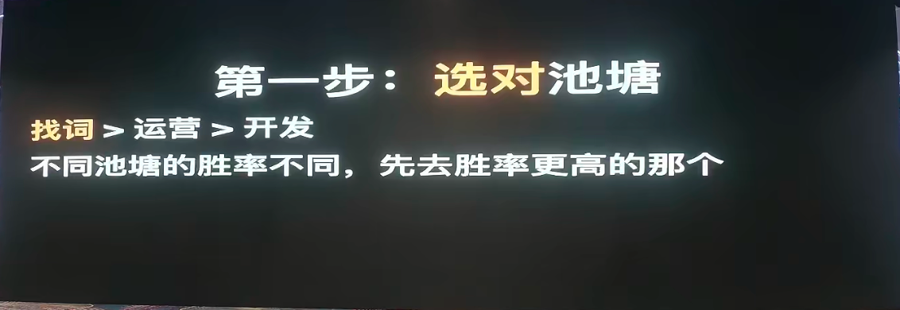

What kind of ponds have a high success rate? Four words: **fish, few people.**

---

## ii. Learning from top operator: copying what?

When you find a good direction, or you don't know how to do it as a beginner, the fastest top operator in the field is the best strategy.

### 1. Backlinks: look at the operator method
If you move, you will always leave traces online. Using tools like Ahrefs to analyze reverse links, especially backlinks that originated early at the top of the top station, will help you to restore their drive from 0 to 1.

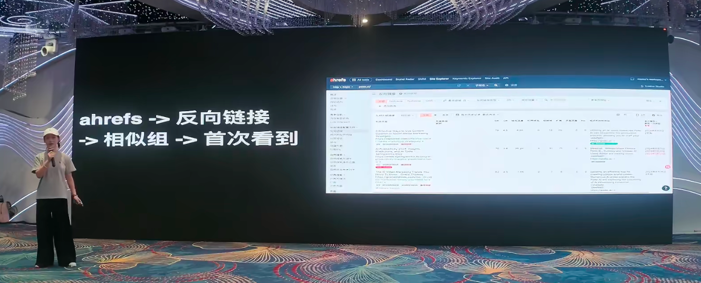

### Copy inner pages: Monitor the movement of opponents
Focus on what words the opponent has? Monitor their Sitemap with tools, compare the new inner pages with the new keyword each day. (Be careful not to just look at the update date but to see the actual addition).
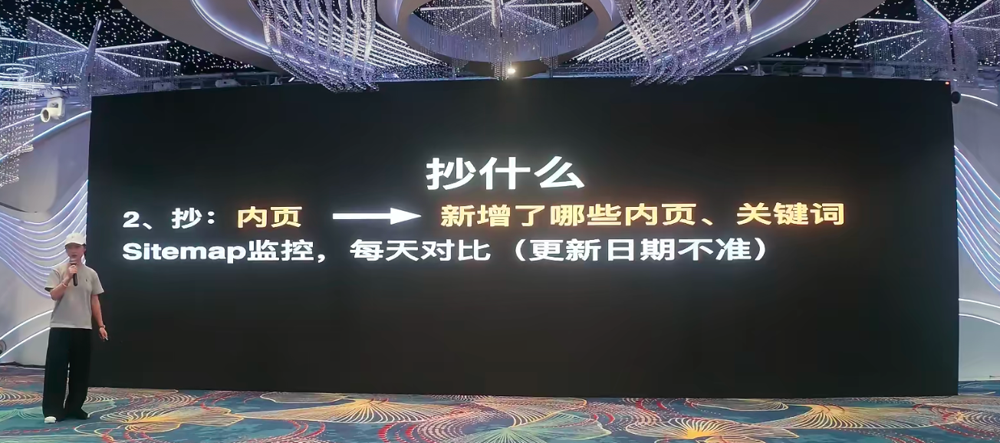

### 3. Copy On-Page SEO
What about the big segment of the SEO guide? Send the top-lined site directly to big models like Gemini, so AI can help you analyze their SEO do well and recycle the core elements directly.
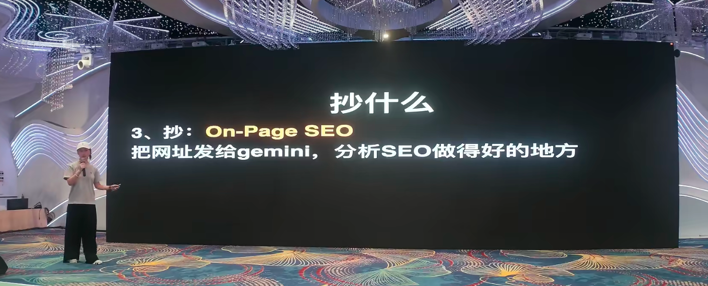

### 4. Interactive design for website copying
Interact well. User trust is strong and stays long. Allow AI (e. g. Claude / Codex) with an built-in browser to open the site point button and analyse its interactive mechanisms.

---

## iii. Squirt: How to judge the number of fish and how to find them?

### 1. Where to find him?
Finds (describes) through high-volume keyword, emerging keywords, or through expensive backlinks (strikes). Those who can run to the first page of the search in a short period of time using "established keyword" are absolutely worthy of scrutiny.

### How can "fish abundance" be judged?
- **Look where the money is**: Who's making a big ad? Who's buying a few hundred dollars of high-level backlinks? The more you spend, the more you earn.
- **See the shift in the list**: If a function earns money at the top of the App Store income list, then someone will certainly look for it in the search engine, suggesting that it's equally profitable to be a website.

### 3. How to capture early dividends (to judge that fish are becoming more numerous)?
For starters, the best pond is where "fish is about to get more" but "people are less".
- **Trendskeyword research**: excavating "relevant queries" with recommended algorithms, emerging keyword and hot words.
- **Number of results changed**: Using `intitle:` Search to observe the number of web pages that have been developed in the last week/day/hour, indicating explosive potential if the increase in the index level is an indication.
- **Go to the source, keep an eye on first-hand sources (e.g., X/twitter, TikTok blast, AI Model List).

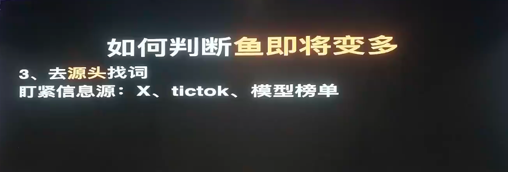

---

## IV. How to avoid a proliferation of people?

1. **Do not go with top operator**: the common word known (especially the hot model word) does not follow without a brain, and the battles that cannot be won are not fought with determination.
2. **Scientific Prejudic**: using a strategy of "emerging keyword + common combinations / version number / multilingual" (e. g. prefixing v2, v3 or xxgenerator) precalculations, or playing time difference for non-English language.

---

## V. PRESENTATION FOR LONG LONG LONG-TERM LONG-LONGER RESPONSE

We need not only skills, but also probabilistic perspectives on this matter:
- **Big Number Theoretically**: Even if there's only 10% success at each station, one can explode at 10 stations. Don't wait until everything's ready, **doing high school**is the way to go!
- **Bayes theorem**: fast launch a spot error, but it must be ensured that there is a repetition and progress in each and every one of these generations, and that your single victory is constantly added to the final one.

---

## VI. Flow strategy: shaping, cutting and cold-starting

1. **Force**: Proactive demand generation. First wave users are obtained through social-mixer money, Build in public (publicly constructed) or red-person marketing, or using information sources such as Reddit and FB Group.
2. **Interception**: A clear search intent is in place. The main objects are demand words, competitive brand names, new tools, model words (especially model terms, which are already used and paid by users, and are converted to extremely high levels of change).
3. **Cold start**: After obtaining accurate traffic, do everything possible to extend the user's stay. For example, send points through daily cards, and even deliberately slow down the generation, adding good-looking action.
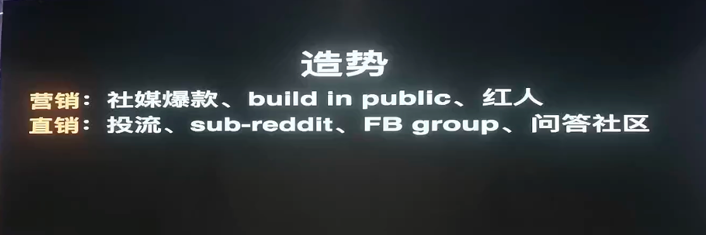
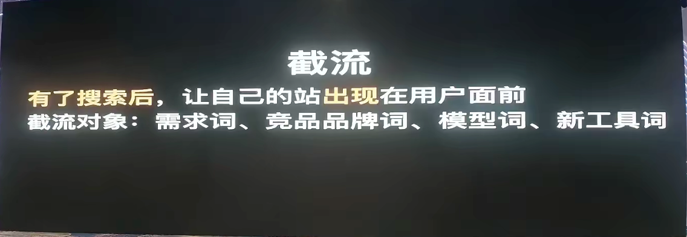
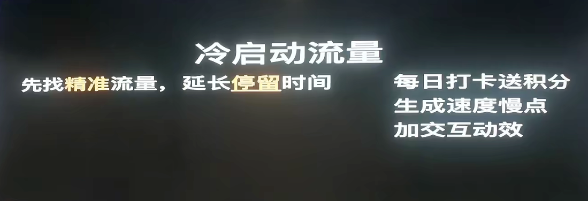

---

## Who are we making money for?

To figure out who we're making, essentially, the global product is doing **services,**to meet the underlying needs:
- **Save time for users**: efficiency tools, time saved is money.
- **Helping users make money**: especially in the ToB area, helping businesses to improve their profits.
- **Make users feel better**: provide emotional value (e.g. AI escorts, games), which are less competitive and less expensive.
- **Made bad information**: for example, earned cheap API differentials, or domestic and foreign functional moves.
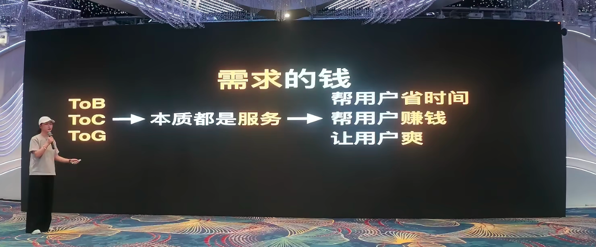

---

## Qualified "AI Age One Company"

In the AI era, you're the CEO of the company, and AI is your CTO.
1. **The code is worthless, Keyword research is core competitiveness!**Don't fall into the bottom of the code of the programmer's mind, `ship fast, ship more'.
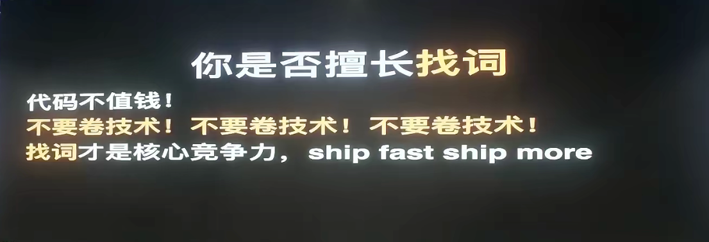
2. **Must be fast enough. **Finding emerging keyword, must go online on the same day (24 hours)! Use the template, do not develop from scratch.
What if the function is not finished? **A false queue!**allows users to think that handling not only collects intentions, but also prolongs the stay, far more than simply allowing users to see the non-functional whiteboards jumping out, and even the false queue stations are at the top of the ranking.
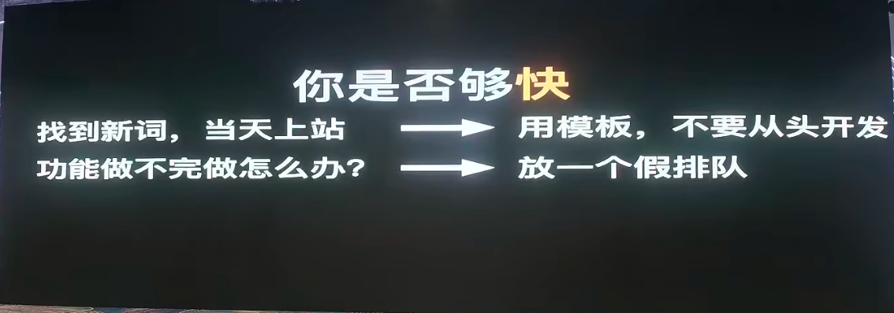
3. We can use AI to defeat others who have not yet done so. No matter how narrow the dividend window is, the opportunity is always left to the optimists who reduce mental consumption and do it immediately.
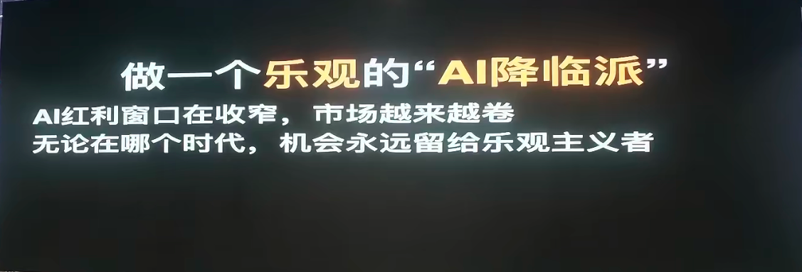
