*Original author: Daniel Johnson, Founder of We Scale Startups | Fractional CMO*

---

## 1. Introduction: The Hardest Problem in Global SaaS Isn't Building the Product

If you're a SaaS founder, you've probably spent countless days and nights on your product. You polish features, optimize the experience, iterate on versions... then you launch full of expectations, only to discover—

**Nobody cares.**

Not because your product is bad. But because in today's SaaS market, the product itself is no longer the biggest bottleneck. The real bottleneck is **distribution**—how to get your target customers to know you, trust you, and ultimately choose you.

This problem exists for every SaaS company, but it's especially lethal for those trying to enter new markets. You have no brand recognition, no trust foundation, no network—you're starting from zero.

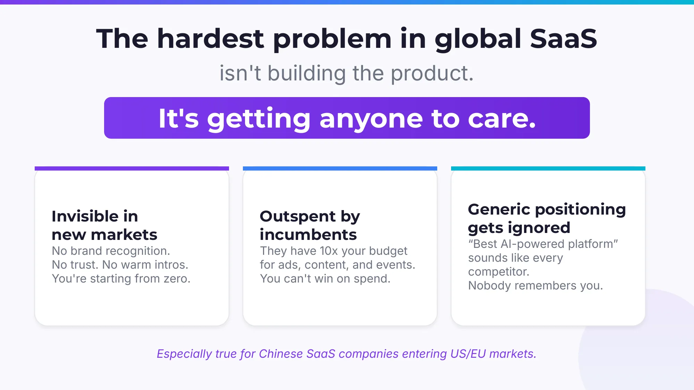

Daniel Johnson nailed three core challenges in his presentation:

**First, you're invisible in new markets.** No brand awareness, no trust, no warm introductions. You're like a stranger who just moved to a new city—nobody knows you.

**Second, you're outspent by incumbents.** Legacy competitors have ad budgets 10x or even 100x yours. They can throw money at content, events, and paid campaigns, and you simply can't compete on spending.

**Third, commoditized positioning makes you forgettable.** "The best AI-powered platform"—that sounds exactly like every other competitor's tagline. When everyone says the same thing, nobody remembers you.

These challenges are especially acute for SaaS companies expanding internationally. When entering the US or European markets, you face not just product competition, but a cultural gap, trust deficit, and brand vacuum.

So where's the breakthrough?

The answer: **Founder-Led Distribution.**

---

## 2. Why Founder-Led Distribution Works

In B2B, there's a truth that's been validated over and over: **Buyers trust people, not brands.**

This is especially clear in high-ACV SaaS deals. When a company is spending tens or hundreds of thousands of dollars on software, decision-makers need more than product demos and feature comparisons—they need trust. Trust in the seller, trust in the solution, trust that "this person understands my problem."

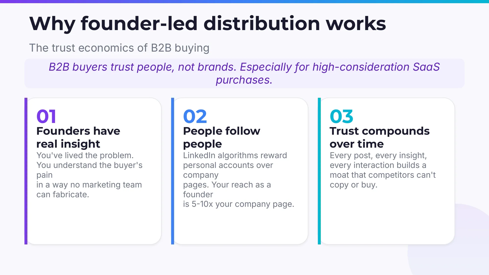

Daniel Johnson makes three key arguments:

### Founders Have Authentic Insights

As a founder, you've personally lived through the problems your customers face. You didn't read about them in market reports—you experienced them through countless customer conversations, product iterations, and failures. This depth of understanding is something no marketing team can manufacture.

When you share a thought about an industry pain point on LinkedIn, your ICP (Ideal Customer Profile) immediately feels it—"This person truly gets my situation." That resonance can't be bought.

### People Follow People, Not Companies

This is a phenomenon validated by data time and again: on LinkedIn, a founder's personal profile gets 5 to 10x the reach of a company page. The algorithm inherently favors personal content—because people prefer engaging with a human, not a faceless corporate logo.

Think about your own LinkedIn habits: are you more likely to stop and read a founder sharing startup lessons, or a company page posting a product update? The answer is obvious.

### Trust Compounds Over Time

This is the most powerful property of founder-led distribution: **it's a compounding game.**

Every post, every interaction, every shared insight builds a moat that competitors can't replicate or buy—**personal authority and trust.** Three months in, every post you publish has far more impact than your first, because you've built an audience base and credibility asset.

---

## 3. The Authority → Demand Flywheel: How Founder Content Becomes Sales Pipeline

Now that we understand "why," let's look at "how." Daniel Johnson proposes an elegant model—the **Authority → Demand Flywheel.**

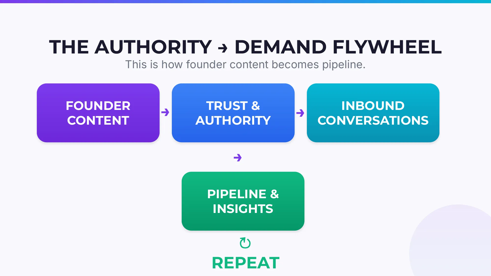

Here's how the flywheel works:

**Founder Content → Trust & Authority → Inbound Conversations → Sales Pipeline & Insights → Repeat**

You publish content, content builds trust, trust generates conversations, conversations create opportunities, and customer feedback from those opportunities becomes material for your next piece of content. This isn't a linear process—it's a flywheel that accelerates with every turn.

The key: **every cycle of this flywheel costs zero.** You don't need to spend a single dollar on ads. You're leveraging your own experience, insights, and time—which happen to be your most unique assets as a founder.

---

## 4. LinkedIn: The Highest-Leverage Channel for B2B Founders

Among all channels for founder-led distribution, LinkedIn currently offers the highest ROI.

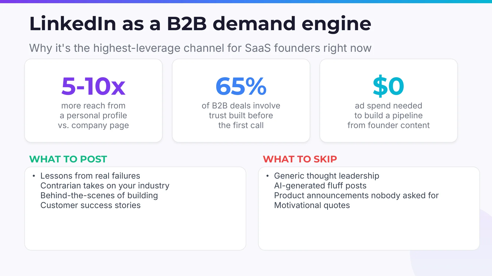

Key data points:

- **Personal profiles get 5-10x the reach of company pages**—that's how the algorithm works
- **In 65% of B2B deals, trust is established before the first call**—buyers already "know" you through your content before reaching out
- **$0 ad spend to build a sales pipeline**—purely driven by founder content

So what should you actually post?

**Post this:** Lessons learned from real failures, contrarian takes on the industry, behind-the-scenes stories, customer success stories. The common thread—**authentic, specific, insightful.**

**Avoid this:** Generic "thought leadership," AI-generated fluff, product launch announcements nobody cares about, inspirational platitudes. The common thread—**hollow, generic, zero information value.**

Simply put, your content should make readers think "this person has actually been through this," not "yet another person chasing clout online."

---

## 5. From One Post to One Deal: The Conversion Loop in Practice

Let's make the flywheel concrete and see how a single LinkedIn post becomes sales pipeline, step by step.

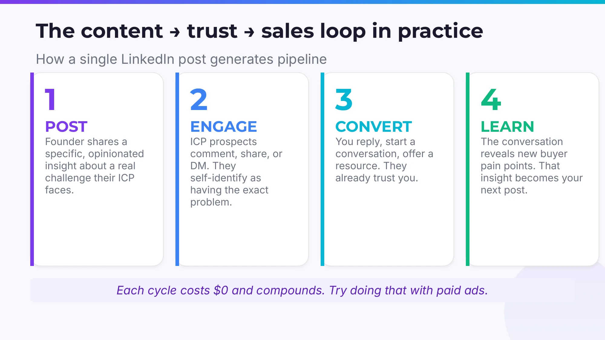

**Step 1: Post.** The founder shares an opinionated, in-depth insight about a specific challenge their target audience faces. Key words: specific, opinionated. Not "digital transformation is important," but "when helping clients with X, we found 90% get stuck at Y, and the reason is Z."

**Step 2: Engage.** Potential customers in your ICP see it and start commenting, sharing, or sending DMs. They self-identify—"We're dealing with the exact same problem!" This is the most valuable signal: prospects coming to you.

**Step 3: Convert.** You reply to comments, start one-on-one conversations, share a useful resource. You don't need to "sell" because the other party has already built trust through your content.

**Step 4: Learn.** Through these conversations, you discover new buyer pain points and needs. These insights become material for your next post.

**Every cycle costs zero, and the effects compound.** Try doing that with paid ads.

---

## 6. The Introverted Founder's Playbook

Many founders recoil at "LinkedIn distribution": "I'm not the type who likes making loud proclamations online."

Good news: **You don't need to be loud. You just need to be consistent and specific.**

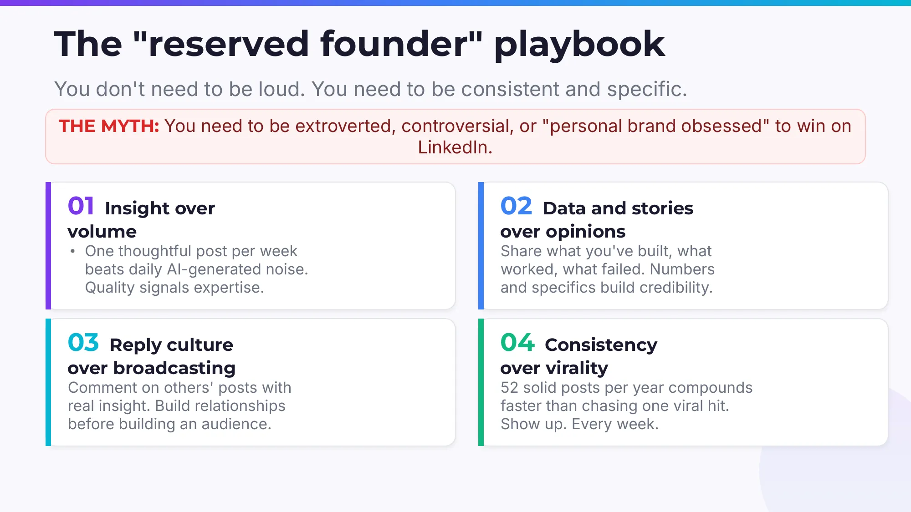

Daniel Johnson designed a methodology specifically for founders who don't want to become "influencers"—he calls it the "Introverted Founder's Playbook." Four core principles:

### Principle 1: Insight Over Volume

One thoughtful post per week far outperforms one AI-generated piece of fluff per day. Quality signals expertise. You don't need to show up on LinkedIn every day, but every time you do, people should think "this was worth reading."

### Principle 2: Data and Stories Over Generic Takes

Don't post "I think SaaS companies should focus on customer success"—anyone can say that. Post "Last quarter we improved customer renewal rates from 72% to 89%, and the key changes were X and Y." Data and specific experiences build credibility; generic takes get scrolled past.

### Principle 3: Reply Culture Over Broadcasting

Rather than only posting your own content, spend time leaving thoughtful comments on other people's posts. Build relationships first, then audiences. This approach is especially suited for introverted founders with limited "social energy"—you don't need to be center stage, just show up in the right conversations.

### Principle 4: Consistency Over Virality

Fifty-two solid posts a year beats chasing one viral hit. Don't worry about "what if this one doesn't blow up?"—what matters is showing up every week. Consistency itself is a signal: you're serious, you're not going away, you're worth following.

---

## 7. How to Systematize Without Losing Authenticity

Some founders ask: "I understand I need to create content, but my days are already consumed by product, fundraising, and team management—where do I find time to write LinkedIn posts?"

A fair question. The answer isn't "squeeze out more time"—it's **build a system where the founder only does the highest-value part—providing insights—and the system handles everything else.**

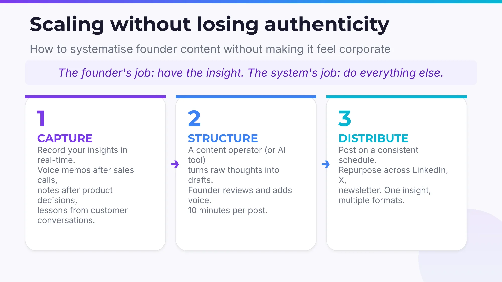

Daniel Johnson proposes a three-step process:

**Step 1: Capture.** Record your thoughts and insights in real time during your daily work. After a sales call, record a voice memo. After a product decision, jot down a quick note. After a customer conversation, note the pain points they mentioned. These raw materials are your "content goldmine."

**Step 2: Structure.** A content operator (or AI tool) transforms your raw thoughts into post drafts. The founder does the final review, adding their own tone and style. Each post requires just 10 minutes of founder time.

**Step 3: Distribute.** Publish content on a fixed schedule. The same insight can be repurposed across LinkedIn, X (Twitter), email newsletters, and more. One idea, multiple formats.

The core philosophy: **The founder's job is to provide insights; the system's job is everything else.** This way you maintain content authenticity and personal character without content creation derailing your primary responsibilities.

---

## 8. The AI Era: Founder Authority Matters More, Not Less

You might think: "Now that AI can mass-produce content, does personal branding even matter anymore?"

Quite the opposite. **In the AI era, a founder's personal authority matters more than ever.**

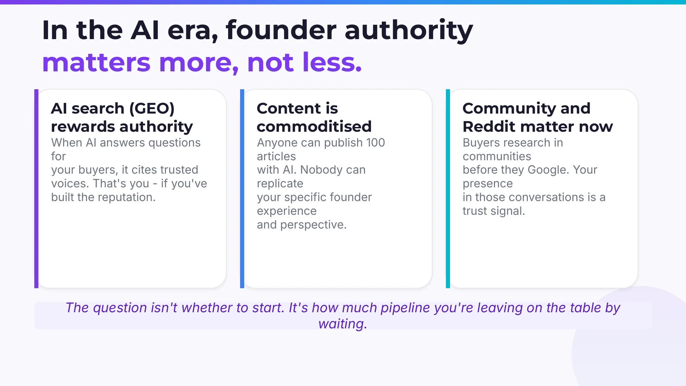

Three reasons:

### AI Search (GEO) Rewards Authority

When AI answers questions for your buyers, it cites voices considered credible and authoritative. If you've built a reputation in your domain, AI will mention you in its recommended answers. This is an entirely new distribution channel—being "recommended" by AI systems as an industry expert.

This also means companies that haven't built personal authority will become even more invisible in the AI search era. If your competitor builds their founder brand before you do, AI will recommend them first.

### Content Has Been Commoditized

Anyone can use AI to publish 100 articles in a single day. But nobody can replicate your specific experiences, unique perspectives, and authentic stories as a founder. When everyone can mass-produce "decent enough" content, **content backed by real experience becomes even more scarce and valuable.**

It's like a market flooded with synthetic gems—natural gems become even more precious. Your founder experience is that natural gem.

### Communities and Reddit Are Rising in Importance

More and more buyers research on Reddit, Hacker News, and other communities before making purchasing decisions, before they even search on Google. Your presence and engagement in these communities is a powerful trust signal.

These three trends converge to one clear conclusion: **In the AI era, the opportunity cost of not doing founder-led distribution keeps growing.**

---

## 9. Case Studies: From Seed to Series B—How They Did It

Theory aside, let's look at real cases.

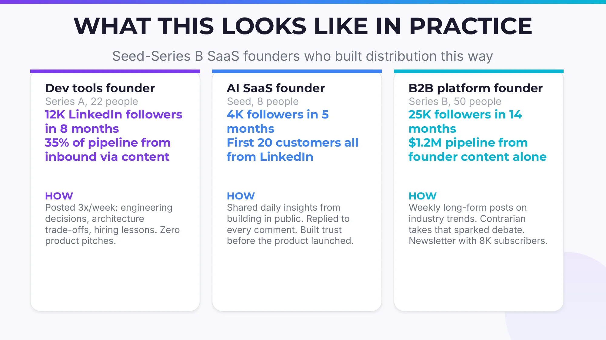

### Case 1: DevTool Founder

- **Stage:** Series A, 22-person team
- **Results:** 12,000 LinkedIn followers in 8 months; 35% of sales pipeline from content-driven inbound leads
- **Method:** 3 posts per week, all about engineering decisions, architecture trade-offs, and hiring lessons learned. Zero product pitching.

The key takeaway: **You don't need to "sell" the product.** When you consistently share valuable professional insights, customers come to you.

### Case 2: AI SaaS Founder

- **Stage:** Seed round, 8-person team
- **Results:** 4,000 followers in 5 months; first 20 customers all came from LinkedIn
- **Method:** Daily "build in public" insights, replied to every comment, built trust before the product even launched.

This case proves: **Even at the earliest stage, before you have a finished product, founder-led distribution can already start working.** You don't need to wait until the product is ready—in fact, the sooner you start, the better.

### Case 3: B2B Platform Founder

- **Stage:** Series B, 50-person team
- **Results:** 25,000 followers in 14 months; $1.2M in sales pipeline generated from founder content alone
- **Method:** Weekly long-form industry trend analysis, contrarian takes to spark discussion, plus an email newsletter with 8,000 subscribers.

$1.2 million, zero ad spend. That's the leverage of founder-led distribution.

---

## 10. The 30-Day Launch Plan: Start Taking Action Now

If the above has convinced you, here's a 30-day launch plan you can execute immediately.

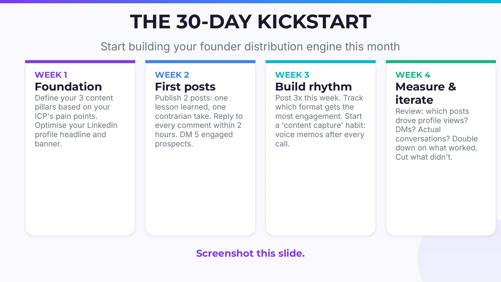

### Week 1: Lay the Foundation

- Based on your ICP's pain points, define 3 content pillars (e.g., industry trend analysis, startup lessons, technical architecture decisions)
- Optimize your LinkedIn profile—focus on the headline and banner. Don't write "CEO of X Company"; write "Helping [target customers] solve [core problem]"
- Research who your ICP follows on LinkedIn and what topics they're discussing

### Week 2: Publish Your First Posts

- Publish 2 posts: one about a lesson learned from failure, one with a contrarian take on a mainstream industry opinion
- Reply to every comment within 2 hours—this is critical for both the algorithm and relationship building
- Proactively DM 5 prospects who engaged with your content to start real conversations

### Week 3: Build the Rhythm

- Publish 3 posts this week, gradually increasing frequency
- Track which formats (text-only, images, carousels) get the most engagement
- Start building a "content capture" habit: after every call or meeting, use a voice memo to record one idea

### Week 4: Review and Iterate

- Review the data: which posts drove the most profile visits? Which led to DMs? Which generated real business conversations?
- Double down on what works, cut what doesn't
- Plan your content calendar for the next month

---

## Conclusion: Your Product Is Your Product, Your Distribution Is You

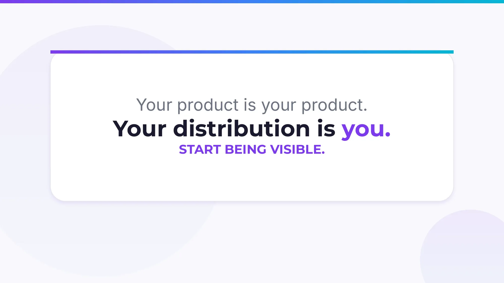

In the SaaS industry, we spend too much time discussing product features, technical architecture, and fundraising strategies, while overlooking a fundamental question: **When your product is ready, will anyone be waiting to use it?**

Founder-led distribution isn't optional—it's one of the most efficient and sustainable growth strategies in today's attention-scarce, trust-scarce market.

It doesn't require you to become an influencer, spend hours on social media every day, or pay a single dollar in ad spend. It only requires one thing: **systematically sharing the real experience and insights you already possess.**

As Daniel Johnson puts it: the question isn't whether you should start—it's how many potential deals you're leaving on the table every day that you don't.

**Start being seen.**

---

*This article is adapted from a presentation by Daniel Johnson (Founder, We Scale Startups). For further discussion, connect on LinkedIn: linkedin.com/in/danieljohnsonxyz*
