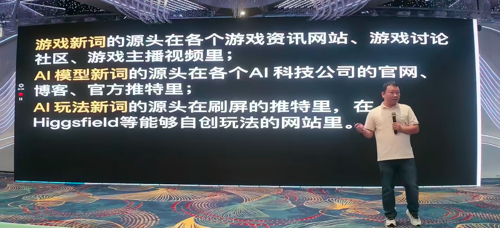
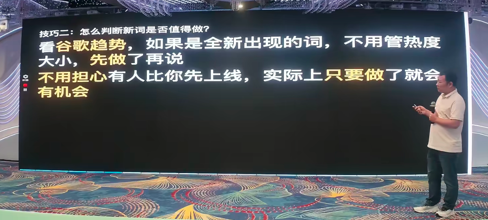
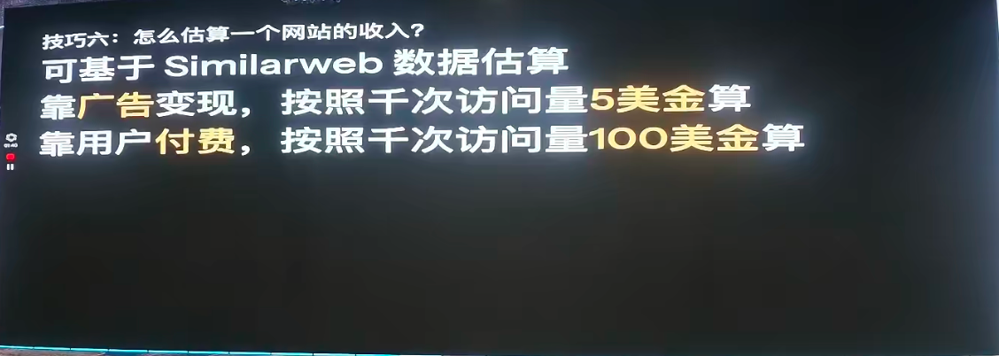
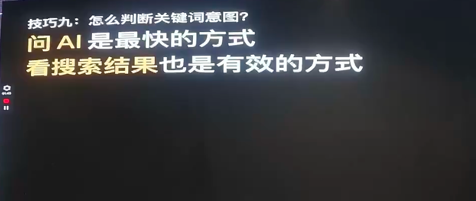
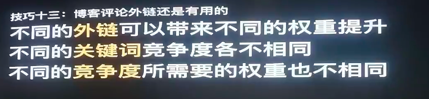
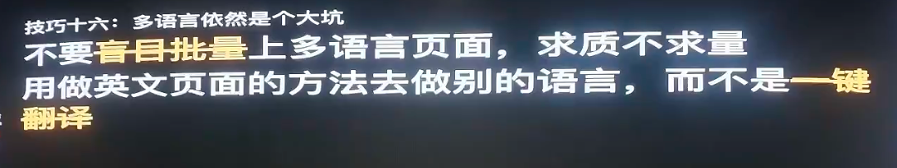
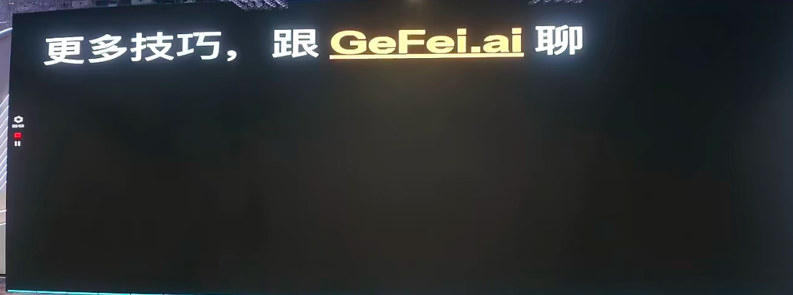

# 19 Practical SEO Lessons from Gefei

> At "**Gefei’s Friends, Mid-Year Sharing Meeting Shenzhen Station**", the founder of the Gefei’s community**, as the last guest of the day, brought together an axle of the theme "**SEO ' s Guide to the Landing of Fields of War Techniques**".
> >
> No theory, no chicken soup, straight-through skills -- from finding emerging keyword, how to judge value is not worth it, how to see the competition earn money, how to go to the page SEO, how to send backlinks, how to use user behavioral data, how to price them, **19 direct replicating techniques**, every one of which comes from the actual proofs of Gefei himself and his friends.

---

## I. Looking for emerging keyword: emerging keyword is a new opportunity, the key is to find the source.

### Skills 1: Different types of emerging keyword with different sources

And I started by saying that everyone knew that finding emerging keyword -- emerging keyword is a new opportunity to make money. But **Google trend is not the first scene of emerging keyword.**One word must have been set on fire somewhere else, discussed first, led to interest, Google searches, Google trends starting to heat up. When you get it in Google, it may be a day, a day, a day, a day, a day, a day.

How do we find more source information?**Different types of words, different sources.**

| Emerging keyword type | Where's the source? | How? |
| --- | --- | --- |
| **Emerging keyword** | Game information website, game discussion community, game anchor video | Use the game that used to burn back, find out which anchors/web sites are recommended earlier, and watch them. |
| **AI Model emerging keyword** | AI Science and Technology Network, Blog, Official Twitter, YouTube channel | Focus on the official accounts of Models. They're sometimes pre-advertised. |
| **AI playing keyword** | Screenshots of Twitter, Higgsfield and others that can create their own games | Look at the tweets of bloggers like Boyu and see how they share the latest game. |

**Core approach: push the source with "known answers."**We know what happened in the last year or two -- take this answer, search the entire web, see which hosts, which websites were recommended earlier, and look at them. That's how you get dozens of pairs or even hundreds of eyes.**Helping you find emerging Keyword.**

**Procedure keyword research:**Gefei also mentioned that he wrote an article in the community on how to use Twitter API to pick on time - filtering tweets with links that have been praised for more than a certain number of the last six months, and calling on the traffic interface of the website and the date of registration of domain names,**to run automatically every other hour,**to find a popular, brand new, trafficable web page.

> What if Similarweb API can only check the flow last month? Gefei's proposal is to have AI make you a browser plugin, send domain names to the front of the plugin from the back, automatically open Similarweb to see the traffic over the last 28 days.**All thresholds actually have solutions.**

### Skills 2: brushing the media and maintaining your sensitivity - you should be launch a spot while someone else is painting.

Gefei gave a live example: yesterday, there was a web fire — someone opened a GitHub warehouse to provide a multi-dimensional way to detect whether current visitors are Chinese, and then someone packed a play**called "F***Cloud" on that basis, adding fun velocities and cartoon images, which were distributed all over the Internet.

> **You see a warehouse that's useful, it's not very powerful to spread it, but you wrap it up into an interesting game, and everyone on the Internet will spread it for you.**

The central point of Cobble is: **When someone else does the screen, you know the opportunity.**You should study the heat, go to the site, not follow the others and forward it.**

---

## II. JUDICIALS: EMEGING Keyword and established Keyword separate

### Tactic 3: A brand-new word -- no matter how hot it is, do it first.

If you see an all-emerging **Keyword**in Google trend, whether it appears for two months, two weeks or yesterday **directly, not on his mind.**

- It doesn't matter if anyone else is already on the stand.
- It doesn't matter whether the domain names are registered – you always find the domain names that you can register.
- For two months or three, there are opportunities -- because many people just register domain names or go to the web page, but SEO is not good, backlinks are not enough, and experience is poor.

> **Don't worry about someone getting on the line before you do. **

### Skills 4: established keyword -- see if anyone earns money from this word

For stablished keyword, the key is to verify whether the market/demand**has been certified **to earn money:

- **See if the top-ranked website has been liquidated**— what to pay for and what to sell for the package;
- **See if anyone's long-term ad for the keyword**– If someone keeps paying for a word, the probability is that they'll get money from it. Even if they don't cash through the website, there must be a more backward realization logic.

> "Or else it's impossible to just throw money, huh?"

---

## III. Looking at the competition: from pricing page to revenue estimate

### Skills 5: How do we figure the site will be turned off?

Three dimensions of judgement:

| Deciding dimensions | Specific methodology |
| --- | --- |
| **Functional limitations** | See if there's a limit to the functionality. Pay for advanced functionality. |
| **Receiving channel** | See which payments are connected (Stripe, Paddle, etc.) and the traffic that is imported to the collection page from Similarweb. |
| **Advertising Union** | See if you can access advertising codes like Adsense -- some stations don't cash on members, others on advertising. |

### -Technology 6: Look at the pricing page = look at the core selling point

In particular, Gefei stressed:**Every fee-paying website, every top-ranked website, every website in the advertising process — other pages can be ignored and pricing pages must be viewed.**

- Look at it. The ABC three packages give each one of their rights.
- **The function of the advanced package is the core selling point where users are willing to spend more and buy it;**
- Take out the two core sales points and make a single website only this point and do better than it — **This method is feasible **and has been logged and tested by Coffi himself and a few other friends.

### Skills 7: Calculating web income - a very simple formula

Ko Fei gave an estimate of "specially simple and violent":

| Disbursement Mode | Estimation formula | Annotations |
| --- | --- | --- |
| **Advertising liquidation** | Similarweb monthly visits 1000 x $5 | About $5 per 1,000 visits |
| **User fees** | Similarweb monthly visits 1000 x $100 | Average contribution per visit US$ 0.1 |

> He has validated both the websites of his friends and those of his own,**and the actual income is often higher than estimated **— because there are uncollectible income such as long-term subscriptions.

---

## IV. COMPETITION: KEYWORD?

### Skills 8: Determine the level of the keyword competition

Taken together, four indicators:

1. Percentage of the top ten searches**of the front page of vs inner pages**;
2. **Ratio of large flow stations**;
3. The number of web sites ranked on the first page**backlinks**;
4. **Initle page**.

> Gefei recommended its own tool, `seo.web.cafe/kd/ ', which has been combined to help you estimate automatically — 500 times a day for friends and 100 times a day for non-group friends.

---

## V. Making pages: On-Page SEO core principles

### Skill 9: Users want whatever you want.

First principle for making pages:**Understand the intent of the user to search, and give whatever the user wants.**

- function, function; video, video; game, game; information, information;
- **Can't ignore the need for a headline for a landing page**;
- The page contains not fewer text files, but must be written around the theme of the keyword.

### Skills 10: The fastest way to judge Keyword's intent - Ask AI

He shares two things he does most often every day:

1. Seeing a strange website, opening it up, Claude asked it: **What's this site for?**
2. After that, I asked: **On what basis is the site realized? What are the main sources of traffic?**

> "By and large, after these questions, you've got an idea of a website. And you can do it in parallel -- you can ask a number of N websites."

He even suggested that a browser plugin could be made, that each site would be asked these questions automatically and that the analysis would be displayed directly on the right panel.

### Skill 11: Keyword development -- not to build up, to focus.

A lot of people ask, "Why do you watch density when Google says don't build up Keyword?"

Coffi explained that**density is intended to indirectly ensure that your page content is focused on the core keyword**to prevent AI editing issues from becoming irrelevant or dissipating.

- **Core principles: one page, one keyword group**;
- Just write the entire page around the keyword, and the density will naturally reach the target.

### Skills 12: On-Page SEO Key Indicators

Whether it's a web page or an analysis of the competition:

| Indicators | Request |
| --- | --- |
| **Title / Description / Heatings** | You have to cover Keyword, Keyword, the closer you go in the sentence, the better. |
| **Number of page words** | 1200 ~ 1800 or so |
| **Next word for density ranking** | It has to be the core, Keyword. |
| **Heatings** | Mainly H1 and H2 |

### Skills 13: Remove meaningless repetitions with CSS Content

A practical little trick: 50 "copy" files appear if there are 50 tipcards on the page, each with a "copy" button -- this is not related to the core theme of the current page, and it dilutes the keyword understanding.

**Solution: **Show the words "Copy" with CSS 's 'content ' attribute instead of in HTML. So Google reptiles will not include these meaningless repeat words in the text analysis.

---

## VI. Backlinks: comments backlinks are still useful but smart

### Skills 14: Blog reviews are still useful

Gefei admitted that the comment was "it's true that he's making garbage on the Internet", but he wrote articles in the community that argued --**it worked.**

The logic is simple: different backlinks bring different upgrades to the system, different keywords compete differently, and different needs to the system. Commenting backlinks may not be useful in terms of competitive terms; but they are still valid in the fields of emerging keyword, playstations, etc.

**Step-up techniques — looking for the least commented page:**

- The more people send out the same article, the lower each of the returns gets;
- To get a list of the articles from the entire blog and find out **the lowest number of articles commented **to send;
- Further: looking for the most connected pages of the web site**(especially those that contain links to the first page) is the most valuable page of the entire site, where backlinks work best.

> "You don't have to just listen to it. When everyone does it, you should think about it one more time."

### Skills 15: Backlinks look at both quality and quantity - priority when budget is low

The experience of Gefei is different from the dominant expression of "must be demanding":

- Not to buy except for the lowest-end garbage.
- The rest**is self-generated, whether it be navigation, commentary or elsewhere, and will be effective as long as it is sent**;
- **When the budget is limited, priority is given to raising the number of backlinks rather than the quality.**

> **Example: **US$ 2000 budget, A is 4 files x $500, and B is 60 days x US$ 30 per day backlinks.**B-60 backlinks domain names must be greater than 4.**

---

## VII. STRATEGIES: CORRECTIONS, LANGUAGES, BUSINESS STATISTICS, FREEDOMS AND INSTITUTIONS

### Skills 16: Scripting is still a useful method.

**It's a front-line website, every operation, every detail worth studying:**

- Keyword Policy
- UI Interactivity and Functional Achievement
- Thinking of content development on the web site
- Pricing policy
- Backlinks Policy
- Advertising (what words are cast, which countries, what pages are written)
- Social media operations

> **Please note, however, that it is a copy of thought, thought, not a lazy copy.**Repeating Google pages is not a good idea.

### Skills 17: Multilingual remains a big pit -- don't translate blindly

I'm not sure if I'm going to be able to do this.

| Phase | Approach | Problem |
| --- | --- | --- |
| **Primary** | One web page + JS Translation Plugin, same web site in different languages | The reptiles can only climb to one language, SEO. |
| **Intermediate** | One page per language, with subdirectories or subdomain names | One-key translation leads to unlocalization of content |
| **Advanced** | Independent station per language/state (non-English language) | It's more expensive, but it's the best. |

> Ko Fei revealed that he began to hear the good news from his friends in 2025 -**the English-language Keyword, dedicated to Korean, Japanese-language stations, and received traffic**. He hid this information for six months, and decided in June 2026 to invite Ping to share it with the community.

**Core principles: use of English pages to do other languages - separate research on keyword, individual writing, local UI style - rather than one-key translation.**

### Skills 18: User behavioral data is a winning method for the weak and the strong.

According to Gefei, some websites have few backlinks, but they are ahead of many backlinks --**because user behavioral data are better.**

Three core indicators:

| Indicators | Objective |
| --- | --- |
| **boomce rue ** | The lower the better. |
| **Average length of stay** | The longer, the better. |
| **Number of page views per person** | The more, the better. |

**Technology to increase the number of page views per person:**

- The image generated by the generator shows only small maps and jumps to the new page when the large one is taken;
- Specialized in a `Generating Results' page to display all historical results in the form of a list (a small chart list);
- When clicking on a chart, the URL changes (using `pushstate ' ) and pops up the large chart layer;
- Turning off the layers, you see all the historical photo lists — better experience, access to pages.

**Core assumption of Gefei: **Each keyword has a "better user behavioral data threshold" -- for example, 1,000 good behavioral data to get to the front page. Only the natural flow from SEO accumulates too slowly, but **it can accelerate through free dissemination, advertising, etc. **

> And that explains why "advertisement brings up natural flows" -- not Google favors the advertiser, but precision users produce excellent behavioral data on your website, helping you to cross that threshold faster.

### Skills 19: Free is a good strategy, plus the price increases are the fastest way to make money.

**The two values of free:**
1. (b) Spreading out;
2. Accumulation of user behavioral data from which Google will judge whether your web page better meets user needs.

"The best way to make money is to raise the price." After the price rise:

- The original subscriptions are not lost on a large scale - very few are downgraded and most continue to use them;
- **Rational pricing increases the unit price without lowering the payration rate**.

> I've also overpaid several websites, "It really works."

---

## VIII. CONCLUSION: MORE TECHNOLOGY TO TALK TO GEFEI.ai

At the end of the sharing, Ko Fei recommended the community's exclusive AI assistant **Gefei.ai**— which trained the community in all the community's conversations over the past few years, in the public course articles, in the community course articles, and in all the "Fly Classrooms" that were used in the group conversations.

> He also specifically mentions that API costs are borne by him personally, that members of the community are free of charge, and that they will not be charged in the future.

19 The technique seems simple, but each one was validated by Gofie and his friends in the field. As he said at the beginning,**everyone learned the same information, but the experience that they understood, practiced and learned varied - not to be better than the strongest today than yesterday.**

---

> This paper is based on the sharing of SEO skills in combat, a guide to the landing of Shanghai, which is based on the sharing of ideas in the field and is intended for cross-reference exchanges between Gefei’s Friends and Global Expansion colleagues, and does not represent platform positions.
