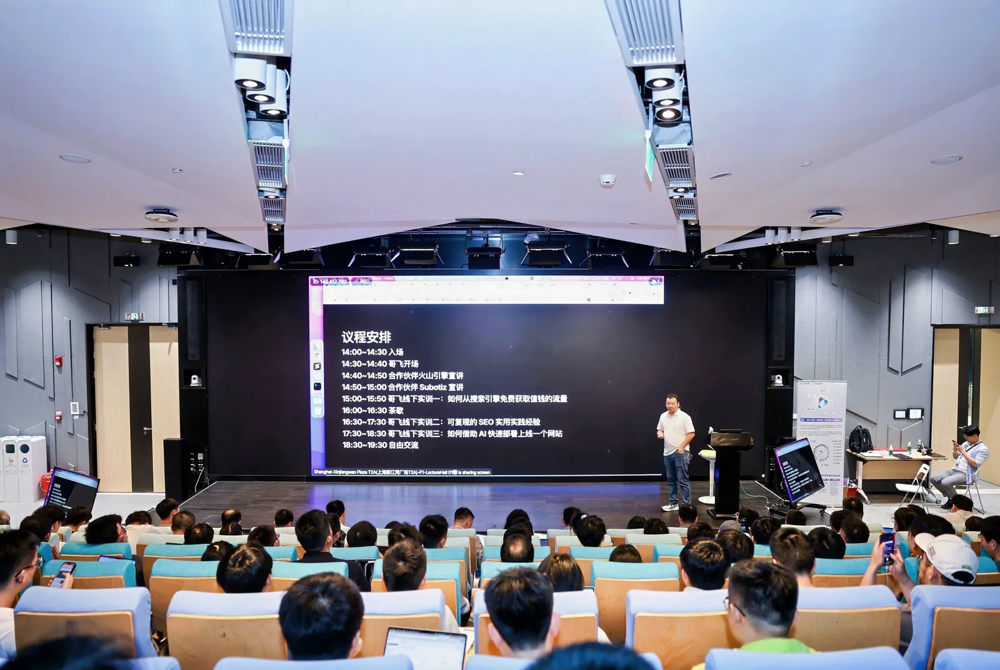

# I Attended Gefei's Mid-Year Offline Meetup: An Actionable SEO & Going-Global Notebook

Last Sunday I attended the "Gefei's Friends · Mid-Year Sharing Meetup" in Shanghai.

This community holds two offline events a year — one mid-year and one at year-end. In past years the mid-year run toured several cities: Beijing, Shanghai, Hangzhou, Chengdu, Shenzhen. This year it kicked off in Shanghai. Unlike previous years, Gefei completely changed the format this time — instead of inviting seven or eight community members to take turns on stage, he sat down alone with his laptop and walked everyone through the entire hands-on workflow: **picking keywords, reading data, mining demand, and building a site with AI**. The theme was literally an "Introductory Offline Bootcamp." When registering, he even noted that anyone already making over $10k/month could skip it, because everything covered was what beginners need most.

He was on the fence about whether to sell tickets to outsiders, but internal demand alone wasn't enough to go around, so in the end only a handful of people brought friends or family. The room felt familiar, so we skipped the self-introductions.

Below are the takeaways I organized from the day, in four parts: **the two sponsors' talks**, **Lesson 1 (how to get valuable free traffic from search engines)**, **Lesson 2 (hands-on SEO details)**, and **Lesson 3 (building and deploying a site fast with AI)**.

---

## 1. What the Two Sponsors Talked About

There were two partners this time: **Volcano Engine** and **Subotiz (a merchant payment platform)**.

### Volcano Engine: This Year, the Going-Global Track Is Under Heavy Pressure

The Volcano Engine business rep first recapped the several waves of shock the going-global scene went through in the first half of this year. It came across as pretty real:

- **January**: Several App-building clients had their apps pulled from the Apple App Store, and daily spend dropped by 50–60%. It turned out Apple and Android were cracking down on gray-area / borderline content and anything involving WeChat, so the only option was to scramble on compliance fixes and re-submit.
- **Around the same time, web sites were hit too**: several large sites lost 40% of traffic in a day. Investigation showed it was caused by payment channels being shut down for sites carrying borderline data.
- **The last two weeks**: many going-global clients have seen big swings. The rumor is that Google adjusted the display logic of its recommendation algorithm again in the first half of the year, leaning more toward pushing its own AI products and tightening recommendations for external AI-related keywords.

He also called out one phenomenon: there's a text-aggregation platform (the "you-" family) burning money on ads — **up to $2 million a day** — making life very hard for a lot of AI-site operators, with customer acquisition costs now 3–5x what they were a year ago. When he crawled the rankings last year, he could still see plenty of well-funded, well-built tool sites; today the leaderboards are almost entirely big companies (the likes of 360 and ByteDance). **The overall conclusion: this track is getting more crowded this year, and traffic is getting more expensive.** Even so, plenty of people around him are still hitting $1k/day or more by landing good keywords and riding the AI-tool dividend.

> On models, his take was interesting: everyone used to assume inference costs and model costs would keep falling, but this year saw a reversal — stronger models did not bring cheaper costs (because of a global compute shortage, models are actually getting more expensive to buy). Volcano's approach is to not only chase the strongest models but also work on optimizing cost, which is why the Doubao series has a relative edge on price-performance versus competitors.

**A few model updates** (he stressed some details aren't convenient to discuss in public — DM him if interested):

- Next week (the Beijing mid-year Force conference) the entire Doubao model family will get updated, from text to image to video.
- The **image model** gets a major version update next week.
- The **video model** will ship in two versions: a cheaper 2.1 (at least 60% cheaper than the current 2.0), and a higher-end 2.0 Pro supporting 4K and 30 seconds, aimed at premium film/video production.
- The **text model** 2.0's current version is still a bit short, but it's in the global top tier on intent understanding, and it's cheaper than comparable competitor models — worth exploring use cases for cost reduction.
- **Voice** (Yunque, ASR/TTS, character voice synthesis, podcast models) is a direction where Doubao is fairly distinctive and world-leading.
- The **music model** was originally planned to launch starting next Monday, but due to copyright issues it's been pushed back — expected to ship within June once licensing is sorted. Closed-beta feedback says it's roughly on par with Suno.

Two more "save-money" points were very practical:

1. **Offline batch processing (Batch)**: if you have large-volume audio/video/image generation or processing needs that don't require real time, you can run them as offline jobs. There are usually 7–8 hours of idle resources from evening into the night, and offline processing gets another 50% off the base model price; if it hits the cache it can go to 30–40% off. Batch it all together and **total cost can come down to 20–30% of list price**.
2. **Action Plan**: in the coding-tools direction (going up against Cursor and Claude Code), they've launched an Action Plan that will integrate more models over time; for cases where calling the official API is unstable, they'll provide a more stable version that's less likely to be intercepted.

### Subotiz: A Payment and Growth Platform for Subscription Going-Global Merchants

Subotiz is a **subscription payment + growth platform** focused on AI tools going global. It optimizes payment gateways and compliance/risk control for sites, targeting the pain points of going-global merchants: "low paid conversion, hard compliance, hard operations."

The two industry pain points they raised really hit home for anyone building sites:

- **Low willingness to pay**: traditional cross-border payment flows are cumbersome and opaque, lacking subscription/credit mechanisms suited to overseas users.
- **Low payment success rate**: traditional redirect-based payment is prone to failure from network and risk-control issues, causing drop-off.

Among their solutions, the most worth noting:

- **Site-wide embedded, no-redirect payment**: users complete payment without leaving the brand page, lifting the industry-average ~20% success rate to over 65% (their overall order success rate stays around 90%).
- **A one-time-authorization, reusable subscription agreement** + small-amount trials + first-order discounts, lowering the decision threshold.
- **One-stop backend**: multi-currency, tiered pricing, flexible promotions, multi-language, automatic invoicing, automated subscription-entitlement management — no engineering required.
- **Compliance & risk control**: aligned with PCI-DSS, GDPR and similar frameworks, automatically blocking card fraud, fake orders, and malicious chargebacks.
- **Low-code integration**: quick SDK integration, live in as little as three days; friendly even to indie developers without strong technical chops.
- **No overseas entity required**: a domestic entity can quickly hook into overseas payments.

Platform stats: over 60 million cumulative transactions, more than $5 billion in volume; support for 135+ currencies and 160+ local languages. Signing up during the event came with exclusive perks (fees fully waived up to a certain transaction amount).

**One attendee's candid review on the spot was more convincing than the official pitch.** His two reasons for choosing Subotiz were:

1. It has Stripe and PayPal built in, so **integrating one is like integrating both at once**;
2. It's hard for small merchants to go directly to Stripe themselves — accounts get banned all the time; whereas Subotiz opens the account under their name and you can actually talk to someone. Last December he had an account that got its traffic temporarily diverted because "the model hadn't been reviewed," and the Subotiz team kept appealing for him — two months later the appeal succeeded and the account was restored. **When something goes wrong, there's someone who can actually help you fix it** — that was the deciding factor that kept him.

---

## 2. Lesson 1: How to Get "Valuable" Free Traffic from Search Engines

The key qualifiers in this lesson are "**free**" and "**valuable**." Some traffic you can get but it isn't valuable (it usually only comes from paid ads), whereas the search traffic you earn from good SEO is relatively long-term, stable, and worth a few dollars per visitor — and it's free.

This time Gefei put the AdSense backends and domain names of several of his old sites right up on screen — something you couldn't see before (community rules forbid asking each other for domains), so there was always a veil over it. **Because these sites don't get much traffic anymore (just a few hundred dollars a month), showing them off doesn't hurt his income.**

### How a Site That Looks Like "Junk" Still Makes Money

He first showed the AdSense backend, sorted from high to low by **revenue per thousand page impressions (RPM)**. RPM varies wildly across sites. Among them:

- There was a games site, built around a keyword a community member discovered last September. That person had put up a page but didn't know how to embed the game into the site (didn't even know how to use an iframe), so they asked Gefei how to do it. Gefei casually built one too — **the whole thing took less than two days, he barely maintained it, and to date it has earned about $130k+ cumulatively** (about $58k on the .io domain, about $78k on the .com). On the first night he even bought the wrong domain (a typo), then re-registered it the next day.

> **The business logic of ad monetization**: other game sites have to spend money buying traffic on Google Ads, and one type of ad slot is the "partner-site ad slot." Sites like ours that run AdSense have our ad slots put up for sale on Ads. Google's smart ad model finds suitable placements for advertisers (e.g. games sites), and so the ads end up displaying on our sites. **The revenue split: the site owner takes 51%, Google takes 49%.** That's one reason Google is willing to give these sites traffic — it gets to keep roughly half.

Another site was a **PDF-to-video tool** (turning boring PDFs into "brain rot"-style videos — "brain rot" was Oxford's 2024 Word of the Year). From the owner's perspective it's "ugly and junky," but it makes money. Its product flow: upload PDF → extract text → hand it to AI to generate the script → TTS to voice → pair it with a boring background video (like Minecraft footage) and merge into the output.

**He pointed out two ad formats**:

- The big display ad slot on the homepage (appears automatically once you run AdSense + turn on Auto ads);
- **Interstitial ads**: they pop up on page transitions or after a stretch of time on the page, are dismissible and relatively user-friendly, but **earn the most for the site owner**. He specifically reminded everyone: in the AdSense backend, be sure to turn interstitial ads on.

### Reading Traffic Data

He bought this PDF-to-video site from a community member for $20k (the member built it in late November and earned $20k in just over two weeks). After buying it, he built out pages for all the related keywords, and to date it has accumulated roughly **1.8M UV / 7.8M PV**.

He explained a few key metrics very clearly:

- **UV / PV**: UV is unique visitor — within the same session, one person counts as one UV; every page opened/refreshed adds 1 to PV.
- **Pages per visitor**: 7.8M PV ÷ 1.8M UV ≈ **3.29**, which is normal-to-good. If it's below 2–2.5, your page count or internal-linking design isn't reasonable enough; getting to 4 or 5 means higher revenue.
- **Bounce rate**: this site is around 46%, i.e. of every 100 people, 46 leave after viewing just one page. **Lower is better.**
- **Average session duration**: measures how long users stay. When a site is being hit with fake traffic (commonly from Singapore data-center IPs), the signature is — bounce rate near 100%, only the homepage viewed, extremely short stay (a few seconds) — you can spot it at a glance.

### AdSense Approval and Limits (Important)

- **In 2024 it was still easy to get approved; now it's basically one rejection per review.** Because anyone can use AI to write code and build a site, the AdSense review backlog is overwhelmed, so they can only pick the best of the best.
- Once you run AdSense code, Google actually knows the size and source of your traffic. **Traffic that mainly comes from search engines is a plus**; if it's traffic bought from other channels in a short burst (with the sole purpose of passing review), you'll be ranked lower.
- For a site with very little traffic that's obviously AI-generated, it won't reject you immediately — it'll **drag it out 4–8 weeks before rejecting** — the point being to reduce repeat submissions and ease the review-queue load. So when you submit a new site now, **no result within two weeks basically means it didn't pass**.
- What if it doesn't pass? If traffic is decent, you can delete that submission and submit again. A better approach is to **change the page**: don't make it obviously AI-generated, make the functionality more complete, make the copy richer, and don't make the whole page one big wall of text.
- **Too much traffic also causes problems**: Google "would rather kill by mistake" — it'll warn "your traffic may have issues" and **limit your ad serving**. Watch one metric — **coverage**: if it's below 60%, it means your ad serving has already been limited; when it explicitly says you're limited, coverage can drop below 10% and the traffic is just wasted.
- **New account vs. old account**: Gefei's is an account he's used for over a decade — high authority, so a short-term traffic spike won't get it blacklisted immediately; instead it goes into an observation period, and at month-end settlement they decide whether to deduct. Deducting 5–10% a month is within the normal range; deducting a lot means there's actually a problem with the traffic.

### Ad Monetization vs. User Payment: The Gap Can Be 10x

He did the math: that PDF-to-video site has about 1.8M UV, and ads + payments combined bring in revenue on the order of $53k, of which **user payments are only about 1/3 of the ad revenue** (because the free quota is too generous and the page is ugly).

Meanwhile another **subscription site** has only about 210k UV (less than 1/9 of the former's traffic), yet generated about 849 orders and **$57k** in revenue, averaging **$67 per order**. The two sites have similar revenue, but the subscription site used a tiny fraction of the traffic.

> **He's tested an even more extreme comparison**: on the same AI subscription site, running ads for half a month vs. turning ads off and doing subscriptions, **the revenue gap can reach 10x** — in the time AdSense earns $80 in ad fees, the subscription side can generate over half a year's worth of revenue (about 1:10). So he later decisively turned off the ads on the subscription site: because every paying user is converted from a visitor, and seeing a screen full of ads will very likely stop them from paying; **to raise paid conversion, you have to turn the ads off**.

**The monetization logic of this lesson in one sentence**: first find a keyword with search volume → understand the intent behind it → build a site that satisfies that need → launch and earn rankings and traffic → then decide whether to monetize via ads or subscriptions.

---

## 3. Pricing Design: The Secret to Lifting AOV from $20 to $67

This is the part I personally found **most valuable**. He asked the AI-site builders in the room what their typical average order value (AOV) was, and people answered **around $20** — he himself didn't know how to price the sites he built in 2024, basically just ten-or-twenty dollars. He has one site with $1M in cumulative payments, but its AOV is only $43, "pretty miserable." The core of the gap is simply **whether you know how to do pricing design**.

Here's how that $67-AOV subscription site was priced:

**Monthly subscription has two tiers**: $29.9 / $49.
**The annual plan has one key package**: about **$100/year**.

**The secret is right here 👇**

> The cheapest monthly subscription is $29.9 and only lasts one month; whereas $100 lasts a full year. **For roughly the same ~$100, one side gets you 3 months and the other gets you 12 months** — once users compare, they naturally choose annual. At the same time, **turn off** the cheapest $9.9 monthly subscription (early on, no one dared price high, so the lowest was $9.9, leading to a flood of low-priced orders), forcing anyone who wants to buy to at least buy the $100 annual plan. This lifts AOV across the board.

Anchoring is also used cleverly: a credits package of 800 credits vs. 2400 credits (3x), priced at ×3 to $100, makes the big package feel "worth it."

**Later iterations** (v1.5, getting more aggressive each time):

- The second version raised AOV to about $89, the third to about $100.
- **Low tiers don't get the premium model**: the entry/monthly tier only gets the base model, and only the annual plan gets the premium model, forcing users toward annual. This "segmented pricing" is a common play on many foreign sites — give an easy-to-accept entry tier to hook users, and treat the remaining tiers as anchors.
- **One-time purchases are used as anchors too**: he also exposes one-time purchases, but **only at high prices** — two tiers at $199 and $499. People who don't want to subscribe and just want to buy once will go for the $199; this in turn pushes the average AOV close to $100.

---

## 4. What an AI Tool Site "Should Look Like"

He also broke down the page structure, splitting it into two kinds of pages and two devices:

**Two kinds of pages, with completely different purposes:**

1. **Conversion page (landing page)**: for the traffic you buy via ads. The structure is very lean — visitors watch a video → generator → pricing → FAQ at the bottom → done. It doesn't need to be SEO-friendly; it's purely for conversion.
2. **SEO page (for organic traffic)**: a long, "wordy" page built around all the peripheral keywords users might search, with **one page per keyword**. For example, can you upload a TXT (text-to-...), can you paste a URL directly (URL-to-...), and so on — cover all the peripheral keywords, and each one captures a share of traffic.

**On desktop**: put four videos in one row on the homepage; if there's no room for the generator, make it a **floating form** fixed to the bottom of the page, with links to other pages on the left.

**A typical AI-tool homepage structure**: the first screen has the H1 + description + form (showing half or all of the form is fine) + a one-line disclaimer ("selling dog meat under a sheep's-head sign" — it actually promotes Google's models, because they work well, while calling itself an alternative).

**On mobile**: mimic the TikTok/Douyin effect, swiping one video at a time; make the bottom into a fake app navigation bar. Because shrinking the desktop page directly onto mobile looks bad and the page is too long, you have to adapt it separately. Tapping generate pops up a help desk — the goal in all of this is to get users to understand what the site does as fast as possible and guide them to the generator.

---

## 5. Lesson 2: Hands-On SEO Details

Lesson 2 mainly answered "how do you slowly lift rankings for big keywords" plus a bunch of on-the-spot Q&A.

### On-Page Changes + Anchor Text

- On-page: put the target keyword in the title and do the language tweaks — this step was covered earlier.
- **The single most important off-page thing is anchor text (what name others use to refer to you)**: when he was working "AI image maker," the backlink anchor text revolved around that keyword; later, when he wanted to go after a bigger keyword, the anchor text revolved around that one. Build up the anchor text, authority rises, and you can win rankings for bigger keywords.

> **Anchor text must be diversified — don't use exact match everywhere.** For example, if you pick a keyword and then send 100–200 or 300–400 backlinks **all with identical anchor text**, Google can tell at a glance you're manipulating rankings. The right approach is to spread it across the various ways of phrasing that keyword — pick three or four related phrasings and rotate through them.

- **Raise keyword density gradually**: add it in the title, in the H tags, and transition it into the body bit by bit — **don't make a big change all at once**, or that's also a manipulation signal.

### Don't Get Lazy and Reuse Content

Someone asked: I built a page for a certain game/model keyword on site A, and built the same one on site B; if the homepages link to each other, isn't the content duplicated?

Gefei's answer was clear: **different pages don't need to use the same content — differentiate it.** Whether it's multiple pages within one site or multiple sites covering related keywords, you can't "use one piece of content in multiple places."

> He pointed out a common misconception: "the purpose of building a page is to get traffic, not to get the page built." So you should approach it from the angle of "can this get traffic," not "let's get it live ASAP." **It's okay to go slower, it's okay to spend more time.**

---

## 6. Lesson 3: Building and Deploying a Site Fast with AI

The final lesson was true hands-on — Gefei opened Claude live and demonstrated "from a single keyword to a finished site."

### Picking Keywords + Picking Domains

- He used keywords like "AI xxx maker" as the example. The most direct play: **use your homepage to beat someone else's inner page** (a homepage usually has higher authority), so you register a dedicated domain and use the homepage to focus on this keyword — **punching above your weight**.
- Use Happymail (a domain lookup tool) to see whether each TLD is registered and whether it has traffic. **When checking a keyword, looking at the traffic of the domain that exactly matches the keyword gives you a rough read on how competitive this play is**: if the domain is registered but basically has no traffic, it's doable; if every TLD is registered and they all have traffic, then avoid it and switch keywords.
- **Don't agonize over the TLD**: for AI tool sites, .io works; if .io is gone, then .net, .io, .video (if you're doing video), and so on — people have gotten traffic on all sorts. **As long as you can register it, it's fine**, because this method isn't about building a brand — hyphen or no hyphen, whatever TLD, none of it matters. What to avoid is .xyz (easily treated as a spam site) and .cc (it can't be installed in JS/analytics tools, which avoid it).
- Domains are "endless": add a hyphen, add a prefix/suffix to the keyword — anything you can register works.

### Writing Pages with AI (Live Claude Demo)

A summary of his hands-on habits:

- **For the first version, don't let the AI write the copy — let it run free**; nail down the functionality first, then refine the copy. Sometimes when you don't lock things down, the AI surprises you.
- **Make the first version just one single HTML page**; don't ask it to build a full site with a user system/subscriptions right off the bat — too complex. When you're practiced, you can get a single page done in half an hour.
- **Change things bit by bit, pointing out one specific issue per round**, rather than having it redo the whole page. He specifically noted: Claude from a couple years ago (the 2024/2025 level) often edited the wrong spot and scrambled the code; ever since (a version he mentioned in the video) came out, it has evolved fast — now it generates code in a backend virtual machine while showing progress on the frontend, which is a much better experience.
- He commented on the H1: the AI initially didn't put the core keyword in the H1, so you have to remind it. **In the heading (H1), the leftmost position carries the most weight and it matters less toward the right, so the main keyword should go first.**

### On "Should Similar Keywords Get Separate Pages?"

Someone asked whether maker / generator / and similar near-synonym keywords should each get their own page. Gefei's advice:

> For the vast majority of people, **these three near-synonyms can share one page**. Because the intent of these keywords is nearly identical, the page topics would be highly similar; your site's authority isn't high and it's still new, so forcing multiple pages just looks like duplicate content and won't win rankings anyway. Unless your site has very high authority, there's no need to make a separate page for each synonym. But for keywords with clearly different intent like text-to-image vs. image-to-image, you can split them.

### Deployment: Cloudflare Workers / Pages

- For a plain single page with no framework, he demonstrated deploying it directly, **with no framework at all** — the upside is speed (very convenient when you don't need login/subscriptions), the downside is you generate from scratch every time.
- **If you need login, subscriptions, and similar features, you still need a base framework**: a framework wires up Google login, email, subscriptions, payment interfaces, and various APIs ahead of time, so you just add business code on top instead of building from scratch each time. (He mentioned **CNAuth / a certain SaaS auth framework** being good — cheaper than a certain competitor, worth a try.)
- He himself often deploys these sites on **Cloudflare Workers / Pages** for convenience. The capabilities involved are nothing more than: Google login authorization, calling AI model APIs, and calling traffic-data APIs like Google Search / Ahrefs.

### Judging Difficulty: Inner-Page-Heavy Top 10 vs. Strong Homepages

He also explained the algorithmic logic behind **judging keyword difficulty** in seo-os-style tools:

> Take the **top 10** search results and look at whether they're mostly "inner pages" or whether there are "strong homepages." If the top 10 have lots of inner pages from big sites plus dedicated strong homepages targeting this keyword, the overall difficulty is higher.

### Q&A Highlights

**Q: My new project targets a keyword it can't win, but it's getting impressions on a different keyword instead — is that normal?**
Normal. At first you might land the "no-space" version of the keyword (to Google, with-space and without-space are two different keywords). As your site's authority rises and it gets used by more people, you'll gradually be able to win higher-value keywords. This has a lot to do with domain age and how much the site is used.

**Q: Will outbound links from my site cause problems?**
It depends what the links are about. If it's an article listing 20–30 or 50 references, no problem — it actually supports the authority and credibility of your content; but if a single page has dozens of links pointing to other people's **homepages**, Google will most likely know you're swapping reciprocal links, and that's bad.

**Q: I have impressions but low click-through — what do I do?**
Usually it's that the ranking isn't high enough — the results above already satisfy the need well, and few people scroll further down. The only thing to do is keep polishing and push the ranking up.

**Q: When should you pay for backlinks, and when not?**
It depends on your expectations for the site: if you judge that it can convert traffic into orders and make money, then spend money and resources on backlinks; if you judge it's hard to convert into revenue, you probably shouldn't have picked that niche in the first place.

**Q: I've already picked a money-making niche and built the site — how do I judge whether it's worth continuing to pour in resources?**
**Test in small batches first**: buy a few backlinks first (a handful, a dozen), don't keep buying. With these backlinks, your GSC data will shift; if you can see ranking changes, it means these keywords are "winnable" and you can keep going. Give it 2–4 weeks; if by 4–6 weeks GSC/GA is still dead water with no clicks or impressions picking up, and you've already invested enough in backlinks, there's no need to continue — it could be that the keyword is too competitive, the page isn't good enough, or there are keyword density/quality issues. Look for problems on your own side first (also check whether the domain was previously "burned" by someone — that's possible).

**Q: What happens if you buy backlinks too fast? (A lesson he paid for)**
Gefei described his own experiment: he wanted to test whether "backlinks would get nullified," so he bought 10–15 a day, 336 in a month at about $30 each — **$10k spent on an experiment** — and the site just wouldn't take off, no different from his other well-performing sites, very strange, and the domain itself was fine. He suspects **Google judged the backlinks were growing too fast**.

> Normal pace: statistically, buying 2, 3, or 5 a day is all fine, but 10 a day, hundreds a month, makes it easy for Google to catch you red-handed and identify that you've been "buying continuously." There were also community members who hammered backlinks hard in the first two months — they spiked early, then crashed straight back down. **The core is: don't let Google detect manipulation.**

**Q: How do you manage junk backlinks? How do you find postable backlink sources?**
- The method is **to probe by posting first**: if it's blocked immediately, tag it "can't post"; if it posts but needs review, tag it "needs review"; if it passes review, tag it "needs review, passable." Accumulate this way, and your library of "directly postable" and "postable after review" sources keeps growing.
- When posting backlinks, **the name (anchor text / username) can vary** — it doesn't all have to be the same brand name.
- **Copy competitors' backlink homework**: use Ahrefs (he mainly uses Ahrefs — SEMrush can't show failure flags and isn't as good as Ahrefs) to pull a competitor's backlinks, filter by "Best links" first, then look at the "Do-follow" ones; the rest are probably ordinary or junk links. Export the competitor's indexed links and go through them one by one: some are columns/reviews written by others (possibly hero-post-style deals you can't do yourself), some are directory sites (many directories are no good anymore), some you can submit yourself, and some you can buy on Fiverr.
- **When buying on Fiverr, pick the ones that are indexed by competitors and are do-follow**, and pick slightly cheaper ones (what the big players buy tends to be pricey; you find the cheaper ones, the $200–300 kind). Filter round after round like this, and your pool of usable backlink sources keeps growing.

---

## Final Thoughts

My biggest takeaway from the whole day: **the going-global SEO track really is more crowded this year, and traffic is more expensive**, but the underlying method — "find keywords → understand intent → build pages that satisfy the need → get traffic → monetize the right way" — still holds. And what really opens up the revenue gap is usually not technology, but these two things: **pricing design**, and **not treating the page as the goal but treating traffic as the goal**.

For people just starting out, this "open the backend, reveal the domains, do it live" session really did lift the veil that used to be there.

---

*(This is my personal write-up of conference notes; some model versions, prices, and other details are subject to the latest official statements. Please assess the risks of any compliance and traffic-buying practices mentioned at your own discretion.)*
