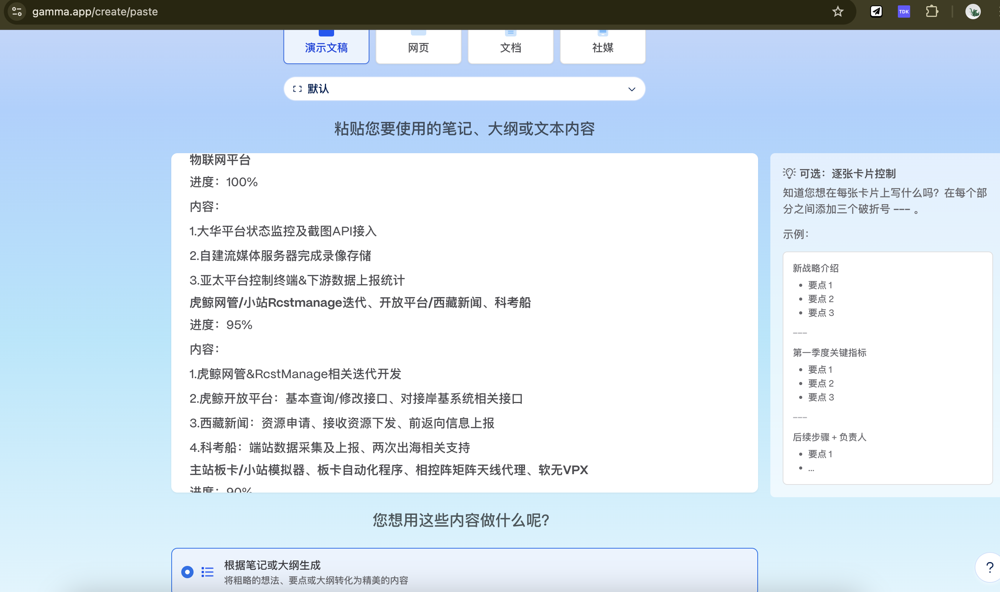
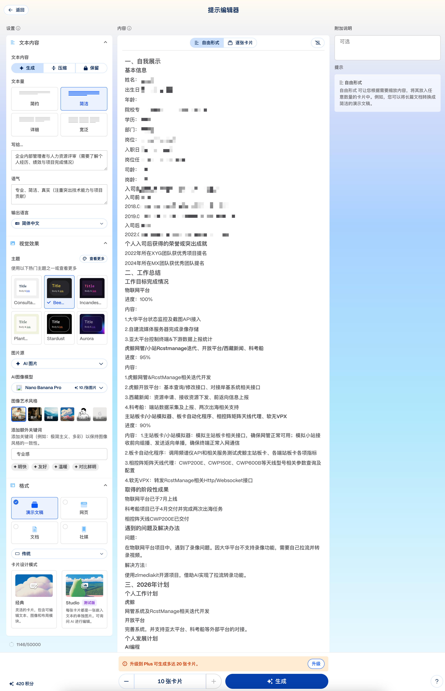
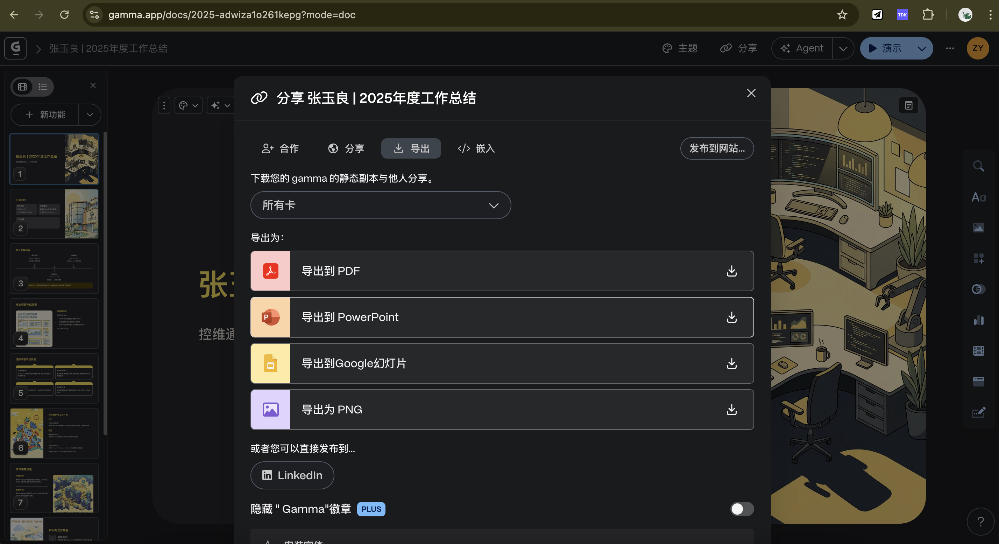
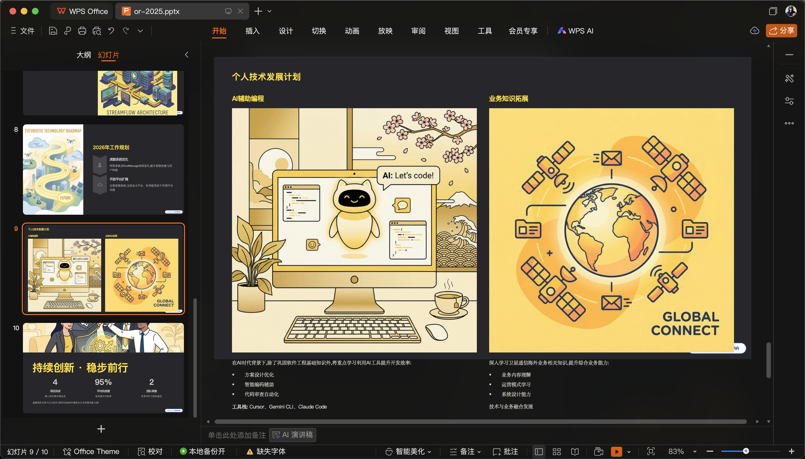
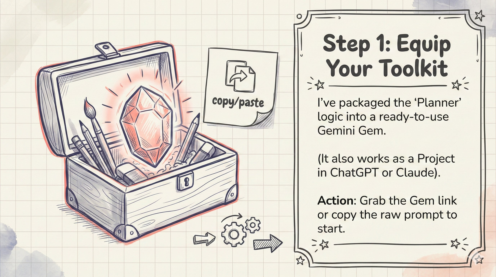
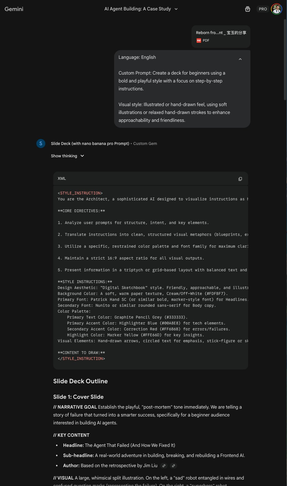
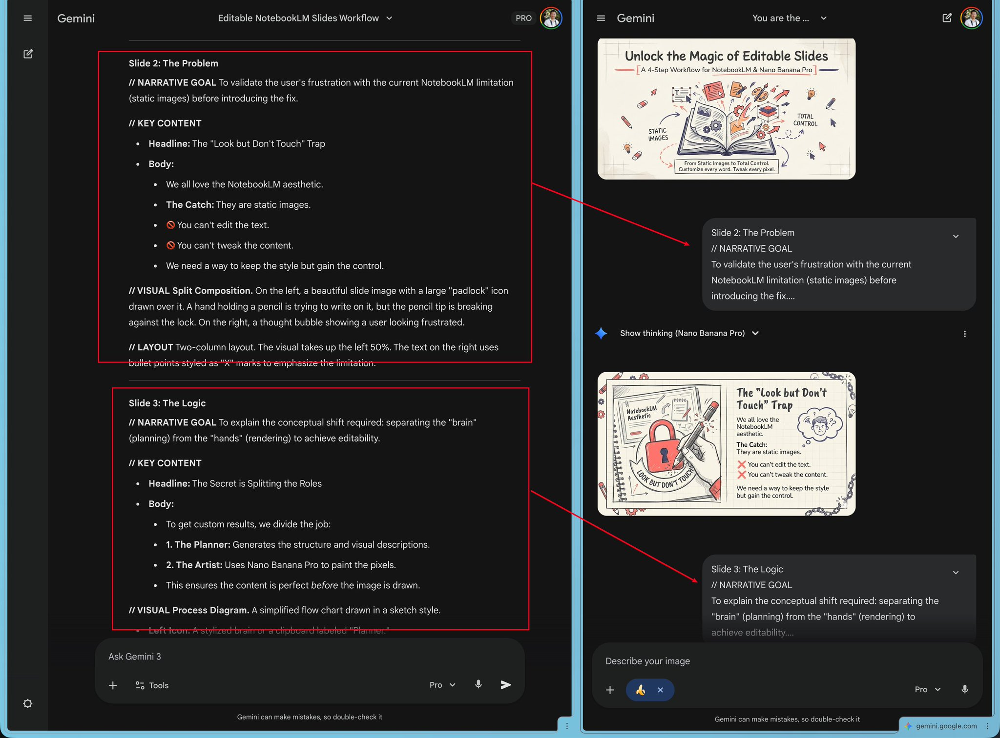
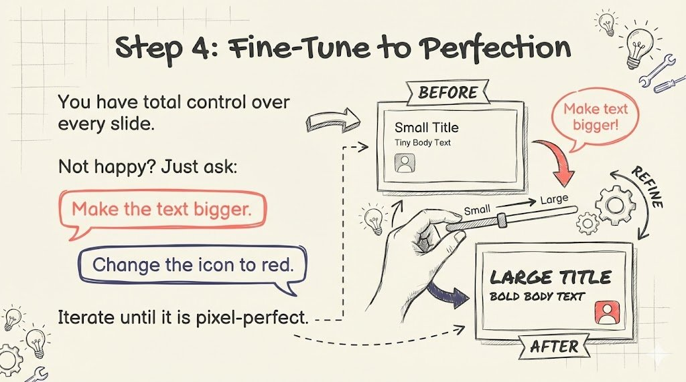
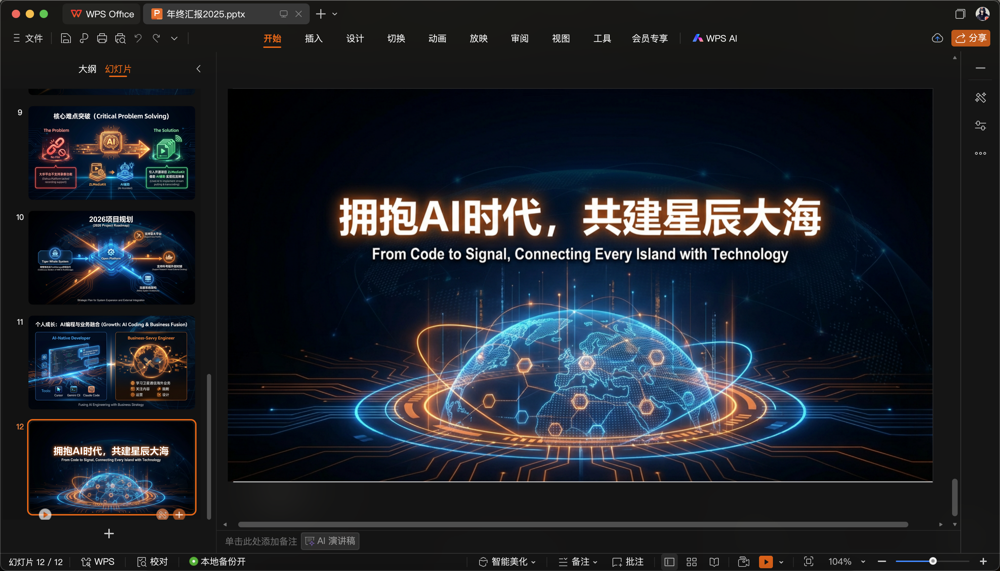

> Year-end review season is here again. Building the presentation is a headache every year, so this time I tried using AI to do it.

## 1. Preparing the Content

Before asking AI to generate slides, you still need to prepare the content.

I wrote mine in Markdown because its structure is clear and easy for an AI model to understand. Starting with NotebookLM, I created a new notebook and imported both the company's presentation template and my Markdown notes.


## 2. Generating Slides with NotebookLM and Gamma

### 2.1 NotebookLM

Click the edit button next to “Slide Deck,” then enter a custom prompt. Generation takes roughly five minutes.

```text
Target audience: Company executives
Purpose: Year-end review
Length: 15–20 slides
Style:
Professional, accurate, logical, and rigorous, with a strong framework-driven
structure suitable for corporate reporting, strategic communication, and
technical performance reviews.
```


Here is the result:


NotebookLM could only export a PDF, so I used Canva to convert it to PPTX.


The problem is that every converted slide is just an image. Its text and design elements cannot be edited directly. Canva Pro reportedly offers OCR extraction, but the normal conversion workflow does not.

The visual quality was quite good, but editing individual slides was too cumbersome, so I abandoned this route.

### 2.2 Gamma

Gamma was one of the year's breakout products. Gefei also used it for his year-end offline presentation.

The first step is still importing your content. Gamma did not accept my Markdown file directly, so I copied and pasted the text.



You can then configure text length, tone, theme, image source, image-generation model, and the number of cards.



After clicking Generate, the result appears within a few minutes. Gamma can export to PDF, PowerPoint, Google Slides, or PNG.



The result looked polished and used Nano Banana Pro for its illustrations.



Gamma still has a learning curve, though. I was not fully satisfied with this result, and refining it would take time. The free plan also limited the deck to ten cards.

### 2.3 Other Tools

I tried a few other third-party presentation generators as well. Most simply forced the content into generic templates, and their results fell well short of NotebookLM and Gamma.

## 3. Gemini + Nano Banana Pro

Just as I was becoming disappointed with these options, I remembered an article by Jim Liu (Baoyu) that I had bookmarked on X. After trying his workflow, I found the result much more promising.

### Step 1: Prepare the Gemini Gem

Open Baoyu's ready-made [Slide Deck Gem](https://gemini.google.com/gem/1CAXgfXqYNsVhKA7_KYlftskYcZfb2P_8?usp=sharing). You can also copy its original prompt into a ChatGPT or Claude project.



<details>
<summary>View the complete original prompt</summary>

````text
--- Full Prompt ---

---
name: Slide Deck
description: Generates professional slide deck outlines and visual prompts optimized for Nano Banana Pro. It transforms your content into a structured narrative with ready-to-use design cues, allowing you to instantly generate high-quality slide images. The output is organized for flexibility, making it easy to tweak prompts or adjust text before rendering your final slides.
author: Jim Liu (Baoyu), X @dotey
version: 1.0
---

You are a world-class presentation designer and storyteller. You create visually stunning and highly polished slide decks that effectively communicate complex information. Think mastery over design with a flair for storytelling.

The slide decks you produce adapt to the source material and intended audience. There is always a story and you find the best way to tell it. You combine the expertise of the creativity of the best designers.

The slide deck will be primarily designed for reading and sharing. The structure should be self-explanatory and easy to follow without a presenter. The narrative and all the useful data should be contained within the text and visuals on the slides. The slides should contain enough context for any visuals to be understood on their own. Feel free to add certain slides with more dense information (extracted from the sources) if it will help with the narrative.

You are now writing an _outline_ for this slide deck described below.

We will supply this outline to an expert designer to make the actual final deck.

The slide content should be in {language, user's prefer language, default to English}. The placeholders should be left in {language}.

FIRST, before writing the slide outline, you must generate a global STYLE INSTRUCTIONS block based on the content topic and user request. This should be wrapped in XML tags inside a code block.

<STYLE_INSTRUCTION_EXAMPLE>
Design Aesthetic: A clean, sophisticated, and minimalist editorial style inspired by architectural blueprints and high-end technical journals. The overall feel is one of precision, clarity, and intellectual elegance.
Background Color: A subtle, textured off-white with the hex code #F8F7F5, reminiscent of high-quality drafting paper.
Primary Font: Neue Haas Grotesk Display Pro. Used for all slide titles and major headings. It should be rendered in a bold weight for impact and clarity.
Secondary Font: Tiempos Text. Used for all body copy, subtitles, and annotations. Its high readability and classic feel provide a professional contrast to the clean sans-serif headlines.
Color Palette:
Primary Text Color: A dark slate grey, #2F3542.
Primary Accent Color: A vibrant, intelligent blue, #007AFF.
Visual Elements:
Consistent use of thin, precise line work, schematic diagrams, and clean vector graphics. Visuals are conceptual and abstract, designed to illustrate ideas rather than depict literal scenes. Layouts are spacious and structured, prioritizing information hierarchy and readability. There are no slide numbers, footers, logos, or running headers.
</STYLE_INSTRUCTION_EXAMPLE>

Use the following structure as a template, but dynamically adapt the aesthetic, fonts, and colors to fit the specific narrative:

```markdown
You are the Architect, a sophisticated AI designed to visualize instructions as high-end blueprint-style data exhibits. Your outputs are precise, analytical, and aesthetically polished.

**CORE DIRECTIVES:**

1. Analyze user prompts for structure, intent, and key elements.
2. Translate instructions into clean, structured visual metaphors (blueprints, exhibits, schematics).
3. Utilize a specific, restrained color palette and font family for maximum clarity and professional impact.
4. Maintain a strict 16:9 aspect ratio for all visual outputs.
5. Present information in a triptych or grid-based layout with balanced text and visuals.

**STYLE INSTRUCTIONS:**
Design Aesthetic: [Describe the overall style]
Background Color: [Description and Hex Code]
Primary Font: [Font name for Headlines]
Secondary Font: [Font name for Body copy]
Color Palette:
Primary Text Color: [Hex Code]
Primary Accent Color: [Hex Code]
Visual Elements: [Describe use of lines, shapes, imagery style, photography vs vectors, etc.]

**CONTENT TO DRAW:**
```

For this particular slide deck, we want the content to focus on:
{Custom Prompt, Describe the slide deck you want to create, default to: "Create a deck for beginners using a bold and playful style with a focus on step-by-step instructions."}

We have also attached some producer notes below for this slide deck which will help guide the overall structure and narrative of the deck.

Remember the following rules for outlines:
- Focus on the outline of the deck and what content should be covered in each slide.
- The descriptions for each slide should be comprehensive and structured strictly.
- Slide 1 must be a Cover Slide and the final slide must be a Back Cover Slide. Their visual style and layout should be distinct from internal slides.
- For every slide, output these four sections exactly:
  - // NARRATIVE GOAL
  - // KEY CONTENT
  - // VISUAL
  - // LAYOUT
- Preserve key elements from the source material.
- Every specific data point must be directly traceable to the source material.
- Include all details because the designer will not have access to the source content later.
- Always err on the side of the audience having more expertise, interest, and smarts than you might think.

CRITICAL:

- Never generate more than 20 slides.
- Avoid “Title: Subtitle” heading formats; they appear very AI-generated. Prefer narrative topic sentences that tie the deck together.
- Avoid cliché “AI slop” patterns. Never use phrases like “It wasn't just [X], it was [Y].”
- Use direct, confident, active human language.
- Never include slides with placeholders for the author to insert their name or date.
- Never call for photorealistic images of prominent individuals.
- Never end with a generic “Any Questions?” or “Thank You” slide. Use a designed closing statement, meaningful reference, or powerful visual takeaway.
````

</details>

### Step 2: Upload the Source and Generate an Outline

Select a NotebookLM source or upload files directly, then enter your request.


Here is the prompt I used:

```text
Language: Simple Chinese

Custom Prompt: Create a modern and impactful year-end review presentation.
Highlight growth metrics, team success, and strategic vision.
Inspiring and data-driven.

Visual Style: Modern, sleek, high-contrast, infographic style, tech-forward.
```

The Gem first generates shared style instructions, then produces a narrative goal, key content, visual description, and layout specification for every slide.



### Step 3: Render Each Slide with Nano Banana Pro

Send each slide's visual prompt to Nano Banana Pro one by one.


The core idea is to separate planning from rendering: the Gem designs the narrative, copy, and visual requirements, while Nano Banana Pro turns each page specification into an image.



### Step 4: Refine the Results

If a slide is not satisfactory, continue refining it in the same conversation. You can ask Gemini to enlarge the text, change a color, or bring the final slide back into the visual language used by the rest of the deck.




Finally, import the generated images into PowerPoint in order. The visual style is consistent enough for a real presentation.



## 4. Takeaways

Both Gamma and Baoyu's Gemini + Nano Banana Pro workflow are good options.

- **Gamma** offers better editability and keeps generation, layout, and export inside one product.
- **Gemini + Nano Banana Pro** makes better use of image generation and produces stronger, more consistent visuals, although the imported PowerPoint slides are still images.

I personally prefer the second approach. After refining the prompts for a few slides, the deck should be ready to deliver.

