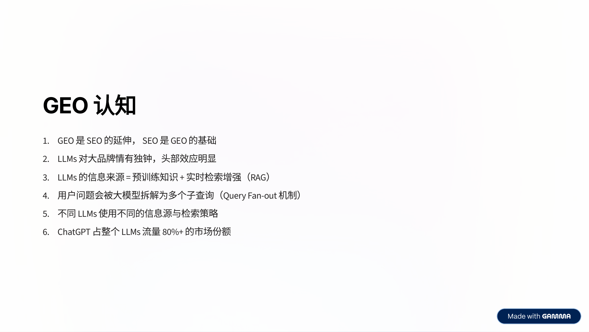
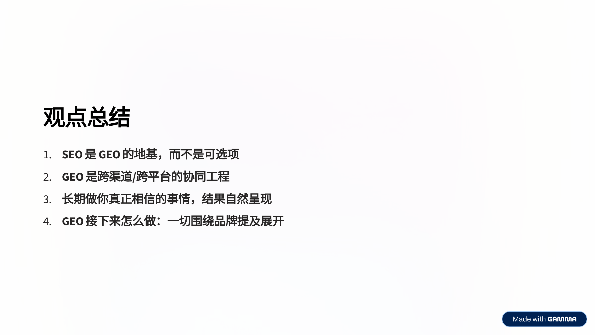

> This article is based on a presentation by Chen Pan (Span) at the "SEO in Practice · 2026 SaaS & AI Global Growth Summit." Span has 7 years of internet product management experience and 6 years of Google SEO expertise. He previously served as the SEO lead at a globally recognized AI company and currently consults for multiple SaaS companies on their international SEO strategies.

---

## First, the Results: 12,000+ Real Sessions per Month from LLMs

Before diving into the details, let's look at the numbers.

This is a GA4 screenshot covering November 19 to December 18, 2025 (a 30-day window). Under the "Session source / medium" dimension, total sessions from LLMs reached **12,499**, with **8,979** first visits, **8,609** engaged sessions, and an overall engagement rate of nearly **69%**.

The traffic source breakdown is fascinating: chatgpt.com dominated overwhelmingly. chatgpt.com / (not set) contributed 6,255 sessions, and chatgpt.com / referral contributed 5,815 sessions — together accounting for over **96%** of all LLM traffic. Perplexity followed far behind with only about 290 sessions. Other platforms like OpenAI and Gemini contributed negligible amounts.

In the February–March 2026 data window, LLM traffic remained at a high level of **11,433** sessions, with 8,347 total users — proving this wasn't a one-time spike but sustainable, steady growth.

Behind these numbers is a brand-new SaaS product — an AI Face Swap tool — that achieved these results through a systematic GEO (Generative Engine Optimization) strategy in less than one year starting from zero.

In this article, I'll walk through the entire process across four dimensions: GEO cognition, strategy formulation, execution, and results.

---

## 1. GEO Cognition: Understanding How LLMs Decide What to Recommend

Before taking any action, you need to build a correct understanding of GEO. Many people see GEO as something entirely new and separate from SEO, but that's not the case.

### GEO Is an Extension of SEO, and SEO Is the Foundation of GEO

GEO doesn't replace SEO — it's a new layer built on top of it. If your website hasn't even nailed basic SEO and has no presence in search engines, expecting LLMs to recommend you is nearly impossible. Traditional SEO factors like search rankings, content quality, and backlinks are also key signals that LLMs use to determine whether a brand is worth recommending.

### LLMs Favor Big Brands — The Winner-Take-All Effect Is Real

This is a pragmatic reality. LLMs naturally tend to recommend brands they've seen more frequently in their training data. The higher the brand awareness and the more mentions across the internet, the greater the probability of being recommended by an LLM. For new brands, this means you need to deliberately increase your presence across various data sources.

### LLM Information Sources = Pre-trained Knowledge + Real-time RAG

Understanding this is crucial. LLM responses don't rely solely on pre-trained knowledge. Increasingly, models (especially ChatGPT's online mode, Perplexity, Google AI Overview, etc.) perform real-time web searches when generating answers. This means if your content can be picked up by these retrieval systems, it has a chance of being cited and recommended by an LLM.

### User Questions Get Decomposed into Multiple Sub-queries (Query Fan-out)

When a user asks an LLM a complex question, the model doesn't just run a single search. It breaks the question into multiple sub-queries, retrieves results for each, and then synthesizes an answer. For example, when a user asks "best face swap for mac," the model might separately search "face swap mac app," "best AI face swap 2025," "face swap mac review," and other variants. Understanding this mechanism helps you cover more potential sub-queries in your content strategy.

### Different LLMs Use Different Sources and Retrieval Strategies

ChatGPT cites Reddit, YouTube, news sites, and blogs. Perplexity relies more on structured search results and academic content. Google AI Overview heavily cites top-ranking content from its own search results. This means you can't optimize for just one platform — you need a multi-channel approach.

### ChatGPT Commands 80%+ Market Share of LLM Traffic

Real-world data shows that ChatGPT dominates LLM referral traffic with over 80% market share. This gives us a clear strategic priority: if resources are limited, focus on getting recommended by ChatGPT first.

---

## 2. GEO Strategy: A Three-Pronged Systematic Approach

Based on these insights, Span developed a GEO strategy framework that pushes forward on three dimensions simultaneously.

### Dimension 1: Get SEO Right

This is the most fundamental pillar and cannot be skipped. It includes:

- **Search Intent Matching**: Ensure every piece of content precisely matches user search intent
- **User Interaction**: Optimize UX to improve dwell time and engagement
- **Content**: Produce high-quality, in-depth content
- **Backlinks**: Build a high-quality backlink profile
- **On-page SEO**: Optimize titles, descriptions, structured data, and other on-page elements
- **Technical SEO**: Ensure solid technical foundations — fast loading, good crawlability

### Dimension 2: Build Brand Authority

LLMs favor well-known brands, so you need to proactively amplify your brand's presence online:

- **PR**: Publish press releases to boost brand authority
- **Influencer Marketing**: Leverage KOL influence to expand brand reach
- **Affiliate**: Use affiliate marketing to increase brand exposure
- **Ads**: Run targeted ads to build brand awareness

### Dimension 3: Influence the Data Sources

This is the most critical and technically sophisticated dimension of GEO strategy:

- **Become a data source that LLMs cite**: Make your official website content directly cited by LLMs
- **Join existing data sources that LLMs cite**: Plant your brand information on third-party platforms that LLMs already reference

Specifically:

**Publish PR**: Publish press releases with target topic/keyword intent on major PR platforms. For example, publishing product launch press releases on Yahoo Finance, PR Newswire, etc. — this content gets picked up by Google AI Overview and other LLMs' retrieval systems.

**Run Influencer Marketing**: Partner with niche-relevant YouTubers to publish videos. A key tactic: insert brand-relevant descriptions in the YouTube video descriptions that LLMs are already citing, and pin a brand comment. An important mindset shift here: the primary goal of influencer marketing isn't direct ROI — it's **boosting branded search volume**.

**Join LLM-cited data sources**: This is the most labor-intensive component. The core method: collect target prompts/topics/keywords, identify all sources that LLMs cite for those queries, and use different tactics to influence each source type.

---

## 3. Execution: 12 Months of Systematic Operations

After the strategy was set, execution was divided into three phases:

- **January – March**: Polish the product, do routine SEO work
- **April – June**: PR, Influencer Marketing, join LLM-cited data sources
- **July – December**: Add content following new product features, routine maintenance

Let's focus on the critical April–June execution phase.

### Action 1: Publishing PR

Product press releases were published on Yahoo Finance (via ACCESS Newswire) and PR Newswire, focused on core features and differentiating value propositions.

The PR results were immediate. Searching "best face swap ai for mac" in Bing's AI Mode showed the product in the recommendation list, citing the PR Newswire press release as the source.

Even better, searching "best face swap for mac" in Google AI Overview also returned the brand recommendation, with the citation list clearly showing PR content from multiple news outlets.

This proves that PR is not only valuable for traditional SEO but equally critical for visibility in the AI search era.

### Action 2: YouTube Influencer Partnerships

By partnering with niche-relevant YouTubers (primarily Indian influencers), the team published product reviews and tutorial videos. Searching "best face swap ai" in ChatGPT, the model directly displayed a YouTube video as a recommendation source.

Meanwhile, Google search results for "best face swap ai" also showed video results in prominent SERP positions. YouTube content proved valuable across both SEO and GEO channels.

### Action 3: Joining LLM-Cited Data Sources

This was the most labor-intensive and operationally demanding part of the entire execution.

**Step 1: Build a Tracking Spreadsheet**

The team created a comprehensive tracking spreadsheet documenting every target topic/keyword, all cited source URLs across different LLMs (Perplexity, Claude, Google Search, AI Mode, ChatGPT, etc.), content types (Reddit, Blog, Quora, Forum, YouTube, Directory, Download Website, PR, etc.), and execution status.

The core logic of this spreadsheet: **you're not guessing what LLMs will cite — you're actually checking what each LLM is citing for every prompt, then systematically influencing those already-cited data sources.**

**Step 2: Targeted Execution**

Taking ChatGPT's search for "best face swap for mac" as an example, the cited Sources include Reddit posts, blog articles, review sites, and other content types.

Different tactics were used for different source types:

- **Reddit**: Publish posts and comments in relevant Subreddits recommending the product
- **Blog**: Partner with blog authors to add product links or mentions in existing review articles
- **Quora**: Publish answers containing product recommendations under relevant questions
- **Forum**: Participate in discussions on tech forums, naturally mentioning the product
- **Directory / Download Website**: Submit product information to AI tool directory sites

**Step 3: Track Results with Tools**

The team used Ahrefs' Brand Radar feature to obtain product-related prompt data, then fed these prompts into the Profound platform for continuous tracking.

Through Profound, the team could monitor the product's performance across 230 related prompts, including visibility percentage, ranking changes, and sentiment analysis for each prompt — creating a complete loop from execution to measurement.

### Quora Operations in Practice

While Quora doesn't get much attention in China, it still holds significant value for international SEO and GEO. Google AI Overview in particular cites Quora answers.

In practice, the team published about 20 posts and comments on Quora targeting questions like "best face swap ai" and "best face swap for video." The result: Google AI Overview directly cited the Quora recommendations when answering related questions, listing the brand as a top recommendation.

### Reddit Operations in Practice

Reddit is one of ChatGPT's most important third-party data sources. Searching "best face swap ai" in ChatGPT reveals that Reddit posts occupy prominent positions in the Citations. ChatGPT even directly quotes Reddit user reviews as recommendation evidence.

### April–June Execution Summary

Over these three months, the team completed the following:

- Published **3** PR articles
- Partnered on **16** YouTube videos (primarily Indian influencers)
- Published **~150** Reddit posts
- Made **~150** Reddit comments
- Published **~20** Quora posts and comments
- Completed **3** blog link insertion partnerships

These numbers don't look extravagant, but the key was **precision** — every action was based on actual LLM citation data rather than blind mass content production.

---

## 4. Results: Let the Data Speak

### Sustained Growth in Branded Search Volume

Google Search Console data shows a clear upward trend in branded search volume throughout 2025. Over 12 months, branded terms accumulated **363K clicks**, **450K impressions**, an average CTR of **80.7%**, and an average position of **#1**.

The trend chart shows branded search volume starting from near zero in early 2025, with visible growth beginning in March, a dramatic jump during April–June (exactly the PR + Influencer + data source influence execution period), and continued climbing after July during the maintenance phase, stabilizing at 1,500–2,000 daily clicks by year-end.

### Ranked #3 in GEO Visibility

On the Profound platform, the brand's GEO visibility in its category has risen to **#3**, with a Visibility Score of **19.2%** — behind only Reface (34.1%) and Pixlr (20.9%), two established brands. Trailing behind were well-known legacy tools like YouCam (18.2%) and Fotor (17.2%).

For a brand less than one year old to compete alongside these established products in LLM recommendations clearly demonstrates the effectiveness of the GEO strategy.

### 12K+ Monthly LLM Traffic

The final results circle back to the opening data — over **12,000+** sessions from LLMs in the last 30 days, with **8,900+** being first visits, meaning most of this traffic represents entirely new users and genuine incremental growth.

---

## 5. Bonus: Reddit Operations Playbook

Reddit played a crucial role in the overall GEO strategy, and Span dedicated a detailed section of his presentation to sharing practical experience.

### 1. Find High-Value Posts

The first step is finding Reddit posts that already receive search traffic. Two approaches:

**Approach 1: Google Search** — Search "keyword site:reddit.com" in Google to see which Reddit posts already rank well and receive search traffic (use SEO tools to check Search Traffic data).

**Approach 2: Ahrefs Site Explorer** — Look at reddit.com's Top Pages in Ahrefs, filter by keywords, and identify high-traffic posts related to your product.

Once you find these posts, there are two action paths: make comments (recommend the product in existing posts) or create new posts mimicking the structure of successful ones.

### 2. Get Your Comments to Rank Higher

On Reddit, comment ranking is primarily determined by upvote count. Therefore:

- Get upvotes on your comments
- Reply to high-ranking comments with sub-comments

This helps your product recommendations gain higher visibility within posts.

### 3. Hire Reddit Freelancers on Upwork/Fiverr

Reddit operations require specialized skills — you need aged accounts, understanding of each Subreddit's rules, and knowledge of how to recommend products naturally without getting deleted. The most efficient approach is hiring professional Reddit Marketing Freelancers or Agencies on Upwork or Fiverr.

### 4. Screen Candidates

Selection criteria include: experience, high ratings, and proven success cases. Start by working with several freelancers simultaneously, screen based on actual results, and retain the 1-2 best performers for long-term collaboration.

### 5. Pay for Results

A results-based payment model is recommended. Reference pricing:

- One successful comment = **$3 – $10**
- One successful post = **$10 – $15**
- One successful upvote = **$1**

"Successful" means the comment/post wasn't deleted and remains visible.

---

## 6. Key Takeaways

Span closed with four core insights:

### 1. SEO Is the Foundation of GEO, Not Optional

Don't abandon traditional SEO because of the rise of AI search. On the contrary, the better your SEO, the higher your probability of being recommended in GEO. The two reinforce each other.

### 2. GEO Is a Cross-Channel, Cross-Platform Coordinated Effort

GEO can't be solved by doing one thing on one platform. It requires coordinated efforts across PR, YouTube, Reddit, Quora, Blog, Directory, and other channels. Each channel influences different data sources for different LLMs — only collective force produces significant results.

### 3. Commit to What You Truly Believe In — Results Will Follow

Like SEO, GEO doesn't deliver overnight results. This case study took about 6 months from initial efforts to visible traffic growth. It requires patience and sustained investment.

### 4. The Future of GEO: Everything Revolves Around Brand Mentions

The core competitive advantage in GEO ultimately comes down to **brand authority**. The more your brand is mentioned across the internet — and the more positively — the more likely LLMs are to recommend you in relevant contexts. All strategies and execution should ultimately serve the core goal of "increasing brand mentions."

---

## Final Thoughts

What impressed me most about this case study wasn't the final 12K monthly traffic number, but the systematic and replicable nature of the entire methodology.

In summary, the core GEO methodology can be distilled into three steps:

1. **Figure out what LLMs are citing** — For your target keywords, check what each LLM platform is citing as sources
2. **Systematically influence those sources** — PR, Reddit, Quora, YouTube, Blog — execute precisely based on actual citation data
3. **Continuously track and iterate** — Use tools like Ahrefs Brand Radar and Profound to monitor results and dynamically adjust strategy

As AI search becomes increasingly prevalent, LLM referral traffic is emerging as the next major traffic source after Google organic traffic. For SaaS brands going global, the earlier you invest in GEO, the sooner you'll capture this wave of opportunity.

I hope this case study provides some inspiration for those building SaaS products for the global market. If you're also working on GEO, feel free to share your experience and insights in the comments.
