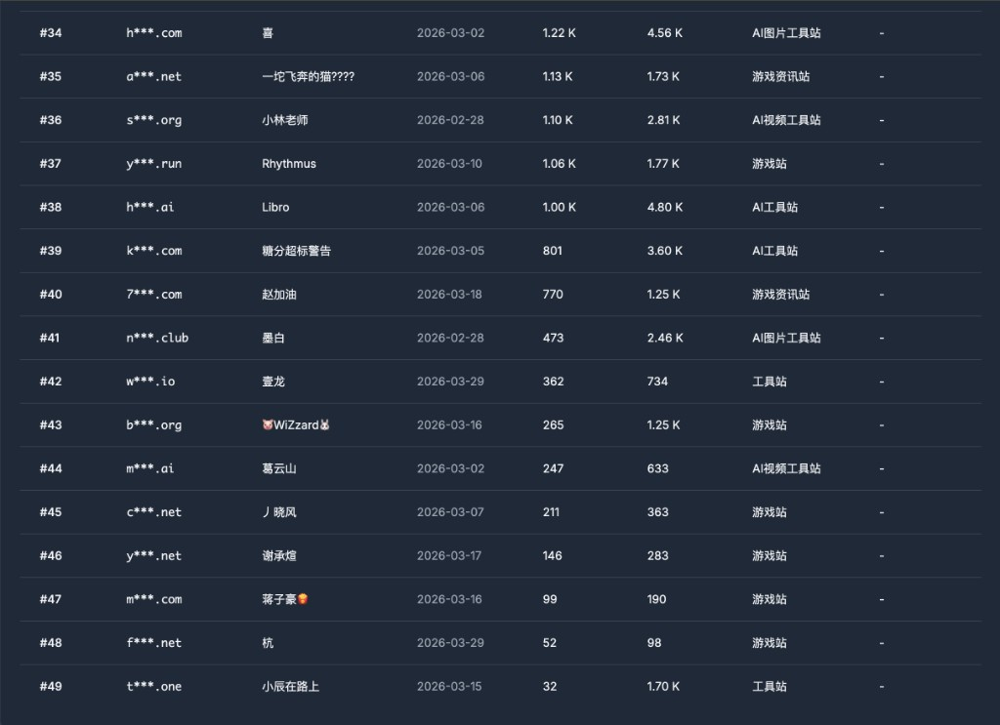
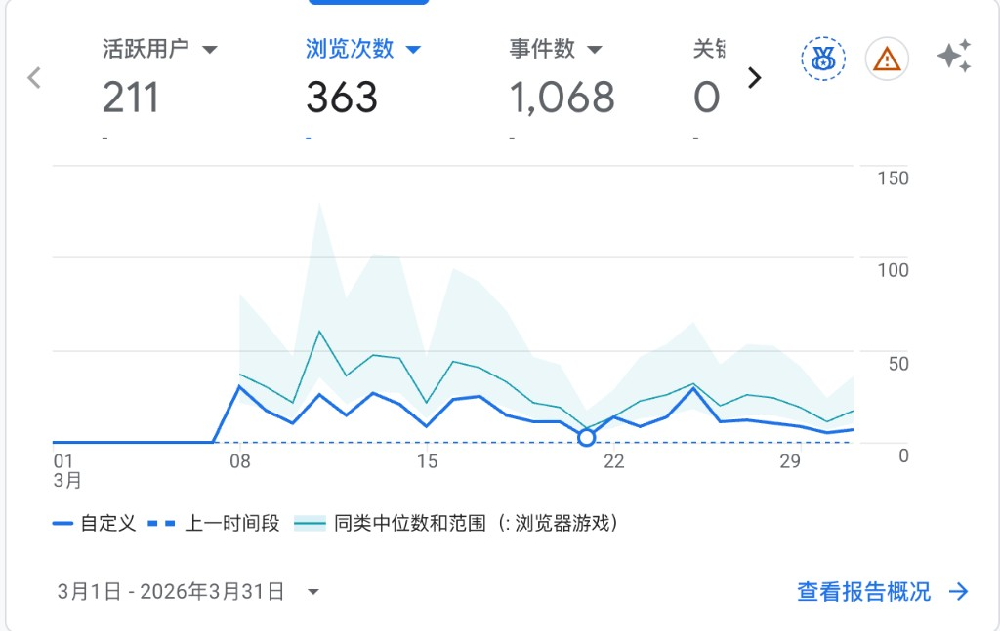
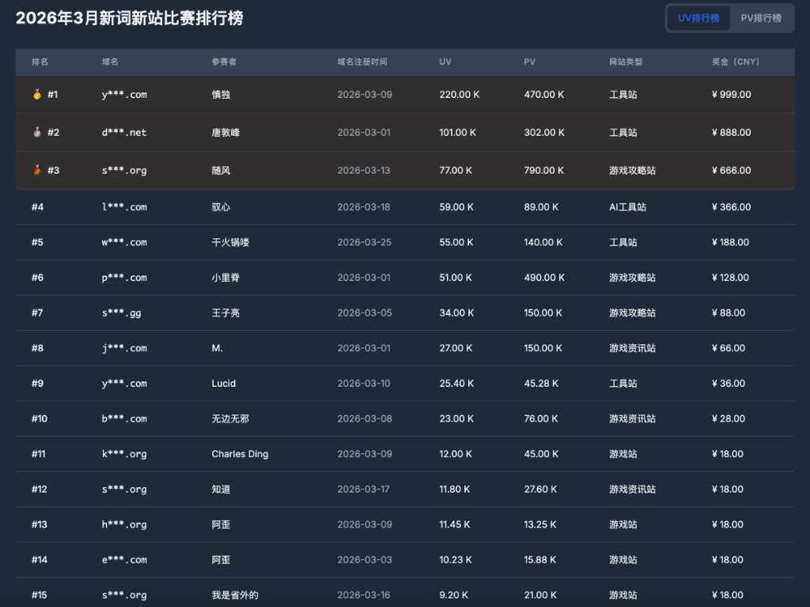

> First time joining a monthly contest. Finished second-to-last, but at least I ran the full race.

---

## 1. The Results

The March new-keyword new-site contest results are in. **49 websites** entered, and my site came in at **#45**.

March stats: **211 UV, 363 PV**. Compared to the top entries pulling tens of thousands of UV, the gap is massive.

---

## 2. What I Built

I built a **browser games site**.

The reasoning was straightforward: this type of site has compounding value — content accumulates over time and isn't dependent on a single keyword.

But the downside is obvious too: the niche I chose has **relatively low search volume and isn't a fresh keyword**. The whole point of a new-keyword contest is low competition and fast growth potential — my choice of direction gave up that advantage from the start.

---

## 3. What I Did in March

Honestly, March was a pretty lazy month:

| Item | Count |
|------|-------|
| Inner pages published | ~66 |
| Backlinks built | 22 |
| Pages indexed | 8 |

Only 8 pages indexed out of 66 published — that's a low ratio, suggesting content quality or site authority wasn't strong enough. The 22 backlinks were a start, but didn't move the needle much.

---

## 4. What the Top 15 Looked Like

The top three sites pulled UV of 220K, 101K, and 77K respectively — all tool sites or game walkthrough sites. The gap is enormous.

First place was a tool site with 220K UV and ¥999 in prize money. Second place, also a tool site, had 100K UV. Third was a game walkthrough site with 77K UV. The top entries all chose niches with higher search volume and lower competition — better suited for a new site to ramp up quickly.

Sites similar to mine (general games sites) mostly landed outside the top 10. Games sites tend to have a lower traffic ceiling, though the real issue is keyword selection and content quality.

---

## 5. What Went Wrong

This contest exposed a few obvious problems:

**1. Bad keyword choice.** The whole point of new-keyword SEO contests is finding a high-volume, low-competition term. Mine had low volume to begin with — a structural disadvantage.

**2. Content quality was too low.** 66 pages published, only 8 indexed. That ratio means most of the content had little value to search engines.

**3. Not enough effort overall.** March was basically "I showed up." No serious optimization, no iteration. The result reflects that.

---

## 6. April Plan

A low starting point is fine — there's plenty of room to improve.

April goal: **break into the top 30**. I'll focus on:

- Improving content quality, cutting low-value pages to boost indexing rate
- Building more targeted backlinks to improve domain authority
- Reviewing which inner pages are getting traffic and doubling down on those

First contest was about learning the rhythm. Onwards to April.
