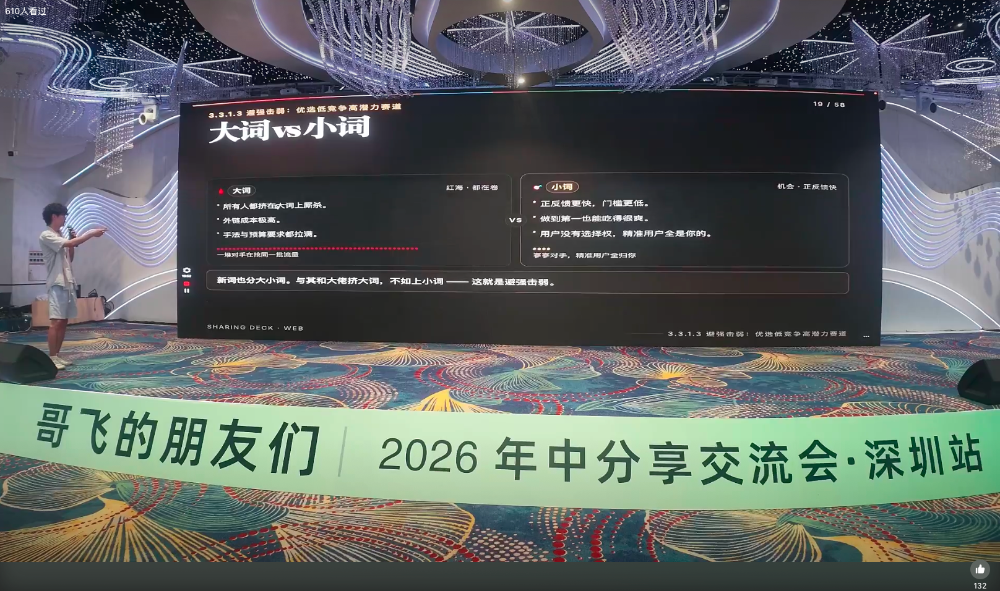
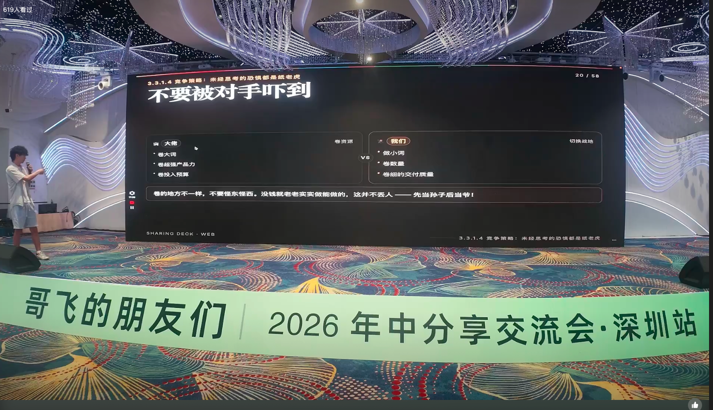
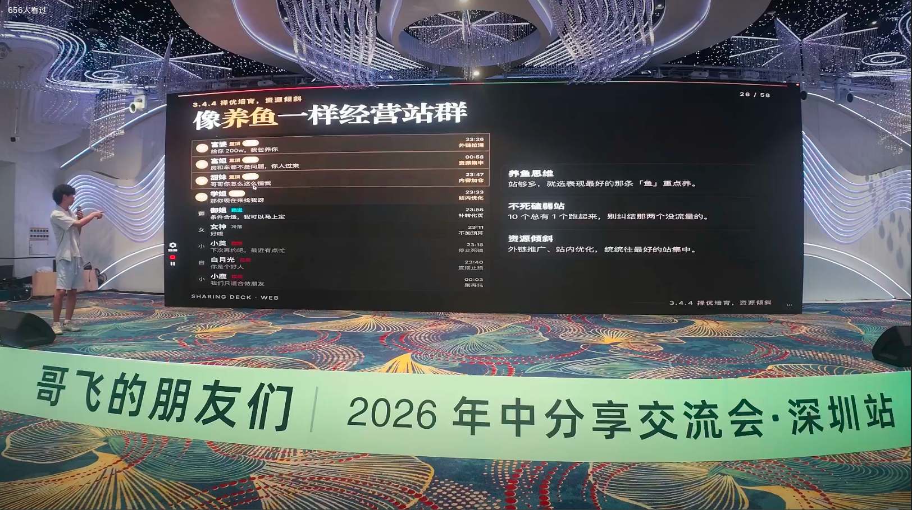
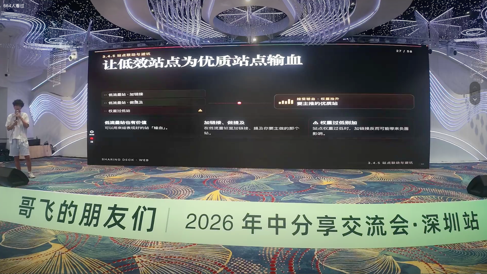
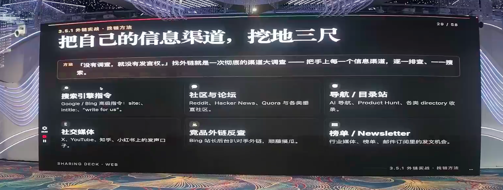
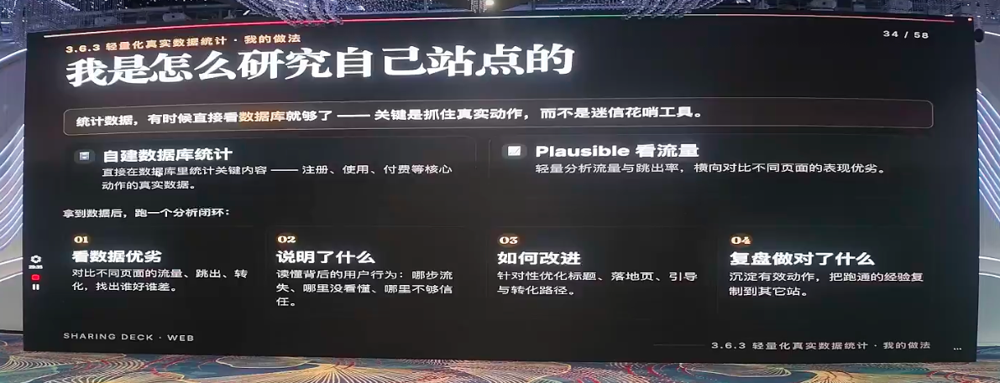
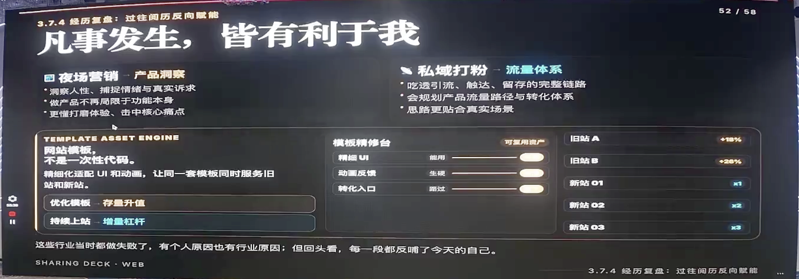

# Mindset Is Your Best Feng Shui: A Survival Playbook for AI Entrepreneurs

> At "**Gefei's friends, year-round sharing meeting Shenzhen Station**, a continuous entrepreneur, independent developer **sheep**brought a very different sharing. The theme was "**Mind is Best Windwater**" -- in his own words, "It doesn't matter if the title doesn't understand, mainly to listen to me bragging."
> >
> But it's actually dry. The method is important, but if you can keep moving in uncertainty, it depends more on a person's mentalities, perceptions, and rhythm. He's got the classic philosophical thinking and the first line of the AI-powered global entrepreneurship, the first half of it takes care of the new-touch mentality, and the second half of it goes directly to change in intensity.

---

## First, I met the sheep first: I didn't graduate from high school, I went to 30 stations a year.

The sheep made a very honest introduction at the scene: they left society before they graduated from high school and started a business. He worked as an entity in his home, he worked as an electrician in his early years, he sold property, he delivered delivery, and he worked in a six-month night market.

By the end of 2024, he had moved from being owned to **global AI entrepreneurship**— because the traffic was becoming more expensive and he was not moving. The result was almost **30 stations in a year,**more than a dozen keywords.**

> And he repeatedly said, "**do global implementation, the most important thing is that it's actually available in the Gefei’s community.**A lot of things fly public, "I'm just doing it, and maybe you're not doing it."

---

## II. The Mind: Put down "Face" and "Big."

### 1. In practice: set up a framework for real users to help you measure

The sheep suggest that the new hands start **frame, master**: once the master version of a full set of responsive designs is ready, whatever station can be quickly "shell-changing" and more efficient. After the stop, there are actually a few things -- backlinks, insider optimization, and then backlinks.

> **backlinks are reusable fixed assets.**Whatever station you're after, these backlinks resources have been yours.

He also shared the confusion that was common to a new hand: the locals ran well, reporting mistakes on the line. The conclusion was that --**the real problems would only be revealed in the use of the real users.**So, when he came out of the bug, the locals could not get AI fixed, fixed, and the users could do it.**The questions that the users had detected were more real.**

### 2. Take off the "tweet": "do niche keyword" at all.

The sheep observed that many people, especially those from large factories, had to do with a product that was too cowy.

- Large factories often come out of a "vocation" (product manager, programmer) and are good at single points; **global expansion tests a run-through process system**and single points can only work;
- **doing nichekeyword is not a disgrace.**Many top-opractors are able to spend as much time as niche keyword users are rich and worthy of service.**
- Do niche keyword also allows for differentiation (e.g. batch drawings, batchal drawings), as much as possible covering user needs, leaving all operations in one station, and increasing the length of stay.

> His attitude is straightforward: **The essence of entrepreneurship is to earn money and earn the respect that he wants. **Don’t wrap it up too complex with grand narratives, making money, dreaming of having money to pursue. Many of the bosses don’t graduate from primary school, high school, and can make hundreds of millions of dollars a year – many grass-roots entrepreneurs can make money on their own.

### 3. Opposite moves, weak ones: new hands should do niche keyword

Citing the Moral's "Voice of the Inverse, the Vulnerable," the sheep cheer the new hands: You can't do anything with your hands.**Niche Keyword works faster, lower threshold, first and best.**

> The real case is him: a niche keyword made last year, at the end of the year, **10,000 a month, and over 600,000 a year **— a large part of it is contributed more than 6 million a month by a big brother user.

High-volume Keyword is the Red Sea where everyone is fighting, and it's almost impossible to do it; rather than put all their energy on the niche Keyword and pile it up as well.

### 4. Place yourself in the weakest position: a canoe, with only progress

> "We're already grass. What's to be afraid of? Put ourselves in the weakest position, and then we'll have to move forward."

The lamb reminds you not to be scared of your opponents --**the direction of the rolls is different**: top operator rolls the budget (who already has hundreds of thousands of dollars) and the new guy doesn't have a budget, **the volume, volume delivery quality**. Anything comes out of "rolls" and has to be adjusted by strategy, not by imagination.

---

## iii. Script: You run like a fish.

### 1. Multiple launch a site to see the most authentic data

The lambs compared the store to "chips" and "fishing":

- **More launch a spot to get real data you can understand.**Analysis of someone's website, forever in the fog, at the analysis stage; data is based on your own understanding only if you are self-involved;
- It's like looking for someone, "Ten tweets first," and there's always one that works. **Enough stations = your own data book**, naturally, no anxiety -- just one or two stand to die.

> One in ten stations always runs, and the success rate is really worth it. What's going on is to analyze the success stories that run.

### Fish-raising strategy: good fish focus, bad fish directly deleted

- The best-performing fish is focused on feeding, **all the backlinks resources are tilted towards it,**first and foremost to make money;
- Zero UV, completely non-flowing stations, directly deleted, no more feeding;
- But **low-flow stations are not useless **— they can be your **free backlinks resources **to give power to the new station (DRs can sometimes suddenly pull up to thirty-forty). And you can keep your "deep" station, maybe one day.

> His other real case: the nigche Keyword station, which was 600,000, was just a low-flow station.**Believe in probability, and believe in luck.**

The key to scale is to sink the success of the fight into **SOP**, and then scale it up -- scale it up like a fish.

---

## iv. Backlinks: High quality without money.

### 1. Free theorists: must stand behind the Chief.

The lamb shared a method he found early in the "no money": thousands of dollars on him, he couldn't afford the SEO data tools, and he found that **Bing's backstage **could also be "playing" -- the sidebar had backlinks and could be compared to the website.

> The point is: **must come out of a tool, must be self-approval, making **more "real" than third-party data tools, and more efficient.

### Paybacks: Don't buy garbage cheaply

This is the pit he stepped on himself:

- Don't try to buy a bunch of black hat links cheap (e.g. $200 for 1000), **it's all garbage links, it doesn't make sense **
- Buy as much as possible**best post**and as much as **100 and above**;
- The bottom 100 is to determine whether it's a "water flow master station" -- a station that looks exactly the same, **DR is too high but very low **, and you can see it at first sight, not buy it.

### Free backlinks: novollow also works, but needs to be refined

> A lot of people think free backlinks are non-fool, meaningless, and there's no need to think so.

**As long as the backlinks site is high enough (e.g. Hacker News, etc.), novollow can also bring a lot of power.**Free backlinks need to accumulate over time, and must be refined to find them — there's no point in finding a bunch of garbage to go for free, using a big platform.

He described the search for backlinks as "deep your own information channels three feet" - advanced command for the search engine (site:, initle:, write for us), community and forum (Reddit / Hacker News / Quora), navigation and catalogue stations (AI navigation, Produc Hunt, various types of directory), social media (X/ YouTube/ Know/Small Red Book), competition backlinks counter-check (must stand back), list and Newsletter, one by one, one by one.

---

## V. Conversion (focus): 4,000 UVs how to make more than 50,000 conversions

The lamb said that the one time that he had entered the 10,000th of the days, he had taken it down with this conversion system: **that day, about 40.000 more UVs, and the conversion of more than 50,000 SHKDs **, equivalent to a UV worth over a dozen yuan.

> Many people are high-flowing without making money, and the problem is often that they are not doing well.

### Core premise: a smooth path.

Users follow a smooth path, which is the main prerequisite for meeting their needs. The path ends smoothly and ends with payment.

### Data to target three rates: registration, bource rate, usage

- **Registration rate**: Add a variety of entrances, buttons, "pushing" users to register (e.g., having to register before trial);
- **Bounce date**: price page is the "end stop" for most users, who often jump out of the price.**Retention at the moment he jumps out **— direct play of a discount page to keep him, rather than just e-mail (many users don't even go to mail);
- **Usage**: low usage leads to various bullet windows.

He studied his own site "light": looking directly at the real data of core actions such as registration, use, payment in a self-built database, and working with Plausible to see traffic and bourse rate. When he got the data, he ran a closed analysis -- **to see the quality of the data → how to improve the redisposal of what was right **, copying the running experience to other stations.

### User Trust = Frontend Style

> The front end has to be carefully optimized. Even if you use a PPT/Current Template, the high-end station must be **modified on the basis of the template.**The front end is important.

The lamb compares this type of thing to an electrician: it depends on whether it has enough cover, title, detail page, or not. It's exactly the same thing. He also mentioned that at a SEO/GEO conference, a team **dedicated to the sale of coins was set up to do something **and it can be seen how important the content of the website is to ROI.

### Key concept: reducing user ' s learning costs '

This is the concept he learned from a teacher: **Users have just entered a strange website and don't know how to use it **, so all kinds of guidance are to be provided directly to him.

- In the tool stations, the longest-staying and most time-consuming users are the **generator segment**;
- Lowering the learning threshold using **preset words, grade-by-level guidance, input-output template**(e.g., window guide at registration, example + hint at output area);
- **More pictures/videos**: not just for the good-looking, but also for the trust and stay - the time spent on a purely text-based web page must be too long for the drawings and videos (he compared).

### Keep the entrance down to the pain.

- **All conversion portals are concentrated as far as possible in the generator block**(the user core action takes place here);
- **Multi-entry = Overexposure**: Generators have login buttons, header navigations have login buttons, which essentially increase the visibility of login/price pages;
- **Put conversion action on the pain of the user**: If the user wants to copy the hint, copy the template, then place the "Registration button" on the "Registration button";
- Even a water flow tip station can be converted - replace the "copy/download template" with "entry" (or the first free and the second necessary).

> **The page with the largest traffic is the best entry.**

### Keep an eye on the success rate.

Paying or not is highly influenced by the "success rate." **Generating cannot be generated, users certainly won't pay**and many users are impatient and leave once they fail.

### Blast windows and price pages: Full emotional value

The lamb calls himself "The Bottle Window Feverer," and he doesn't think that a bullet window must affect the experience -- "You look at domestic software, you open a commercial, you open a window, you have a ticket." The bullet window can write rights (time-limited discounts, discounts), or **increase the exposure of the price entrance.**

> **People who see prices are not necessarily bought, but who do not look at prices must not.**

The price page is going to bring the emotional value of **. **.

### Summarizing the transformation: treating users as babies

> "The user is the baby, you have to keep him."

Sheep says it's very straightforward: many times, you have to look at the user as if he doesn't know anything, and you have to show him every step, every detail, every move, and you have to teach him how to pay. He can do more than 50,000 conversions with more than 4000 UVs, for the reason that **all the optimizations have been done **, one hand to the user.

---

## Six: You hit me, I hit me.

### Golden window period: straight-up rivals

Emerging Keyword comes out of the Golden Window period and analyses those rivals who are already on the run -- **whatever they do ****This is the most effective and quickest way to get results, much faster than to study old stations.

### Luck can be broken down into methodology.

> "Any luck, if you look at it carefully, there must be a logic behind it, just to see if you think deep enough and are willing to study it."

Similarly,**the retracing may not be impossible.**The nature of the product is two things:**user experience**(using the user as a baby, step by step)+**transformation**.

### Choosing the track: AI-powered global entrepreneurship has a higher success rate

The sheep say that they have tried their own electricians, owned audience, and the conclusion is that the tracks are too rolly and have a low success rate; and **global AI entrepreneurship competition is relatively small and high **. Rather than rolling in a bad track, it is better to compete in a place with a higher success rate **doing niche keyword, doing precision demand **.

> "You hit me, I hit you." Don't squeeze those crowded tracks for grand ideas.

### We're relying on the break-through route. Don't use small questions as an excuse.

A lot of people are afraid, hesitant, mostly using small problems (such as "I don't know the technology") as an excuse to escape.

> "I didn't graduate from high school, and I'm also able to make a website. It's not a problem -- it's about whether you want to make money or not."

He also lit a common mistake: **paying doesn't mean making money **, many people ignore the middle effort and lose their energy at the moment of "paying." Master leads in, trains in individuals.

### Make the site master a permanent asset.

> The master version of the website can add value on a continuous basis**stock of assets: this is the perfect time for the next direct re-entry; the constant lanch of a site and backlinks are your **incremental leverage**.

He's done a replay of his past -- the nighttime marketing exercise led to product insight (insight of human nature, capture of real claims, hit the core pain), the downed Audience to pollute the flow system (showing, touching, remaining complete links, planning the path of transformation).**Every seemingly failed experience, looking back at itself today, feeds on itself.**

### Accept the present imperfections: anxiety does not solve the problem, action does.

The lamb ends with a philosophical thought: **to acknowledge and accept my current imperfections **— "I'm a white man now, it's okay, I'm actually doing this."

> **Anxiety does not solve the problem, but action and time do. **Contrast is universal, permanent (one solution and one next), and this psychological expectation is needed to make global entrepreneurship work.

He also stressed that "how to start" really didn't matter: he had thousands of dollars on his body, had over 300 bucks of computers, started with 4000 bucks, and started to do it all the way up to now.**A thousand miles, starting with the bottom line.**

---

## VII. END: How far can a man go?

The sheep share their final thanks:

- Thanking his friends for helping him when he was the hardest and the least rich,
- **Thank you for the Go Fei community**- "I'm a member of the Go Fei community before I actually take off." He systematically learns how to build a station, how to master it, and many analytical methods are drawn from the methodology of Go Fei**;
- Thank you for all the good friends you've met.

> He sent you the last sentence (and every website of his own): **To put time and strength to the point where he lived and lived, and always waited until the day you were killed.**

And he played the same thing about "bringing names of famous people to increase trust" — **Isn't that the way we transform websites to enhance the credibility of authors and the trust of users? **The bottom logic, actually, is all the same.

---

> This paper is based on the sharing of "Sense of Mind is Best" by Gefei's friends, Mid-Year Sharing, Shenzhen Station (2026.07.04-07.05), which is based on the sharing of "Sense of Minds is Best" by Gefei's friends, and is intended for cross-reference exchanges between Gefei community partners and Global Expansion peer, without representing platform positions. The methodology in the paper concerns specific operations; if replicating or quoting, please indicate the source and contact the original lecturer's authorization.
