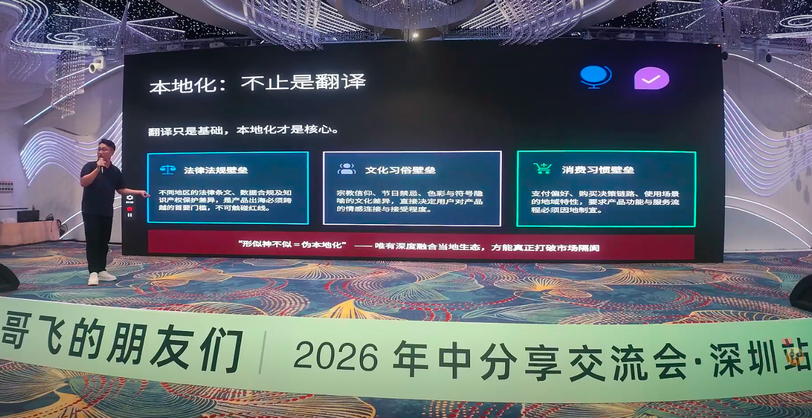
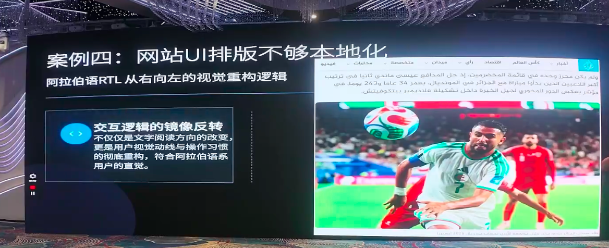
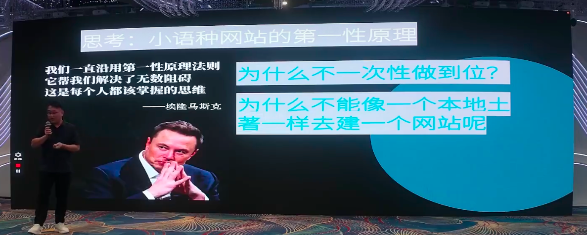
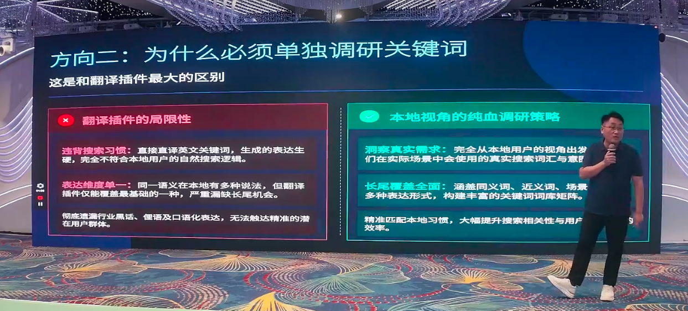
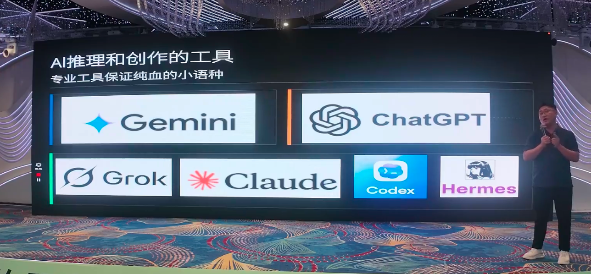
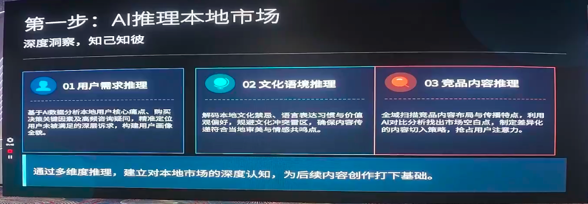
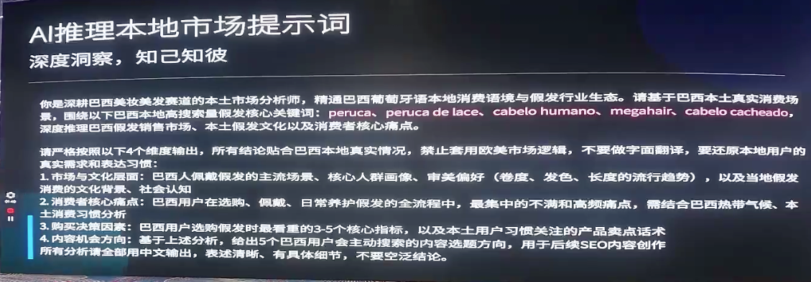
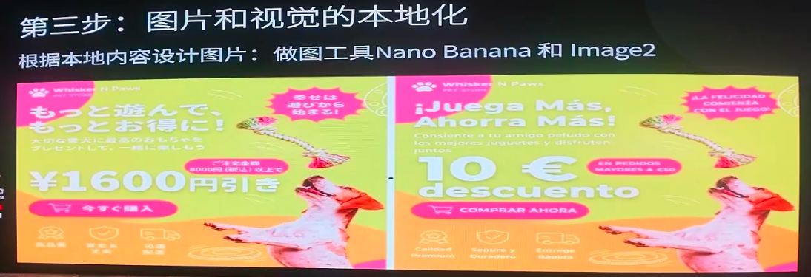
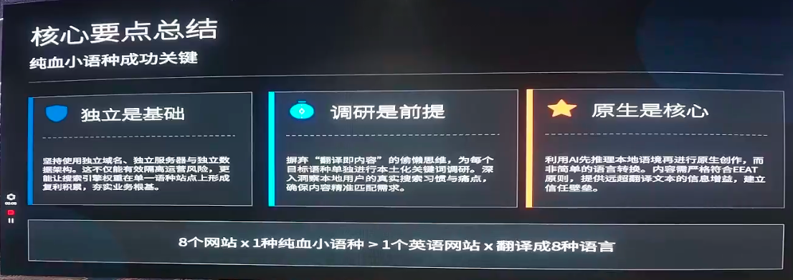

# One Native Localized Site Beats Eight Translations

> At "**Gefei’s Friends, Mid-Year Sharing Exchange Shenzhen Station**", standalone website B2B & B2C dual track SEO expert **SEO Xiaoping**, which led to the sharing of the theme "**AI Pure Blood Edition Non-English language website digs**".
> >
> When most people hear "non-English translate global expression ", the first reaction is to put a translation plugin into eight or even 100 languages. And Ping’s conclusion is the opposite - **standalone website, which takes eight "one language for one country" seriously, will benefit far more than "one website with a translation plugin turned into eight languages."**He named his book "Non-English language " in pure blood, and continues to verify running within the Gefei community.

---

## I. From "Book-up" to "Ai": The opening of Mr. Ping.

According to a live introduction by Mr. Ping, he does the English track, as well as the non-English track. He learns business Japanese, has passed the Japanese grade, and the first site is a pure Japanese-language SEO station -**a website has only one language and only Japanese.**

The turning point was made after AI appeared. He frankly said that in front of AI, his degree in business Japanese was a piece of shit. So he played the judgment that, since AI could outperform him, its German, French, Italian, Vietnamese, Polish, Portuguese could well outperform the vast majority of non-English language university students today.

**He's got a whole lot to learn from here.**He's stopped insisting on English, but he's going to lay it all over a country — a web site in a language.

Mr. Ping laughed that he was at the top of the English-speaking market in the United States, but "take off" on the non-English track,**because it was too easy**: when everyone mentioned global access, by default, was a station in English, and the track was crowded.

> According to their share, their team has at least 18 websites (2B + 2C combined) and dead far more than that. The survival theory is "no-English language ".

---

## Where's the traditional translation plugin? Seven "Turn over" scenes from Mr. Ping's replay.

Mr. Ping reminded Gefei's partners that many people felt that "a non-English slot, well-flowed, well-ranked" was a good idea, but few people pushed it in the way **of the success story **in reverse.

He gave the idea of a competition: don't argue about the usefulness of "translator plugins" but go straight to Google Japan IP and search the core of the web site, Keyword, to see which websites are ahead. Here's the real scene of his rediscretion.

### Story 1: SEO Authority -- local top domain name is Google's "son."

In the case of "cell phone shells", Google Japan, after searching:

- The first three are ****.jp ' local top-level domain names**and Google clearly prefers them to be ranked higher;
- Translation plugins usually have a secondary directory or domain name, which is diluted. Japanese may be only 12% of the entire station; 100% of the pure Japanese site is 100%.

### Scene 2: Words translated. There's no search.

Mr. Ping stressed that the interpreter could not be certain, but was not localized. He took a real figure:

- English "case" (cell phone shell) search volume in the United States is about **135,000**, derivative 74,000, difficulty above 50;
- An early translation of a Japanese word from the plugin, even though it was used by Japanese, had only **320**of Ahrefs, from over 30,000 to 320;
- And the real local Japanese expression (the Japanese used to call their mobile phones "smart" in the words of a smart) has a search volume as high as **3 million,**well above the United States.

> He pointed out that Japan had 100 million people and the United States 300 million, but that Japanese mobile shell searches were more demanding and less difficult to compete with. That was the "Blue Sea word" that could never be found in translation.

### Scene 3: Users split and trust is not built

Teacher Ping shares that Japanese users are naturally wary of operating `.com ' or something that is not local, and that `.jp ' domain name trust is immediately drawn up — **just as the Chinese see their own geographical name.**The translation plugin is hard to create a sense of "you're a native."

### Scene 4: Culture doesn't match -- your Black Five is someone else's blasphemy.

- **Black Friday (Black V)**for the English-speaking market, which has turned to the Arabic-language market and may be perceived as a cultural desecration;
- The rich countries of Saudi Arabia and the United Arab Emirates, which are extremely consuming, are particularly sensitive to "black" – it is often associated with revenge, anger, mourning. Black Friday is a source of resentment.

### Scene 5: The transformation chain is broken -- the payment is completely different.

Mr. Ping reminds us that PayPal and credit cards are the global mainstream:

- The Polish electrician market has the most used **local mobile wallets**;
- Brazilians are required to fill out their accounts **CPF (personal tax number)**, B2B, and **CNPJ (enterprise tax number)**, the closing pages are not filled, and Brazilians will directly judge the website as a fraud.

**Only local wallets, local tax numbers, conversion rate can get up at once.**Essentially, it's a bad message.

### Scene 6: Legal compliance - the entire big domain name was accidentally taken out.

This is one of the most impressive points of Mr. Ping's experience, according to which **several of them have been given four or five years of big domain names because of compliance problems,**as follows:

- (b) The restrictions vary from country to country: the age of purchase is at 18, 20, 21 years, and the translated website cannot play different tips for different countries;
- When the flow is big, it becomes a public enemy in the eyes of local counterparts, who take the verdict to AWS, Aliyun, and take the domain name and the server with them;
- **The draw/deplete is a mined area**: Belgium has awarded the pure luck draw as an improper commercial act; Poland, Portugal and Italy do not prohibit the free draw, but are classified as a specialty and must report it to the government.

### scene 7: UI & writing habits are not localized

- **Arabic **written from right to left. What's worse is that when you have an Arabic-language translation plugin, other pages (English, French, Japanese) can be pulled from right to left and experience very poor;
- **Japanese **The closing page is divided into two lines: the first line is a Chinese name, the second line is a pseudonym (as is the case for the Amazon and Yahoo in Japan), as the names of the Japanese are not read by even their own people;
- The German ****amount is in contrast to Chinese: decimals are used in commas and thousands of points. `958,45 ' is over 900, `1.250 ' is actually 1,20050; the German quotation marks are also the diagonal method of the upper right corner of the lower left corner.

> Mr. Ping said it's funny that the price is a misty one, or 1,000? The price would have been bought by the people who would have been discouraged.

### Supplementary scene: Viet Nam's "local legal entity" threshold

He also referred to a large machine (silver and steel exports) company in Shenzhen: Viet Nam is in good traffic and has a lot of information, but it's hard to deal with it. This is because the Vietnamese are only able to file large projects in their own country and access local platforms.**It is necessary to have a local legal entity, so the other party will be able to file a bill **– otherwise the big project is in trouble, what happens if they don't find a Chinese company?

---

## iii. Complete version of net blood not-English language

After all, Mr. Xiao Ping gave the core idea: **with the Mask's "first principle" to make each station look like a native.**German is a German station, Kazakhstan is a Kazakhstani station — the site is no different from the natives from the inside and from the outside, so it's called a "pure blood version."

This is what he shared on the ground and tested in the Go Fei community.

### Step 1: One-stop language, domain name + server + IP all isolated

- **One language of a website**(a suitable combination of very similar cultures, such as Uzbekistan and Turkmenistan in the vicinity of Kazakhstan, etc.);
- Priority **local national top level domain name**(`.jp ', `.de ', etc.) registered on Namecheap, Hostinger at a cheap price, without local company and business licence, with a dual-currency credit card;
- **Servers and IP must be isolated**. Share of domain names for plugins such as GTranslate, TranslatePress, which are punished very much - the flow often falls down after taking off within 15 days because the content generated by the plugins overlaps with the original language;
- Domain name registrations, servers, content are not the same,**risk is naturally dispersed**. 18 stations die in one or two stations, and accumulation can be profitable. That's what the Gefei’s community used to say, "No eggs in a basket."

### Step 2: Individual research in each country

Mr. Xiao Ping stressed that this is a first step and one that must not be saved. If you don't study, you just go to the content, you'll do it, you'll do it, you don't have a threshold.

- Purpose: To find **local real needs**+ **Thesaurus coverage**;
- Tools: Ahrefs, SEMrush, Google Advertising backstage, co-opting local forums, question and answer platforms, Amazon Reviews, etc.;
- **Do not be deceived by the generic word**: some feel that "API", "PVC" and "ABS" are all the same, unresearched, and wrong. The same "OpenAI API" is about 4000, more difficult for Brazil; Japan has a larger search volume and less competitive.**And close-eyes also make Japan — go and squeeze the tomatoes.**

> He has a bottom-up SEO logic: rankings are not self-decided, they are decided by competitors, and the competition is hidden in the KD values. This is fully in line with the Gefei’s community's idea of finding the Blue Sea word.

Once the research is completed, the traditional SEO approach to the keyword mapping and theme cluster is followed: the core word (TOP) creates brand recognition, the code word (MID) takes over business flows, and the long word (BOTTOM) main attack is turned into a deal.

Mr. Xiao Ping took a case on the scene: Shenzhen, an individual who works in a solar facility (one-person company, OSC model), had no more than 30 hits per day at her Arabic-language net-English station, but had received an **3.5 million judgement order**, and tens of thousands of people were afraid to answer.**The demand for non-English language was so strong.**

### Step 3: AI to reason first, then write (key)

Mr. Ping noted in particular that the whole process**did not have the word "translation" at all times **— the greatest chance was to kill the translator with pure blood.

He observed that companies that sell large models today are campaigning to promote "drive skills" and that they are no longer able to translate them (like the miner's mobile phone said, "sMS." But there are very few people who really use AI to reason. He has never been to Poland, Vietnam, and he has learned his culture by **AI reasoning**.

**The reasoning phase is to open the model to the largest, most advanced **(Gemini / GPT Depth Search / Claude / Grok, etc.) and start to think in depth. The research is only concentrated on consumption two days before the project, and fixed after the SOP was formed.

**Elements that must be reasoned:**
1. **User dimension**: local user needs, pain spots, purchasing key factors for decision-making, crowd image;
2. **Local expression**: language expression, writing, web design habits;
3. **competitive dimensions**: finding 4-5 local competitive stations to throw to AI deep disassembly -- a lot of things "float on the surface," that's how Polish local wallets dig up.

**Core skills: cross-linguistic reasoning (Chinese + local target language)**

According to Mr. Ping, his hint is a mixture of Chinese + native languages, and the logic is:

- The big model is basically "predict the next word with the previous word";
- All in Chinese, it's going to the Chinese language library to look for "Brazil" wigs, and there's no real Brazilian material in it;
- So he'll feed **the searchable local keyword **from Ahrefs (which ensures 100% of the core word is correct because it has a search volume in the vocabulary), and let AI predict the next word along local words, go to the local language library, and reason, thereby avoiding grammar, word, cultural mismatches.

The two sets of hints displayed on the scene are typical:**the reasoning phase**allows AI to play "home market analyst" around local Keyword deep reasoning markets and cultures with search volumes;**the writing phase**allows AI to play "local electronics expert" and to create and ban translation in local languages in their native language.

**Writing requirements**: written from the perspective of the native mother tongue (indigenous natives); expressed in the tunnel; and adapted reading structures to facilitate design of landing pages;**written by scene**— for example, for Kazakhstan, for 2B products, emphasis is placed on "what happens when under 40 degrees" rather than "waterproof, heat resistant" in the United States.

### Step 4: Manual clearance of knowledge (this is the real threshold)

Mr. Xiao Ping has repeatedly stressed that **If this step is not taken, the entire package will be without a threshold.**

AI would be "false" if it was any stronger, and it might have written something, but the company would have to delete it if it didn't have that business.

- It is important that **people who know and have professional experience **operate AI as non-English language — which coincides with Google **E-E-A-T**(experience, profession, authority, credibility);
- He's been in the electronics industry for over a decade, and AI has written at least Chinese for himself, looking at what's bullshit and what's not in line with business.
- True feedback: There were professional users who said, "You wrote an PVC, but the map was obviously silicon glue, aren't you liars?" — Unrecoverable mistakes by an outsider, perceptive.

> Testing AI output with real people plus industry knowledge banks is the most irreplaceable link in this SOP set.

"AI non-English language creation + artificial quality = high-quality primary content", which is the key to pure blood and to Google **E-E-A-T**and "information gain" and the gap with traditional autotranslation plugins.

### Step 5: Localization of pictures

The web pages are not just text, but also pictures and videos, which are also localized.

- Localized images with tools such as Nano Banana (Gemini image).
- For example, the company went online for a "$10 discount" campaign, the Japanese station became a "$1,600 discount" banner, the European station wrote "0 Euros" (8 Euros if they were not good-looking). Japanese users would find the money in their own currency in a way that they were unfriendly and unsettled.

### Step 6: Localization of video (only exception: direct translation)

Mr. Ping's live presentation was with tools like HeyGen, and specifically -- he was using "Video Translation", not "AI Generating Video."

- HeyGen translates videos that match the sound, the accent, the whole of the **.......................................................................................................................
- **Why does this video instead favour direct translation?**Because AI generation is currently unstable — the first 10 seconds is a product, and the second half is likely to change, and the video is made in order to make clients trust (plants, supply chains, desktop dismantling products) that the product must remain the same from the first to the last frame;
- **There's a flaw, but it's more real**: There's a pedestrian walking by the road, watching, and it makes the client feel "it's true." It's too personal, and the client feels false and afraid to buy it.

---

## IV. Summary: one stop, one language, eight > one stop, eight versions

Mr. Ping constricts the logic to a few keywords:

| Principles | Meaning |
| --- | --- |
| **Independence is the basis** | Each domain name, server, IP, content are independent, risk spread, access compound |
| **Research is a prerequisite** | Separate research on keyword, user needs, local laws and culture - translation plugin never works |
| **Original is the core** | Objection to translation. Let AI write based on local research. |
| **Localization is the end of the line** | From text to pictures, videos, the whole chain is "I can't see you're different from the locals." |

The bottom of this SOP is entirely based on Google SEO logic and mainstream AI, without any "go-to-door acceleration." He also mentioned that whether as an electrician or as a SaaS, the logic is the same as the SEO methodology that the Gefei’s community has been sharing.

**The core conclusion is clear and strong: a website in each language, with 8 of the eight, must have benefited more than a website with 8 translations.**

And now the threshold is very low – even non-programmer-born foreign trade operators can build two or three stations a day, using tools such as Cursor, Cloud Code. Mr. Ping advised the Cophyllian community’s partners **to use this SOP as early as possible, and to wait for others to react with 2027, 2028, which is long ahead.

---

> This paper is based on the sharing of the "Ai-Nn-English language website " on the "Gefei’s Friends, Mid-Year Sharing Exchange Shenzhen Station (2026.07.04-07.05, Shenzhen World Hotel) ".
