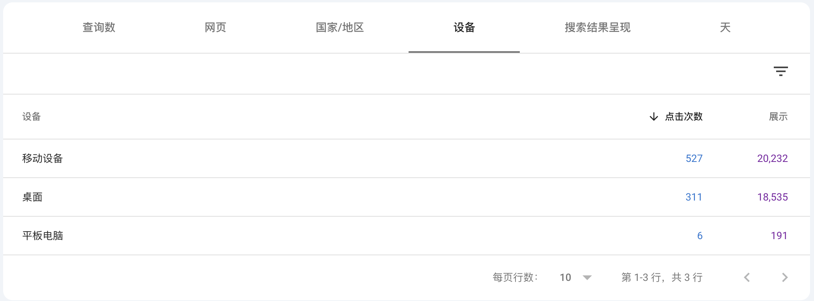
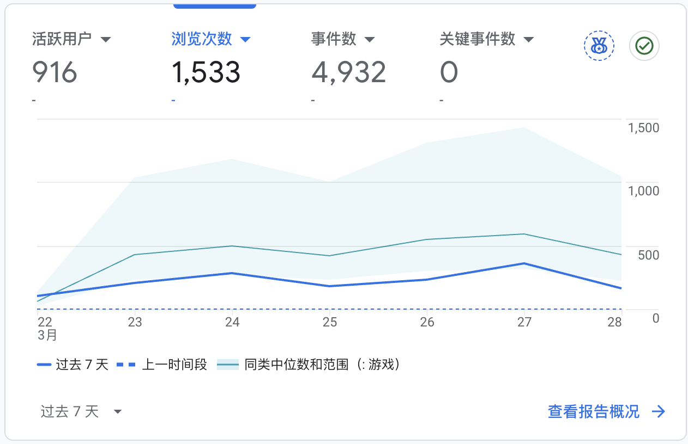
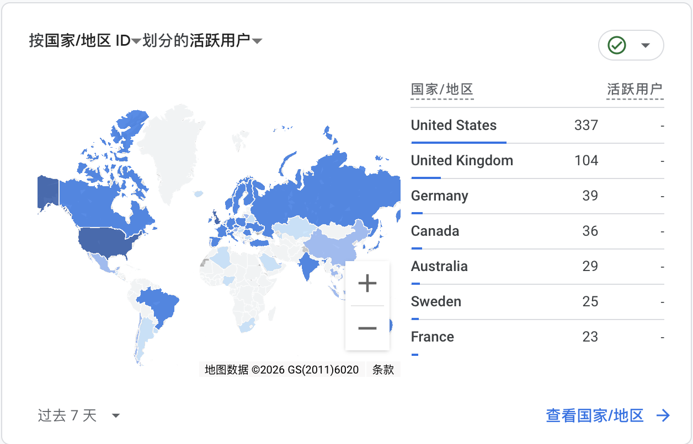
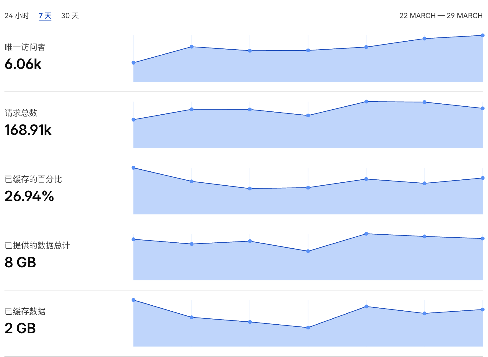

> Starting March 16th, I watched Google Trends daily and spotted a game keyword with surging search volume. To qualify for April's new-keyword competition, I held off until March 20th to register the domain, launched the site on March 21st — and the first-week data looks promising.

## 1. Overview

This is a game tool site for a game that Steam released on March 20th. I used AI to design the UI on the 20th, launched the landing page on the 21st, and connected Google Search Console, Google Analytics, and Bing Webmaster Tools right away. Every day since, I've had AI browse for the latest game content to keep updating pages and adding new inner pages. The early numbers look solid.

## 2. Key Data

### 2.1 Google Search Console

GSC tells a strong story for the first week: **844 total clicks**, **39K impressions**, and a **2.2% CTR**. Traffic spiked quickly between March 22–23, peaked on the 23rd, then leveled off — suggesting the keyword is still gaining traction but early buzz has settled.

Breaking down by device, mobile dominates — **527 clicks and 20K impressions** vs. desktop's 311 clicks and 18.5K impressions. Tablets barely register. This is a clear signal to prioritize mobile UX.

### 2.2 Google Analytics

Over the past 7 days: **916 active users**, **1,533 page views**, and **4,932 events**. Traffic trends are tracking well above the median for the Games category benchmark.

By country, the **United States leads with 337 users**, followed by the UK (104), Germany (39), Canada (36), and Australia (29). The site is English-only for now — I'll consider multilingual expansion next month.

### 2.3 Bing

Bing was connected late — I submitted to Bing Webmaster Tools on the 24th, three days after launch. Unsurprisingly, the numbers are modest: **52 clicks and 1.4K impressions**. Bing's overall volume just doesn't compare to Google at this stage.

### 2.4 Cloudflare

CF numbers should be taken with a grain of salt — a lot of the traffic is likely bots. The 7-day stats show **6.06K unique visitors**, **168.91K total requests**, a **26.94% cache ratio**, and **8 GB of data served**. I use this as a sanity check, not a primary metric.

## 3. Takeaways

Finding keywords with real search volume is everything — without it, building a site feels pointless. Positive early feedback creates a virtuous cycle: you stay motivated, keep investing energy, and the site grows.

Backlinks are still thin at this point. The plan for next week is to go hard on link building and hopefully show up strong in the April competition.
