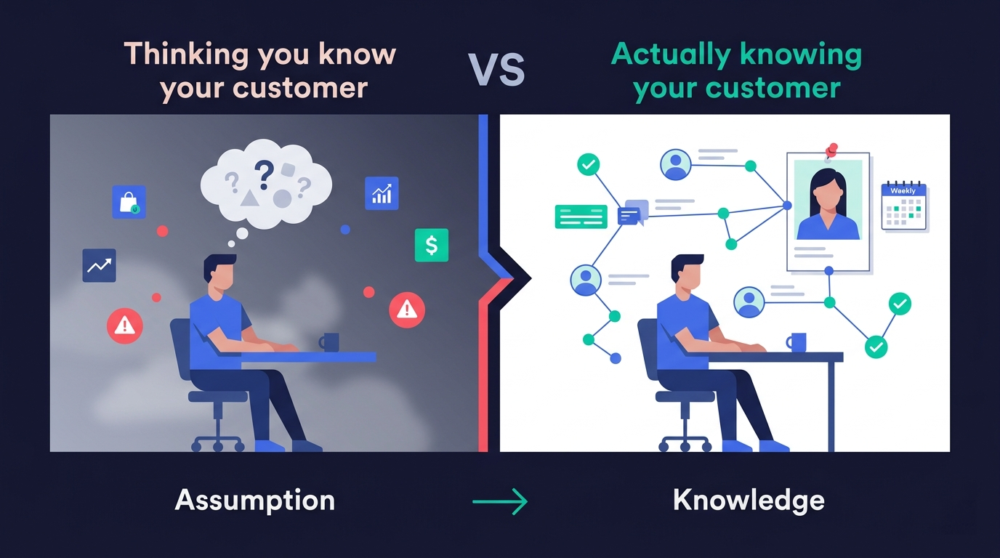
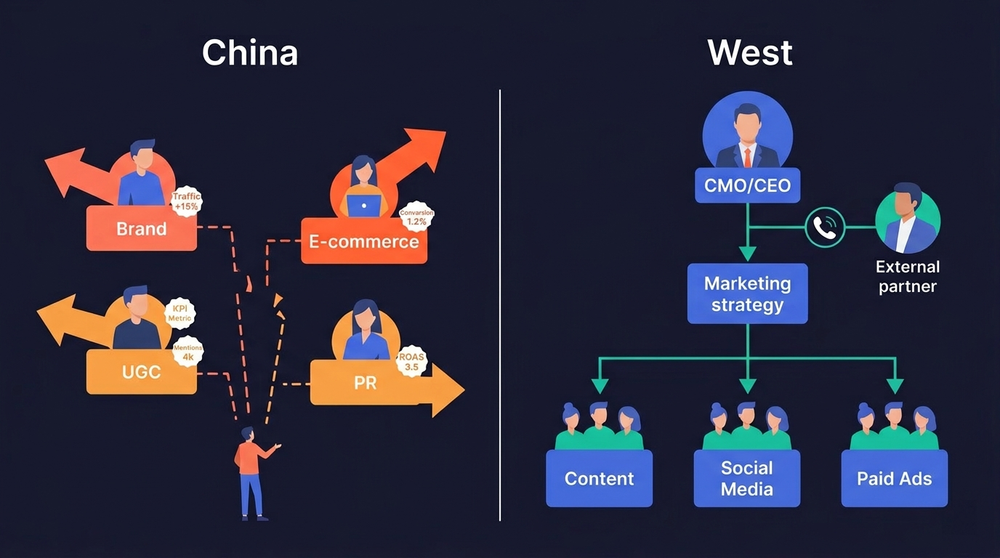
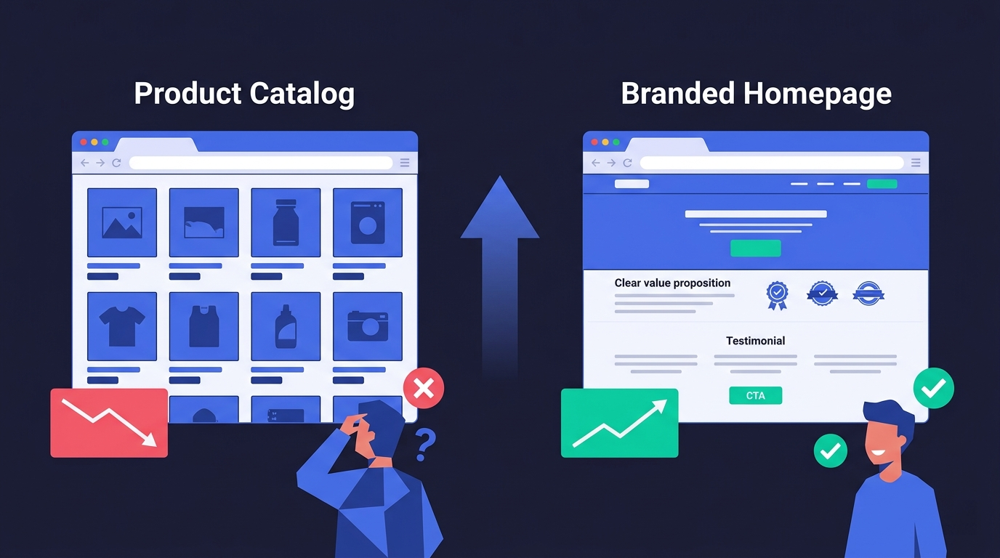
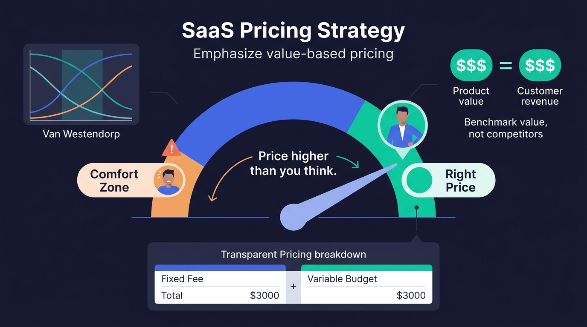
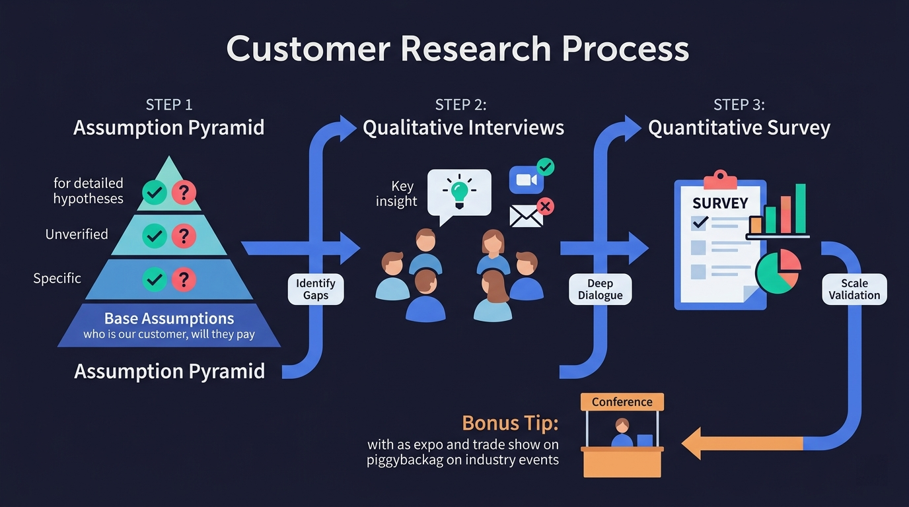

> At a going-global roundtable in Shenzhen, 4 overseas marketing experts who have served Chinese companies for years shared their real observations on Chinese companies expanding internationally. From customer research to pricing strategy, website localization to brand building, these voices from "the other side" may be more worth hearing than any market report.

---

At a going-global conference in Shenzhen, 4 overseas marketing experts from different countries sat together for a candid and incisive roundtable discussion. They came from different backgrounds but shared one thing in common—they've been helping Chinese companies enter overseas markets for many years.

* **Wolfgang**, Austrian, based in Hong Kong, specializing in website development for companies going global. He knows firsthand the pitfalls Chinese companies face in website localization.
* **Daniel**, British/South African, serial entrepreneur. After experiencing both startup failures and a successful exit, he now focuses on helping startups grow, with particular expertise in customer research and product-market fit.
* **Jonathan**, German, running an SEO and GEO agency in the UK. He has served both Chinese and Western clients for 12 years, flying to Shenzhen every quarter, giving him deep first-hand observations of both markets.
* **Greg**, American, founder of Jolly SEO, specializing in brand marketing and Reddit promotion. From a US-native perspective, he has unique insights on how SMBs can build brands overseas.

The discussion covered the core topics that matter most to companies going global: customer research, organizational structure, brand building, pricing strategy, and localization. When the moderator threw out the first question, the conversation quickly cut to a pitfall that nearly every company expanding overseas falls into.

## 1. The Biggest Pitfall in B2B SaaS Going Global: Do You Really Understand Your Customer?

The first question posed to Daniel was: What's the biggest pain point for the North American B2B SaaS clients you serve?

His answer was surprisingly simple: **They don't understand their customers well enough.**

> "Most companies will say 'we've done customer interviews,' but they haven't turned the insights from those interviews into actionable knowledge, let alone shared that knowledge across the entire team."

Daniel said he understands why—everyone's busy, and chatting with customers doesn't seem to directly move business metrics. But in reality, deeply understanding how customers use your product and why they chose you makes almost every decision in the company better.

He also shared a story that made him both admiring and envious: a friend of his built a Shopify plugin from scratch until it was acquired by Shopify. This friend hung a customer persona on his living room wall and **updated it every week**.

> "His understanding of customer behavior reached an obsessive level. I used to think I knew better than my customers, and all my projects failed. Later I realized the problem wasn't that I wasn't smart enough—it was that I kept substituting 'I think' for 'I know.'"

The moderator immediately chimed in that Chinese companies might have an even bigger problem in this area—"We really don't do much customer research, we can't even figure out our ICP (Ideal Customer Profile), and we have a perfect excuse: we're thousands of miles away from our US customers."

This is perhaps the core paradox of the entire discussion: **The farther away you are, the more you need to deeply understand your customers; but the farther away you are, the harder it is to understand them.** And most Chinese companies going global choose the path of least resistance—simply not doing it.

## 2. Chinese Companies vs Western Companies: Structural Differences in Going Global

Jonathan has been in this industry for 12 years, flying to Shenzhen every quarter. He has a deep, visceral understanding of the differences between Chinese and Western companies.

**Chinese companies' strength: Ambition and willingness to invest**

> "One thing I really love about working with Chinese brands is that they're genuinely ambitious. They want to grow, and they're willing to invest resources to learn and develop."

He made an interesting comparison with British companies: "In the UK, many business owners have this mindset—'I can take two holidays a year, have a pub lunch every week, I'm quite content, I don't want to hire more people.' But Chinese companies aren't like that—they want to go big. Americans are similar to Chinese in this regard, both having that 'I want to realize my dream' drive."

**Chinese companies' weakness: Departmental silos and overly long decision chains**

But Jonathan also pointed out a structural issue:

> "Chinese companies tend to fragment marketing into many pieces—brand marketing team, e-commerce team, UGC team, PR team... These teams each have different KPIs, and sometimes they're even working against each other."

What does this mean? Even if every team is working hard, because they're not aligned, the overall effect might actually be declining. The brand team is crafting brand stories, the e-commerce team is competing on price, the PR team is pushing press releases—three parallel tracks that are unrelated, even contradictory. And the ultimate goal—making the company more money—gets diluted.

He gave an example: when working with American companies, he can usually speak directly with the CMO or even the CEO, and decisions get made in one phone call. But when working with Chinese companies, he might collaborate for two or three years, always interfacing with a relatively junior employee, never meeting the real decision-maker. Many good recommendations sink into oblivion because they never reach the decision-making level.

"This makes my job much harder. But I love both sides—I've been doing this for 12 years, my hair has gone gray, and I'll keep doing it."

## 3. Small Chinese Manufacturers Going Global: Successes and Failures

When the topic turned to real-world cases of SMBs going global, each panelist contributed brilliant observations.

### Greg's Two-Sided Case Studies

Greg, from his perspective as an American, compared small Chinese manufacturers to small local service businesses in the US—small scale, limited resources, but enormous potential if the direction is right. He shared two diametrically opposite cases.

**Failure case: A PCB manufacturer in Shenyang.** The conversations went great, the product was solid, communication was smooth, but they ultimately couldn't work together due to budget issues—Greg's service price was twice their budget at the time. For many small manufacturers, the investment threshold for brand marketing is indeed a hurdle.

**Success case: A clothing brand.** This company was virtually the only Chinese company willing to invest in brand building in their niche. They had the budget and the patience for long-term investment.

> "Can you imagine how dramatic that traffic growth curve was? Because in his niche market, there simply weren't any other Chinese companies doing branding. Most small Chinese manufacturers have a product catalog as their homepage, which is a very strange experience for Western users."

Greg also emphasized a point: if he sees a client's homepage that's essentially a product catalog page, his first reaction is—"Whatever your marketing budget is, spend the money to fix the website first. Find someone who understands Western users to redo your website, then we can talk about marketing."

### Jonathan's Tactical Advice

Jonathan supplemented with tactical experience from a different angle. He first pointed out a common misconception: many small company owners only focus on traffic numbers, demanding "more clicks, more clicks," regardless of traffic quality.

> "This forces marketing teams to write all kinds of junk content to pad traffic numbers. The result? Traffic goes up, but the website's overall conversion rate keeps dropping because all the visitors are low-quality."

Additionally, if the product line is too narrow and the products themselves aren't clearly differentiated, it becomes harder to gain traction. Conversely, companies with rich product lines can create different landing pages through various product combinations, making it easier to achieve search rankings.

On the positive side, he mentioned two particularly effective strategies:

**1. Engineering as Marketing**

> "We build unique tools on clients' websites. For example, if it's a solar energy company, we might build a solar ROI calculator and put it on their website. This attracts users to the site, increases dwell time, and ultimately helps them discover the product's value."

**2. Micro-KOL Strategy**

> "Don't chase big influencers. Instead, find small Instagram and TikTok creators and have them shoot content using your product. Then use that content in your paid ads. It's much cheaper than hiring a professional photography team to shoot commercials, and it's more authentic and persuasive."

### Daniel's Sharp Observations

Daniel summarized the two main reasons he's seen Chinese companies fail going global in 30 seconds:

**First, not understanding Western consumers' purchasing logic.**

> "Their mindset is: 'I've listed the product, people will come buy it.' They don't understand that you need to first make people aware of your product, educate the market, explain why the product matters, and then speak to a specific audience. I tell them this, they say 'makes sense,' then follow up with 'but we don't want to do all that, just help us sell.' Mate, this is a $10,000 consumer product—nobody's going to pay just because it 'looks nice.'"

**Second, founders micromanaging too much.**

He told a story about a female founder in the AI space—PhD-educated, very smart, but because she personally "had never clicked on an ad," she refused to do any paid promotion. Her cousin gave her some SEO advice, and she insisted on following that direction.

> "She paid me a lot—more than any client I'd had before. But honestly, she was wasting her money. Because she was too emotionally invested in her company to let professionals handle it."

### Wolfgang's Localization Advice

Wolfgang, from a website development perspective, raised a simple but crucial point: **When in Rome, do as the Romans do.**

> "I constantly encounter this situation: clients say 'just integrate Alipay, foreigners can learn to use it.' I say no—you need PayPal, Stripe, and credit cards must work. Think about it: if a foreign company wanted to enter the Chinese market but didn't accept Alipay or WeChat Pay, would that work? Going global is the same logic."

He added that domain names and website design style also need to be localized. Chinese website design is very different from Western website design, and directly transplanting a Chinese-style website overseas won't work well.

> "You need to find someone you trust, then let them do their thing. If it doesn't work, you can always change it. But at least let the professionals try first."

## 4. SaaS Pricing Strategy: Your Price Is Always Lower Than You Think

When the topic shifted to pricing, Daniel offered a minimalist but powerful piece of advice:

> "Price higher than you think. Every time I price my own products, I underestimate. Make the price high enough that you feel slightly uncomfortable—that's about right."

He recommended a pricing research model called **Van Westendorp**, which helps you find a reasonable price range. The core idea is not to just look at competitor pricing, but to think: **How much value does your product create for the customer?**

> "If your product can help a customer build a network of sites generating tens of thousands of dollars in annual revenue, then your product can command a high price. There will always be people who say 'too expensive,' but you can ignore them."

Jonathan then shared his agency's pricing model—**fixed fee + variable budget**:

> "For example, we charge $3,000 per month as a fixed service fee, plus another $3,000 in external budget. The external budget is charged based on actual usage—you pay for what's spent. Our principle is transparency—we itemize exactly where every dollar goes, because too many marketing companies do a terrible job at this."

He also admitted that ROI attribution for AI marketing is currently a major challenge. Traffic from AI sources (like ChatGPT, Perplexity, etc.) still has very immature attribution tracking. Users typically go through multiple touchpoints before making a purchase, so clients and service providers must first agree on an attribution model—first touch, last touch, or multi-touch—otherwise performance evaluation becomes a total mess.

However, Jonathan believes that traffic from AI sources is typically more valuable than traditional search's upper-to-mid-funnel traffic, because these users tend to come with clearer purchase intent.

## 5. Customer Research Playbook: From the Assumption Pyramid to Real Conversations

An online audience member asked Daniel a great question: When doing customer research, should you start with quantitative surveys or qualitative interviews?

Daniel's answer: **Start with qualitative.**

But before that, he recommends doing one thing first—**build an "Assumption Pyramid."**

> "List all your assumptions about the business, arranged in a pyramid by importance. The bottom layer holds the most fundamental assumptions: 'This is our customer,' 'This is our product,' 'People will pay for this.' Then refine upward layer by layer. Next, mark: which assumptions have been validated? Which ones do you just 'feel' are right?"

The elegance of this method is that it helps you quickly identify blind spots—things "we think we know, but actually don't." Many teams believe they understand their market well, but when you force them to write down their assumptions and label them "validated/unvalidated," they often discover that most of their knowledge is just "gut feeling."

Once you've identified which assumptions are unvalidated, you can design targeted questions and then **go talk to customers face to face**. You don't need to start with a massive survey—deep conversations with 5-10 customers are more valuable than sending out 500 questionnaires.

Regarding interview methods, Daniel was also direct: email interviews work but aren't as good as in-person. "If you offer incentives—like hats or payment—people tend to write answers that sound nice but aren't very truthful."

He also emphasized a key technique: **Don't rigidly follow your question list.** He shared an example—he discovered an important insight (the "one line of code to open a store" product positioning) not from a planned question, but from casually asking near the end of a conversation: "How would your friends describe our product?"

> "Quantitative research is usually the second step, because people's purchasing decisions are based on emotion, not logic. You need to understand that emotion first before you can design meaningful quantitative questions."

Greg also added an extremely practical tip: if you're the only person in your company who cares about customer research, with no budget and no team support, **tag along with the trade show team**.

> "Your company probably won't send you overseas specifically for customer research. But if someone from your company is already going to an industry trade show or doing field marketing, find a way to go with them—or at least give them your questions and have them conduct a few interviews at the show."

---

## Summary: 5 Iron Rules for Going Global Successfully

From this roundtable discussion, we can distill 5 core pieces of advice:

**1. Deeply understand your customers, rather than assuming you do.** Customer research isn't a one-time task—it's an ongoing habit. Build an assumption pyramid, validate every assumption, and like that Shopify founder, update your customer persona every week.

**2. Drop the "Chinese-style" website mindset and localize everything.** Payment methods, website design, domain names, content style—every touchpoint must align with target market users' expectations. A product catalog page cannot serve as your homepage.

**3. Brand building is a blue ocean—don't just sell products.** Most Chinese companies going global are still stuck in the "list it and sell it" mindset. Companies willing to invest in branding have virtually no competition in their niches.

**4. Price with confidence—benchmark against value, not competitors.** If your product creates significant value for customers, don't be afraid to price high. Use the Van Westendorp model for formal pricing research—it's always more reliable than "pricing by gut feeling."

**5. Find local partners you trust and let them execute.** Don't let founders' personal preferences dominate marketing decisions. Find a professional local team, give them space to execute. If it doesn't work, adjust; but at least let the professionals try first.

Going global has never been as simple as moving your product to another market. The real challenge isn't crossing geographic distance—it's crossing cognitive distance: understanding how a different group of people think, make decisions, and buy.

As Daniel repeatedly emphasized throughout the discussion: the most successful companies are those that understand their customers to an "obsessive" degree. And the most unsuccessful companies often don't fail because of their product—they fail because they stubbornly try to understand a completely different market through their own way of thinking.

These 4 foreign experts have been deeply embedded in the Chinese going-global industry for years. Their observations may have limitations, but one thing is certain—they represent exactly the group of people that Chinese companies going global most need to understand: their overseas customers.
