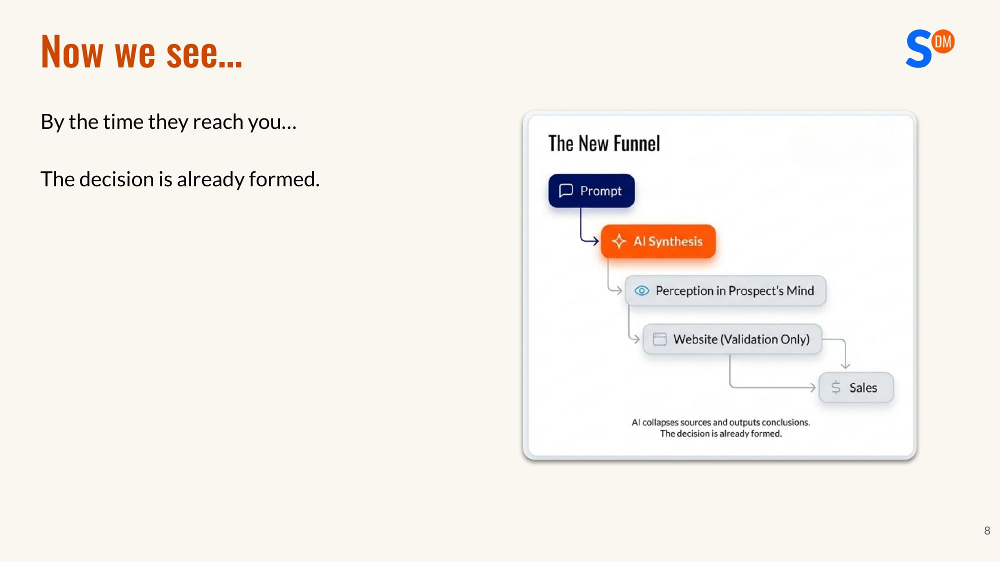
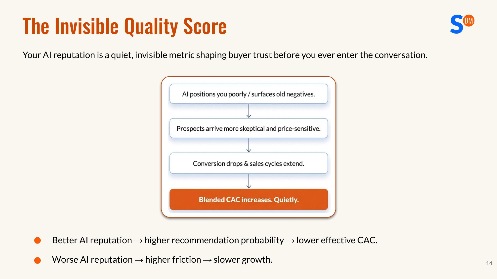
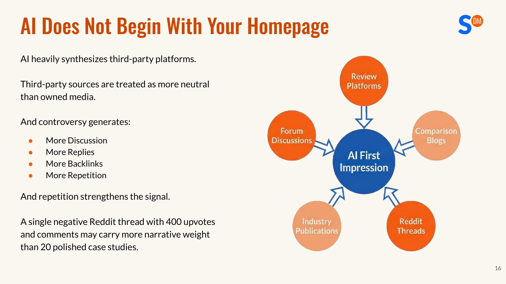
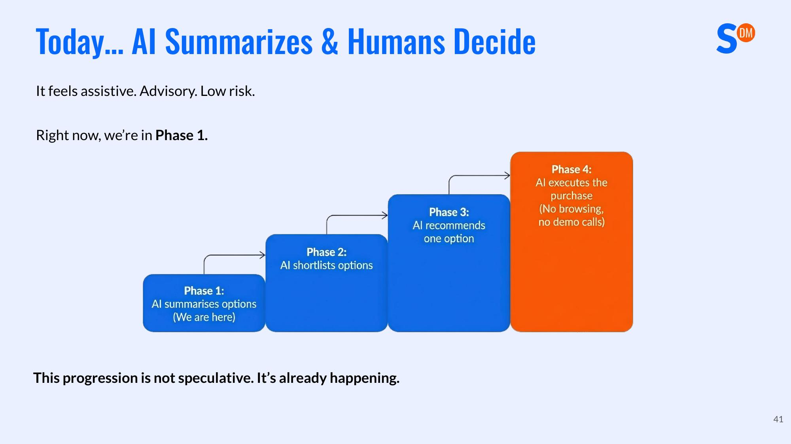
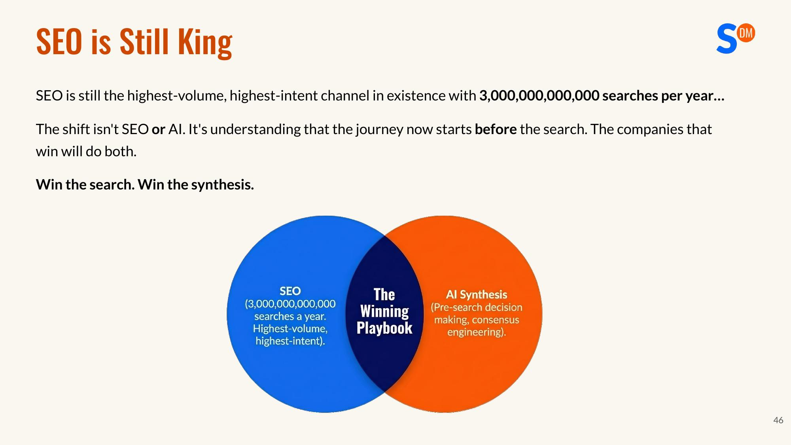

*Based on a talk by Jonathan Kiekbusch | SwishDM*

---

> In the next five years, some of the companies in this room will stop growing. Not because your product got worse, not because a competitor built something better, but because a machine quietly removed you from the shortlist.

That was Jonathan Kiekbusch's opening line in a talk aimed at SaaS founders. It's a jarring statement — and one that's becoming closer to reality every day.

Kiekbusch is the CEO of SwishDM, with over 12 years of experience in online retail and SaaS transformation. He has worked with major brands like EcoFlow, Insta360, and Dreame, helping them boost visibility and conversions through smarter SEO and GEO (Generative Engine Optimization). In this talk, he introduced a core framework — the **Perception Engineering Framework** — to explain how SaaS companies can systematically manage and optimize their "image" in the eyes of AI, at a time when AI is fundamentally reshaping the buyer's decision-making journey.

---

## 1. You've Already Lost Control of the First Impression

In the old internet world, every road led to the same destination — your website. Users searched for keywords, clicked links, landed on your site, browsed your carefully designed pages, were moved by your brand story, and eventually converted into customers. You controlled the narrative because you controlled the destination.

But now, that path is being fundamentally rewritten.

In the new funnel, users enter a prompt, AI performs synthesis, and perception forms directly in the user's mind. Your website? It's just a validation step — if the user even bothers to visit. By the time a prospect actually reaches your website, the buying decision is already largely made.

Kiekbusch put it clearly: most companies still think they control how their brand is perceived — you control the homepage, the brand messaging, the owned media. **But you no longer control the first impression. AI is doing that for you.**

And the first impression AI delivers might be completely different from what you intend. Imagine this: you spent three months redesigning your website, updating all your product copy, producing a beautiful brand video. But when a prospect asks ChatGPT "which project management tool is best for a 50-person SaaS team," the AI's response either doesn't mention your brand at all or describes you as you were two years ago. All your effort may simply not exist in AI's narrative.

---

## 2. This Is Not a Channel Shift — It's a Structural Transformation

Many people treat AI search as an "upgrade" to traditional search — just a different channel where the old playbook needs minor tweaks. Kiekbusch believes this understanding is dangerous.

There's a fundamental difference between traditional search and AI. Traditional search directs users to various sources and lets them compare on their own, giving you a chance to persuade them. AI compresses and merges those sources, eliminates the user's self-directed exploration, and outputs conclusions directly.

What does this mean? Your carefully crafted brand story gets compressed into a few bullet points. Your unique market positioning becomes a single "also offers..." clause. If you haven't optimized for machine readability, you'll be drowned out.

Even more brutal: in the AI world, there's no "page two." In traditional search, users typically compare 5 to 10 options. But in AI-synthesized responses, usually only 2 to 3 brands dominate the entire narrative, and AI will explicitly recommend a top choice. You're either mentioned or completely invisible — there's no middle ground.

Kiekbusch summed up the essence of this change: **The old game was about capturing traffic. The new game is about controlling consensus.** Because in an AI-mediated world, consensus determines visibility, and visibility determines survival.

---

## 3. The Invisible Quality Score: How AI Reputation Affects Your Customer Acquisition Cost

Your AI reputation is a quiet, invisible metric that's profoundly affecting buyer trust — before you even enter the conversation.

Kiekbusch calls it "The Invisible Quality Score," and here's how it works: if AI positions you poorly or surfaces historical negative information, the prospects who reach you start with skepticism and price sensitivity baked in. This leads to declining conversion rates, longer sales cycles, and ultimately a silently rising customer acquisition cost (CAC) — and you may not even know why.

Conversely, a better AI reputation means higher recommendation probability and lower acquisition costs. It's a flywheel — either virtuous or vicious — and the difference is whether you're actively managing it.

---

## 4. Where Does AI Get Its Information? Not From Your Website

This might be one of the most counterintuitive insights from the entire talk: **when LLMs build a narrative about you, the starting point is not your website.**

LLMs don't begin with your latest product launch page or your freshly updated positioning copy. They start with signals distributed across the entire internet — your website is just one node in the panorama, not the sole source.

More critically, when AI synthesizes information, it relies heavily on third-party platform content. Review sites, forum discussions, comparison blogs, industry media, Reddit posts — these third-party sources are treated by AI as more neutral than your owned media.

Kiekbusch gave a striking example: a Reddit post with 400 upvotes and extensive comments might carry more weight in AI's narrative than 20 carefully crafted case studies you produced. Why? Because controversial content generates more discussion, replies, backlinks, and repeated citations — and repetition reinforces the signal.

This leads to an important concept about AI's weighting mechanism: AI judgment is based on three dimensions — Authority, Consensus, and Frequency. If someone wrote a review two years ago saying "this product isn't suitable for agencies," and you never countered that claim with enough authoritative content, AI might still describe you that way today. **You're defined by historical content until new consensus overwrites it.**

AI pulls from these places: old reviews, Reddit posts, comparison articles, missing use-case coverage. This content gets compiled into a clean summary — and that summary becomes your first impression. You didn't write it, but it defines you.

---

## 5. Where Are Most SaaS Companies Dropping the Ball?

Kiekbusch points out that most SaaS executives have never done any of the following: never run a structured prompt audit, never categorized AI outputs by sentiment, never tested how AI describes their product features, never checked what AI says about them in competitive comparisons.

Yet these AI outputs are shaping buyer perception every single day.

It's as if your competitor is sending a "report" about you to every potential customer, every day — and you don't know what it says, nor do you have any way to intervene. This isn't an edge case — it's a core competitive blind spot.

Kiekbusch proposed a simple but powerful test: go to ChatGPT or Perplexity and ask "what's the best [your category] tool for [your target scenario]" and see what AI says about you. If that paragraph were the only thing a prospect ever read about you, could you win? No website, no demo, no pricing page — just a machine-generated summary shaping their expectations, trust, and willingness to pay. Before you even enter the conversation, everything is already set.

---

## 6. The Perception Engineering Framework: The 5D Methodology

Kiekbusch's Perception Engineering Framework is not a one-time marketing campaign — it's a continuous operating system for reputation management in the age of machines. It consists of five phases: Discover, Diagnose, Design, Distribute, and Defend.

### Step 1: Discover — You Can't Fix What You Can't See

Start with a prompt audit. Most companies have never done this. Here's how: create a project in ChatGPT, set memory to "Project-only" to prevent AI from using external memory and ensure unbiased output. Then write a persona prompt, putting yourself in the customer's shoes — something like "I manage a 40-person marketing team and we're expanding internationally..." Then, within that same project, ask the questions your real prospects would ask.

Key audit directions include: best tool recommendations for specific use cases, how your brand compares to competitors, whether your brand fits a particular niche, and whether your brand supports a specific feature. Export all responses, categorize them by sentiment, and patterns will emerge quickly.

For executing at scale, use prompt tracking tools like Scrunch AI to batch-download AI outputs and analyze sentiment. You'll see clearly where the narrative breaks down.

### Step 2: Diagnose — Pinpoint Where You've Lost Narrative Control

After discovering the problems, the next step is mapping exactly where you've lost control of the narrative. Loss of control typically occurs across five dimensions: positioning in competitive comparisons, authority of feature descriptions, coverage of use cases, residual impact of historical negative content, and visibility of problem-solving capabilities.

The key principle: prioritize by pipeline impact. Ask yourself "which issues are actually hurting our conversion rates?" Fix the narrative breakpoints that directly affect purchasing decisions first.

### Step 3: Design — Proactively Build the Narrative You Want

If AI is synthesizing comparison information, you need to structure the comparison first. Build around: X vs. Y comparison content, "best alternatives" content, clear differentiation positioning, and explicit use-case segmentation.

**If you don't define the comparison, AI will define it for you.** And AI's definition might be based on outdated information from two years ago.

For every niche where you're currently mislabeled or absent: create targeted use-case content, publish it on third-party platforms, and encourage users from that segment to update their reviews.

Review strategy is especially important. Old reviews don't disappear, but they can be outweighed. A continuous, proactive review strategy — getting your current product described by real users — isn't a nice-to-have. It's a necessity.

### Step 4: Distribute — Signals Must Be Everywhere AI Pulls Information

Publishing only on your own website is far from enough. AI pulls information from: your website, review platforms, industry media, Reddit and community forums, developer documentation and tech ecosystems.

Your website is just one signal. Authority is distributed. You need to establish presence wherever momentum can accumulate: backlinks, discussions, citations, mentions.

Kiekbusch offered a clear benchmark: **ten high-quality distributed mentions beat fifty mediocre blog posts. Signal density matters more than volume.**

### Step 5: Defend — Continuously Monitor and Reinforce the Narrative

Perception is dynamic. Competitors are publishing new content, reviews are being updated, old posts resurface, and new features change the positioning landscape.

Continuous defense should include: ongoing content creation to control the narrative, regular prompt tracking cadence, cross-platform sentiment monitoring, and quarterly audit cycles to catch new narrative gaps.

**Reputation drift is real. Your competitors won't stand still.**

---

## 7. The Five-Year Outlook: From AI Advice to AI Purchasing on Your Behalf

Kiekbusch laid out a four-stage prediction for AI's role in purchasing decisions.

We're currently in Stage 1: AI summarizes options, humans decide. It still feels advisory, consultative, low-risk.

But what comes next, in sequence: Stage 2 — AI shortlists candidates; Stage 3 — AI directly recommends one option; Stage 4 — AI executes the purchase (no browsing, no demo calls).

This progression isn't speculation — it's already happening. Kiekbusch gave a relatable example: you tell your home AI device "organize a princess-themed birthday party for my daughter next Saturday." The AI orders decorations, books performers, confirms catering. Did you compare 12 vendors? Read reviews? Browse websites? No. AI chose for you.

The same applies in SaaS. A founder might say: "Set up a collaboration platform for our new marketing team, mid-range pricing, integrates with HubSpot, invite everyone." AI evaluates tools, reads sentiment, selects a vendor, creates the account. If you're not in the machine's consensus, you won't even be considered.

In the old world, you might lose the race. In the new world, you might never make it to the starting line. **You won't fail. You simply won't exist. And you won't know why.**

When AI agents start executing purchasing decisions on behalf of humans, differentiation must be machine-readable. Authority must be distributed. Reputation must be structured. Consensus must be engineered. If your narrative is vague, AI will flatten you into the same description as your competitors. If your narrative is weak, you'll be excluded entirely.

This isn't a distant future. OpenAI's Operator can already browse the web and execute actions on behalf of users, and Google's AI Agent is iterating rapidly. The distance from "AI helps you choose" to "AI buys for you" might be just a year or two.

---

## 8. Don't Forget: SEO Is Still King

Before going all-in on AI narrative, Kiekbusch offered an important reminder: SEO is still the largest-traffic, highest-intent channel in existence, with 3 trillion searches globally every year.

This isn't an "SEO or AI" binary choice. The winners are companies that excel at both. **Win search, win synthesis.** The customer journey now begins before search. The companies that win understand that decisions happen before the visit — and increasingly, decisions happen without any visit at all.

---

## Final Thoughts

Kiekbusch's core argument can be distilled to a single sentence: **Perception is no longer a part of brand building — it's the infrastructure for competitive survival.**

In the AI era, your brand is no longer what you say it is — it's whatever version AI compiles. Design disappears, emotion disappears, persuasion disappears. What's left is flattened consensus. If that consensus works against you, your customer acquisition costs will quietly climb, your pipeline will mysteriously shrink, and you might not even be able to figure out why.

But the good news is that consensus can be engineered. Through the five-step framework of Discover-Diagnose-Design-Distribute-Defend, you can systematically audit how AI describes you, locate where the narrative breaks, build the right content and authority to fix it, distribute signals to wherever AI pulls information, and then continuously monitor and reinforce.

This isn't a one-time project — it's a continuous operating system. Just as you wouldn't build a website and never update it, you can't run one AI audit and consider the job done. Perception is dynamic, and your competitors won't wait around for you.

If you can only do one thing today, do this: open ChatGPT and ask how AI describes your product, how it compares you to competitors, and how it evaluates your fit for specific use cases. Export the responses. Read them carefully. You'll likely find that what AI says is completely different from what you assumed. That gap is exactly where you need to start engineering.

The window for this transformation won't stay open forever. When AI evolves from "summarizing options" to "placing orders directly," you'll either already be on the machine's consensus list, or you'll never appear on it. Act now — there's still time.

> Engineer your perception. Before it engineers you.
