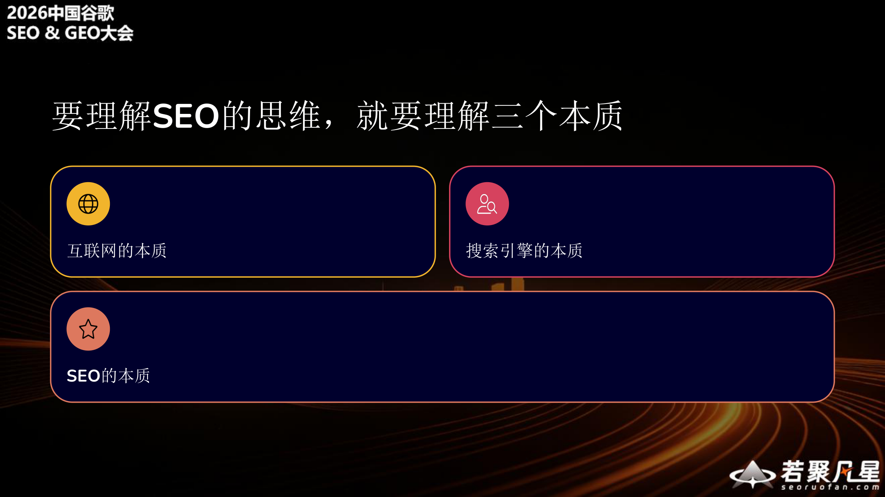
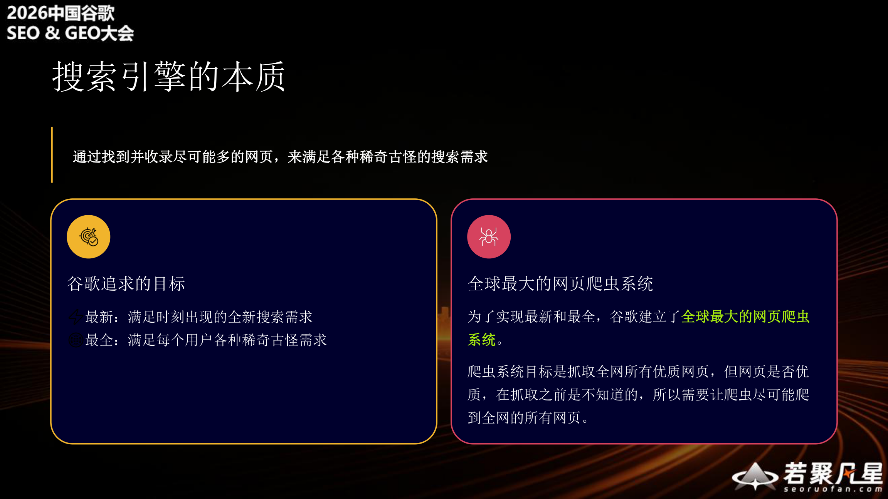
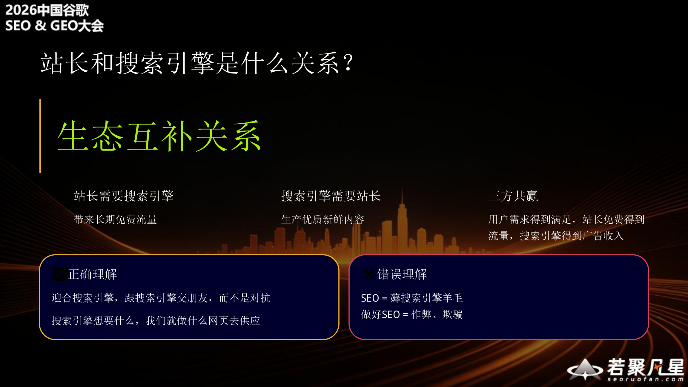
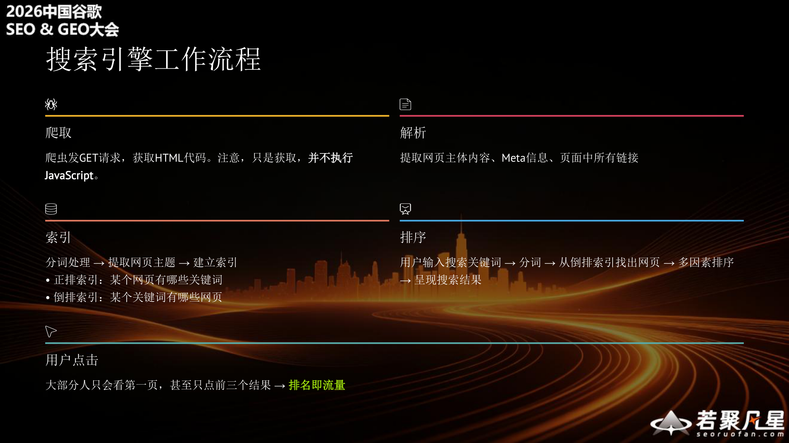
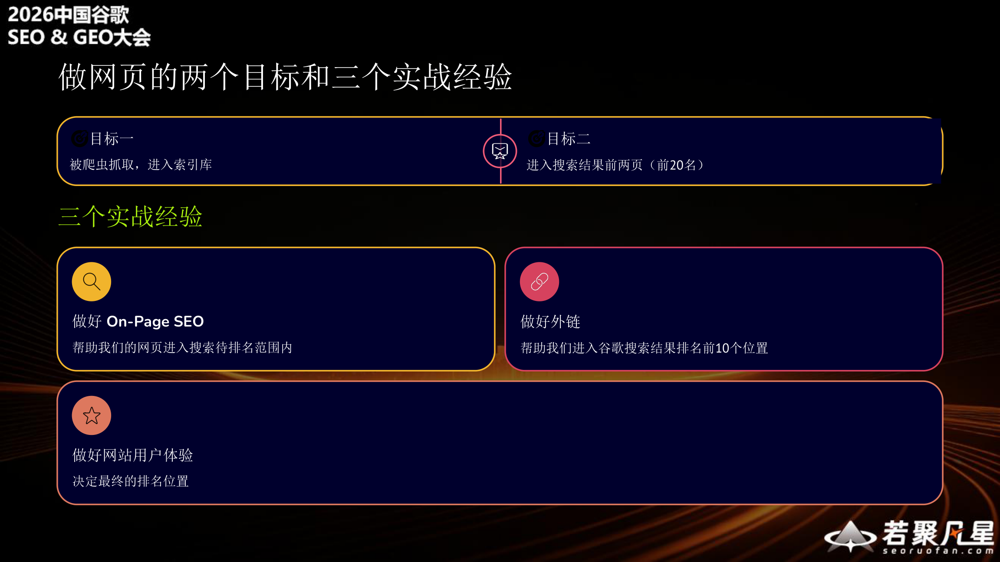
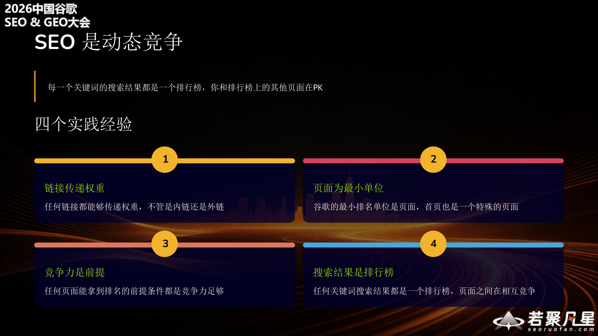
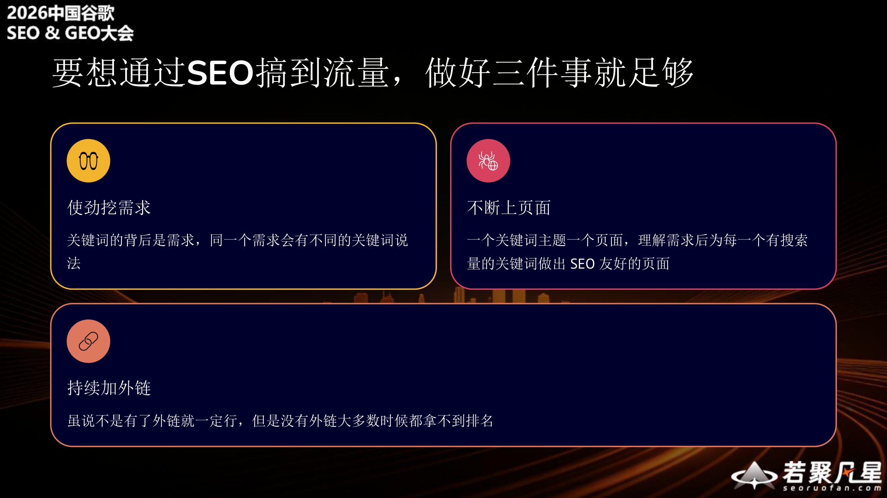
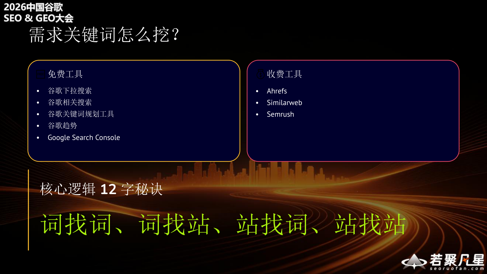
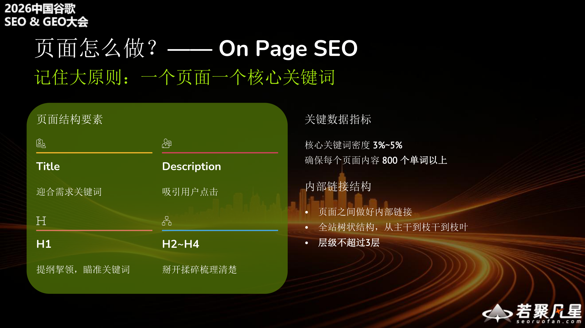
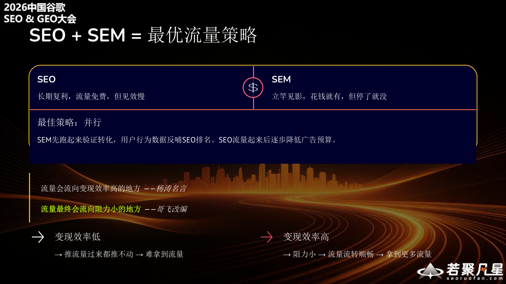

> This article is based on GeFei's talk "Rebuild Your SEO Thinking from Search Engine Fundamentals" at the 2026 China Google SEO & GEO Conference. By doing SEO well, you can truly acquire free traffic and save massive advertising costs. This article will help you build your own SEO thinking framework starting from three fundamental essences.

---

## 1. Who is GeFei

GeFei wears four hats:

- **SEO Practitioner**: Years of SEO experience, started as a webmaster in 2008, researching SEO and practicing website building, and developed his own SEO thinking framework
- **Hands-on Developer**: Years as a frontline engineer, continuously writing code. An SEO person who can't code is not a good webmaster
- **Website Operator**: Runs multiple AI tool websites, acquires traffic through SEO and SEM, and monetizes through AdSense and paid subscriptions
- **Community Leader**: Runs a 5,000+ member paid community for AI-powered international business, teaching members how to discover demand, do SEO, acquire traffic, and monetize

### GeFei's Website GSC Data

GeFei's websites show impressive Google Search Console performance, with multiple sites achieving hundreds of thousands of clicks and millions of impressions. These numbers demonstrate the power of SEO.

### Community Members' Website GSC Data

It's not just GeFei's own sites that perform well — community members' websites show equally impressive results. Multiple members' sites have achieved hundreds of thousands or even millions of clicks, with the highest single site reaching 3.07 million clicks and 28.32 million impressions.

### What's the Value of Good SEO?

**SEO traffic = free precision traffic.**

Using one of GeFei's websites as an example (February 2026 data):
- 3.7M search traffic, 3.08M organic traffic
- 618.79K paid traffic, $309.3K cost per click spend
- **If you had to buy those 3.08M organic visits through ads, it would cost approximately $1.54 million**

This is the value of SEO — the advertising money saved is pure profit.

---

## 2. Why Rebuild Your SEO Thinking

**Most people learn SEO techniques. Today we're talking about SEO's underlying logic.**

- **Techniques become outdated**: When the algorithm updates, yesterday's effective techniques stop working today
- **Underlying logic doesn't change**: Understand the essence of search engines, and you can derive the right approach for any change
- **Today's goal**: Starting from three essences, help you build your own SEO thinking framework

---

## 3. Understanding the Three Essences of SEO

To understand SEO thinking, you must understand three essences: **the essence of the internet**, **the essence of search engines**, and **the essence of SEO**.

### The Essence of the Internet

The essence of the internet is **a massive network of countless web pages connected by links**.

Key numbers:
- **1.1 billion** — total websites globally
- **100 billion+** — total web pages globally
- **50 billion+** — web pages indexed by Google

Even as the world's largest search engine, Google has only indexed about half of all web pages. This shows the internet's scale far exceeds our imagination.

### The Essence of Search Engines

The essence of search engines is **to find and index as many web pages as possible, to satisfy all kinds of search queries**.

**Google's goals**:
- **Most current**: Satisfy new search queries emerging every moment
- **Most comprehensive**: Satisfy every user's diverse and unusual needs

**The world's largest web crawler system**: To achieve currency and comprehensiveness, Google built the world's largest web crawling system. The crawler's goal is to fetch all quality web pages, but since page quality can't be determined before crawling, the crawler must try to reach every page on the entire internet.

### The Essence of SEO

**The essence of SEO is to help search engines better crawl and understand your web pages.**

This has two dimensions:

- **Better crawling**: Clear site structure, complete internal links, and proper sitemap, so crawlers can traverse every page without obstacles
- **Better understanding**: Accurate titles, descriptions, and body keywords, so search engines understand what your page is about

---

## 4. The Relationship Between Webmasters and Search Engines — Ecological Complementarity

Webmasters and search engines have an **ecologically complementary relationship**, not an adversarial one.

- **Webmasters need search engines**: To bring long-term free traffic
- **Search engines need webmasters**: To produce quality, fresh content
- **Three-way win**: Users get their needs met, webmasters get free traffic, search engines earn ad revenue

**Correct understanding**: Embrace search engines, befriend them. Whatever search engines want, we create web pages to supply it.

**Wrong understanding**: SEO = exploiting search engines; good SEO = cheating and deception.

---

## 5. AI Is Here, Is SEO Dead?

**I disagree with this claim.**

Anyone saying this clearly doesn't understand SEO or AI.

- **What AI can satisfy**: AI can handle some informational search queries
- **What AI cannot directly satisfy**: There are many interaction-heavy needs AI cannot directly fulfill — social media, e-commerce, gaming, tools, services, video streaming...

**Why does this misconception exist?** Because most people assume: website = content website. In reality, websites can provide all kinds of diverse services.

---

## 6. How Search Engines Work

Understanding the search engine workflow is crucial for good SEO:

1. **Crawling**: The crawler sends GET requests to fetch HTML code. Note: it only fetches — it **does not execute JavaScript**
2. **Parsing**: Extracts the page's main content, Meta information, and all links on the page
3. **Indexing**: Word segmentation → extract page topics → build indexes
   - Forward index: which keywords does a given URL contain
   - Inverted index: which pages contain a given keyword
4. **Ranking**: User enters a search query → word segmentation → find pages from inverted index → multi-factor ranking → display search results
5. **User clicks**: Most people only look at the first page, some only click the top three results → **ranking equals traffic**

---

## 7. Three Classic Questions Answered

Once you understand how search engines work, three classic questions have obvious answers:

### Should tool sites, e-commerce, video, and gaming pages create content?

→ **Absolutely!** Without content, how does Google know what's on your page? Google can only judge and match user searches based on the text content you write.

### Why avoid client-side rendering?

→ Crawlers only fetch HTML — they **don't execute JS**. Client-side rendering = an "empty shell." Google only renders JS for major sites; our small sites don't get that treatment.

### Why can't multilingual sites use JS switching?

→ JS switching doesn't change the URL. Crawlers can only capture content in one language — other languages are effectively wasted effort.

---

## 8. Two Goals and Three Practical Experiences for Web Pages

### Two Goals

- **Goal 1**: Get crawled and enter the index
- **Goal 2**: Rank in the top two pages of search results (top 20)

### Three Practical Experiences

1. **Do On-Page SEO well**: Helps our pages enter the ranking range
2. **Build backlinks well**: Helps us reach the top 10 positions in Google search results
3. **Deliver great user experience**: Determines the final ranking position

---

## 9. SEO Is Dynamic Competition

**Every keyword's search results page is a leaderboard — you're competing against other pages on that leaderboard.**

Four practical insights:

1. **Links pass authority**: Any link can pass authority, whether internal or external
2. **Pages are the smallest unit**: Google's smallest ranking unit is the page; the homepage is just a special page
3. **Competitiveness is a prerequisite**: For any page to rank, having sufficient competitiveness is the precondition
4. **Search results are leaderboards**: Every keyword's search results are a leaderboard where pages compete against each other

---

## 10. Three Things to Do Well in SEO

**To get traffic through SEO, doing three things well is enough:**

1. **Aggressively mine demand**: Behind every keyword is a user need; the same need can be expressed with different keywords
2. **Continuously publish pages**: One keyword topic per page; understand the demand, then create an SEO-friendly page for every keyword with search volume
3. **Steadily build backlinks**: While having backlinks doesn't guarantee rankings, without them you usually can't rank at all

---

## 11. Demand Keyword Mining

### What Are Demand Keywords

After search engines crawl web pages, they segment the content into tokens and build an index. **Keywords = the words users type into the search box = carriers of user demand.**

**Every keyword's search results page is an independent leaderboard.**

Our goal: Be better than the competitors already ranking at the top of that leaderboard to have a chance at ranking.

Key mindset shift:
- **You don't need** to compete with every web page in the world
- **You only need** to compete with the top few dozen pages in that keyword's search results

Once you understand this, you'll realize SEO isn't that hard.

### How to Mine Demand Keywords

**Free tools**:
- Google autocomplete suggestions
- Google related searches
- Google Keyword Planner
- Google Trends
- Google Search Console

**Paid tools**:
- Ahrefs
- Similarweb
- Semrush

**The core logic in 12 characters: word-to-word, word-to-site, site-to-word, site-to-site**

- **Word-to-word**: Start from one keyword, find more related keywords
- **Word-to-site**: Search a keyword to find competing websites that rank well
- **Site-to-word**: Analyze competitor sites to find all keywords they rank for
- **Site-to-site**: Through one competitor, discover more similar competitors

Repeat these four steps in a cycle to uncover a massive pool of demand keywords.

---

## 12. On-Page SEO

**Remember the key principle: one page, one core keyword.**

### Page Structure Elements

- **Title**: Match the demand keyword
- **Description**: Attract user clicks
- **H1**: Provide focus, target the keyword
- **H2~H4**: Expand and organize supporting content

### Key Data Metrics

- Core keyword density: **3%~5%**
- Ensure each page has **800+ words** of content

### Internal Link Structure

- Build proper internal links between pages
- Use a tree-like site structure: trunk → branches → leaves
- Keep the hierarchy within 3 levels

---

## 13. How to Build Backlinks

**Use every possible method to get your website's links appearing on other websites.**

The best approach is to "copy the homework":

1. **Find competitor websites**: Use keywords to find peer websites in your niche
2. **Analyze competitor backlinks**: Use Ahrefs or Semrush to examine their backlink profiles
3. **Filter actionable backlinks**: Analyze and select backlinks that you can realistically replicate
4. **Accumulate steadily**: Build up gradually, continuously adding backlinks over time

---

## 14. SEO + SEM = The Optimal Traffic Strategy

**SEO**: Long-term compounding, free traffic, but slow to take effect.

**SEM**: Immediate results, pay to play, but stops when you stop paying.

**Best strategy: Run both in parallel.**

Start with SEM to validate conversions; user behavior data feeds back to improve SEO rankings. As SEO traffic grows, gradually reduce the ad budget.

> Traffic flows to where monetization efficiency is highest — Yang Tao's famous quote
>
> Traffic ultimately flows to where resistance is lowest — GeFei's law

- **Low monetization efficiency** → Even pushing traffic doesn't move the needle → Hard to acquire traffic
- **High monetization efficiency** → Low resistance → Smooth traffic flow → Acquire more traffic

---

## 15. Summary

Starting from search engine fundamentals, we can build a complete SEO thinking framework:

1. **Understand three essences**: The internet is a network of pages, search engines index all pages to satisfy search needs, and SEO is about helping search engines better crawl and understand your pages
2. **Recognize the relationship**: Webmasters and search engines are ecologically complementary, not adversarial
3. **Master the workflow**: Crawl → Parse → Index → Rank → User click
4. **Do three things well**: Aggressively mine demand, continuously publish pages, steadily build backlinks
5. **Run SEO + SEM in parallel**: SEM validates conversions, SEO acquires long-term free traffic

> Techniques become outdated, but underlying logic doesn't change. Understand the essence of search engines, and you can derive the right approach for any change.

---

*Speaker contact:*
- *WeChat / Twitter: GeFei55*
- *WeChat Official Account / Jike: GeFei (哥飞)*
- *Community: GeFei's Friends (哥飞的朋友们)*
