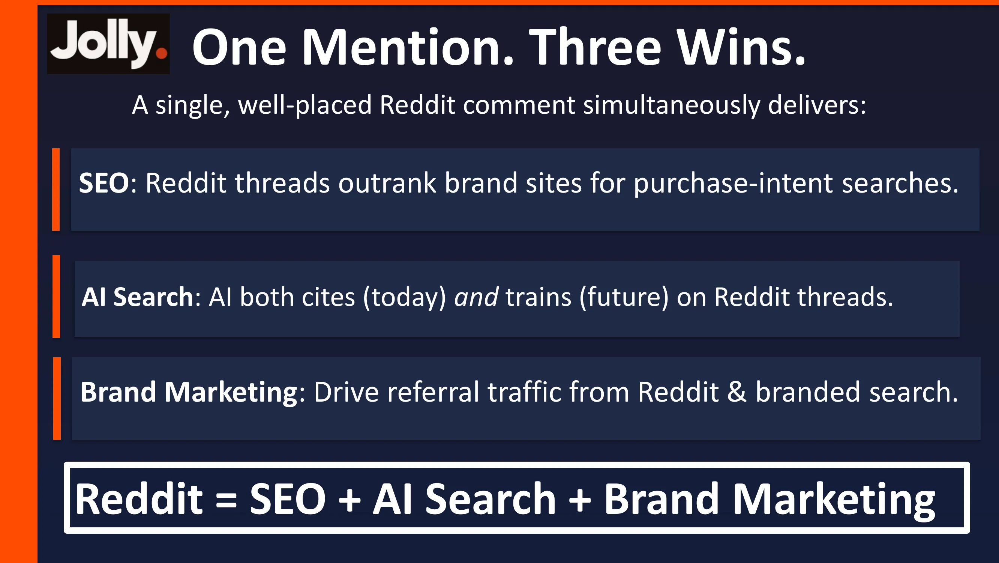
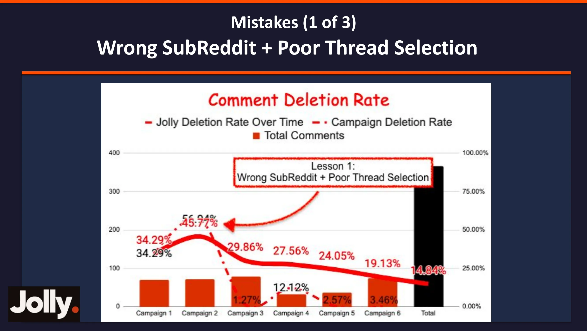
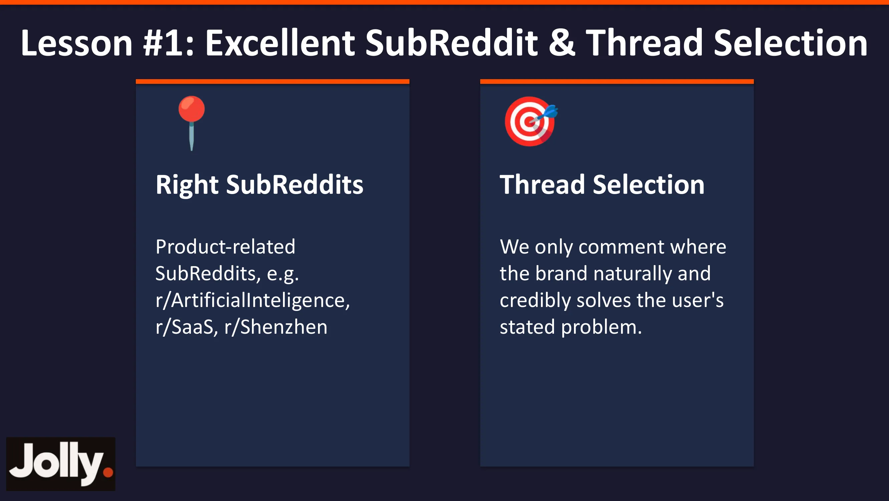
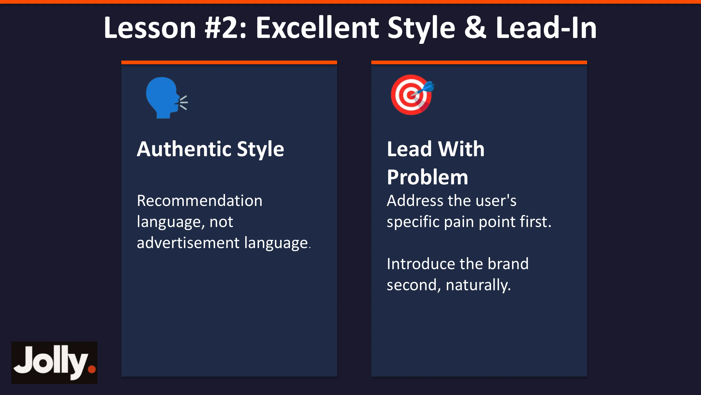
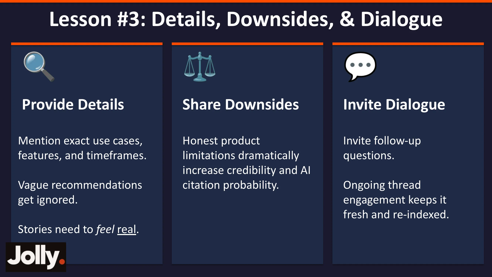
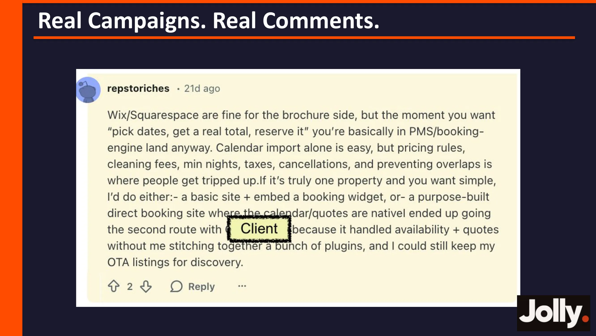
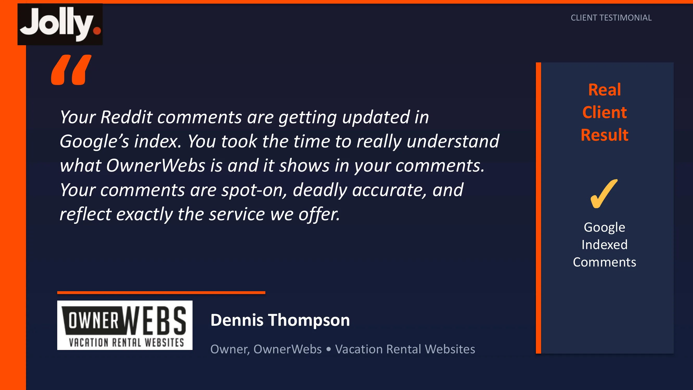
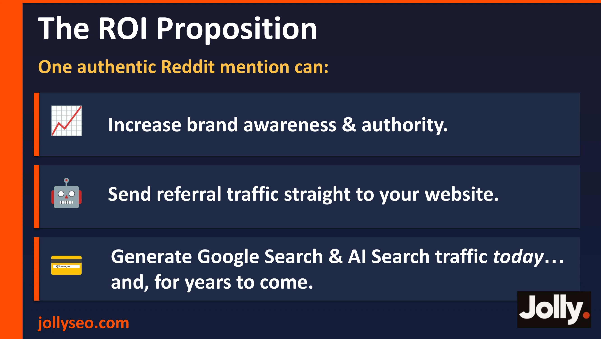

> This article is based on a presentation by Greg Heilers at the "SEO in Practice · 2026 SaaS & AI Global Growth Summit" (March 8, 2026). Greg is the founder of Jolly SEO, with 8 years of experience in brand authority building. His team has earned over 25,000 backlinks for clients and has been recognized by leading SEO platforms including Moz, Ahrefs, Backlinko, and brightonSEO. Greg currently lives in Hefei, China, and has spoken at SEO events in Hangzhou and Shenzhen.

---

Reddit is becoming one of the most underrated channels for SaaS and AI product growth.

Not because Reddit itself drives massive traffic, but because it plays an extraordinarily unique role in the age of AI search — ChatGPT, Perplexity, and Google AI Overview are all citing Reddit posts and comments with increasing frequency. In other words, a single comment you leave on Reddit today could be referenced by AI repeatedly for months or even years.

But here's the problem: Reddit is one of the most marketing-hostile communities on the internet. Post in the wrong place, strike the wrong tone, or come across as even slightly inauthentic, and moderators will delete your comment — wasting your effort and potentially damaging your brand reputation.

In this article, I'll walk through the 3 major mistakes Jolly SEO's team made on Reddit, the 3 core lessons they distilled from those failures, and real comment examples that actually delivered results. If you're working on GEO or considering Reddit as a brand marketing channel, this article can save you a lot of trial and error.

---

## 1. Why Reddit Deserves Serious Investment

### One Comment, Three Wins

Greg opened with a core thesis: **Reddit = SEO + AI Search + Brand Marketing**.

A well-crafted Reddit comment can deliver value across three dimensions simultaneously:

**SEO Value:** Reddit posts are ranking higher and higher in Google search results. For purchase-intent queries like "best X for Y," Reddit threads often outrank brand websites. Getting your brand mentioned in these high-ranking threads is essentially free, premium SEO exposure.

**AI Search Value:** This is the most significant opportunity right now. AI models not only cite Reddit content in real-time retrieval (via RAG mechanisms), but also absorb this content during future model training. This means a brand mention you place on Reddit today doesn't just influence today's AI responses — it could shape the model's "memory" going forward.

**Brand Marketing Value:** Reddit drives direct referral traffic and brand search volume growth. When users see a genuine recommendation for your product on Reddit, their next step is often to Google your brand name — and that's the core driver behind increased branded search volume.

These three layers of value combined make Reddit one of the highest-ROI channels for brand mentions available today.

---

## 2. Reddit's Anti-Spam Defenses: What You're Up Against

Before discussing strategy, you need to understand your adversary — Reddit's content moderation system.

According to Reddit's 2025 transparency report, **2.66%** of all content on the platform gets removed. Of that, **1.41%** is removed by moderators, and **1.25%** by Reddit's admin team.

2.66% might sound low, but consider that Reddit processes an enormous volume of content daily. And that figure is a platform-wide average — if you're posting brand-related marketing content, your deletion rate will be significantly higher than the baseline.

Digging deeper into moderator removals, **71.3%** are handled by Automod (automated moderation bots), while **28.7%** are manual moderator actions.

What does this mean? First, your comment needs to survive Automod's rule checks — many SubReddits have keyword filters, account age requirements, karma thresholds, and other automated rules. Second, even if you clear the automated filters, a comment that looks like advertising will still be removed by a human moderator.

Greg's bottom line: **An inauthentic presence leads to extremely high deletion rates.**

So what does an "authentic presence" look like? That's exactly what Jolly's team — a group of 30+ people running 6 campaign cycles through countless stumbles — figured out through three hard-won lessons.

---

## 3. Before You Comment: Do Your Homework

### Step 1: Define Your Brand Voice

Before writing a single comment, answer a few key questions:

What image should your brand project in Reddit community discussions? Should it be helpful and supportive? Educational and informative? Neutral and factual? Expert and authority-led? Or casual and relatable?

Beyond that, clarify: What topics should your brand be associated with? What language, tone, or phrasing should be avoided? Who are your competitors?

These questions seem basic, but they determine the consistency of your "persona" across all future comments. If your comment style is geeky and technical today but switches to polished marketing copy tomorrow, moderators and users will spot the inconsistency immediately.

### Step 2: Find the Best SubReddits and Threads

The second step is systematically identifying the most valuable SubReddits and threads. This involves a combination of manual searching and crawler tools, then organizing the data into a spreadsheet tracking SubReddit names, post URLs, posting dates, comment counts, upvote counts, and other key metrics.

Prioritize based on three principles: newer posts first (they're easier to rank), active posts first (discussion drives visibility), and relevance first (alignment with your brand must be strong).

Only after completing these two preparation steps should you move on to actually writing comments.

---

## 4. Mistake #1: Choosing the Wrong SubReddit and Thread

This was the first major error Jolly's team made.

Their client was a **B2B collections agency** (debt recovery services). But during execution, the team posted a comment in r/SaaS under a thread titled "What is the best payment platform today to collect subscription fees for a SAAS Business?"

The problem? They missed on both dimensions:

**Wrong SubReddit:** r/SaaS is a community for discussing SaaS products, but the client was a collections agency — not a SaaS product at all. Commenting in a community that doesn't match your category feels completely out of place.

**Wrong Thread:** The thread was about payment platforms — how to collect SaaS subscription fees. The client offered debt collection services — helping recover overdue payments. Payment platforms and debt collection are entirely different things. Recommending a collections agency in a thread about payment platforms is like suggesting a wheelchair in a discussion about which running shoes to buy.

### The Direct Consequence: Deletion Rates Skyrocketed

Looking at Jolly's Comment Deletion Rate tracking chart, during Campaign 1 and Campaign 2 (when this mistake was being made), deletion rates hit **34.29%** and **45.77%** respectively. Nearly half of all comments were being deleted — meaning half the team's effort was completely wasted.

### Lesson #1: Match the SubReddit and Thread with Precision

The correct approach requires precision on both dimensions:

**Right SubReddit:** Only engage in SubReddits directly relevant to your product. If your product is an AI tool, go to r/ArtificialIntelligence. If it's a SaaS product, go to r/SaaS. If you're targeting a specific geographic market, find the corresponding regional community.

**Right Thread:** Only comment under threads where your brand can naturally and credibly solve the user's problem. The litmus test is simple: if you remove your brand name, does the comment still read as a valuable response? If yes, the match is strong. If the comment has no reason to exist without the brand name, you're just force-feeding an ad.

---

## 5. Mistake #2: Wrong Writing Style and Wrong Angle

After correcting the SubReddit and thread selection, Jolly's team ran into a second problem during Campaign 3.

The client was still the same B2B collections agency. This time, they chose the right SubReddit — r/smallbusiness, exactly where the client's target audience hangs out. The thread was also on point — "Debt Collection Agency Recommendations," with the original poster explicitly asking for agency recommendations.

Everything looked like a perfect match. But here's what the comment looked like:

> *When rental debts start dragging on, the bigger question often becomes whether the effort to chase them is still proportional to the amount at stake. I've seen situations where having someone else take over simply created distance and clarity, especially when the debt was clearly business-to-business rather than personal. In one case I was familiar with, \[Client name\] came up because...*

Two fatal flaws:

**The writing style screamed AI-generated:** The text was too polished — sophisticated vocabulary, complex sentence structures, and neatly layered logic. That's not how Reddit users write. Reddit language is casual, conversational, and often includes typos and grammatical imperfections. A perfectly constructed paragraph is actually the biggest red flag on Reddit.

**The angle was wrong:** The original poster asked for a collections agency recommendation — a very direct question. But instead of answering directly, the comment opened with a lengthy philosophical musing about "whether debt collection is worth the effort," only circling around to the client's name after a long preamble. On Reddit, this kind of roundabout approach triggers users' built-in marketing-detection instincts.

### The Direct Consequence: Deletion Rates Improved but Remained High

During Campaign 3, the deletion rate dropped to **29.86%** — an improvement over before (because the SubReddit and thread selection were now correct), but still nearly one in three comments getting removed. The problem was in how the comments themselves were written.

### Lesson #2: Write Like a Real Person — Solve the Problem First, Then Mention the Brand

**Authentic Style:** Use the language of recommendation, not the language of advertising. How do real Reddit users recommend products? They say things like "I tried XX, it's pretty solid, the main thing is the XX feature works really well" — not "XX is an industry-leading solution that leverages its advanced technical architecture and superior user experience..."

Specific writing tips include: occasionally skip a space after a period (real users do this all the time), avoid bullet points (Reddit comments rarely use list formatting), use informal expressions (gonna, kinda, tbh), and throw in occasional humor or self-deprecation.

**Lead With the Problem:** Address the user's pain point first, then introduce the brand naturally. If someone asks "recommend a collections agency," your comment should open with a recommendation in the very first sentence, then explain why. Don't front-load a wall of context and only "happen to" mention the brand at the end.

---

## 6. Mistake #3: No Details, No Downsides, No Dialogue

By Campaigns 4 and 5, Jolly's team had internalized the first two lessons: SubReddit and thread selection was on point, and the writing style and angle were correct. But they still ran into issues.

This time the client was a B2B2C e-commerce product company. The SubReddit and thread both matched precisely, and the writing felt natural and conversational. Here's what the comment looked like:

> *\[Solid Writing & Lead-In\]... What helped me was switching up how I sourced the transfers. I gave \[Client Name\] a try recently, and so far, the colors stayed vibrant even after multiple presses. Fingers crossed I'll get the same results next time, which will save me from reprinting stuff all the time.*

It looks decent at first glance, but three issues revealed it wasn't quite authentic enough:

**No Details:** What colors? What material? How many presses? Someone who has actually used a product will naturally include these specifics. A comment without details reads like a restaurant review written by someone who never actually ate there — vague and unconvincing.

**No Downsides:** The product comes across as flawless? That's the biggest red flag on Reddit. Real users almost always mention something imperfect when recommending a product — "The only downside is customer support is a bit slow" or "It's pricier than alternatives, but worth it." A comment that's all praise will immediately look like a planted ad to any moderator.

**No Discussion:** The comment shared a personal experience but didn't invite others to join the conversation. On Reddit, good comments often end with a question — "Anyone else had a similar experience?" or "Has anyone tried XX?" These invitations to dialogue not only make the comment feel more natural but can spark follow-up discussion, keeping the thread active and triggering search engines to re-index it.

### The Direct Consequence

Looking at the data chart, after iterating through three rounds of lessons, Jolly's comment deletion rate fell from the initial 34.29% all the way down to **2.57%** in Campaign 5 and **3.46%** in Campaign 6, with the overall deletion rate ultimately settling at **14.84%**. That's a remarkably clean downward curve.

### Lesson #3: Provide Details, Acknowledge Downsides, Invite Dialogue

**Provide Details:** Reference specific use cases, feature specifics, and timeframes. Vague recommendations get ignored — stories need to "feel real." For example, don't say "this tool is great." Say "I've been using it for 3 months, mainly to generate weekly client reports, and exporting to PDF is roughly 2x faster than the tool I used before."

**Share Downsides:** Be honest about the product's imperfections. This is counterintuitive, but it's the most effective credibility catalyst. Greg specifically emphasized: honest descriptions of product limitations "dramatically" boost credibility and the likelihood of being cited by AI. AI models, when assessing information reliability, tend to cite content that is more balanced and objective.

**Invite Dialogue:** End your comment with an invitation for follow-up discussion. Ongoing thread engagement not only makes content appear more natural but keeps the thread "fresh" — search engines and AI models re-index active threads more frequently.

---

## 7. Real Example: What a Comment Looks Like When All Three Lessons Come Together

When all three lessons are properly applied, the results are transformative.

### Example: Vacation Rental Website Service Recommendation

This comment appeared in a thread on r/ShortTermRentals where the original poster asked, "Has anyone built their own website for direct bookings outside of Airbnb?"

The commenter (a Jolly team account) first discussed in detail the limitations of Wix/Squarespace when handling booking functionality — calendar syncing is the easy part, but pricing rules, cleaning fees, minimum stay requirements, taxes, and cancellation policies are where most people get stuck. Then they naturally introduced the brand: "If you've got just one property and want to keep it simple, you can either build a basic site and embed a booking widget, or go with a platform built specifically for direct bookings. I ended up going with option two and used \[Client\]..."

Note the key characteristics of this comment: it leads with valuable industry knowledge (which features are pain points) before naturally introducing the brand; it mentions the brand's specific strengths (handling availability and quotes) without positioning it as a perfect solution; the overall tone reads like an experienced industry insider sharing hard-earned wisdom in a community discussion.

---

## 8. Client Feedback: Validating the Results

Dennis Thompson, founder of OwnerWebs (a vacation rental website platform), provided this feedback: "Your Reddit comments are getting updated in Google's index. You took the time to really understand what OwnerWebs is and it shows in your comments. Your comments are spot-on, deadly accurate, and reflect exactly the service we offer."

This feedback validates two critical points: first, the Reddit comments were indeed being indexed by Google, confirming that the SEO value is real; second, the accuracy and professionalism of the comments earned the client's personal endorsement, proving that Jolly's team genuinely invested the effort to understand the client's product.

---

## 9. What Not to Do: A Quick-Reference Checklist

Beyond the three core lessons, Greg shared several common anti-patterns to avoid:

**Fake Questions:** Posts like "Has anyone tried this amazing tool called \[X\]?" are transparently fake. Moderators have seen this tactic thousands of times — they'll delete it on sight and may even ban the account.

**Super Short Comments:** One-liner comments (e.g., "I recommend XX, it's great") have noticeably higher deletion rates. Comments that are too short lack context and detail, making them look like mass-produced bot content.

**Bad Comparisons:** Greg specifically called out the LinkedIn-style approach — comparing a SaaS startup journey to running a marathon. That kind of writing might earn a few likes on LinkedIn, but on Reddit it'll only get you ridiculed. Reddit is not LinkedIn. Leave the "storytelling marketing" at the door.

---

## 10. General Best Practices

**Minimal Links:** Only include a link when it provides direct, clear value to the reader. Don't drop a link in every comment — that's the fastest way to trigger Automod and raise moderator suspicion. In most cases, simply mentioning the brand name is enough. Interested users will search for it on their own.

**Human Review:** Every comment must go through human review before publishing. Never copy-paste AI-generated content directly. AI can help draft initial versions, but the final published version must be edited and approved by a real person to ensure the tone is natural, details are accurate, and there are no telltale signs of AI-generated content.

**Rule Compliance:** Before engaging in any SubReddit, read the community's Rules in full. Every SubReddit has different rules — some prohibit self-promotion, some require accounts to meet minimum age or karma thresholds, and some have specific formatting requirements. Posting comments without reading the rules is like running an obstacle course blindfolded.

---

## 11. The ROI Model for Reddit Brand Marketing

Greg closed with a summary of the ROI value proposition for Reddit brand marketing: a single authentic Reddit brand mention can accomplish three things simultaneously — drive referral traffic directly to your website, build brand awareness and authority, and generate long-term traffic from both Google search and AI search.

And this value compounds over time. A well-crafted Reddit comment continues to deliver value for the entire lifespan of the thread — potentially months, potentially years. This stands in stark contrast to paid advertising: when you stop the ad spend, the traffic disappears. But a Reddit comment stays, continues being indexed by search engines, and continues being cited by AI.

---

## Summary: Three Lessons, One Methodology

Looking back at the entire presentation, Jolly SEO's Reddit brand marketing methodology can be distilled into one core principle and three specific lessons:

**Core Principle: Trust First.** On Reddit, trust is the prerequisite for everything. Without trust, your comments get deleted, downvoted, and reported. With trust, your comments get upvoted, receive replies from the OP, get indexed by search engines, and get cited by AI.

**Lesson #1: Choose SubReddits and threads with precision.** Only show up where your brand can naturally and credibly solve a user's problem. Choose the wrong place, and everything else is wasted.

**Lesson #2: Write like a real person — solve the problem first, then mention the brand.** Use the language of recommendation, not the language of advertising. Address the pain point first, then introduce the brand.

**Lesson #3: Provide details, acknowledge downsides, invite dialogue.** Details make stories believable. Downsides make recommendations authentic. Dialogue keeps threads alive.

This methodology helped Jolly's team bring their comment deletion rate down from an initial **45%** to under **3%**. More importantly, the comments that survived are continuously driving SEO rankings, AI citations, and branded search volume growth for their clients.

In an era where AI search is reshaping how people discover information, every authentic Reddit comment is an opportunity to write your brand into AI's knowledge base. What matters is not the quantity of comments, but the quality and authenticity of each one.

As Greg put it: **Keep learning. We sure will.**

---

*This article is based on a presentation by Greg Heilers (founder of Jolly SEO), originally delivered on March 8, 2026 at the "SEO in Practice · 2026 SaaS & AI Global Growth Summit." Contact Greg: greg@jollyseo.com. For more content, visit jollyseo.com/newsletter.*
