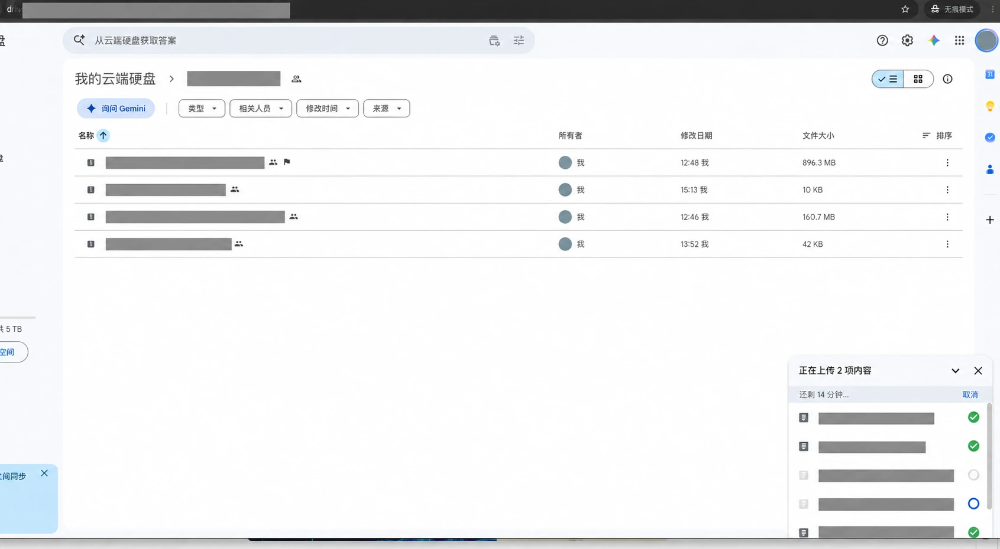
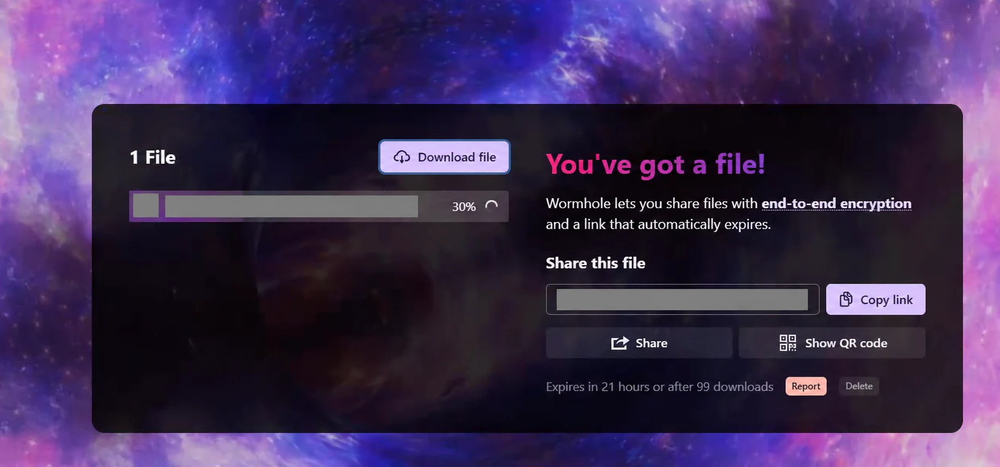

I was recently upgrading a system in an Indonesian client's environment. The plan was straightforward: send over the upgrade packages, then continue with deployment. Instead, I got stuck at the file transfer step.

A working remote desktop connection does not guarantee a successful file transfer. And a successful upload does not necessarily mean the recipient can download the file. This experience made both points very concrete.

## Sunlogin: The Desktop Worked, but the File Transfer Disconnected

I started with the international version of Sunlogin. Remote desktop access worked fine, but large file transfers could fail when the connection fluctuated.

The screenshot shows a disconnected session with error code `57448`. The interface lists possible causes, including the other party ending remote control, unlinking the host, or signing out. That message alone does not establish the actual cause. The immediate problem was simpler: the file had not made it across.

Since transferring through the remote access tool was not working out, I tried cloud storage.

## Google Drive: Uploaded, but Not Shareable

I had previously bought a Google One subscription on Xianyu for a little over ten yuan, so I used Google Drive to upload the files.

Some files transferred without trouble. The upgrade included small ZIP files as well as larger image archives, one of which was close to 900 MB.

Then the large archive ran into another problem: it was flagged, preventing me from sharing it normally. Opening it displayed a warning that translates as:

> This file looks suspicious. Only the owner can view it.

The warning tells me that access was restricted at that point. It does not establish that file size or a particular archive format caused the restriction. For this delivery, the practical result was clear: I could see the file, but the client could not get it.

## Wormhole: Slower This Time, but the Transfer Finished

I eventually tried [Wormhole](https://wormhole.app/), which ChatGPT had suggested.

The basic workflow is straightforward: select a file, generate a sharing link, and have the recipient open it to download. Its [official website](https://wormhole.app/) describes end-to-end encryption and automatically expiring sharing links.

On the connection I was using, Wormhole felt somewhat slower than Google Drive. But the file eventually transferred successfully, and I could finally move on with the upgrade.

The screenshot captures the transfer in progress at 30%. The successful completion came afterward, during my actual use of the tool.

## Keep Another Option Ready for Remote Delivery

This was not a controlled speed test or an exhaustive feature comparison. I simply needed to get the files to the client.

My takeaway is to keep options available across remote desktop software, cloud storage, and temporary file sharing. When one route fails, switching tools can sometimes save more time than repeatedly trying the same thing.

If large remote file transfers keep disconnecting, or an uploaded cloud file is unavailable to the recipient, [Wormhole](https://wormhole.app/) is an option to try. It solved my problem on this occasion; speed and reliability will still depend on the network conditions at both ends.

*Project filenames and sharing addresses have been redacted in the screenshots.*
