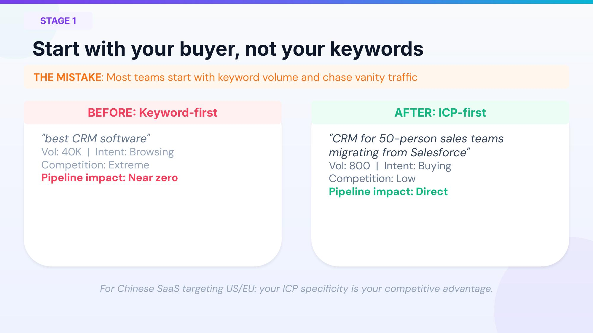
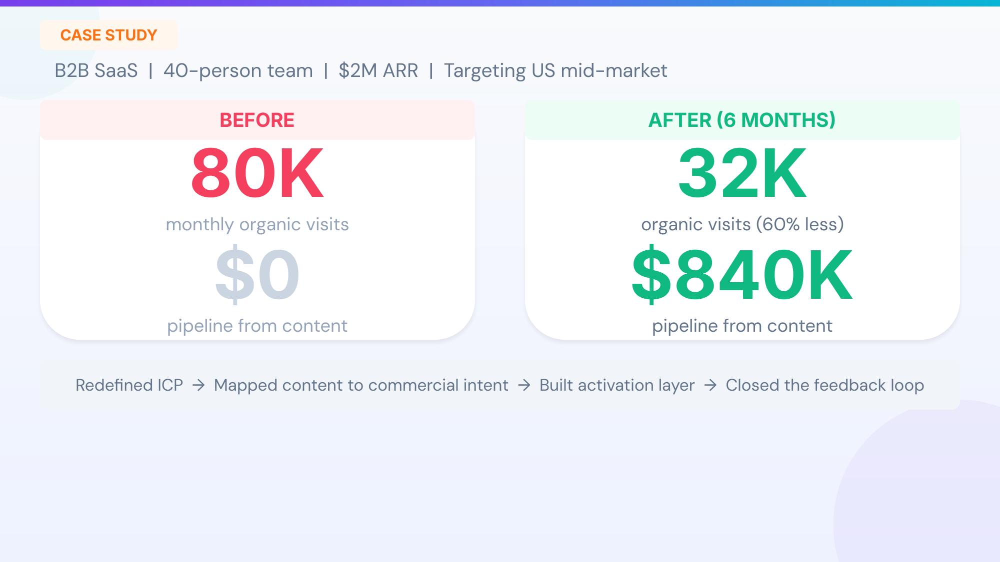
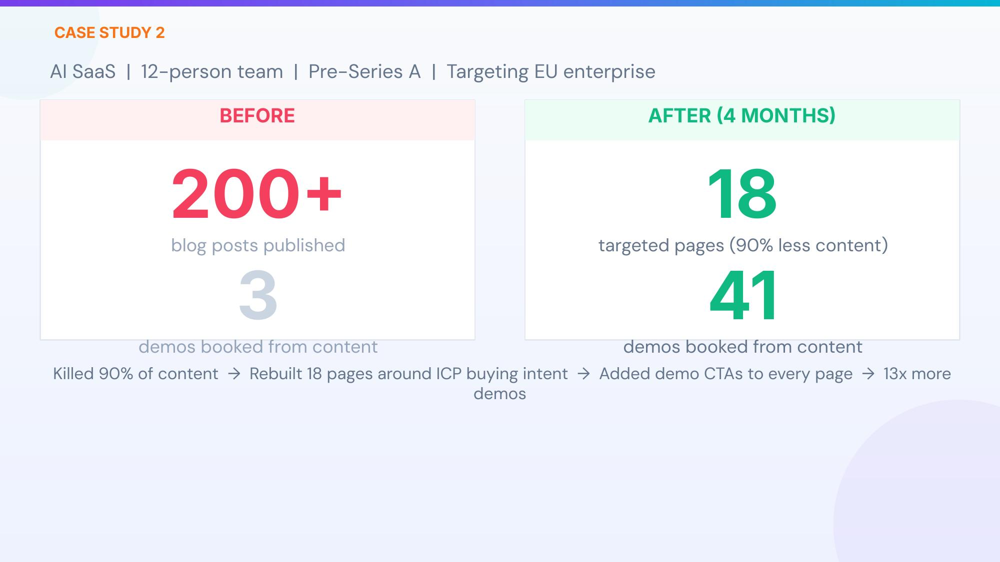
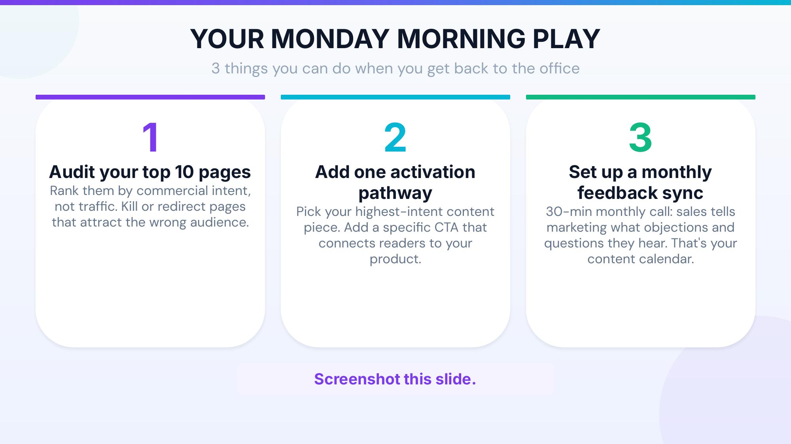

*Based on Daniel Johnson's presentation | We Scale Startups*

---

> Did you publish more content last year than the year before? Did your pipeline grow with it? If the answer is no, you're not alone.

In the world of SaaS growth, an uncomfortable truth is being validated by more and more teams: more content does not equal more pipeline. Many companies pour massive resources into content marketing — publishing more blog posts, posting more frequently on social media, expanding SEO keyword coverage — yet their sales pipeline doesn't budge. Where's the disconnect?

This isn't an isolated case. During a presentation to SaaS founders and growth leaders, Daniel Johnson posed a pointed question: How many of you published more content last year than the year before? Nearly everyone raised their hand. Then he followed up: Did your pipeline grow with it? Most hands went down. This simple interaction revealed an industry-wide blind spot.

Daniel Johnson is the founder of We Scale Startups and serves as Fractional CMO for multiple AI and B2B SaaS companies. He has helped over 70 startups — from seed to Series B — build systematic growth frameworks. In his view, the vast majority of SaaS teams don't have a traffic problem; they have a **systems problem**. He introduced a "Revenue-Aligned Growth Engine" framework with just four steps — simple enough to sketch on a napkin, yet powerful enough to fundamentally transform your content marketing ROI.

---

## I. Why Your Content Marketing Isn't Generating Pipeline

Let's start with a thought experiment. Suppose your company is a CRM SaaS, and your content team spent considerable time optimizing an article around "best CRM software." This keyword has 40,000 monthly searches — it looks like a huge traffic opportunity. But in reality, most people searching this term are in the information-browsing stage, competition is fierce, and they're far from a purchase decision — this traffic is nearly impossible to convert into pipeline.

Now consider another scenario: your team creates an in-depth piece around "CRM for 50-person sales teams migrating from Salesforce." Monthly search volume is only 800, but people searching this term are in the purchase-decision stage, competition is low, and their needs align perfectly with your product — this traffic directly drives pipeline.

This is the fundamental difference between a **keyword-first** and an **ICP (Ideal Customer Profile)-first** approach. The first mistake most teams make is planning content based on keyword search volume rather than starting from the buyer. They chase vanity traffic instead of revenue-converting precision traffic.

Johnson emphasizes repeatedly: the more precisely you define your ICP, the greater your competitive advantage. This is especially true for SaaS companies expanding from China into US and European markets — in global competition, ICP precision is your greatest differentiator.

---

## II. The 4-Stage Growth Engine: From Traffic to Revenue

Johnson's "Revenue-Aligned Growth Engine" consists of four tightly connected stages, each indispensable.

### Stage 1: ICP Definition — Start with the Buyer

This is the foundation of the entire system. If you can't clearly define your ideal customer profile in one sentence, your content strategy is built on sand. ICP definition isn't a broad industry label like "mid-market companies" or "tech companies" — it needs to be specific enough to paint a real person: what size company they're at, what role they hold, what specific pain points they face, and what solution they're considering migrating from.

Only when your ICP is precise enough can you make the right content decisions — what to write, what not to write, where to distribute, what tone to use. ICP is a filter, not an amplifier.

### Stage 2: Intent-Mapped Content — Write for the Buying Journey

After defining your ICP, the next step isn't "produce as much content as possible" but to plan content around your ICP's buying intent. What is buying intent? Simply put, it's whether the searcher is "understanding a problem" or "looking for a solution," "comparing options" or "ready to purchase."

The hallmark of high-intent content: it answers questions directly linked to purchase decisions. For example, "how to migrate from Salesforce to [your product]" is classic high-intent content, while "what is CRM" is low-intent informational content. Both have value, but if your goal is pipeline growth, resources should be prioritized on the former.

A harsh reality: many teams publish tons of content, but 90% of it may not be linked to any commercial intent. Readers come, learn, leave — and never become your customers.

### Stage 3: Activation Layer — The Critical Step Most Teams Skip

This is the most overlooked part of Johnson's framework. The **Activation Layer** is the bridge between content and pipeline. Without this bridge, even the best content is just doing free work for others.

The activation layer has four core elements. First, intent-matched CTAs: readers at different buying stages need different calls to action — early stage might be downloading a whitepaper, mid-stage attending a webinar, late-stage booking a demo. One-size-fits-all CTAs severely damage conversion rates. Second, intent-qualifying content upgrades: for example, offering a "migration cost calculator" as a content upgrade — people who download it are likely seriously considering switching products, automatically filtering for high-intent leads.

Third, frictionless trial and demo paths: there should be no unnecessary barriers between content and product experience, every step should be natural and smooth. Fourth, remarketing loops: continuously reaching readers who've shown intent signals but haven't converted immediately, keeping your brand present in their minds.

The activation layer means you're no longer "publishing content and praying" — you're designing a clear path to pipeline for every piece of content.

### Stage 4: Revenue Feedback Loop — Let the System Evolve

The final stage addresses a widespread organizational problem: marketing and sales teams look at their own data in silos, never communicating. This disconnect directly causes content strategy to derail from actual sales needs.

Closed-loop feedback has three dimensions. First, sales data drives content priorities: the sales team faces customers every day and knows what objections come up most and what questions matter most. This frontline intelligence is your content calendar. Second, conversion data optimizes ICP targeting: which content led to demo bookings? Which leads ultimately closed? The answers help you continuously calibrate your ICP definition and content strategy. Third, customer insights generate new content: every win and loss contains valuable information — why they chose you, or didn't. These real buyer signals are the best content material.

Johnson puts it bluntly: **this is the key to turning scattered tactics into a complete system.** Without feedback loops, your growth engine is like a car without a steering wheel — it might be moving, but you have no idea where it's going.

---

## III. The Role of AI: A Double-Edged Sword

AI has driven the marginal cost of content production toward zero, which sounds great, but Johnson points out a profound paradox: **precisely because AI makes content free, content's value for pipeline also approaches zero.**

AI excels at the execution layer: keyword clustering and research, content brief generation, data analysis and reporting, competitive analysis. These are areas where AI can dramatically boost efficiency, and teams should actively leverage it.

But AI will destroy your signal in these areas: thought leadership and unique perspectives, ICP insights and positioning strategy, differentiation strategy, founder trust and brand credibility. These are precisely the core drivers of pipeline growth. When your competitors are using the same AI tools to generate the same content, differentiation approaches zero. Your prospects see an ocean of indistinguishable content, and none of it makes them think "this company truly understands my problem."

> Pipeline comes from insight, not information. AI can give you information, but insight must come from deep customer understanding and a unique industry perspective.

In other words, AI is a fuel additive for the growth engine, not the engine itself. If you use AI to replace thinking and insight, you'll get more noise, not more pipeline.

---

## IV. Real Cases: Let the Data Speak

### Case 1: B2B SaaS, 40-Person Team, $2M ARR

This US mid-market company had 80,000 monthly organic visits before the transformation, but zero pipeline from content — massive traffic, zero conversions. What did they do? First, they redefined their ICP, narrowing from a broad "mid-market companies" to specific industries, company sizes, and pain points. Then they reclassified all content by commercial intent, cutting articles that only attracted information browsers. Next, they built a complete activation layer for the remaining high-intent content. Finally, they connected marketing and sales data feedback. Six months later, organic visits dropped to 32,000 (a 60% decrease), but content-driven pipeline reached $840,000.

Traffic was cut by 60%, yet pipeline skyrocketed from zero to $840K. This perfectly illustrates that "the right traffic is ten thousand times more important than more traffic." Many founders panic when traffic drops, but that actually proves most of your previous traffic was ineffective — eliminating it is a good thing.

### Case 2: AI SaaS, 12-Person Team, Pre-Series A

This AI SaaS company targeting the European enterprise market had published 200 blog posts before the transformation but generated only 3 demo bookings — averaging one demo per 67 articles, astonishingly inefficient. After 4 months, they cut 90% of their content, keeping and rebuilding just 18 precision pages around ICP buying intent, each configured with demo CTAs. Result: demo bookings jumped from 3 to 41, nearly a 13x improvement.

This case delivers a counterintuitive insight: sometimes "less is more" isn't just motivational talk — it's a verifiable growth strategy.

---

## V. Self-Diagnosis: Is Your Growth Engine Healthy?

Johnson provides a simple 5-point diagnostic tool. Score yourself, one point for each "yes":

First, can you define your ICP in one sentence? Second, does your top content target commercial intent rather than pure traffic? Third, is there a clear path from content to activation (e.g., demo booking, trial signup)? Fourth, is sales team feedback driving your content calendar? Fifth, can you measure content-to-pipeline conversion (not just traffic metrics)?

If you score 2 or below, **you have tactics, not a system.** Don't worry — that's where most teams start. What matters is recognizing the gap and taking action.

The diagnostic's value isn't the score itself — it's helping you quickly identify the weakest link in your system. The dimensions where you score lowest are where you should focus first. Don't try to improve all five dimensions simultaneously; pick the one with the greatest leverage and concentrate your resources there.

---

## VI. Three Critical Shifts

Johnson summarizes three key mindset shifts from "having tactics" to "having a system."

**Shift 1: From optimizing traffic to optimizing ICP intent.** Stop asking "how do I get more traffic" and start asking "how do I get more of the right traffic." Switch your metric from page views to pipeline contribution.

**Shift 2: From bridge-less content to building an activation middle layer.** Every piece of content must have a path to the product, otherwise it's just an article, not a growth asset.

**Shift 3: From siloed experiments to closed-loop feedback systems.** Marketing and sales are no longer two independently operating departments but an organism that shares data and feeds each other. When this feedback loop starts running, your growth system gains the ability to self-learn and self-optimize — it becomes more precise over time.

---

## VII. Common Objections and Responses

**"Our traffic isn't big enough to be picky."** — You don't need more traffic; you need the right traffic. 500 ICP visitors beat 50,000 random visitors. Instead of fighting for attention in a red ocean, precisely capture in a blue ocean.

**"Our sales team won't cooperate with marketing."** — Start small. A monthly 30-minute sync where sales shares the objections and questions they hear from customers. When they see this information turned into genuinely useful content that brings better leads, trust builds naturally.

**"We tried content marketing. It didn't work."** — What you tried was probably content production, not a content system. The difference: a system connects content to pipeline; production just puts words on the internet.

---

## VIII. Three Things You Can Do Monday Morning

Finally, Johnson offers three specific actions you can execute as soon as you're back in the office on Monday.

**Action 1: Audit your top 10 pages.** Re-rank by commercial intent, not traffic. Pages attracting the wrong audience? Cut or redirect them. You want the pages with the highest pipeline contribution, not the highest traffic.

**Action 2: Add an activation path to your highest-intent content.** Pick the article closest to purchase decision and add a specific, context-relevant CTA. Not a generic "contact us" but something like "book a 15-minute migration consultation."

**Action 3: Establish a monthly feedback sync.** 30 minutes where sales tells marketing what objections and questions they're hearing. That's it. The ROI of this single step may exceed what you spend on any marketing tool.

---

## Final Thoughts

The beauty of this framework is its universality — whether you're a 12-person Pre-Series A team or a hundred-person Series B company, whether you serve SMBs or enterprise clients, the underlying logic is the same: start from ICP, match buying intent, build an activation bridge, iterate with closed-loop feedback.

The only prerequisite for this system isn't budget, team size, or traffic volume — it's clear ICP understanding. If you can't articulate your ideal customer profile right now, start there. Sit down with your sales team and discuss what the customers you've closed in the past six months look like — what kind of people, from what kind of companies, facing what specific pain points. This information is the starting point for your entire growth system.

In an era where AI makes content cheap, what's truly scarce isn't content itself but the systemic capability to convert content into revenue. Your competitors can use AI to produce as many articles as you, but they can't replicate your deep customer insights or a well-running growth engine. The content battlefield has shifted from quantity to quality and systematic execution.

> You don't lack traffic — you lack a system. The good news is, systems can be built. Starting this Monday.
