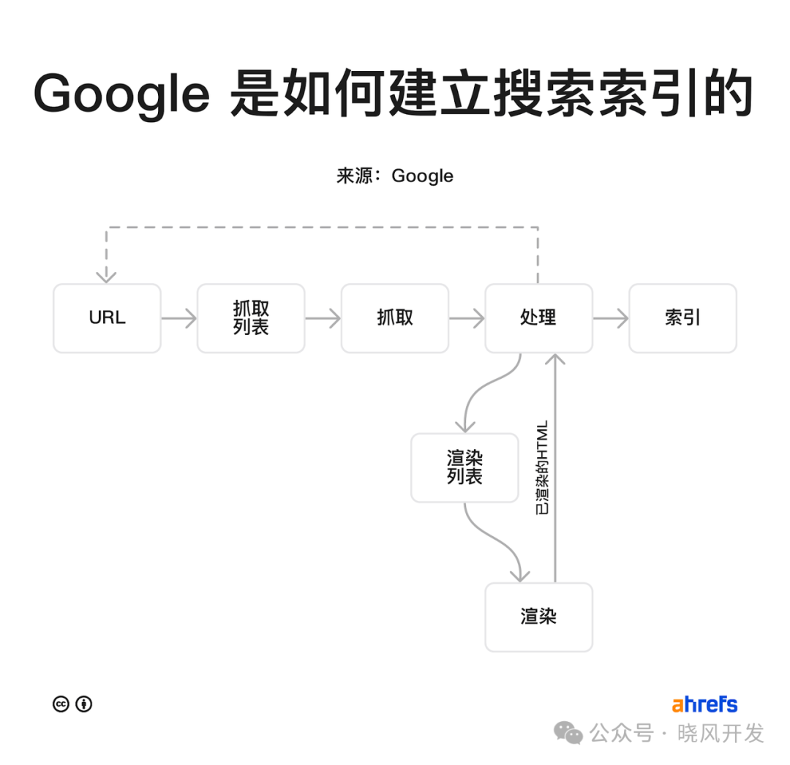

> It has been over half a year since I joined GeiFei's community, and I still haven't properly studied SEO. This time I'm learning by doing, starting with the fundamentals.

## Why Should You Care About How Search Engines Work?

The higher you rank on Google, the more organic traffic your website receives.

## How Does Google Build Its Search Index?

### Step 1: URLs

Google discovers URLs in three main ways:

- **Through backlinks**: You can use the free Site Explorer tool in Ahrefs Webmaster Tools to check your website's backlinks.
- **From sitemaps**: A sitemap lists all the important pages on your website.

### Step 2: Crawling

Google prioritizes which URLs to crawl based on several factors, including:

- The URL's PageRank
- How frequently the URL changes
- Whether it is new

### Step 3: Processing

Google must render a page to fully process it. Google runs the page's code to understand how its appearance affects the user experience.

### Step 4: Indexing

Indexing is the process of adding information from crawled pages into a large database called the search index.
If a web page is not in the search index, search engine users will not be able to find it.

## How Search Engines Rank Web Pages

### Backlinks

- **Link authority**: Backlinks from high-authority pages typically have the greatest impact on rankings.
- **Link relevance**: Links from related websites and pages tend to be the most valuable.

### Relevance

Google uses the relationships between entities to better understand the relevance of a page.

### Freshness

Freshness is a query-dependent ranking factor, meaning it has a greater impact on some search results than others.

### Topical Authority

Google wants to rank content from websites that have demonstrated authority on a given topic.

### Page Speed

You can check the speed of any web page using PageSpeed Insights, which also provides optimization recommendations.

### Mobile Friendliness

You can check any web page for mobile-friendliness issues using Google's Mobile-Friendly Test tool or the Mobile Usability report in Google Search Console.

## How Search Engines Personalize Results

### Location

Your location has a significant impact on local search results -- so much so that searching for the same term from two different locations can yield almost entirely different results.

### Language

If you have web pages in multiple languages, Google may not be aware of this unless you tell it.
You can do this using an HTML attribute called hreflang.

### Search History

Google uses your search history to personalize search results.

Original article: https://ahrefs.com/blog/zh/how-do-search-engines-work/
