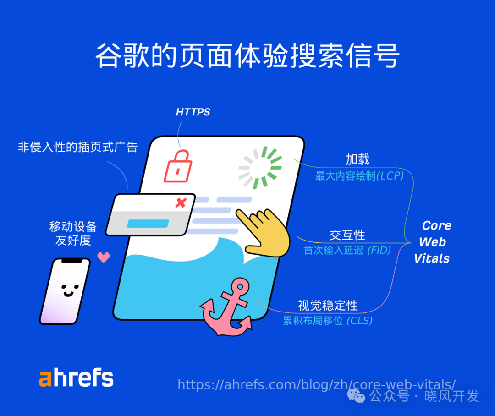

## On-Page SEO Fundamentals

### What Is On-Page Optimization

On-page optimization (or on-site optimization) refers to everything you do on a page to improve its rankings. The focus is on helping Google and searchers better understand and digest your content.

### Why On-Page Optimization Matters

Google examines the content of a page to determine whether it is a relevant search result. If Google considers your content less relevant than your competitors', it will rank you lower.

## How to Do On-Page Optimization

### On-Page SEO Checklist Overview

### Align with Search Intent

Search intent is the reason behind a user's search. Understanding search intent helps you figure out what users are looking for and what you need to provide in your content.

### Cover Your Topic Thoroughly

If your content covers relevant subtopics, it is more likely to meet searcher expectations. On top of that, it can rank for more related keywords and drive additional traffic.
A great place to find clues is by looking at top-ranking pages. You can manually identify commonalities among them, such as headings, frequently asked questions, visual aids, and the depth of coverage on the topic.

### Make Your Content Unique

If you want to succeed in rankings, you cannot simply rehash what other pages are saying -- you need to bring something new to the search engine results page.
This increases your chances of attracting links, which in turn helps your page rank higher.
To achieve this, you need to get creative, because "uniqueness" depends on what already exists on the SERP. Here are some angles to consider:

- Original research -- new knowledge, insights, or findings. For example, an industry survey conducted with your company's clients.
- A unique perspective or opinion on a topic -- a fresh viewpoint that challenges conventional thinking or takes a strong stance. For example, SEO tips from a seasoned industry expert.
- A faster or simpler way to solve a specific problem or achieve something -- for example, tips on becoming wealthy before 30.
- A useful, free resource -- for example, templates, cheat sheets, and so on.

### Create a Visual Hierarchy with H1-H6 Tags

Heading tags (H1, H2, etc.) not only help Google understand the content on your page, but also help readers comprehend and improve readability.
The best practice for H1 tags is to use only one per page and make it match the page title.
As for H2 through H6 tags, simply use them for subheadings within your content.

### Write a Compelling Title Tag

Title tags are often the primary piece of information that determines which result gets clicked, so you need to make them appealing. Here are some tips:

- Keep it short -- ideally under 70 characters to avoid truncation.
- Match search intent -- tell searchers that you have what they are looking for.
- Be descriptive -- avoid being vague or generic.
- Avoid clickbait -- make sure title tags align with your actual content.
- Include your keyword -- use a close variant if it makes more sense.
- Include the year -- useful for topics that require freshness.

Make sure to set title tags on every indexable page.

### Write a Compelling Meta Description

Meta descriptions are not a Google ranking factor, but they can drive more clicks and traffic. This is because Google often uses them as descriptive snippets in search results. Here are some tips for writing meta descriptions:

- Keep it short -- ideally under 160 characters to avoid truncation.
- Expand on the title tag -- include unique selling points that you could not fit in the title.
- Match search intent -- double down on what searchers want.
- Use active voice -- speak directly to the searcher.
- Include your keyword -- Google often bolds matching keywords in search results.

### Set User-Friendly URLs

Google recommends using words relevant to your content in the page URL. The simplest approach is usually to set your target keyword as the URL slug.
If the URL structure already contains some words from your target keyword, you can shorten the slug.

### Optimize Your Images

Images on your page can rank in Google Image Search and drive additional traffic.
Image optimization essentially involves the following three tasks:

- Use descriptive file names: Google states that file names can provide clues about the image's subject. Naming tips: be detailed, keep it concise, avoid keyword stuffing, and use hyphens to separate words.
- Use descriptive alt text: Google also uses alt text (alternative text) to understand the subject of an image. This is an HTML attribute used to describe the image. The primary purpose of alt text is to improve accessibility for visitors using screen readers. Best practices: be detailed, keep it concise, avoid keyword stuffing, and do not say "it is an image."
- Compress images: Compressing images reduces file size, which improves loading speed. Many tools can accomplish this -- ShortPixel is an excellent option.

### Add Internal Links

Internal links are links from other pages on your website. They help Google understand what a page is about and boost its authority, which can lead to higher rankings.
Given that adding an internal link takes only a second, it is a simple and quick on-page optimization technique.

### Use External Links

Google states that linking to other websites is a great way to provide value to users. So when appropriate, do not be afraid to do so. Just be careful not to link to low-quality or spammy sites.
When linking to external websites, keep the following in mind:

- Cite and link to their sources
- Link to resources that readers may find useful
- Use nofollow or sponsored tags for any sponsored or paid links

## Demonstrate Experience or Expertise on the Topic

Google places greater emphasis on content from experts or people with first-hand or lived experience. Which factor matters more to Google depends on the topic.
Here are several ways Google recommends demonstrating expertise. You should:

- Show that you understand the topic. Based on your expertise, demonstrate how to solve a problem or achieve a goal.
- Provide clear sources of information (and link to them).
- Cite expert opinions to add credibility to your content.
- Provide background information about the author, such as linking to an "About the Author" page. Do not hide your credentials.
- Make sure the content does not contain easily verifiable factual errors.

When it comes to topics that may require first-hand or lived experience, Google recommends that you:

- Explain how you created the content. For example, provide some behind-the-scenes insights into a product review process.
- Provide evidence of relevant work, including images or videos.
- Provide background information about the author -- just like with expertise.

## Advanced On-Page Optimization Tips

### Optimize for Featured Snippets

### Use Schema Markup to Get Rich Snippets

### Optimize Page Experience

To rank pages, Google also considers a set of "page experience signals," which include but are not limited to:

- Core Web Vitals (CWV) -- in other words, whether the page is fast and stable enough.
- Security -- whether the page uses an HTTPS connection.
- Mobile-friendliness -- Google uses the mobile version of your page for indexing and ranking.
- Avoiding intrusive interstitials and dialogs.

Page experience signals are typically improved at the site-wide level rather than page by page. However, you also need to ensure that all new page designs are optimized.
Security issues and interstitials are the easiest to fix: get an SSL/TLS certificate and disable pop-ups that may annoy users. CWV and mobile-friendliness may take more time to address.

### Monitor and Update Your Content

On-page optimization is an ongoing process. If you are not satisfied with your Google rankings, you can improve and republish your content to boost your position.

Original source: https://ahrefs.com/blog/zh/on-page-seo/
