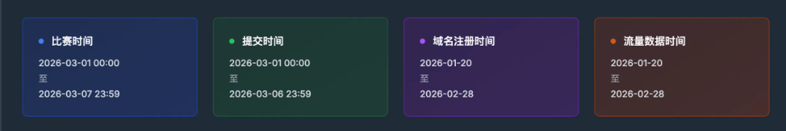
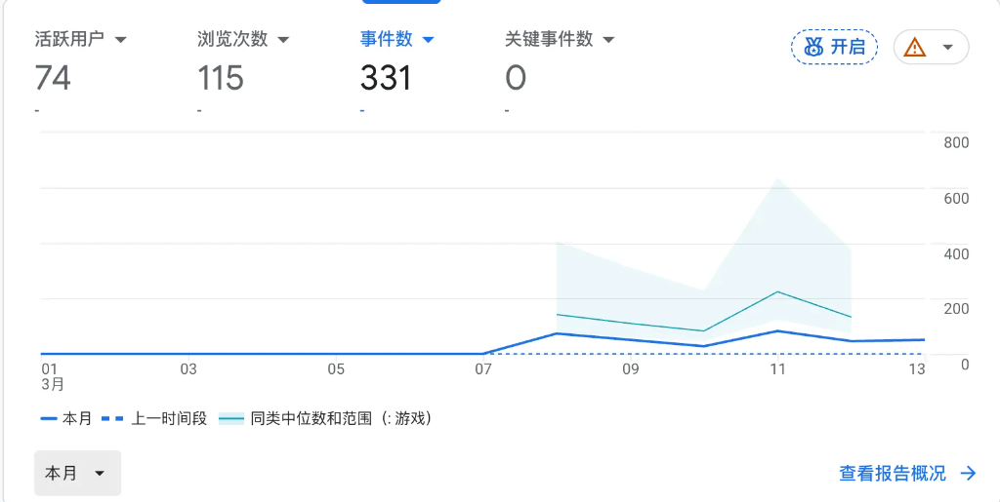

Doing anything requires positive feedback — with it, you can keep going.

## A Late February Sign-Up

A few days ago, Gefei held the February new-keyword competition. I should have signed up, but I always felt I wasn't ready, so I never entered any monthly competitions. The only reason I joined the annual competition last year was that Gefei said anyone with traffic would get ¥66 — that's what finally pushed me.

I remembered to sign up on the morning of March 7th, but by then the February competition window had already closed.

---

## What I Did in February

I built a fairly niche knowledge-base website — one with almost zero search volume.

I haven't built a single backlink to this day. All I did was have ChatGPT and Claude Code generate 3 SEO articles per day. To my surprise, it still attracted some active users and page views.

The results weren't great, but at least I could see that inner pages were making a difference. Not many people signed up last month either, and after checking the rankings, I realized I wasn't in last place.

---

## Immediately Signing Up for March

So last Saturday, it hit me — I had to join the March competition right away.

That morning I started keyword research, first pulling words from small game site sitemaps and filtering through dozens of them. I checked each one on Semrush and Ahrefs for keyword difficulty and search volume, then verified recent search trends on Google Trends.

Since March competition traffic is counted through the end of the month, **I had to launch the site that same day**, which left me very little time for keyword selection.

That morning I picked a keyword with ~2,000 monthly searches and difficulty below 30 from a small game site. As a beginner, this felt like the right level to practice with.

In the afternoon I designed the landing page using Google's Stitch, and that evening I had Claude Code generate the first version based on the design mockup and HTML code.

I went back and forth with Claude Code for over a dozen iterations on the landing page, but I still managed to go live that same evening, with Google Search Console and Google Analytics both connected.

---

## Progress Over the Past Few Days

These past few days I've been steadily adding inner pages while building a few backlinks with help from ChatGPT and Semrush. So far, the numbers are looking promising.

**My takeaway: inner pages and backlinks need to happen in parallel.** I'm planning to ramp up the volume starting next week.

---

## Final Thoughts

SEO is the art of practice — you have to get your hands dirty.

Last year I read a lot but did very little. Still, the long-term exposure built my belief that SEO actually works.

**Because I believed, I began to see.**

I plan to keep practicing through the first half of this year. My goal is to get the game/tool site fully running before Gefei's mid-year offline meetup in June.
