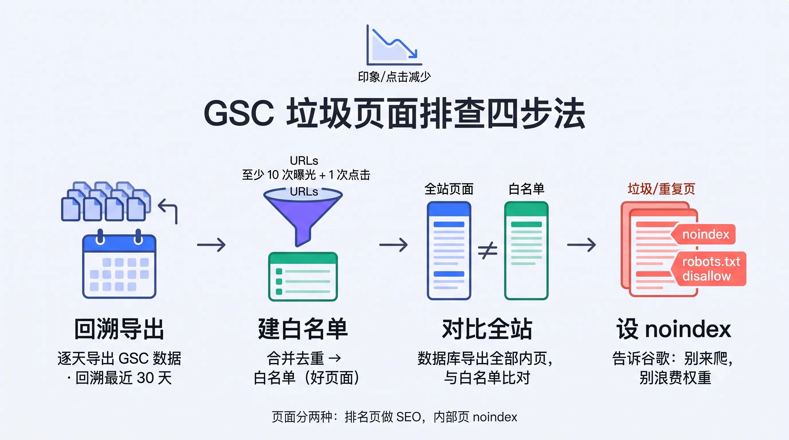
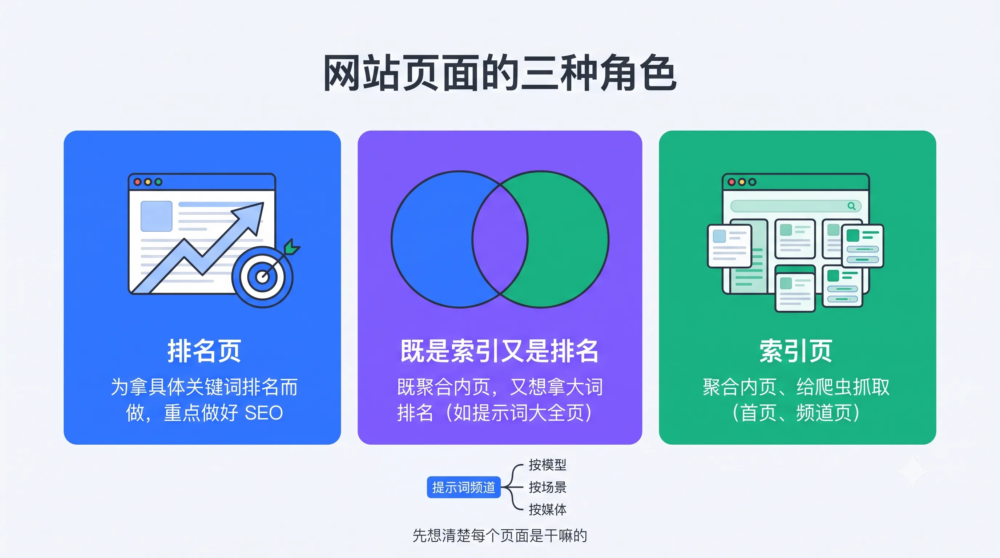

# SEO from First Principles: Tools, Search Mechanics, and Global Growth

> In the axis of "**Gefei’s Friends, sharing the exchange at Shenzhen Station**" the Gefei’s community leader (also the author of the ATK/AITDK plugin and a series of SEO tools) brought about a great amount of information sharing.
> >
> Unlike the other "just do it in a few steps," the sharing of the keywords is**the principle**-- from how Google reptiles work, how to build a back-to-back index, how to sort out the GSC data, how to tear down the page of the competition, and how to take it to its real site. In his words,**"Just do it somewhere else, and we'll tell you why you do it, and what the rationale is."**

---

## First Benefits: ATK Plugin and Gefei Community Platform

Sharing openings, with a wave of benefits paid to the site by the manager:**A partner who has purchased tickets for this exchange (at least one ticket in the account) can exchange free of charge for a month for a Blue member of the A.T.K. Plug-in, valued at $20.**(Note: The month in which a paid member is already unable to change again, can wait until due).

**ATK (AITDK) is the necessary browser plugin for grouping**to read any page (of others or of itself):

- **Pic function**: view flow curves, source of flows, flow from AI, keyword distribution;
- **backlinks query**(Blue membership function, giving 2000 points, looking at a station backlinks consumes a small amount of points);
- **AdSense connection**: Google ads were placed on a website to identify other sites belonging to the same AdSense account, namely, the "Strategie of Author's Website";
- **Basic but high frequency inspections such as Keyword sustainability, H label**.

In addition to the plugins, he presented a platform **built by the Gefei community,**which is quite robust:

- **Daily cluster summary**: an automatic one of the previous day's chat sessions (Survey/Focus/Questions Review, etc.) is produced daily, each of which can jump back to the original set. The records of the last three years and a dozen groups can be searched;
- **My collection**: Supports multiple collections, each of the "lists"/ "navigational stations"/ "read" three display styles. Learn to collect, and eventually sink out their own knowledge navigator;
- **Selected articles / Proceedings of the panel discussion**: Full filing of the two to three years of sharing and discussion in time line.

> In particular, he stressed that: **anything that is "selected top" must be something he thinks you need to learn. **Like the "Seek-and-demand" article, written in May, but this method community has shared it over and over again over the past two years — just for a long time, and some friends have forgotten, so repeat it again.

---

## ii. "See" SEO by the rookie: Several simulators

The principal found many problems common: **just looking at the curriculum, like listening to people say, "The pork is good," and he never saw the pig run. **So he made a couple simulators, and let's "run it."

### SEO Operating Simulator

A "business simulation elite game": starting with an understanding of the underlying principles of the search engine, SEO. Give you **365 days, $5,000 start-up funds**, first to find a keyword to buy domain names, pick a long end words, enhance an optimisation, buy backlinks, buy an API every step of the way and tell you **why **do **,**do**, and it's real. The goal is to get to the end of the income of hundreds of thousands or even millions.

### 2. Keyword Analytic Tool and "AI version Keyword Difficulty"

- **Keyword Analysis Tool**: Enter the number of indexs, monthly search volumes, keyword difficulty (KD) to calculate KGR; he also included KD, made a formula **eKGR**and calculated **KGRI (investment return)**to make a comprehensive determination as to whether a word is worth doing;
- **AI version of Keyword**: The difficulty is judged on the basis of a freely available DR (domain name access) interface for a tool, combining the first ten results - how many are the first pages / inner pages, whether the header or traffic hits the keyword, and how long the domain name has been registered.

> One lesson: if there's a new station in the front row that's only five months and ten months,**you can get a third one, which means that the term is not really competitive and can be done.

### 3. GSC emulator

See how Google Search Console's data come from: 90-day visual simulations, 16 step-by-step teaching, so you **see how each user search behavior affects your website's exposure, clicks on data.**After 16 steps "start" you can see how data changes when the site is really done.

---

## III. Scientific use of GSC: inventory of a multimillion-degree website

A real case was shared by the managing director: a group of friends doing open-source software with an annual revenue of over millions on authorized models. Because of open source, backlinks, website high, some errors were not revealed before; it was not until recently that the GSC **was exposed and the number of hits dropped. **

**Search method (remarkable):**

1. The GSC can only look at 1,000 pages, with multiple pages, to track back at least 30 days a day, to export data daily;
2. Set an indicator (e.g., at least 10 exposures + 1 hits per page) to merge and sort the 30 "hits and exposures" web sites in 30 documents as **white lists**;
3. Export all inner pages from your own database, compared to the white list: in the white list, it's a good page in the eyes of Google; in the absence, it's sorted together.

**The final truth**: Every small version of their website produces a version of the introduction page,**without a nondex and with a lot of repetitions**; and, worse still, more recently, multiple languages have been made, and each page has been automatically translated into nearly 10 languages — resulting in a mass garbage page that has been captured by Google reptiles and consumed in vain.

> This is the "**GSC Level 4 signal" (a special article in the community): Google will give you a different level of warning or warning in different situations. The station is not punished for being high, but for being "reduced."

**Solving**: these pages are all set as noindex and disallow in robots.txt.

> Core Awareness:**The web page is divided into at least two ********ranking page (to do a good SEO) to get the keyword ranking; and another page for internal use is to be placed in a separate directory, using robots.txt + noidex to clearly tell Google "Don't Climb" and not waste your ability.

---

## IV. How Google works: from reptiles to reverse indexing

The mains used Google Search Simulator to untangle the bottom of the search engine, which is the most different place in the Gefei’s community curriculum - **Theory.**

- **How the reptiles find you**: The reptiles, they capture known web pages, analyze new links from them, and put them in the "Pick-to-take list" before they go on.**If your new page is not submitted to the GSC or linked to another site, Google is hard to know you're online.**
- How fast to get an indexing**: Google reptile **often scratches, updates **web pages and posts your web site. The reptiles find a new link when they grab each other's pages.
- **V2EX **Skills: using `site: `Looking at a station' for the last hour/week', you can judge how often reptiles come -- if the reptiles just came 16 minutes ago, the link would be caught here very quickly. **Conversely, if a relinks stand-up reptile comes once a month, do you want to buy it?**
- **Indexing**: Google uses each page as a document, semiscripts, lowercases are consolidated, filtering off-words, first building**positive index**(what is the word for each document) and then creating**backwards index**(what is the document for each word) to quickly locate the user when searching.

> You understand how reptiles and indexes work, and you really know what to do with the page.

In addition, he did YouTube Red Man Quote Evaluator, Text Length Calculator,**Income Target Dismantlinger**(entry of target monthly income, number of websites, number of keywords, push-down rankings, hits, UVs) and a "level card" — 10,000 days from "profit to first dollar" to "Level 10" (he laughed that he felt that 10,000 times a day was peaked and then broke down before finding the web page not bold enough).

---

## V. Tracking the SEO income list: reading trends from data

Since January 2024, the director **insists on downloading monthly data from the SEO Income List**, which has been on the radio for more than two years. Looking back at these data, many trends can be read:

- An old station has been downhill for almost two years and has not grown as fast as before;
- A new station appeared a few months ago, ranking 74 → 16 → 28 → 16, which is a fast-moving type;
- The ratio of payments shows **PayPal is increasing in use in these stations**;
- ElevenLabs, which does the AI/ text transject, has been stable in 2-6.

> Remind the newcomers: **Do not copy (even if you are a team) **— it's a free-on-the-spot, community-based play. The right approach is to analyze **its main selling point or some hot game, and make a stop to intercept that part of the traffic.**

---

## VI. Stowing from the main station: index pages, ranking pages and "tributions"

In the case of an AI brand site, the main figure deciphered its growth logic for two years:

When a new photo model came out last August,**someone will search for the "model name + hint"**— this is emerging keyword. The station initially created a message page for creators of the model, and then found that not only the media were spreading, search engines were able to flow, so it expanded:**each reminder of the model was made a page, which was then consolidated into the "tip channel"**(codified by direction of generation, by scene of use), and then it went directly into the first page of navigation.

This leads to the concept of three types of pages:

- **Ranking page**: to get a specific keyword ranking, make a good SEO;
- **Index page**: display of inner pages, grab of reptiles (both the front page and the channel page are index pages);
- **Both index and ranking pages**: for example, the "Phrasing Whole" aggregation page, which aggregates inner pages and wants to rank high-volume keywords in the "AI Phrasing Repository".

---

## VII. How much detail can a competition land page break down?

The mains, on the spot, took down a face-changing tool's landing page, which can be copied directly. **Hard SEO indicator + soft layout**:

**Hard indicators:**
- **title Put the core keyword to the left**(the higher the left, the higher the brand), and the left to the top if you want to highlight the brand;
- **H1 must contain the target, keyword**, with a sentence outlining the core function;
- Structured data, social sharing maps**are done for each page separately**(rather than a home page map shared on a site);
- canonical setting specifications; word volume is kept within a reasonable range;
- **Interference word treatment**: Repeated words in price tables (e.g., a set of meal names) may interfere with the current page of Keyword, can be handled in a way such as `css content ', or can be rendered as a backend;
- An ATK test found that the price table for this station is **backend SSR rendering**(green) rather than front end rendering (red) - a large station with a professional SEO team would hardly make such a detailed error.

**Pricing page design (soft, but directly impacting payment):**
- Monthly / annual switch, general 3-4 step (initial / Plus / Pro / team version);
- **The example of a specific model, "How many times can it be produced"**— it takes an example of a photo model in such a size that it**has a call for payment**; a video model only provides a high-end set of foods, which is the same thing (like a star having a "ballhouse appeal");
- **"7 days / 365 days of unlimited use"**shows the appeal of the book and its worth learning;
- The idea is to find ways to buy a higher-level package with a discount, a checkout, a seat to guide users.
- **A front-end pricing table is available on each functional page**and is important: users come in from a small function (which is not paid for) and see "the original 15 blades can use so many models" that they can pay.

> He also went along with "speak" to the ATK developer: this front-runner price sheet should not be included in the Keyword statistics, interfere with judgment and suggest improvements.

---

## VIII. REAL STANDING DIRECTS OF THE PRIORIST

It is rare for him to spread out the real data (including profit and loss) on several of his stations:

- **Two music games**(keyword provided by friends): one game, different traffic and unit prices, combined, earned about 130,000. Also **type**(user misspelled) and**trademarks are being taken to the pit where similar stations are forced to change their names;**
- **Some.org game station analysis**: peaked at 9 million traffic, layout, backlinks were learned by the community - **It has a lot of blogs to comment backlinks, so it proves that backlinks are really useful **and don't believe in "no" words;
- **A tool station**(2 million knives bought from friends): multiple pages of PDF, URL, dissertation, etc., were extended horizontally around "X turns Y"; and the amazing thing is that**advertising revenues are about three times the amount paid **(because the price is cheaper + 30 points per day is free of charge but required to log in). And the time and backlinks costs are taken into account, "not much money actually";
- **A novel catalogue (to be done more than a month in advance for casework): only a catalogue of chapters, a strict circumvention of pirated editions,**only one self-published blog review backlinks**can start slowly, and a big page translation to intercept traffic in Taiwan.

> He added that the station was filled with more than 200 garbage spam backlinks,**completely unattended, Google is smart enough to recognize**and does not allow these links to interfere with the ranking.

> The station also explains one reason: **can hold up the loneliness of the period **— the new station will be exposed at the beginning of the line and then back (upped when supplies are insufficient, and more pages are captured by Google) and the flow will come back slowly as long as the heat of the word lasts, renews and adds backlinks.

---

## IX. Tomorrow ' s hacking: New game

The director predicted the next day's hacking out.**The last two sessions asked the judges to score from "Feaky Pages, Complete or Not" but these didn't reflect the community's teachings of "deeping Keyword, doing the SEO."**

So the new game is: **Find Keyword (Quoted Root) **Page for Keyword → Register domain name on line → Submits the work → 
> The prize pool is $14,000: a special prize of 2,000, a first prize of 5 and 1,000, a second prize of 10 and a third prize of 500 and a third prize of 20 and a hundred. In his words,**"The ticket money has been paid."**

---

## X. Q&A Quality

**What about brand stations?**
> Do not waste the first page. The first page is the highest on the site, and**should be used to play "keywords"**for specific needs that can be moved, instead of a huge industry, high-volume keyword. The brand name is your own, no one competes, and it appears several times; the first page is really aimed at a specific demand word. So brand stations and keyword stations are essentially "keywords" on the first page.

**Why only analyse games and AI categories? **
> In fact, all kinds of emerging keywords can be done (news + map tools, historical themes, etc.), as long as they meet the three-dollar number criterion. Only games and AI**are more likely to produce emerging keywords. **

**What if there's only one wave of words? **
> **Horizontal expansion**. The front page has a heartful line, while more inner pages are used to add more words, passing it to inner pages, adding inner pages. This is an effective method that communities have tested for two or three years -**"horizontal expansion works."**The heartword is just the starting point for "tight catch-up" with this accumulated website, with more pages, like a fruit tree that can produce results every year.**

**What if the traffic doesn't work? **
> Several: The big global hotspots will be squeezed down by big station follow-up (see if heat is durable + continuous backlinks); 2 The information category is "Bridging Pages" that cannot be used naturally, and tools/plays can be retained; 3 The use of the StreamAd, Monetag, and the "Stealing Gang" ad alliance will steal and jump, leading to a decline in Google’s experience.**But for new hands, first and even the 1,000, which is more real than long-term flows.**

**How to find tools in other fields? How to keep digging for needs?**
> **excavated by words**(51 words from community summaries, such as Generator, Creator, etc.) multi-pronged; and go to the developer's place of flaunting (Reddit, Hacker News, X) -**programmer couldn't help but share: "What do I do, how many traffic I get?"**You can smell new demand. The core is "Be up early, eat early."

**backlinks when's the head? **
> I can't stop with a positive feedback -- "I'll just spend five minutes on one page, and I'll make more money later." **This is an infinite game, no head**unless you make enough money to get someone to help you get on the page and go skiing.

**Found Keyword. How? **
> Don't even think about it,**starting with a single page,**starting with zero.

---

> This paper is based on the Axis sharing of the leaders of the Shanghai Flying Community, "Gefei’s Friends, Mid-Year Sharing, Shenzhen Station (2026.07.04-07.05, Shenzhen World Hotel)" and is based on live views, tool presentations and case replicas for cross-references between Gefei’s community partners and Global Expansion colleagues, without representing the platform's position.
