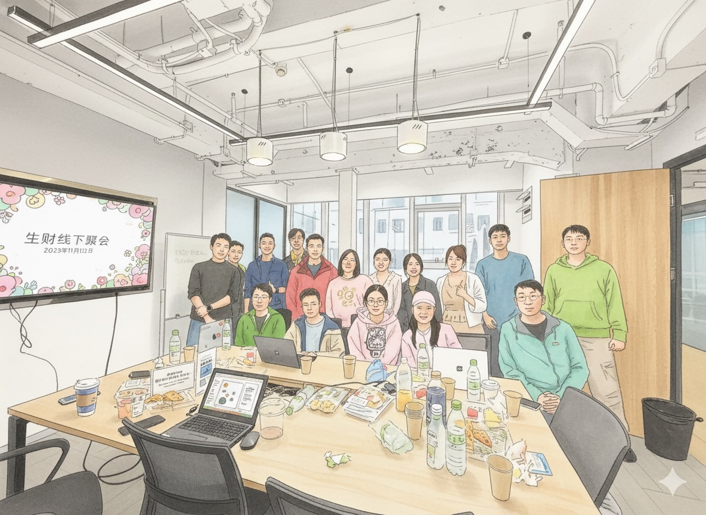
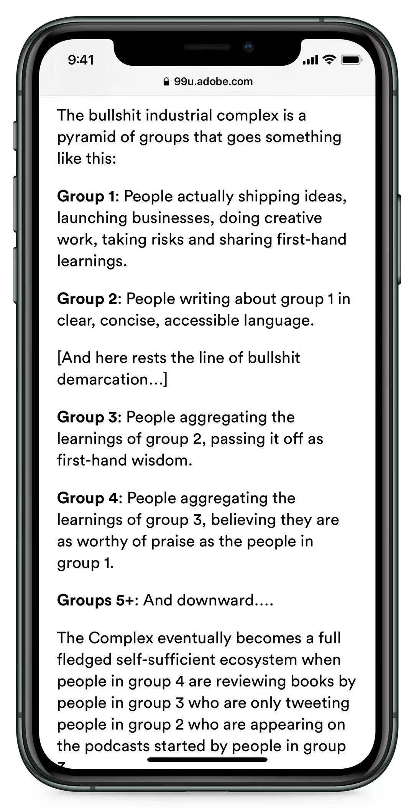

> It had been a long time since I last attended an offline event. When I recently spotted a meetup about AI products, I sent it to Zhuang Zhou. To my surprise, he actually wanted to go this time, and that was how this trip came together.

## 1. Overview

The meetup took place in Shanghai. The organizer is a mentor in the Shengcai community and a member of Liu Xiaopai's Deep Sea community. Most attendees were developers and product managers, along with a few small-business owners.

The discussions mainly focused on building web products for global markets: finding demand, acquiring traffic, and operating social media accounts.

## 2. Featured Talks

### 2.1 Xiaobei

Xiaobei organized the meetup and spoke primarily about discovering demand, writing code, and finding traffic.

#### Finding Demand

Xiaobei recommended several ways to discover real demand: study what people are buying on global freelance marketplaces, examine competitors' paid campaigns, listen to entrepreneurship podcasts, and follow conversations on international social platforms.

I have also been curating and adapting content from overseas lately. These YouTube creators are worth following:

- [Greg Isenberg](https://www.youtube.com/@GregIsenberg)
- [Liam Ottley](https://www.youtube.com/@LiamOttley)
- [Lenny's Podcast](https://www.youtube.com/@LennysPodcast)
- [Starter Story](https://www.youtube.com/@starterstory)

#### Building the Product

Xiaobei also recommended several API platforms worth bookmarking:

- [Replicate](https://replicate.com/)
- [Fal](https://fal.ai/)
- [OpenRouter](https://openrouter.ai/)
- Volcano Engine
- SiliconFlow
- [APICore](https://api.apicore.ai/)
- [Evolink](https://evolink.ai/)

#### Finding Traffic

One memorable idea was the “bullshit industrial complex.” At the top are people who actually act: they build products, do creative work, take risks, and share first-hand lessons. The next group explains those lessons clearly. Further down, each group merely aggregates and repackages what the previous one said.

The model is a useful reminder to move closer to primary sources—and, ideally, to become one of the people doing the work yourself.

### 2.2 Shaozi

Shaozi runs two hotpot restaurants in Shanghai, so everyone at the meetup called him “Hotpot Bro.” His talk was the most valuable part of the event for me.

Soon after Sora 2 launched, he built a platform selling invitation codes. By promoting it on social media, he generated more than RMB 100,000 in monthly revenue.

The checkout system used [Dujiaoka](https://github.com/assimon/dujiaoka), an open-source digital-goods storefront. Individual sellers cannot connect a payment channel directly and may need to withdraw through a platform for a fee, while registered sole proprietors can connect one.

For social media operations, he recommended several tools that distribute content across multiple platforms. This was immediately useful: publishing the same post manually on platform after platform consumes a lot of time.

### 2.3 Other Discussions

Other attendees shared lessons from running social media accounts, including how they secure sponsored work.

Someone had also built a second-hand marketplace and an AI video product, both of which were interesting.

## 3. Takeaways

An offline meetup should be a place to share your own process, but I had not prepared anything this time. For the next event, I need to prepare properly: producing an output forces you to improve your input.

This is not about showing off or hunting for opportunities. More importantly, consistently sharing what you are building helps you grow.

