> This article is based on a talk titled "The Small & Rich Strategy" by Wolfgang Geiger (Wolf). Through the real-world case of Pinhok Languages, it reveals a growth opportunity overlooked by most SaaS companies — targeting small European countries with low populations, high GDP per capita, and their own native languages.

---

## 1. About the Speaker

Wolfgang "Wolf" Geiger, born in Austria, studied in the UK and Beijing, and is currently based in Hong Kong. He is the founder of Pinhok Languages, a company focused on language learning content.

Pinhok Languages had very humble beginnings — around 2012, Wolf compiled a series of vocabulary lists for his own study of HSK (Chinese Proficiency Test) and Cantonese. By around 2014, he began self-publishing these vocabulary lists as books and simultaneously launched the Pinhok.com website, supporting 13 languages.

Today, Pinhok has published over 1,000 books covering 50 languages, generating revenue through book royalties. The website also offers a large amount of free SEO content — some vocabulary lists have been turned into online learning pages for free use, which also drive significant organic search traffic to the site.

## 2. The Data First: Traffic Performance on GSC and Bing

Before discussing strategy, let's look at some real data.

### Google Search Console 2025 Overview

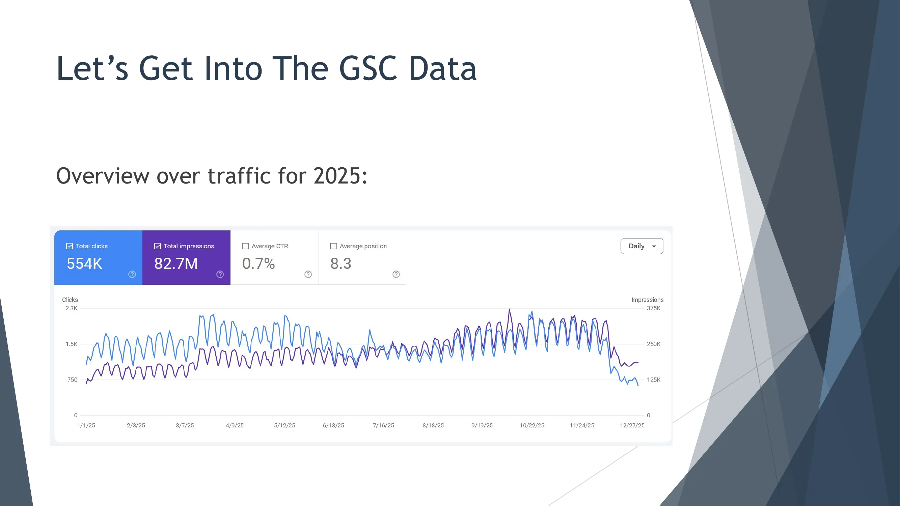

In 2025, Pinhok.com received **554,000 clicks** and **82.7 million impressions** from Google, with an average CTR of 0.7% and an average position of 8.3. The trend chart shows relatively stable traffic throughout the year with some cyclical fluctuations.

### Bing 2025 Overview

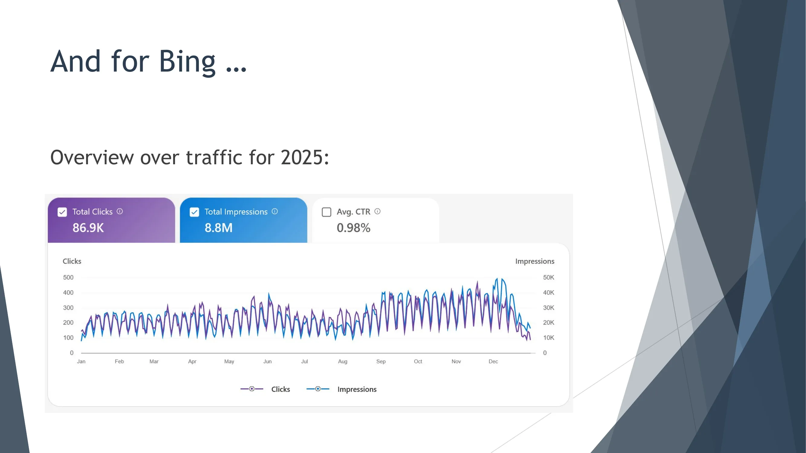

On Bing, the site received **86,900 clicks** and **8.8 million impressions** for the full year, with an average CTR of 0.98%. While Bing's volume is much smaller than Google's, it remains a traffic source that cannot be ignored.

### GSC Data by Country — Here's Where It Gets Interesting

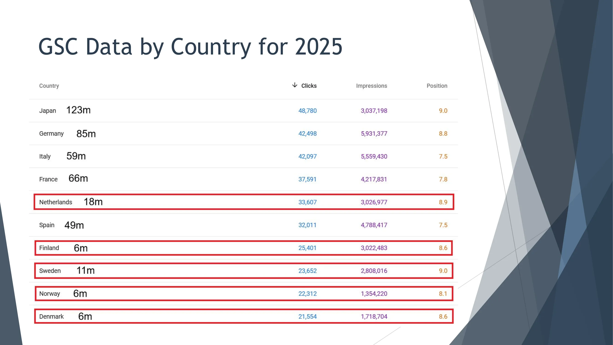

This table is at the heart of the entire strategy. Among the top 10 countries by clicks, we see some very interesting patterns:

Japan (123 million population) ranks first with 48,780 clicks; Germany (85 million population) ranks second with 42,498 clicks; Italy (59 million population) ranks third with 42,097 clicks. These are large countries, so their high rankings are not surprising.

But take note of the countries highlighted in the red box:

- **Netherlands** (18 million population): 33,607 clicks
- **Finland** (6 million population): 25,401 clicks
- **Sweden** (11 million population): 23,652 clicks
- **Norway** (6 million population): 22,312 clicks
- **Denmark** (6 million population): 21,554 clicks

A country with only 6 million people — roughly the size of Shenzhen — actually surpassed India, a population giant, in click volume. How is this possible?

## 3. What Are "Small & Rich" Countries?

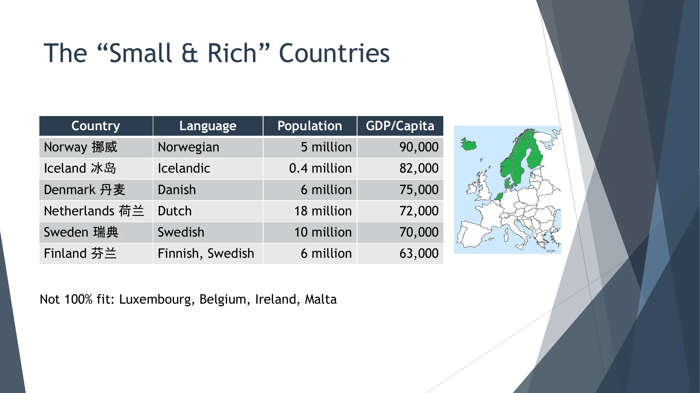

Wolf defines "Small & Rich" countries as having the following characteristics:

1. **Small population** (under 20 million, roughly the size of Shenzhen)
2. **Have their own distinct language**
3. **High GDP per capita**
4. **High education levels**
5. **Strong English proficiency**

The core six countries are:

| Country | Language | Population | GDP per Capita (USD) |
|---------|----------|------------|---------------------|
| Norway | Norwegian | 5 million | 90,000 |
| Iceland | Icelandic | 400,000 | 82,000 |
| Denmark | Danish | 6 million | 75,000 |
| Netherlands | Dutch | 18 million | 72,000 |
| Sweden | Swedish | 10 million | 70,000 |
| Finland | Finnish/Swedish | 6 million | 63,000 |

It's worth noting that Luxembourg, Belgium, Ireland, Malta, and other countries share some similar traits but don't fully fit the criteria — either they use another major language (such as French or English) or have other special circumstances.

## 4. Why Does the "Small & Rich" Strategy Work?

Returning to the core question: why can a country with 6 million people generate more traffic than much larger nations? Wolf offers three possible reasons:

**First, higher rankings on target keywords.** Due to less competition, it's easier to achieve good rankings in these small-language markets.

**Second, broad keywords also rank well.** This is a very critical finding.

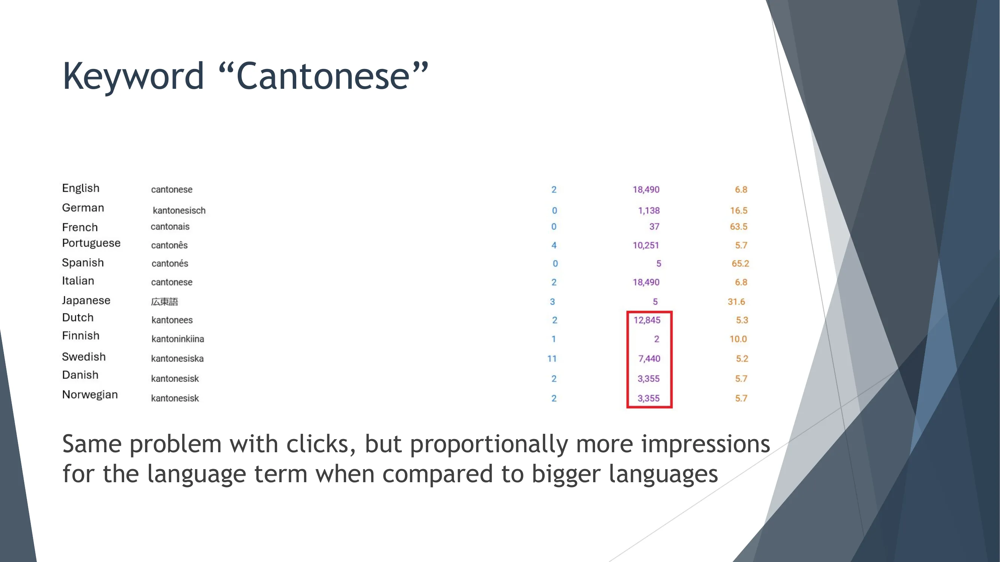

Take the keyword "Cantonese" (and its translations in various languages) as an example. We can see: the English "cantonese" has 18,490 impressions, the Dutch "kantonees" has 12,845 impressions, the Swedish "kantonesiska" has 7,440 impressions, and the Danish and Norwegian "kantonesisk" each have 3,355 impressions.

Relative to population size, the impression volumes from these small countries are disproportionately high.

More importantly, let's look at what keywords users in each country are searching for:

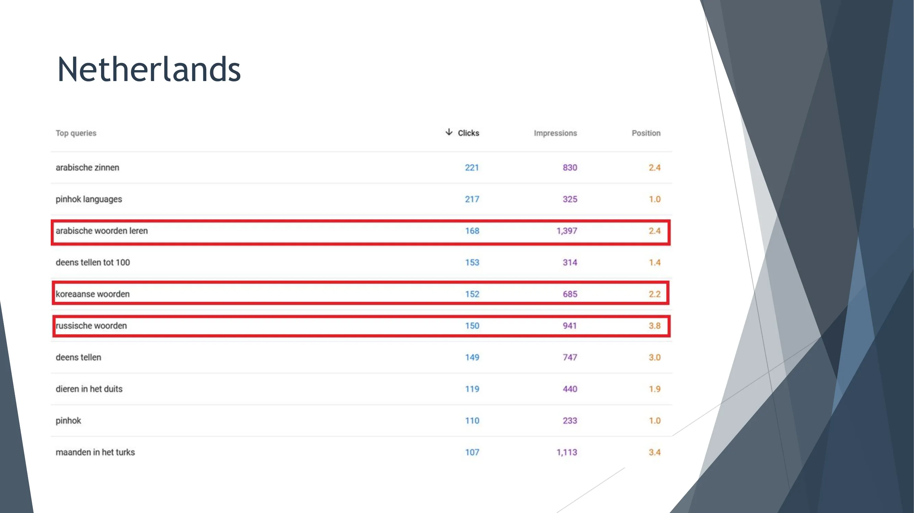

In the Netherlands market, top search terms include "arabische zinnen" (Arabic sentences), "arabische woorden leren" (learn Arabic vocabulary), "koreaanse woorden" (Korean vocabulary), "russische woorden" (Russian vocabulary), and more.

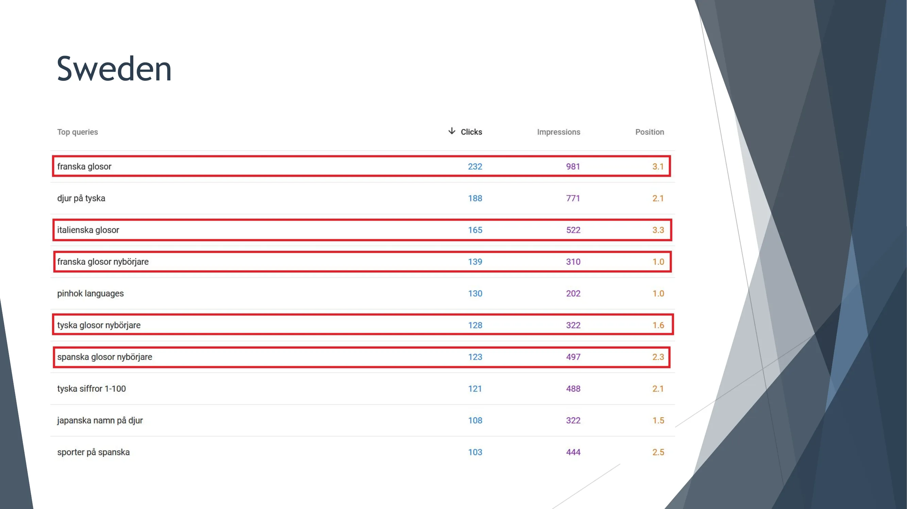

The Swedish market shows a similar pattern, with top terms like "franska glosor" (French vocabulary), "italienska glosor" (Italian vocabulary), "franska glosor nybörjare" (French beginner vocabulary), and so on.

"Woorden" and "glosor" mean "vocabulary" or "words" in Dutch and Swedish respectively. This means that in "Small & Rich" countries, Pinhok can rank not only for long-tail keywords (like "French numbers") but also for broader category-level keywords (like "French vocabulary").

In large markets like the US or Germany, you can only rank for specific long-tail keywords — the competition for broad category-level keywords is simply too fierce.

**Third, brand searches account for a higher proportion.**

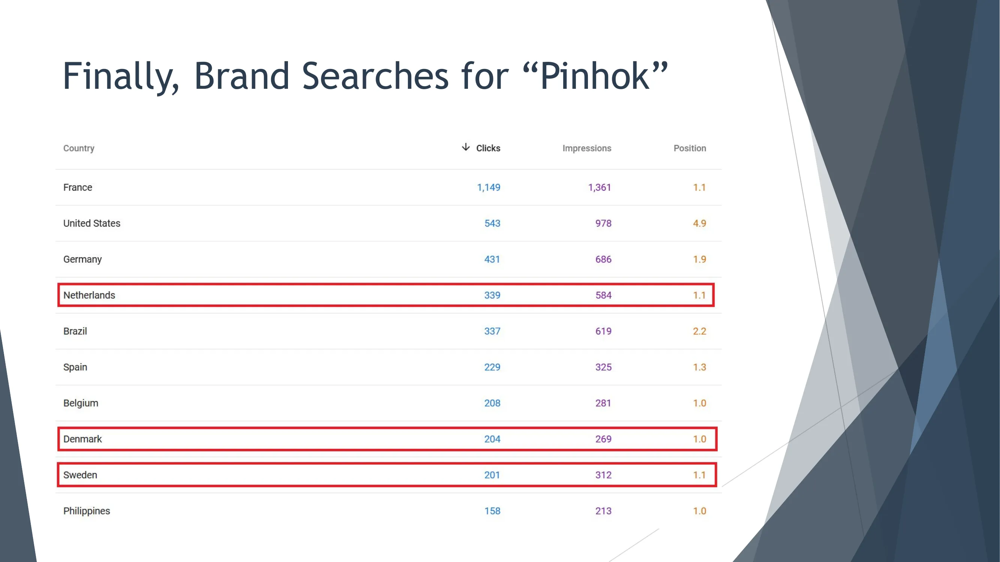

Looking at the search data for the brand keyword "Pinhok," small countries like the Netherlands (339 clicks), Denmark (204 clicks), and Sweden (201 clicks) show brand search volumes that, when adjusted for the population gap, are proportionally much higher than the US (543 clicks) and Germany (431 clicks). This indicates that users in these small markets have built a stronger association with the brand.

### Data Summary

The "Small & Rich" country strategy is clearly working: countries with populations of only around 10 million are outperforming the US, UK, and even India in traffic; broad keywords rank well in small markets but not in large ones; and brand searches have higher proportions and better rankings in small markets.

## 5. More "Potential Countries"

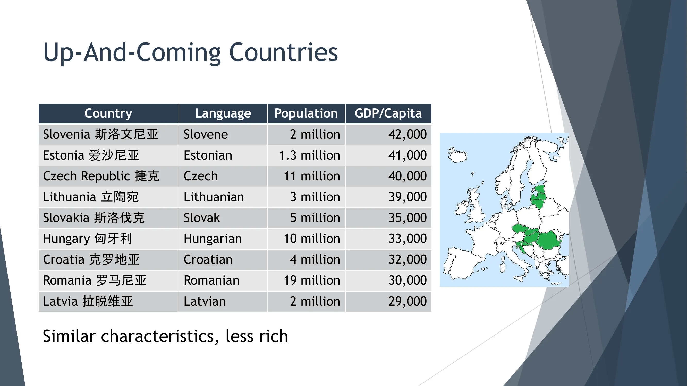

Beyond the original six "Small & Rich" countries, Wolf also identified a group of "up-and-coming countries" that share similar characteristics but are not yet as wealthy:

| Country | Language | Population | GDP per Capita (USD) |
|---------|----------|------------|---------------------|
| Slovenia | Slovenian | 2 million | 42,000 |
| Estonia | Estonian | 1.3 million | 41,000 |
| Czech Republic | Czech | 11 million | 40,000 |
| Lithuania | Lithuanian | 3 million | 39,000 |
| Slovakia | Slovak | 5 million | 35,000 |
| Hungary | Hungarian | 10 million | 33,000 |
| Croatia | Croatian | 4 million | 32,000 |
| Romania | Romanian | 19 million | 30,000 |
| Latvia | Latvian | 2 million | 29,000 |

As these Central and Eastern European countries continue to develop economically, they could become new growth engines in the future.

## 6. Implications for SaaS Companies

### The Typical Internationalization Path for Most SaaS Companies

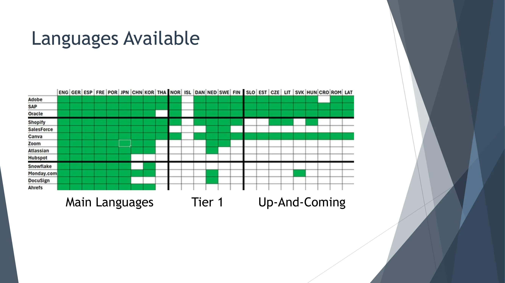

Wolf surveyed the language support of a range of Western SaaS companies — from legacy enterprises (SAP, Oracle, Adobe) to mature companies (Salesforce, Shopify, Canva) to emerging companies (Snowflake, Monday.com, DocuSign) — and found a common internationalization pattern:

Most SaaS companies expand internationally in this order: first the English market, then German, French, Portuguese, and Spanish, followed possibly by Chinese, Japanese, and Korean, then large countries like Italy, Poland, Turkey, or Russia, and only then do they consider small markets.

From the table, it's clear that "Small & Rich" countries and "up-and-coming countries" are still largely blank spaces in most SaaS companies' language support. Only legacy giants like Adobe and SAP have achieved relatively comprehensive coverage.

### The SaaS Version of the "Small & Rich" Strategy

Wolf's recommendation: prioritize by GDP per capita rather than population size.

- English remains the top priority
- Followed by German, French, and Spanish
- But next, instead of jumping to Chinese or Japanese, consider **adding Dutch, Swedish, Norwegian, and Danish support early on**

The reasoning is simple: users in these countries have strong purchasing power, there are fewer competitors, and because of the small population sizes and unique languages, very few companies bother with localization — which is precisely your opportunity.

## 7. How to Execute

### Deciding Which "Small & Rich" Country to Start With

Localizing a website or SaaS product is a significant investment. Wolf proposed four methods for gathering data to guide the decision:

**Method 1: Leverage existing customers.** This is probably the best approach, because existing customers prove that demand exists and there are no unforeseen barriers. You can reach out to these customers to understand what localization improvements they need — such as integrations with local tools (accounting, payments, etc.) and why they use your product. Start with the country where you have the most customers.

**Method 2: Use GSC or website analytics data.** Your website may already be ranking and receiving traffic from countries you haven't specifically optimized for. Check the "Countries" tab in Google Search Console to see which countries are searching for your product.

**Method 3: Translate 2-3 pages as a test first.** When you're working on English, German, Spanish, and French versions, also translate 2-3 important landing pages into other small languages. Let them sit for a while, and by the time you finish the main languages, you'll have first-hand data to judge which languages have already gained traction.

**Method 4: Create a free tool.** Build a free tool that many people need (Ahrefs does this well, offering a wide range of free SEO tools), then translate it into as many languages as possible. If successful, these tools will tell you which countries are using them, provide potential users you can interview, and serve as a free launch platform when you complete localization for a given country.

### How to Handle Translation

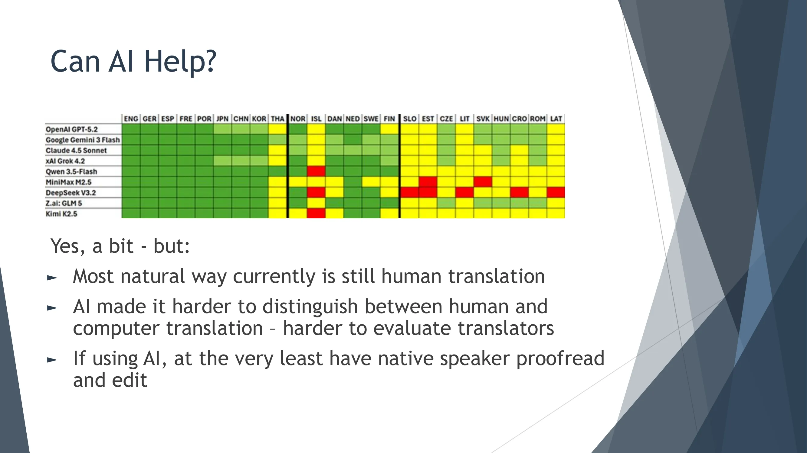

Wolf admits that translation seems simple but really isn't. The core challenge is: you don't speak the target language, so you must find someone who can do the translation well. The emergence of AI has been both helpful and complicating — because it's now harder to distinguish between human and machine translation, making it more difficult to evaluate translators.

From the AI translation quality comparison chart above, we can see that mainstream AI models perform well on major languages (green), but quality is inconsistent on smaller languages (yellow and red).

**Translation workflow before AI:**
1. Find at least 3 native speakers to translate the vocabulary list
2. Simultaneously use Google and Bing Translate
3. Manually compare 4-5 datasets
4. For inconsistencies, use Google Image Search, Wiktionary, and other tools to verify
5. Have 1-2 more native speakers proofread
6. Incorporate feedback and publish

**Translation workflow after AI:**
1. Find at least 3 native speakers to translate the first 500 words
2. Simultaneously have 3 AI models translate the same 500 words
3. Compare human and AI translations (if human translations are too similar to each other, translators may be using AI too)
4. Use AI to analyze inconsistencies and select the best translations
5. Have the best translator complete the full vocabulary list
6. Use AI to check for potential issues
7. Make corrections and publish

Regarding keyword translation, Wolf recommends: use AI to translate English keywords into the target language, have the AI provide 3-5 options, then check on Google which option yields the best search results, and use that one.

## 8. Sales Data Validation

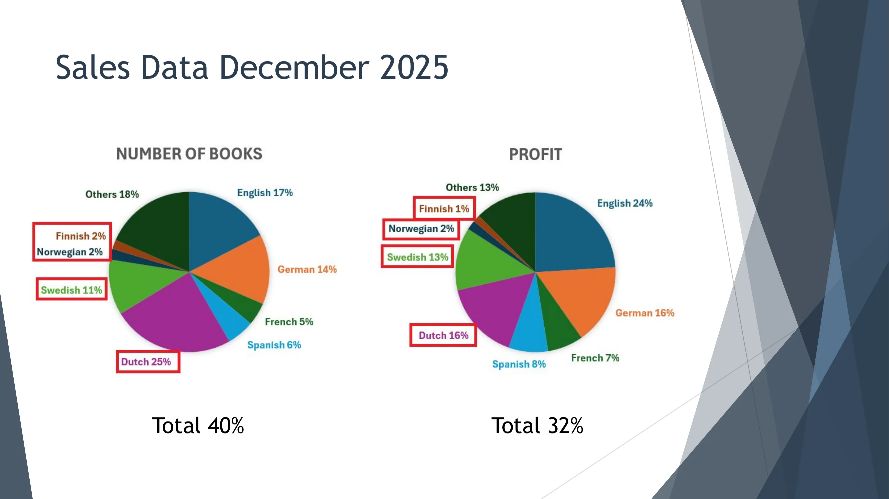

The final sales data provides the most powerful validation of this strategy. Taking December 2025 as an example:

**By units sold:** "Small & Rich" countries (Netherlands 25%, Sweden 11%, Finland 2%, Norway 2%) together contributed **40%** of total sales.

**By profit:** "Small & Rich" countries (Netherlands 16%, Sweden 13%, Norway 2%, Finland 1%) together contributed **32%** of total profits.

For comparison, the English market contributed 17% of sales and 24% of profits, while the German market contributed 14% of sales and 16% of profits. In other words, a handful of small countries with a combined population of less than 40 million outperformed both the English and German markets in both sales and profits.

The Netherlands performed particularly well. Wolf explained why: he partnered with a local Dutch company to ensure books were available in all Dutch online bookstores. Additionally, Dutch people enjoy learning languages and prefer practical, no-frills products.

Another interesting story is the Swedish market. Sweden was originally on par with Norway and Denmark, but after Amazon.se launched in 2020, it gained an additional local sales channel and sales increased fivefold. Similar boosts occurred in Poland (Amazon.pl) and the Netherlands/Belgium (Amazon.nl and Amazon.be).

## 9. Localization Beyond Language Translation

Wolf emphasized that true localization goes far beyond translating language.

For Pinhok, the key was getting into local online bookstores (such as Amazon.se, Bol.com, etc.).

For SaaS companies, considerations include: integrating local payment providers and accounting tools, obtaining local certifications (such as SGS, TUV, etc.), and building reputation on local trust platforms (Trustpilot, G2, etc.).

Wolf also specifically mentioned that Chinese companies like Alibaba, JD.com, Tencent, and Pinduoduo are all actively expanding into Europe. If your SaaS can partner with these platforms — for example, integrating with Alipay when it launches in a given market, or connecting to JD.com's fulfillment network — that would be a unique competitive advantage.

## 10. Additional Growth Strategies

### 1. Using PDFs to Capture Search Traffic

While studying Bing data, Wolf discovered an interesting pattern: many users add "filetype:pdf" to their keyword searches. This could be a user habit or related to AI crawlers.

His approach: provide a PDF download link at the bottom of every free content page. Key details include: linking directly to the PDF file, hosting the PDF on your own server (not a CDN), using the target keyword as the PDF filename, and including the website URL inside the PDF.

### 2. Offering Free Features

Pinhok's approach is to provide free learning materials (website, PDFs, YouTube, etc.) that are completely free with no registration or email required, then upsell from the free content.

For SaaS companies, this could mean offering a free version of a small feature or creating small standalone platforms.

### 3. Niche Down — Go More Specific

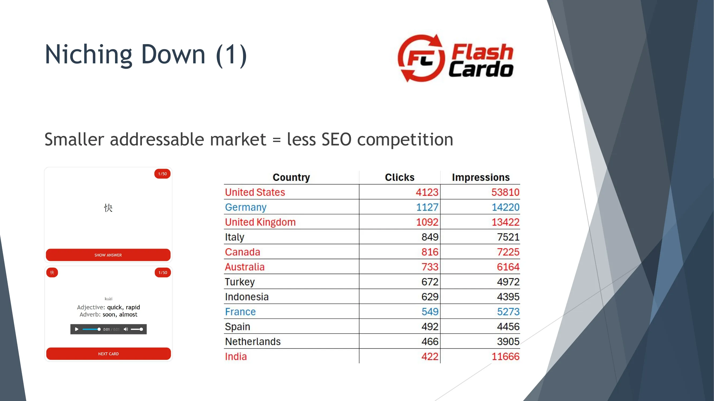

A smaller addressable market means less SEO competition. Wolf discovered that some users prefer learning with flashcards, so he created Flashcardo.com. Users searching for flashcards are roughly one-tenth of those searching for vocabulary lists, but precisely because of less competition, Flashcardo achieved solid rankings in English-speaking markets like the US, UK, and Australia, which in turn boosted English book sales.

This approach applies equally to SaaS: if you can't compete in a large category, find a more specific angle to enter.

## 11. Conclusion

The core idea of the "Small & Rich" strategy can be summarized as:

**Target countries with small populations, their own native languages, and high GDP per capita.** These markets hold enormous SEO potential because competition is minimal. Most SaaS companies are still following the traditional path — major languages and large markets first — to expand internationally, completely overlooking these "Small & Rich" blue oceans.

For Pinhok Languages, four "Small & Rich" countries contributed **40% of sales and 32% of profits**. That number alone is the most compelling proof.

If you're working on international SaaS or cross-border business, it's worth re-examining your market prioritization. Perhaps those small Northern and Western European countries you've never seriously considered are exactly where your next growth breakthrough lies.

---

*Speaker contact information:*
- *Website (English): wolfweb.hk*
- *Website (Chinese): langzhan.net*
- *Email: contact@wohok-solutions.com*
- *WeChat: xiaolangAUT*
