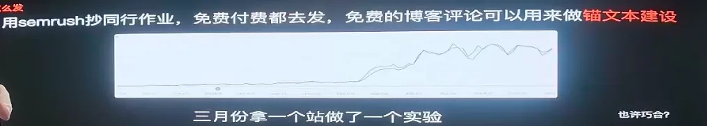
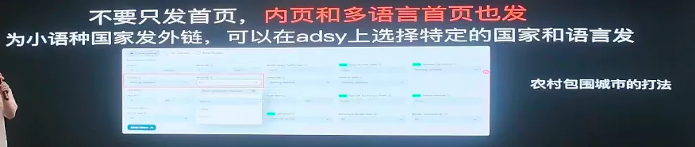
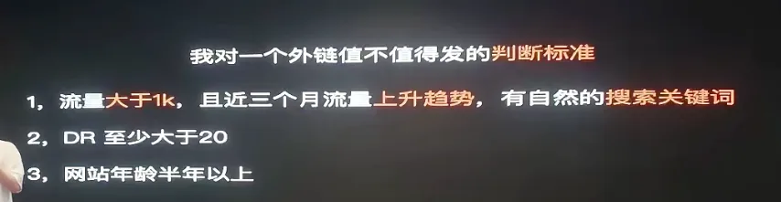

# From a Broke Student to Five-Figure Monthly Income: A Gen Z AI Entrepreneur's Journey

> On "**Gefei’s Friends, Mid-Year Sharing at Shenzhen Station,**" a post-00 independent developer (community and Little Red Book account asnull) brought about a "hair for the earth" sharing.
> >
> Compared to the previous guests' dry-goods theory, his share was much more like a new-man's development record**— it was only in April 2025 that he joined the Gefei’s community, from zero studies, and in September of the same year he achieved a monthly gain of tens of thousands. He summarized his path as a sentence: **General background + Strong implementation + Little luck.**

---

## I. Who is he? A 10-year-old farmer.

The background: He was a graduate of the class after post-2000, 2025, and was an automated **(not a computer). In April 2025, he joined the Gefei’s community to start researching the AI-powered global entrepreneurship, which was introduced by a 10-year-old friend, the Eggshell; after graduation, he was recommended to work in a company. By September 2025, he achieved a monthly intake of tens of thousands and continued to the present.

> He repeatedly stressed that the egg shells were his "beneficial" -- that it was this old friend who led him into the global expansion track.

Don't look at him for a year after he graduated from junior high school, but he's also a 10-year old farmer. He's been doing the bottom of his ability to make global expansion.

---

## Two, from "showing" to "products": seemingly useless experiences, they become the bottom of the power.

He was running his product over, and each one of them didn't make much money, but he was feeding it a little bit:

- **Start with a play-off**: primary school plays games, but does a good meal, and then goes to the outside, scripts, game changers, crackers, video and visual resolution, and goes through a variety of demolition forums (such as I love to break into a community).
- **On the way home**: One day at the forum, someone shared "Apport software with a mobile phone" and he had no computer at home -- he could build something, and he went into the pit.
- **First software**: a toolbox, with the interface initially "Present Century style" and a copy of the UI design having a feeling. No user, just playing; sending the package to your classmates, opening the window to show "Who's Developer" and it's really cool.
- **Second software (FBS)**: Video-visual resolution tool, starting with the network, API, more complex things.
- **Third software**: "Teach/Manual" popular in circles, he also made a book, **containing about 20,000 users**-- but at the time, he had no knowledge of commercial liquidation, "pure charity" and only made over a thousand dollars.
- **University + Eggshell entrepreneurship project**: Systems learned at the front end; eggshell entrepreneurship led him to produce a small program and a web version. The principle is very simple: enter the title, and then randomly combine the paragraph with the template. In 2023, they accessed ChatGPT earlier, and the value of the product was gradually diluted as AI became popular.

> His conclusion is very true: these products have not earned money, but **have worked out the feeling of doing the product**and have helped a lot to later do the Global Expansion station.

**Gold sentence: It's not about what you use, it's about whether you can solve the problem. The product is not a pile of technology, it's about demand.**

---

## iii. Why choose global access: find your way in anxiety

It's not a sudden road, it's "recovered in anxiety":

- It's not true that the egg shell pushed him back to the public sign in 2024, but his perception was that he could change himself only if he studied in a better environment.
- **Crazy search**: After the failure of the study, there was anxiety, and all kinds of "money-seeking" (including Web3 and so on) were tried. It was not until February 2025, when we had a deep talk with the egg shell, that we officially decided to go the global expansion.
- **Interest and capability match**: already a website, App, familiar with product tools, interest in AI (in automation specialty, a project to access desktop robots).
- He remembers that when he first got into office, he was paid thousands of dollars a month, **and immediately joined the Gospel community.**
- And with AI making development more efficient, it's a logical path.

---

## IV. New skills: Crushing cognitive blind zones with operational density

He summed up his approach to growth in one sentence: **Strengthen the miracles, crush the cognitive blind with an operational density, and walk away and repeat itself.**

### First of all, we've had to go over the "secretary" of the community three times.

When I first got into the community, he would send out a whole bunch of introspectives, most of the first time he looked at them, and it was normal. His method was:

- **Round one**: all of them go through the whole and establish the overall framework;
- **Second time**: looking back, because with a sense of holisticity, many concepts will be "puzzled";
- **Third time**: follow practice.

### 2. Followed the "Age Protection" series to the first stop.

He followed the "Standing Stations" series of the Ko Fei community and completed the first stop of his life:

- (b) Practice with **root**to find keyword (e. g. g., g.) and select **low flow, low difficulty**;
- (a) Registered domain names should be given priority `.com ' /.org ',**rather than `.xyz ', `.top ' **, which are easily abused by ash and untrustworthy as search engines;
- It's a way to get to the data platform and learn to look at the data.

> **Core mentality: The first stop is not for money, so run the whole process through.**Many people are stuck in "no action" — they're always trying to make money at the first stop, and they're slow to do it; there's no positive feedback, and the less feedback they want to do it, so let's do it.

The first station had almost no traffic, but he was already excited to do the second when he saw a few real users.

### 3. Second station: one hour on line, first time feeling the power of money

The second station found an emerging keyword in the hot search/ derivative list when entering the AI-related word on Google. Because the first station had run the process, he **registered domain names in an hour, **did not go backlinks and did nothing to promote.

As a result, there were more than a dozen online users in one bed the next day, reaching thousands in a week.**On 12 June 2025, he realized his first gain from global access.**(This station was left unattended and made $71 a year.)

### 4. Making the website more "over-trial"

On how to make the website more accessible (e.g. AdSense), his experience coincided with other guests -**to make the website "like a website"**:

- Don't look at the past as "vibe coding" semi-finished;
- Complementing privacy policies, service provisions, etc.;
- If the page is too single, you can add a FAQ and add a few blogs to the page.

### 5. Action density lunch brainless a site

In particular, he cautioned that action density was important, but that **was not brainless lanch a spot **(he had seen someone go up 500 stations a month, but it was useless). Do it on the basis that **each station was better than the previous one, and it was constantly summarised, and it was done quickly.**

> A flash drive: The second station itself built a set of lanch a spot template from scratch, moving through payments, Google log-in, user systems, emails — which laid the foundation for his next station's fast-start line. And then a lot of stops went on, but without all results, lanch a spot, backlinks were growing, laying the groundwork for the first list of global examples. Looking back, he suggested that**the new hands would use the ready-to-go template (e.g., an open-source template with user systems, cut-off, payment logic) and focus their energies on the core:**functionality, tools, transformations — your real business**.

Then he went to the drawing station and so on, but the launch a site process continued to optimize in each operation, laying the foundation for subsequent payments.**The first payment was made on 18 August, and he stayed up all night.**

---

## V. launch a site experience and skills

### How do you do that?

A copy of your work, free of charge and free of charge. He believes that**free Google backlinks still have value**and can be used to build the keyword.

> He gave an example: Gefei didn't know who you were, but if everyone on the stage said "He's doing XX," he would believe it. The outside website would be like "Man on the stage," Google would be "Gefei" **and when there were enough outside stations to say that you were doing something in the direction, Google would believe you.**

This is similar to SEO's backlinks, which may have been manipulated, but his test actually worked: in March, he took a site test, sent free blogs on a continuous basis, and then clicked more than 60 digits a month later (without updating the website, pure hair chain); and then in May, when Google algorithms were updated, they suddenly took off.

### Multilingualism: rural siege of cities

Gefei and Ping all said "one stop in each language," but their energy is limited for independent developers. His choice is to make a sub-catalogue**:

- The first page of the subdirectories allows the domain name to be raised separately;
- Everyone's fighting for English high-volume keyword, fierce competition,**non-English language **;
- It's easier to get rankings with a separate copy of the bibliographies;
- Non-English language, small countries get their rankings and further forward their access to the front page.

> In summary: **Rural siege of cities**— First, the ranking of small places will benefit the whole front page.

### A free backlinks is not worth it. Look at five.

1. **There is traffic**: at least traffic > 1000, no traffic of no value;
2. **Trend upward**: nearly three months of traffic is on the rise (the decline may have been demandless or punished by Google — not on a punished station, which could have led to self-infliction);
3. **There's a natural indexing real keyword**: real users are searching, not false traffic;
4. **DR at least 20**;
5. **Not too new**: Domain names are best over six months old. Don't send new stations backlinks to new stations, they don't work, they can even be punished together.

### Don't just focus on the words, on the needs behind the models.

When doing the AI tool station, do not just stare at the "model word" itself. You can also look at the real needs behind the model**-- for example, when a picture edits the model fire, you can look at how much traffic you get at a station like that, and what the users are searching for and what they use.

### Inner pages SEO: selection based on data

If you want to use the last inner pages, do not choose the word by feeling. Open the data tool to see which keywords have a search volume, which is relatively manageable, and then decide which page to make.

### Pricing policy

- **Do not create too many slots**, 3 is enough: introductory / professional / advanced. Too many users will have difficulty choosing to leave directly on the page;
- **Introductory**: low price, but poor value compared to intentional (e.g. 9.9 knives produced only a few maps);
- **Professional edition**: only a little bit more expensive than the introductory version, but full value for money **This is the stage where the main push is to guide the user to a deal **;
- **Advanced edition**: can be priced (500, 700 knives and no difference between a khaki), full rights and rights, "no use";
- **Default display of annual fee**: Many users will give priority to annual fee, while one annual fee is approximately 10 months' monthly fee.

### Professional design brings a sense of trust.

Uniform design elements, uniform style, professional Logo, all these details are influencing the transformation. Don't become a website called "Bluckey in one piece, want to run" -- the more professional the page**gets, the more users believe you won't run, the longer you'll be able to keep it, the more natural it is.

---

> This paper is based on the sharing of the last post-00 community member of the "Gefei’s Friends, Mid-Year Sharing, Shenzhen Station, 2026.07.04-07.05, Shenzhen World Hotel" and is intended to inform and distill their personal experiences, views and experiences, and to provide a platform for cross-references between the Gefei community partners and their peers, without representing platform positions. The paper deals with specific practices such as backlinks operations, pricing, etc., and makes its own determination of compliance and risk; if you need to reproduce or quote, please indicate the source and contact the author's authorization.
