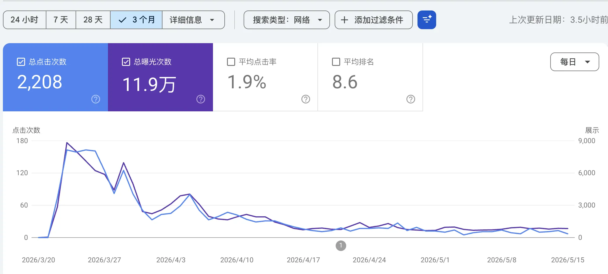

import GrowthSimulator from "@/components/GrowthSimulator.astro";

> This is not a "how I grew X% in N days" piece. It's a retrospective on my own loss. I did 80% of the engineering right and the traffic curve still collapsed. The Top 3 did things I didn't — and those things win on math, not on hustle.

## Where it started: one failed micro-SEO experiment

In indie hacking, engineering chops are table stakes. What actually decides the ceiling is **traffic intuition and growth mechanics**.

Last month I joined a new-site ranking experiment with a highly automated stack. My pick was a **game walkthrough site**. In the launch window it pushed near 10k impressions a day, and then it fell off a cliff. Meanwhile the Top 3 entrants ran an **SBTI personality test site** and pulled in over a million users in 24 hours.

The full end-to-end run, plus tearing down what the winners did, completely rewrote how I think about **content SEO** vs **growth hacking** — both the underlying math and the engineering that supports it. Here's the postmortem.


## I. My engineering practice: an automated content-SEO pipeline

I have a solid backend background. The real point of this project wasn't revenue — it was validating an end-to-end loop: **data discovery → automated site build → edge deployment → AI-driven content pipeline**.

### Stack and architecture

For maximum agility I dropped heavyweight CMSs like WordPress entirely and went edge-native:

- **Frontend & scaffolding**: modular build on the `mksaas` template, UI generated and tweaked with `Claude Code`, every non-essential JS removed to protect LCP.
- **Deploy & network**: full `Cloudflare Pages`, eating CF's global edge nodes for serverless, zero infra cost.
- **Storage refactor**: mid-project, the walkthrough image bundle blew past the static-pack size limit. I moved all hero images and covers to `Cloudflare R2` with aggressive edge caching, which got the main bundle back into bounds.
- **Content pipeline**: zero hand-written content. Scripts called the web-search functions on `Codex` and `Claude Code` to pull live Steam player activity and level data, then emitted structured Markdown walkthrough pages.

### Keyword pipeline

The keyword process was deliberate and reproducible:

```
Google Trends watch → Semrush / Ahrefs funnel → LLM difficulty + potential scoring → domain grab + launch
```

- **Discovery**: from mid-March, high-frequency monitoring on `Google Trends` looking for long-tail terms that bent sharply upward within 48 hours.
- **Validation**: cross-check candidates in `Semrush` and `Ahrefs` for real search volume and keyword difficulty (KD).
- **Decision**: feed the competition signals to an LLM, compute ROI, lock in a target. I landed on a game launching on Steam on March 20.

### The numbers: peaked on day one

Execution in the launch window was clean. Domain grabbed on March 20 (release day), landing page fully live and submitted to GSC on the 21st.

The first three days of release-window momentum carried the site straight up. From Google Search Console:

- **March 23**: daily impressions to **8,600+**, clicks near **200**, average position around **8.6**.



I assumed traffic would snowball as I filled out inner pages (eventually 200+ pages, batches of 4–10 walkthroughs every ~4 days). It didn't. Traffic bled down day by day until UV and PV both dropped to double digits.

### What I got wrong

- **Over-designed, under-iterated.** In the visual pass, chasing "the perfect experience," I had the AI iterate the design 7 or 8 times. That burned the most valuable hours — the launch-day ramp where a new site builds its initial weight.
- **One-way consumption, zero retention.** A walkthrough site is by nature read-once-and-leave. With no retention or interaction loop, every user was a single-session user. Day-2 retention was effectively zero.
- **Content and backlinks both starved.** Once daily work picked up, the site stopped getting fed. Fewer than 10 backlinks at the start, no sustained inbound after, so once competitors flooded in, the early weight got diluted fast.

## II. Outmatched: tearing down the Top 3 growth-hacking model

Compared to my traditional SEO funnel, the Top 3 (all SBTI-style online tests) were playing a different game. The #2 entrant pulled **1M+ UV in 24 hours, 6,000+ concurrent users, and finished with 2.36M UV / 3.92M PV.**


Underneath the spectacle was a **very precise social-self-propagation math model.**

### Speed is a feature

At 23:59 on April 9, group chats and friend feeds carried the first signal; a test video on Bilibili had crossed millions of views. The winner didn't spend an hour on UI.

- **Decided overnight**: registered a domain, cloned a base question bank with `Claude Code`.
- **Live in an hour**: the rough-but-usable MVP went straight onto `Cloudflare Pages`.

In a pulse-style trend, **time-to-live outweighs polish — by a lot.**

### Self-propagation built into the product

The reason the test site went exponential is that they actually triggered a **viral coefficient K (Viral Coefficient)**.

The million-dollar small detail: **the long-form result image had a QR code with the site's domain baked into the footer, and "save / share card" was made obviously frictionless.**

- **Psychology**: personality tests naturally trigger self-expression, identity-signaling, and vanity sharing — three drivers at once.
- **The loop**: user finishes test → has an emotional reaction → saves the QR-stamped result → posts to WeChat Moments / Xiaohongshu → new users scan in.

Every inbound user became a **distribution node carrying a trusted social endorsement.**

### Aggressive cold start and traffic interception

In the first 24 hours, before any search engine had caught up, initial traffic wasn't crawler-driven at all. It was **interception**:

- **Riding the conversation**: searching trending keywords on Xiaohongshu and Weibo, then manually replying with the free test link under every top comment thread asking "where's the test?"
- **Catching the spill**: at noon on April 10, the original open-source upstream site got blocked at China's edge — too much concurrent traffic and unregistered ICP. Because the winner had already seeded their link across micro-influencers and comment threads, *their* site became the default fallback and absorbed the entire spill.

### Dynamic evolution and long-tail SEO harvest

If you thought they only had one trick, you'd be underestimating them. On days 2 and 3 they showed real engineering depth.


- **Cross-region, multi-language clones**: real-time GA showed heavy traffic from Singapore/Malaysia and Hong Kong/Taiwan. Overnight they extended the question bank to overseas contexts and added i18n, triggering a second viral wave (Malaysia alone delivered 2.5K concurrent).
- **Programmatic SEO at scale**: by day 3, social was producing crossover formats — "SBTI × zodiac," "SBTI × MBTI." They structured the data and used a JSON-driven script to render 2,000+ sub-pages. Dwell time was unusually long (avg engagement 4m 01s), so Google didn't flag them — and they took over long-tail SERPs.

## III. The collision: two models, one whiteboard

A single table separates the two mental models:

| Dimension | My traditional content SEO (walkthrough site) | Top 3 growth hacking (SBTI test site) |
| --- | --- | --- |
| **Growth function** | **Linear**: Tₙ = T₀ × (1 + r × n) | **Exponential**: Tₙ = T₀ × Kⁿ |
| **Launch traffic source** | Google ranking, passive crawler wait | Friend feeds, micro-influencer circles, Xiaohongshu comment interception, GEO (Doubao and other AI-answer ecosystems) |
| **User behavior** | One-way, single-session content consumption | Two-way, interaction carrying social currency (QR-coded share image) |
| **Commercial tradeoff** | Chase perfect visuals + site structure, miss the launch window | Ruthlessly restrained — declined short-term ads to keep peak-traffic stability |
| **GSC submission** | Submitted immediately, depends on crawler speed | First two days: ignored traditional SEO entirely. Submitted to GSC on day 3 only to catch residual demand |

Two insights worth keeping:

1. **Redefine where SEO sits in the funnel.** In a pulse-style trend, traditional search is not the first driver. In the first 24 hours, what pushed the site to its peak was the social graph, AI answer engines (GEO), and screenshot-based virality. **SEO belongs in the second half — a wide net for residual searches spilling off the wave, not the spark that lights the wave.**
2. **Product mechanics beat operational hustle.** Engineers fall into the diligence trap — write more scripts, ship 200 more pages, build 10 more backlinks. None of that compounds. A well-designed "share image with embedded QR" compounds. Linear labor loses to a geometric mechanism, every time.

## IV. Closing: compounding the right loop

The walkthrough site landed in the middle of the pack, and traffic flatlined after the brief spike. But during those few launch days, watching real-time numbers tick up in GA was a visceral, real positive feedback signal. It made the appeal of chasing fresh keywords very concrete.

As a programmer, my underlying infra (edge compute, R2 pipeline, full-auto LLM scraping) is already past the friction point — arguably ahead of pure-marketing operators on that axis.

What's next is breaking the "by-the-book SEO" frame. In the next indie / MicroSaaS project, I want to **graft solid engineering onto growth-hacking primitives: a real viral coefficient mechanism, plus Programmatic SEO for batch sub-page generation.**

This was just one skirmish on the indie-hacking road. Now that I've seen the winners' hand, next round it's my turn to bring the asymmetric edge.

---

## Appendix: traffic growth model simulator

To make the math concrete, the widget below runs both models side by side over 30 days. Drag the three sliders — seed users, SEO daily growth rate, viral K — and watch what happens.

Pay attention to what happens the moment K crosses 1.0.

<GrowthSimulator />
