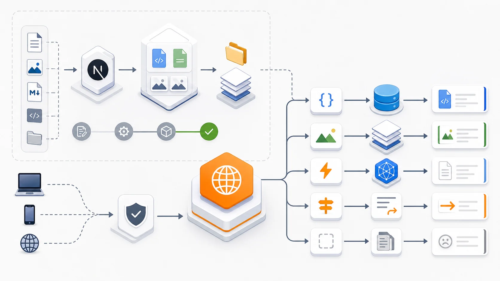

I recently moved a content project from Vercel to Cloudflare Workers. It is a game content site built for overseas search traffic, and the core requirements were simple: pages must stay stable, SEO must not drop, the launch must be reversible, and unnecessary template features should ideally be removed along the way.

The direct trigger was that the project's compute usage on Vercel's free tier was starting to run out. The dashboard showed `Exceeded free resources`; Fluid Active CPU had already gone beyond the free allowance, and the warning email made it clear that the free team had used all included Fluid Active CPU. If usage kept exceeding the free quota, the project could be automatically paused.

This migration was not as simple as switching a deployment button. Looking at the git history, the real migration work happened between June 24 and June 29, 2026. There were 6 core commits, touching 293 files, adding roughly 3,000 lines and deleting about 38,000 lines. That number says a lot: the main job was not "add Cloudflare", but first reshape the project into something suitable for Cloudflare.

## 1. Why Migrate


The project originally came from a SaaS template. It included many capabilities that were not necessary for a content site: login and registration, admin pages, Stripe payments, credits, email, an AI playground, database migrations, file uploads, and more.

Those features make sense in a SaaS product, but for a site centered on SEO content and static pages, they created several problems:

1. The runtime became heavier, and the deployment environment became more complex.
2. Many APIs and service dependencies were not a natural fit for Cloudflare Workers.
3. Maintenance cost was inflated by template features; every future upgrade had to account for modules that were not currently needed.
4. Once search traffic grew, dynamic rendering and function execution would burn through platform free quotas faster.

What finally made me commit to the migration was the combination of resource billing pressure and stability risk.

On one side, traffic growth is a good thing. But Vercel's warning was direct: Fluid Active CPU on the free tier had already been exhausted. Continued growth meant either upgrading to a paid plan or accepting the risk that the project could be paused. For a content site that depends on steady search traffic, "could be paused" is not acceptable.

On the other side, the site's business shape did not require much server-side compute. Most pages were content pages, listing pages, docs pages, and static assets. Since the access pressure was mostly read traffic, the more reasonable direction was not to keep paying for dynamic runtime, but to make the architecture more static and more edge-oriented.

So the first step of the migration was not writing a Worker. It was making tradeoffs: what does this site actually need? Which runtime capabilities are real business needs, and which ones are just historical baggage from the template?

The final core capabilities were straightforward:

- multilingual content pages;
- blog and documentation content;
- SEO infrastructure such as sitemap, robots, canonical, and hreflang;
- a few Worker-native APIs, such as health, ping, and search;
- static asset hosting and edge caching.

Everything else that did not serve the current goal was removed.

## 2. Migration Path: Let Next.js Generate Static Content, Let the Worker Own Edge Logic



The original project was a typical Next.js application. After moving to Cloudflare, I did not try to force every piece of Next.js server logic into a Worker. Instead, I shifted the architecture to static-first:

Next.js generates static pages, and Cloudflare Worker handles the request entry point.

The build scripts now include a Cloudflare-specific command:

```bash
pnpm build:cf
```

It actually does two things:

```bash
CLOUDFLARE_STATIC_EXPORT=true next build
tsx scripts/generate-llms-assets.mts
```

In `next.config.ts`, when `CLOUDFLARE_STATIC_EXPORT` is enabled, Next.js uses `output: 'export'`. In other words, content pages are exported to the `out` directory and then served by Cloudflare Workers Assets.

The Worker configuration is also direct:

```toml
name = "content-site"
main = "src/worker.ts"

[assets]
directory = "out"
binding = "ASSETS"
html_handling = "none"
not_found_handling = "none"
run_worker_first = true
```

The key setting is `run_worker_first = true`. Every request enters the Worker first, and the Worker decides whether it should go to an API, a static asset, default-language fallback, 404 handling, or a root-domain redirect.

This keeps the site's edge logic concentrated in `src/worker.ts` instead of spreading it across platform configuration and framework conventions.

## 3. The Biggest Change: Slimming a SaaS Template Down Into a Content Site

On June 29, there was one large commit:

```txt
feat: enhance Cloudflare integration and clean up unused scripts and configurations
```

That commit removed many capabilities inherited from the original template:

- auth login and registration;
- Stripe payments and webhooks;
- credits system;
- newsletter subscriptions;
- admin/dashboard/settings pages;
- Drizzle database configuration and migrations;
- AI chat/image/text playgrounds;
- S3 storage uploads;
- Resend/Beehiiv and other email or subscription integrations.

At the same time, it added the Cloudflare foundation:

- `src/worker.ts`: Worker request entry point;
- `src/api/health.ts`, `src/api/ping.ts`, `src/api/search.ts`: Worker-native APIs;
- `src/lib/cloudflare/cache.ts`: edge cache wrapper;
- `src/lib/cloudflare/kv.ts`: utility layer for future KV usage;
- `src/lib/cloudflare/d1.ts`: utility layer for future D1 usage;
- `wrangler.toml`: Cloudflare deployment configuration;
- `src/env.ts`: Worker environment variable and binding types.

The essence of this step was dependency reduction. When migrating platforms, many people first try to make old code compatible. For this project, the better move was the opposite: remove runtime dependencies the current business did not need, then move the remaining parts to Cloudflare.

After that, the Cloudflare adaptation became much simpler.

## 4. What the Worker Handles

After the migration, the Worker mainly handles five types of logic.

The first is API routing.

The original Next.js API routes were reduced to Worker-native handlers:

```txt
/api/ping
/api/health
/api/search
```

The `/api/health` endpoint returns:

```json
{
  "ok": true,
  "runtime": "cloudflare-workers",
  "site": "content-site",
  "timestamp": "..."
}
```

This endpoint was very useful during the migration because it directly confirmed that production requests were actually hitting Cloudflare Workers rather than still running on the old platform.

The second is static asset routing.

The Worker generates candidate assets based on the request path, for example:

- `/` maps to the default-language homepage;
- `/example-page` can fall back to `/en/example-page.html`;
- `/docs/xxx.mdx` can map to generated LLM markdown assets;
- paths with file extensions are handled directly as static files.

This solves one of the most common problems after static export: users visit clean URLs, but the output directory may contain `.html` files or `index.html` files.

The third is caching.

The project added a Cloudflare cache wrapper that edge-caches GET requests and sets:

```txt
s-maxage=3600
stale-while-revalidate=86400
```

That is a reasonable fit for a content site. Pages do not need to hit origin on every request, and stale content can continue serving while revalidation happens.

The fourth is security and indexing control.

The Worker adds security response headers consistently, including:

- `X-Content-Type-Options: nosniff`
- `Referrer-Policy: strict-origin-when-cross-origin`
- `X-Frame-Options: SAMEORIGIN`
- `Permissions-Policy`

For the `workers.dev` staging domain, it also adds:

```txt
X-Robots-Tag: noindex, nofollow
```

The fifth is domain canonicalization.

When the root domain is visited, the Worker sends a 301 redirect to the canonical `www` domain:

```txt
https://<www-production-domain>
```

This matters for SEO. During a migration, one of the worst outcomes is having the same pages appear under the production domain, the `workers.dev` domain, the root domain, and the `www` domain, creating canonical confusion.

## 5. SEO Is the Most Easily Underestimated Part of the Migration

This was not a URL migration. The production domain remained:

```txt
https://<www-production-domain>
```

But even when URLs do not change, SEO still has plenty of traps.

For example, the staging domain must not be indexed. The Worker protects `workers.dev` in two ways:

1. It adds `X-Robots-Tag: noindex, nofollow` to responses.
2. When `/robots.txt` is requested, it returns `Disallow: /`.

Another issue is that sitemap and canonical URLs must not become `workers.dev` URLs just because the site is running in staging. The project's `getBaseUrl()` includes a guard: if an environment variable contains `.workers.dev`, the final base URL still falls back to the official production domain.

There was also a small robots rule detail.

After the migration, this was fixed in a separate commit:

```txt
fix: update robots.txt rules to remove disallow for _next directory
```

That commit looks tiny, changing only one line, but it was important. A static site may still depend on resources generated under Next.js paths. If `_next` is incorrectly blocked, search engines and browsers may run into resource access problems.

When migrating platforms, the issues that truly affect launch quality are often not the big features, but these small rules.

## 6. Launch Does Not End at Deploy


During the migration, I created quite a few temporary files and checklists. Many were just stage-specific investigation notes and were later removed during cleanup. What was worth keeping was not a specific filename, but the categories of checks that must be validated before and after launch.

These are the checks I think are worth preserving.

Before launch, check staging:

```bash
curl -I https://<worker-name>.<account>.workers.dev/
curl -I https://<worker-name>.<account>.workers.dev/en
curl -I https://<worker-name>.<account>.workers.dev/api/health
curl https://<worker-name>.<account>.workers.dev/robots.txt
curl -s https://<worker-name>.<account>.workers.dev/sitemap.xml | grep workers.dev
```

After launch, check production:

```bash
curl -I https://<www-production-domain>/
curl -I https://<www-production-domain>/en
curl -I https://<www-production-domain>/api/health
curl https://<www-production-domain>/robots.txt
curl -s https://<www-production-domain>/sitemap.xml | grep workers.dev
```

The expected results are clear:

- staging should be reachable, but not indexable;
- production must not contain `workers.dev`;
- sitemap should only contain the official production domain;
- `/api/health` should return the Cloudflare Workers marker;
- the root domain should correctly 301 to `www`;
- if something goes wrong, remove the Worker Custom Domain and switch DNS/CNAME back to Vercel.

The value of this checklist is not the commands themselves. Its value is that it defines what "launch succeeded" means.

For a content site, "the page opens" is not enough. SEO URLs, robots, sitemap, canonical, API health, and rollback path all need to be confirmed before the migration is truly complete.

## 7. Lessons From This Migration

First, decide what the project actually needs before migrating.

If a content site only needs static pages, search traffic, and a few APIs, there is no reason to keep a full SaaS template with auth, billing, dashboards, and databases. Removing unnecessary things is part of a successful migration.

Second, do not treat Cloudflare as just another Vercel.

Cloudflare Workers are strongest at edge execution, caching, lightweight APIs, and static asset delivery. The closer a project gets to those strengths, the smoother the migration becomes. If the code still carries a lot of Node.js server runtime assumptions, the migration will be more painful.

Third, SEO migration needs its own design.

Even if the domain does not change, you still need to handle staging noindex, production canonical URLs, sitemap domains, robots rules, and `www`/root domain unification. `workers.dev` in particular must never enter search engine indexes.

Fourth, keep a rollback plan.

Platform migration is not a one-way door. The launch document explicitly included rollback steps: remove the Worker Custom Domain, restore DNS/CNAME to Vercel, clear the Cloudflare cache, and verify the production domain again. That makes launch much easier to reason about.

Fifth, a health check endpoint is useful.

`/api/health` looks like a small endpoint, but it answers a critical question: which runtime is current production traffic actually running on? During a migration, that is more reliable than guessing or reading dashboards.

## 8. Conclusion

This migration from Vercel to Cloudflare looked like a deployment platform change on the surface, but in practice it was a reshaping of the project.

Before the migration, it was more like a Next.js application that still carried many SaaS template capabilities.

After the migration, it became a static-first content site: Next.js generates content assets, and Cloudflare Workers handle the edge entry point, APIs, caching, routing, SEO protection, and domain canonicalization.

For this kind of SEO content site, the direction is clearer: fewer runtime dependencies, more static output; less template baggage, more edge control; less platform magic, more verifiable launch flow.

If the site continues evolving, I will probably connect Cloudflare KV and D1 later for search indexes, content cache, or lightweight data features. But that step is not urgent. In the first phase of the migration, the most important thing was to make the site stable, clean, and verifiably running on Cloudflare.

The biggest reminder from this commit history is this: a good migration is not about moving the old system unchanged. It is about using the migration as a chance to confirm boundaries again and reshape the project into something better suited to the new platform.
