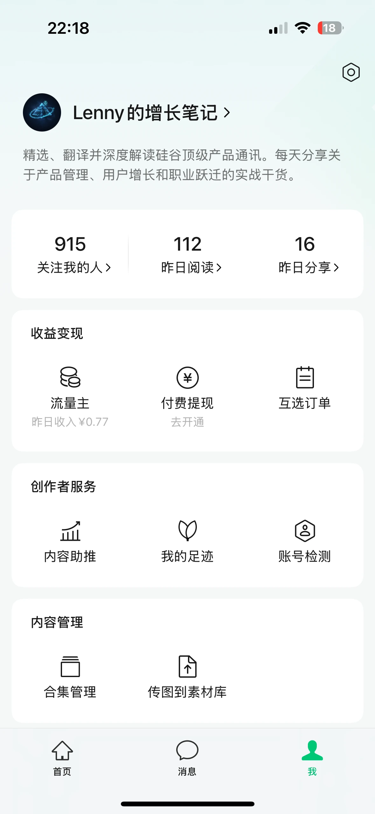

Somehow, a whole year has passed since I started my WeChat Official Account, **Lenny 的增长笔记**, roughly “Lenny's Growth Notes.” I have been posting daily along the way.

Today I looked through the account's milestone history: I registered it on September 24, 2025, and published the first post on September 25. Today marks exactly one year since registration.

The account mainly shares content about product management, user growth, and career development. I rely heavily on AI to help organize and publish the material. I have not poured an enormous amount of time into it, but I have kept it going.

## 915 Followers, a Little Short of 1,000

At the time of these screenshots, the account had **915 followers**, leaving 85 to go before reaching 1,000.

That is not a huge audience, but given the time I have put in, I am reasonably happy with it. A year later, the account is still active, and some people want to keep reading.

The dashboard shows 112 reads and 16 shares for the previous day. Those are simply the figures captured at that moment. They are modest, but they are real signs of a response.

The milestone page also records that **on July 20, 2026, I reached 300 publications, 298 days after the first post.**

Day to day, it feels like publishing just a little at a time. Looking back, it adds up.

## The First Three Months Were the Hardest

The toughest stretch was the first three months.

I kept posting, but the follower count grew slowly. It took roughly 110 days of daily updates to reach 100 followers. That was hardly rapid growth, but it felt like an important milestone to me.

Later, after I enabled WeChat's publisher ad monetization feature, I felt more motivated. I started taking the account more seriously as something to keep working on.

The income was small, but seeing even a little return made a difference.

## Around RMB 30 a Month Is Enough to Make Me Smile

I never had particularly high expectations for monetization. At this point, earning around RMB 30 a month is enough to make me happy.

In the screenshot taken on September 24, the publisher ad dashboard shows:

- **Month-to-date revenue: RMB 33.89.** This is the accumulated amount at the time of the screenshot, not a completed month's total.
- **Revenue for the previous day: RMB 0.77.**

Separately, I have taken on two promotional collaborations, and a third is underway. Those collaborations are distinct from the ad revenue shown in this dashboard, so I am keeping the two separate here.

These numbers do not amount to a substantial side income. But I was never expecting this project to suddenly bring in a lot of money. Having something I enjoy doing outside work, with a little feedback along the way, is enough.

## AI Saves Time, and Publishing Has Become a Habit

AI has helped me keep publishing throughout the year. With assistance organizing and publishing content, each update does not require a large investment of time. That makes it easier to maintain the routine.

This pace suits me. I do not have to devote all my spare time to the account, and low short-term earnings do not make the effort feel pointless.

A year in: 915 followers, around RMB 30 a month in publisher ad revenue, and occasional promotional collaborations. Nothing enormous, but I am happy with it.

I will keep going at my own pace. The next small goal is 1,000 followers.

**I am not counting on it to make much money. It is simply something I enjoy outside work.**
