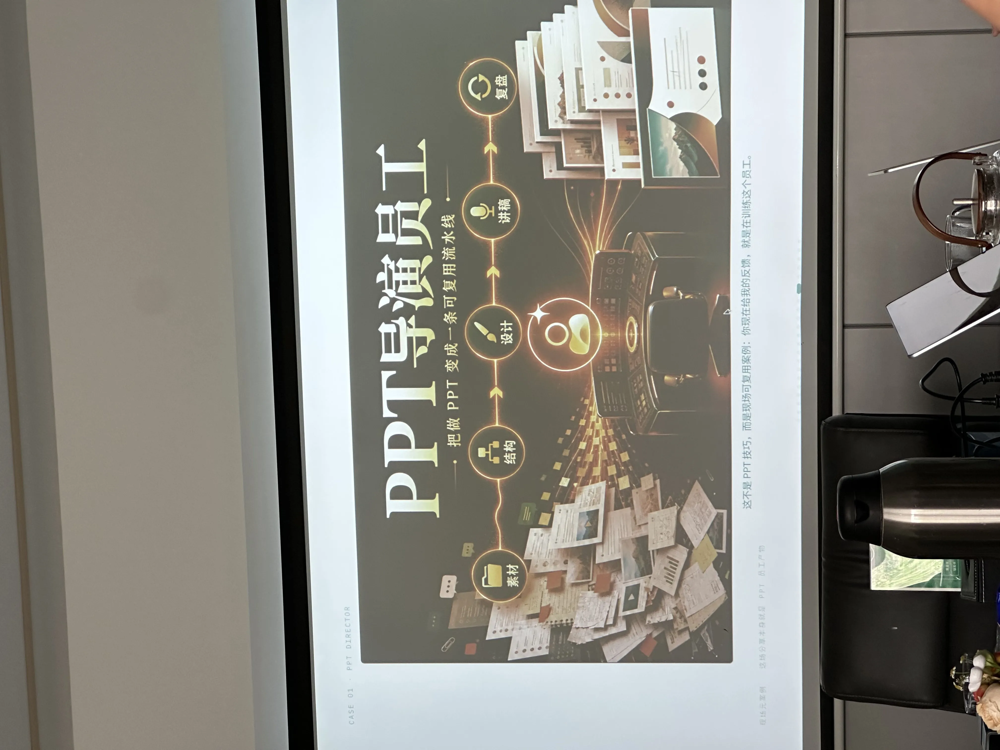
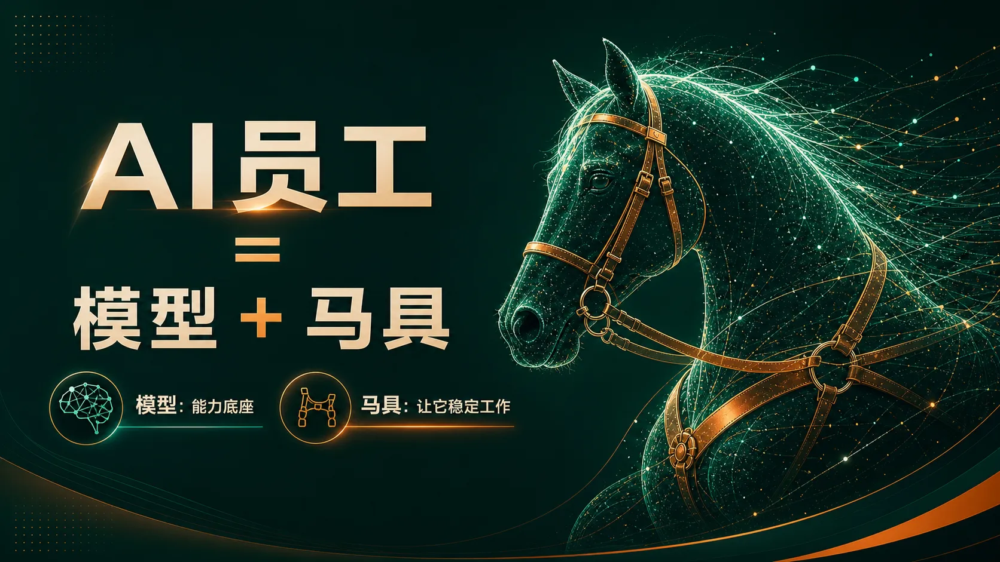
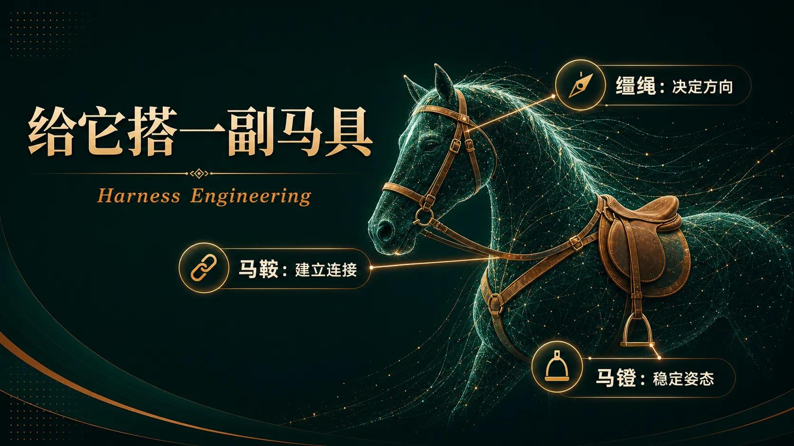
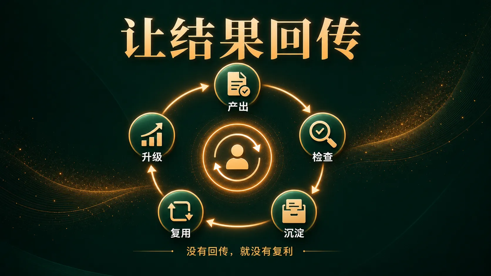
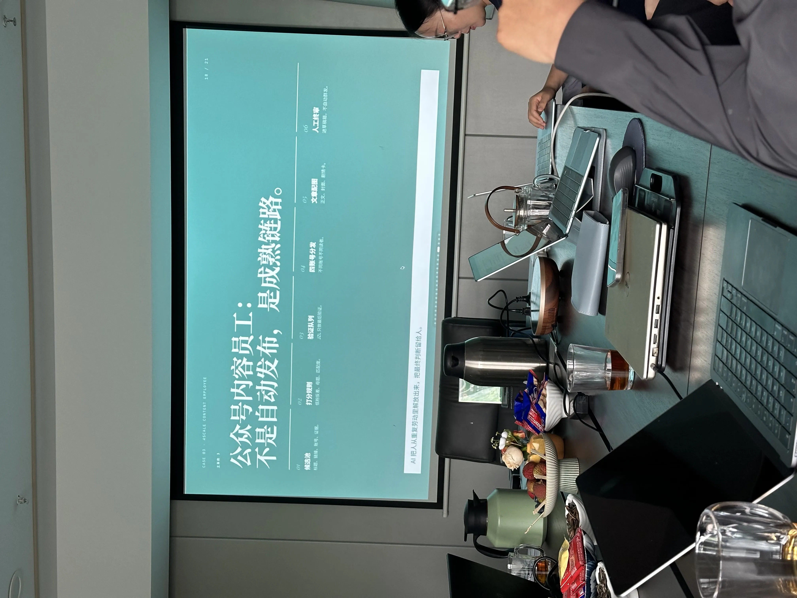
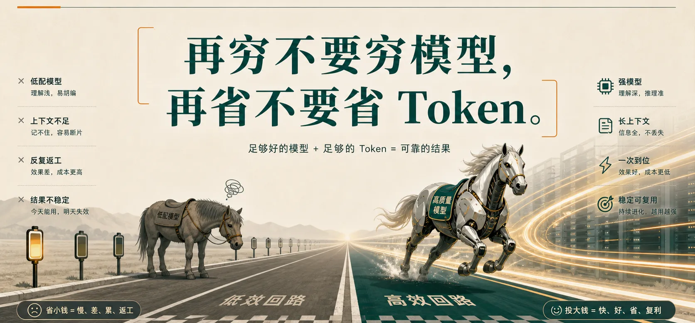
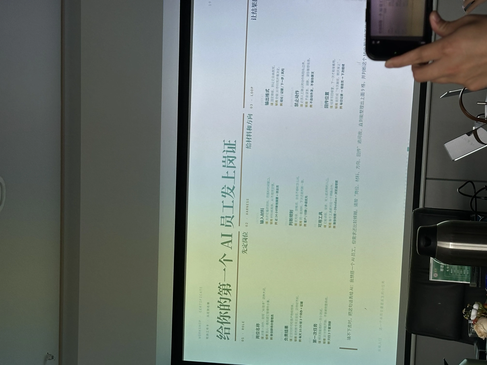
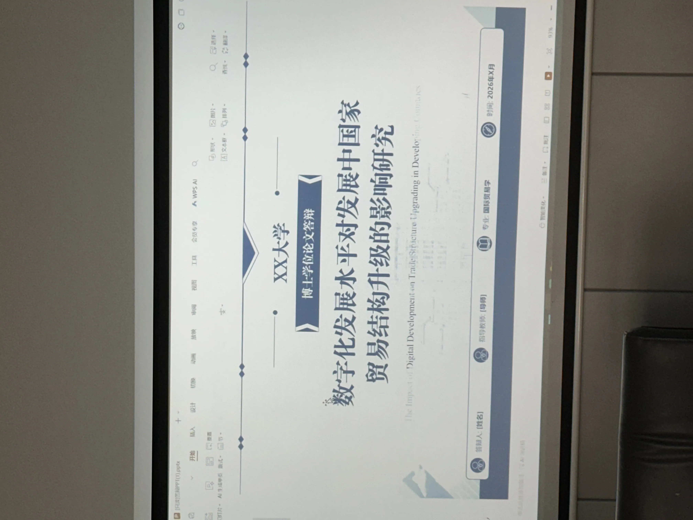
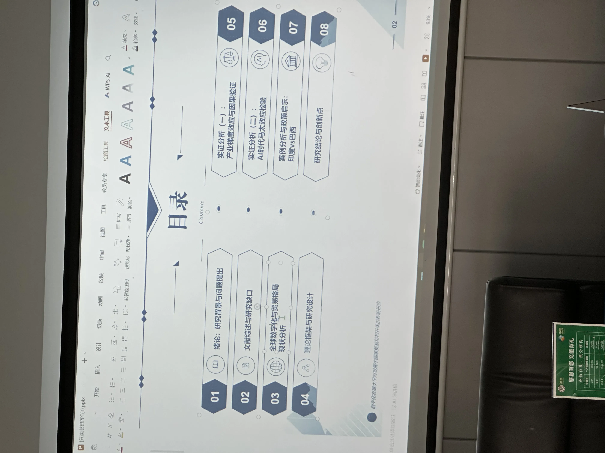
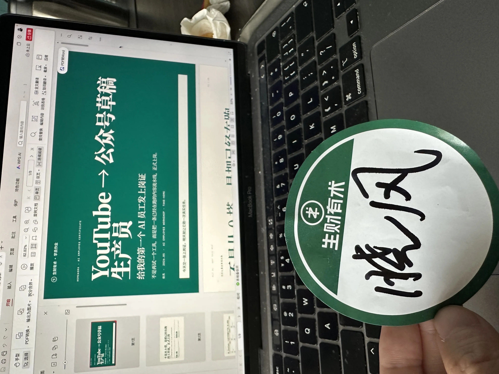

> 2026.05.23 · 周六，从南京坐高铁去苏州，赴一场小型线下聚会

---

## 一、最大的断点：你不是不会用 AI，是 AI 没岗位

这场聚会在苏州，我特意从南京跑过来。一来一回小四个小时的车程，回来路上想了想，值。



主题叫《给 AI 发上岗证》。讲到一半，组局官打出一句话，把我噎住了:

> **「很多人不是不会用 AI，而是 AI 没岗位。你问一次，它答一次；第二天再打开，又像第一次认识你。」**

我对照了一下自己。桌面上躺着十几个提示词、SOP、Skill、笔记，看起来很丰富，但每一次任务都要重新捏一遍流程——哪个先调、参数怎么填、漏一步还得重来。

**AI 像是散装工具，从来没成为员工。**

---

## 二、一个公式：AI 员工 = 模型 + 马具

整场分享的核心就一个公式：

> **Agent = Model + Harness（马具）**



模型是马，决定能力上限；马具决定它能不能在你的目标上稳定跑下去。

马具拆成三件套：



- **缰绳**——给方向：让 AI 知道目标、约束和判断规则
- **马鞍**——接资料和工具：让 AI 拿得到文件、知识库、权限

- **马镫**——稳输出和回传：固定交付格式，结果能被检查、能沉淀回系统

落到操作上，就是"三股绳"：**先给事实，再给方向，让结果回传**。

**最关键的是回传**。一次性问答叫外包，结果回到文件/表格/知识库里才叫复利。没有回传，每次都从零开始。



---

## 三、几句让我反复抄下来的话

整场分享和群友讨论里，有几句话我直接抄进了笔记本：



**「再穷不要穷模型，再省不要省 Token。」**
——省模型，AI 推理飘；省 Token，证据断片。看似省几十块，实际多花的是返工和误判。



**「AI 的使用没啥，就是多用。你一天花 8 小时，和一天花 8 分钟，效果肯定不一样。」**
——AI 的能力边界，只有大量使用才能感知到。

**「要去找有结果的人交流，圈子很重要。」**
——这话不新，但放在 AI 这件事上格外贴。真正的大佬，哪怕一点小机会都会让你 xxx。

**「要习惯给 AI 泼冷水。」**
——AI 模型会出现幻觉，关键决策需要不同模型交叉验证，更需要你主动质疑它。

**「万物皆可 CPS。投产的项目别干，轻资产可以干。」**
——这是聚会里另一位群友的观点，听起来跨界，但本质和"给 AI 发上岗证"是一回事：找到能复利的轻链路，别陷在重投入里。



---

## 四、群友的实战经验（按行业拆）

聚会的另一半时间在交换具体打法，挑几个我觉得能直接用的：



**关于账号和模型**
国外正版账号其实不贵，刚开始嫌贵可以先花 10 块买个野号体验，封了也无所谓。有条件直接开 Pro，模型上千万别抠。CC 和 Codex 各有用法，CC 可以调用其它模型（包括国产）。

**关于工具搭配**
写文案首选 Claude，不容易被识别成 AI；GPT 通用性强但 AI 味浓；豆包语音输入比微信好用，专家模式还能当父母陪伴神器；做小红书/公众号用 Claude 拟人化处理；生财帖子写完丢给 AI 多审几遍。

**关于行业落地**
- 美容行业：AI 批量分发，小红书是主战场
- 销售行业：钉钉拓客文案 AI，外加自制小程序 + 成品开发板
- 矩阵运营：社媒助手踩评论，**发布环节一定人工，避免风控**
- 基建：别用小区宽带，多条宽带 + 海外软路由

**一个有意思的视角**：大陆能翻墙的人不到 2000 万。意味着只要你能熟练用上 Claude/GPT，就已经在一个相对小的池子里。



---

## 五、我交的作业：YouTube → 公众号草稿生产员

聚会的统一作业是：**给一个本周会重复发生的小任务发一张"上岗证"，明天就让它跑一次真实任务。**

我没从零搭，而是把自己已经在跑的那条乱链路正式收编成员工：

- **岗位**：YouTube → 公众号草稿生产员（专做 AI/营销主题）
- **结果**：24 小时内交付 1 篇可一键发的公众号草稿
- **MVP**：明天手丢 1 个 URL，全链路跑通，结果停在草稿箱

流水线 7 步，每步绑死一个 Skill：

```text
拉转录 → 改写文章 → 配图提示词 → 生成配图
→ 压缩 webp → 去水印 → 发到草稿箱
```

明天 10 分钟启动，AI 后台跑 20 分钟，我再花 10 分钟人工验收。**不自动发布，停在草稿箱，等我点确认。**

跑稳 5 次以后再升级：订阅频道监控、主题判断模型化、配图模板库、多平台分发。**每次只动一项。**



---

## 六、带走的不是概念，是一个能在明天跑起来的小员工

整场分享最让我受用的一句话，是收尾那句：

> **「带着一个真实小任务离开，比带着十个高级概念更重要。」**

过去半年我看了太多 AI 教程、试了太多工具，桌面越来越满，效率却没真正变高。原因今天才看明白——**没有岗位，就没有沉淀；没有沉淀，每次都是新手村。**

如果你也有同样的感觉，今晚不妨花 10 分钟，给你最常重复的那件小事，写一张上岗证：

```text
我搭的员工是：
它负责：
我喂给它：
它输出了：
我回传到：
下一轮要改：
```

填得出"下一轮要改"，AI 才真正进了你的团队。

---

**AI 的上限取决于你的想象力，但 AI 的下限，取决于你给它的那张上岗证。**

—— 晓风，2026.05.23 写于苏州回南京的高铁上
