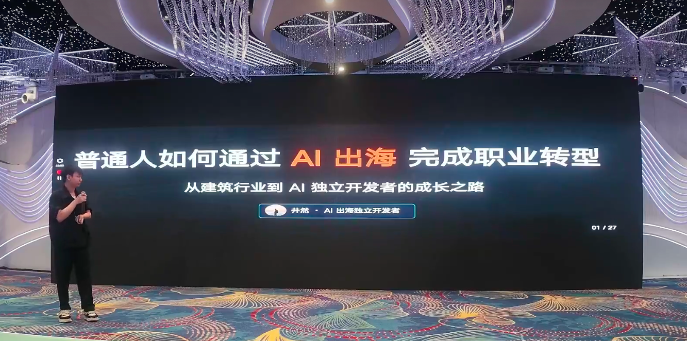
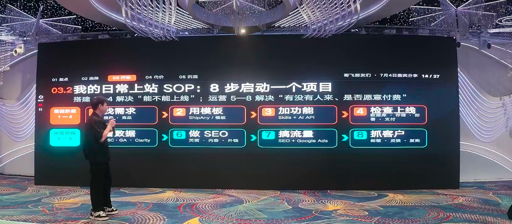
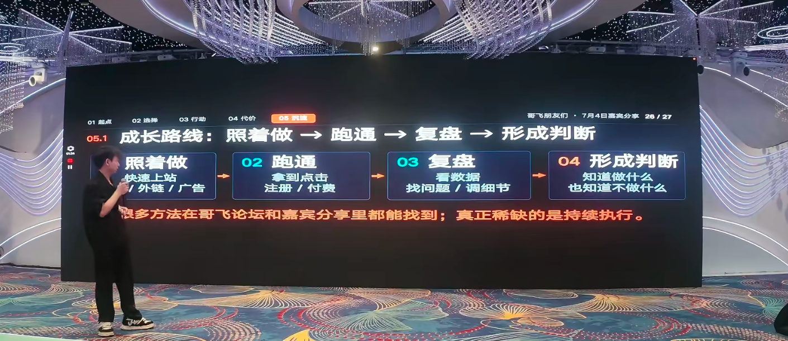

# 从工地到全球：哥飞社群素人拆解"一个人用 AI 出海做到月入六万"的全过程

> 在「**哥飞的朋友们·年中分享交流会·深圳站**」上，AI 出海独立开发者**井然**，带来了一场主题为《**普通人如何通过 AI 出海完成职业转型——从建筑行业到 AI 独立开发者的成长之路**》的分享。
>
> 一年前他还是建筑行业的副总经理，每天跑 20 个项目、管 20 多号人；一年后他一个人做产品、开发、设计、运营、客服、数据，半年就实现了月入六万。他没有技术背景、没有出海经验、身边连一个做 AI 或做程序的朋友都没有——他把这条路总结为五个字：**照着做，去干**。

---

## 一、起点：从"稳定的穷"到裸辞重启

井然坦言，去年这个时候他刚从老东家离开，当时在广东一家建筑公司做到了副总经理——两年爬上来，后两年巩固。公司董事长知道他要走时"努力挽留"，但他还是选择了离开。

**触发点是"线性增长的瓶颈"。** 他发现自己投入的精力越来越多，项目离了他就停摆，而他要陪家人的时间反而越来越少——这和他一直追求的"把时间解放出来"的目标背道而驰。

> 他笑称自己当时的状态是"稳定的穷"——不是老东家给得少，是整个行业的天花板摆在那里。

更有意思的是，他是真正的"裸辞"——辞职时连做什么都不知道。一个同学建议他"可以了解一下 AI"，于是他开始在各个社群和知识星球上找信息。在此之前，他的信息完全封闭——一个人同时管 20 个项目、兼做商务拓展，根本没时间了解外面的世界。

### 关于焦虑：不要被贩卖的焦虑绑架

井然特别提到，很多人刷短视频会被各种"AI 来了不学就被淘汰"的说法搞得焦虑，也会被"别人短时间内日入过万"的案例刺激。

> 他的建议是：**不要受外界因素影响，更应该思考怎么让自己一步一步做的事情能够沉淀、让自己成长。** 擁抱 AI 就行了。

---

## 二、选择：为什么是 AI 出海？

### 零基础也能做的事

井然强调他的起点是"零基础、零背景"——身边没有任何一个朋友做 AI，也没有任何一个朋友做程序。加入哥飞社群后，半年就实现了月入六万。

他总结出的核心判断是：**AI 时代，一个人就是一个团队。** 产品、开发、设计、运营、客服、数据，现在都可以一个人搞定。

- 上站速度很快，两个小时就能丢一个站上去；
- 只要能调 API，看过一遍基本都能复刻；
- 支付接入现在十分钟不到就完成；
- 部署上线买个域名直接就能跑。

### AI 的真正门槛不在技术

井然认为，现在 AI 的门槛已经极低——页面能做、功能能跑、回复能生成。**真正的门槛在于"判断"：**

- 判断需求是不是真需求——**不要去教育市场，要去拥抱市场**；
- 判断产品是否可持续——不做一次性的；
- 承担亏损和试错——现金流一定要守得住。

> 他打了个比方：以前创业是"有点子找程序员"，现在反过来了——很多程序员在找创业点子。**有一身本领但找不到真需求，才是当下最普遍的问题。**

### 长期主义的选择

井然展示了他的生活变化——以前人在哪个项目上，就绑在哪里；现在全国到处飞，想在哪办公就在哪办公，可以睡到自然醒。

> "如果没有今天这个分享会，我现在可以到处去玩了，完全足够。" 但他随即补充：**"我觉得我现在还不是自由的时候，我沉淀得不够多，还要不断成长。"**

---

## 三、行动：一个人的最小闭环 SOP

### 3.1 跑通闭环的五个步骤

井然把一个人做产品的最小闭环总结为五步：

| 步骤 | 关键动作 |
| --- | --- |
| **找需求** | 找被市场验证过的需求，不要造需求 |
| **做产品** | 一个页面解决一个问题，快速交付 |
| **搞流量** | SEO、投流、社媒——每种方法因人而异 |
| **做交付** | 产品可用、用户愿意持续付费 |
| **抓客户** | 邮件沟通、挽留用户、扩展复购 |

> 他提醒：新手一定要把这条路线先跑通，不要卡在某一个点上。每个环节都会有坑，但把路线都走一遍、知道坑在哪里，后面就快了。

### 3.2 日常上站 SOP：8 步启动一个项目

井然把自己启动项目的 SOP 拆成两个阶段八个步骤：

**搭建阶段（1-4）：解决"能不能上线"**

1. **找需求**：搜索竞品、分析市场。在哥飞社群找案例，动手就行；
2. **用模板**：用 ShipAny 等成熟模板快速搭建，不要从零造轮子；
3. **加功能**：用 Skills + AI API，能调 API 就直接调，不要去训练模型；
4. **检查上线**：数据库连接、用户登录、账号存储、部署、支付——逐一检查。

**运营阶段（5-8）：解决"有没有人来、是否愿意付费"**

5. **看数据**：SC（Search Console）、GA（Google Analytics）、Clarity——每天看一遍；
6. **做 SEO**：页面优化、内容更新、发外链——虽然乏味但必须持续做；
7. **搞流量**：SEO + Google Ads——有结果后一定要花钱学投流；
8. **抓客户**：邮件沟通、用户反馈、促进复购——愿意发邮件的都是潜在客户。

### 3.3 找需求：只做被验证过的

井然反复强调：**产品的需求一定要是被市场验证过的，不要去教育市场。**

他的竞品分析思路是：

- 找一个应用场景 + 一个可调用 API 的模型；
- 分析竞品站的流量、来源国家、SEO 情况；
- 如果竞品只做了一个国家，就**换一个国家去切入**；
- 做多了之后会形成"网感"——看到一个站，就能判断自己能不能碾压它。

> "我们不是抄它，我们学习它、超越它——**先模仿，再超越**。"

### 3.4 做产品：一个页面解决一个问题

井然把自己的定位比作"路边摊"而非"高级餐厅"：

- 用户搜索进来，能用、能解决当下需求、觉得可用就直接付费；
- **不要用国内的视角去看海外市场**——很多海外用户不会货比三家，搜索进来排在前面、能用、能解决问题就付费了；
- 他有用户付费后半年都忘了取消，最后只是发邮件说"麻烦帮我取消一下"，也没要求退款。

> "所以我就白白赚了这几个月的钱。"

### 3.5 上站速度与流量验证

- **上站目标**：发现一个不太复杂的需求，两个小时就应该把站上线、外链也发了；
- **流量验证**：7 天内必须搞定引流，确定有没有人来；
- **付费验证**：30 天如果没有付费，就要思考是否值得继续投入，不行就掉头。

> 他透露自己买了几十个域名，除了重复的，基本上都上线了，达到了 8~9 成的上线率。甚至有些站他自己都忘了什么时候做的——昨天突然来了一单，回去检查发现 API 当时也接好了、用户一直在用。

### 3.6 SEO：慢启动，但值得坚持

井然分享了他做 SEO 的真实体感：

- 前两个月发外链，流量可能一直为零——很多人在这个阶段放弃了；
- 但他有好几个站就是放弃更新后、外链还在，**几个月后流量突然蹦起来了**；
- SEO 带来的自然流量"非常香"——不用花任何成本，用户自己来付费。

> "去年滑雪的时候，手机一直在响——坐缆车响、中间休息也响。真的很不真实。"

他每天运营时盯三样东西：

| 数据源 | 关注指标 | 作用 |
| --- | --- | --- |
| **GSC 搜索趋势** | 点击、展现、CTR | 判断需求是否在增长 |
| **Analytics 来源** | 用户面板、活跃/参与 | 了解用户行为 |
| **Email 反馈** | 失败、退款、积分、价格、新需求 | 发现"为什么"发生 |

> **数据告诉我"发生了什么"，邮件告诉我"为什么发生"。**

### 3.7 谷歌投流：花 10 万学费买判断力

井然说他今年才开始接触 Google Ads 投流，花了 10 万块钱的学费。

- 他不认为贵——"我要买的是一个市场判断，确定这个事情是否可持续。如果可持续，花十万、二十万、几十万都值得。"
- 投流能快速验证需求——当天投、当天就可能有单；
- ROI 波动大——偶尔打到 6，也有 0.1 的时候。但跑通之后发现在很多项目上都可以用。

> "不是每个人都需要花 10 万才能学会。我只是领悟得慢一点，但我坚定这条路是对的。"

---

## 四、代价：踩过的坑与交的学费

井然毫不回避自己踩过的坑，并提醒哥飞社群的伙伴们提前避开。

### 坑 1：支付账号被封——反复切换的代价

- 最早用 Stripe，一个半月被封；
- 切到另一个平台，又被封；
- 再切到第三个平台，感觉又要出问题；
- 又迁回 Stripe……

**每次切换都会流失大量订阅用户**，一个稳定的万刀 MRR 瞬间归零重建。

> 他的应对策略：**多养几个支付账号**——找家人、朋友开多个号，同时养着。封了一个还有下一个，不至于全军覆没。

### 坑 2：订阅配置错误——周期参数的致命细节

他用某个支付平台时，发现有个"订阅周期"参数——之前接了那么多支付都不知道有这个设定。结果累积了几个月的订阅用户，周期数量被设为 1，**所有订阅都变成了一次性支付**。

> 损失了大量订阅用户后才发现，但他选择继续往前走："我的路线放得更长，没必要纠结损失的这一点点。"

### 坑 3：积分发放失败——切换支付时的连锁反应

每换一个支付渠道，积分系统都可能发放失败。这个坑他踩了两次，直到接了新支付才彻底解决。

### 应对原则：支付安全三件事

| 策略 | 要点 |
| --- | --- |
| **多备账号** | 同时养多个支付平台账号，封了一个还有备用 |
| **先养号再放量** | 用一次性收入先养出一定单量，再接入投流 |
| **注意合规** | Stripe 现在查得非常严，按规矩来不要碰红线 |

---

## 五、沉淀：成长路线的底层逻辑

井然把自己的成长总结为一条四步路线：

| 阶段 | 动作 | 关键产出 |
| --- | --- | --- |
| **01 照着做** | 快速上站、发外链、投广告 | 先有东西跑起来 |
| **02 跑通** | 拿到点击、注册、付费 | 验证路线可行 |
| **03 复盘** | 看数据、找问题、调细节 | 知道哪里可以优化 |
| **04 形成判断** | 知道做什么，也知道不做什么 | 建立自己的决策框架 |

> **很多方法在哥飞论坛和嘉宾分享里都能找到；真正稀缺的是持续执行。**

### 三个沉淀维度

1. **被需求验证的**：做的产品必须是有被验证需求的——"我看到市场有需求，我才决定做这件事"；
2. **可用的价值**：积累的能力和人脉都是可复用的资源——"他的一句话可能让我少踩一个坑"；
3. **可放大的模式**：做可持续、可复制的产品，不做一次性的买卖。

---

## 六、结语：机会不是等来的，是跑出来的

井然的分享以两句话收尾：

> **机会不是等来的，是跑出来的。**
>
> **AI 时代普通人的机会，是在行动中长出新的能力。**

他提醒大家：不要焦虑 AI 发展太快，机会还有很多——但机会不是等出来的，是要动手去干、有体感去做才行。把时间线拉长，在成长中不断长出新的能力，这才是普通人在 AI 时代最大的机遇。

---

> 本文根据「哥飞的朋友们·年中分享交流会·深圳站（2026.07.04~07.05，深圳御景国际酒店）」上井然的分享《普通人如何通过 AI 出海完成职业转型——从建筑行业到 AI 独立开发者的成长之路》整理，内容仅为现场观点的转述与提炼，供哥飞社群伙伴及出海同行参考交流，不代表平台立场。如需转载或引用，请注明来源并联系原讲师授权。
