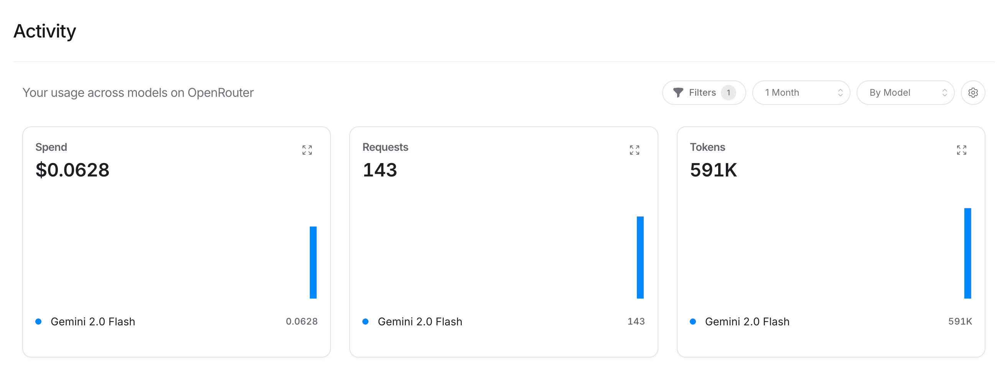
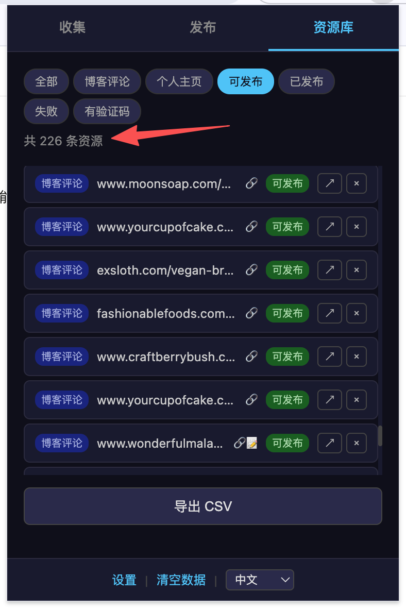

> 本文内容整理自[哥飞](https://x.com/gefei55)老师在社群中的分享，感谢哥飞老师的无私分享。

## 半自动发布博客评论外链，效果如何？

给大家看一下半自动发布效果，工具会生成评论内容，并且把所有输入框都填写好，我只需要点击提交按钮就可以了。

如果设置成自动发布，则不需要我 review，直接就会发布。

---

## Gemini 2.0 Flash 成本极低

Claude 给我推荐的 Gemini 2.0 Flash 这个模型，刚才分析加测试评论，总共 143 个请求，才 6 美分钱，就相当于不要钱了。

| 指标 | 数值 | 模型 |
|------|------|------|
| 花费 (Spend) | $0.0628 | Gemini 2.0 Flash |
| 请求数 (Requests) | 143 | Gemini 2.0 Flash |
| Token 数 (Tokens) | 591K | Gemini 2.0 Flash |

---

## 新手不要急于自动化

有些朋友，尤其是新手，可能会有一个思维误区，觉得自己没赚钱是因为没有自动化。

但我觉得，**是因为你在新手期就凡事想自动化，而不是先亲力亲为动手实践练出手感才导致你没有拿到正反馈。**

比如金鱼 Evan，做出海副业，靠的就是一步步亲手实践：

南山电工问金鱼 Evan：目录站、工具站这些提交表单，你现在是手动填，还是已经有自动化方案？

金鱼 Evan 的回答是：**我目前还是手动的哦。**

南山电工则提到自己做了一个浏览器自动填表的小工具，想找真正在做外链的开发者试用。

这说明什么？**即使月入 4000 多美金的人，外链提交也还是手动的。** 先把手感练出来，再考虑自动化。

---

## 自动化的 6 个前提步骤

自动化的前提是你明确的知道一件事情为什么要这么做，并且知道怎么能做好，并且能够拆分步骤，才能一步一步让程序帮你去做好这件事情。

就拿自动筛选清洗博客评论外链，以及自动发博客评论外链插件来说，你得知道并且做过这些：

1. **Semrush 和 Ahrefs 查外链** —— 都可以看到某个域名的外链列表，并且知道怎么筛选非 SPAM 外链；
2. **浏览器插件模拟操作** —— Semrush 和 Ahrefs 的 API 很难搞，但浏览器插件可以模拟人类操作，打开指定网页，拦截 API 请求获取数据，执行翻页操作等；
3. **识别博客评论外链** —— 什么是博客评论外链，如何识别，如何发布，如何获取；
4. **抓取评论发现更多资源** —— 在一个博客文章里抓取所有评论内容，可以得到别的站长留下的更多会去发博客评论外链的网站；
5. **循环扩展资源库** —— 拿到这些网站再去 Semrush 或者 Ahrefs 查他们的外链，就可以回到第 1 步，得到更多可以发布博客评论外链文章资源；
6. **半自动发布评论** —— 有哪些注意事项，不同的网站有不同的留链接方式，如何让 AI 识别。

**如果你没有亲手发过博客评论外链，并且发得足够多，你就不会知道以上这些，于是也无法让 AI 去帮你写出插件来帮你自动抓取和发布外链。**

如果你什么都不懂，只是告诉你的 AI Agent，帮我发博客评论外链，他是不知道怎么高效且高质量的做好这件事的。

---

## 外链资源筛选成果

跑了一上午的结果，分析了几个网站的 **841 个外链**，得到了 **226 条**不需要登录注册就可以发布的外链资源，其中大部分是博客评论外链，小部分是个人主页外链。

特别提醒一下，不要去看 841 这个数字，我们只需要有 226 个可用资源就够了。而且继续这样爬下去，是可以得到更多的可用资源的。

之前总有群友说，不知道怎么找可以发的外链资源，我总是回答说，其实方法就在我们社群里，只是你没有去实践而已。

**你看，只需要一上午的时间，都不需要我看着，程序自己就筛选出来了 226 个可用资源。**

### 资源类型分布

| 类型 | 数量 |
|------|------|
| 博客评论 (blog_comment) | 159 |
| 个人主页 (profile) | 67 |
| **合计** | **226** |

### 来源网站 Top 10

以下是通过 Ahrefs 分析的竞品网站，按发现的可用外链资源数量排序：

| 来源网站 | 可用资源数 |
|----------|-----------|
| loklokhd.app | 24 |
| level-devil.net | 18 |
| purbleplaceonline.com | 18 |
| ageofwargame.io | 16 |
| leveldevilgame.com | 15 |
| quordle-wordle.com | 15 |
| geometrydash-subzero.io | 15 |
| thenarcissisttest.com | 14 |
| crazy-cattle-3d.com | 13 |
| thwordle.app | 12 |

### 资源样例

以下是部分筛选出来的外链资源，可以直观感受数据质量：

| 类型 | URL |
|------|-----|
| blog_comment | https://joaniesimon.com/grilled-lemon-garlic-potato-kabobs/grilled-potato-kabobs-with-lemon-and-garlic/ |
| blog_comment | https://syncedreview.com/2024/09/09/microsofts-fully-pipelined-distributed-transformer-processes-16x-sequence-length-with-extreme-hardware-efficiency/ |
| blog_comment | https://www.madrimasd.org/blogs/matematicas/2024/02/11/150483 |
| blog_comment | https://pixel77.com/typography-rules-technique/ |
| blog_comment | https://www.bakerella.com/sweets-for-the-season/ |
| profile | https://www.mycomics.de/profil/tedcrane.html |
| profile | https://wallhaven.cc/user/lauralehman |
| profile | https://bordeaux.onvasortir.com/profil_msg_inexistant.php |
| profile | https://jobs.hyperisland.com/company/georgiana-al-usa |
| profile | https://snipplr.com/users/mcleanross?language=all |
