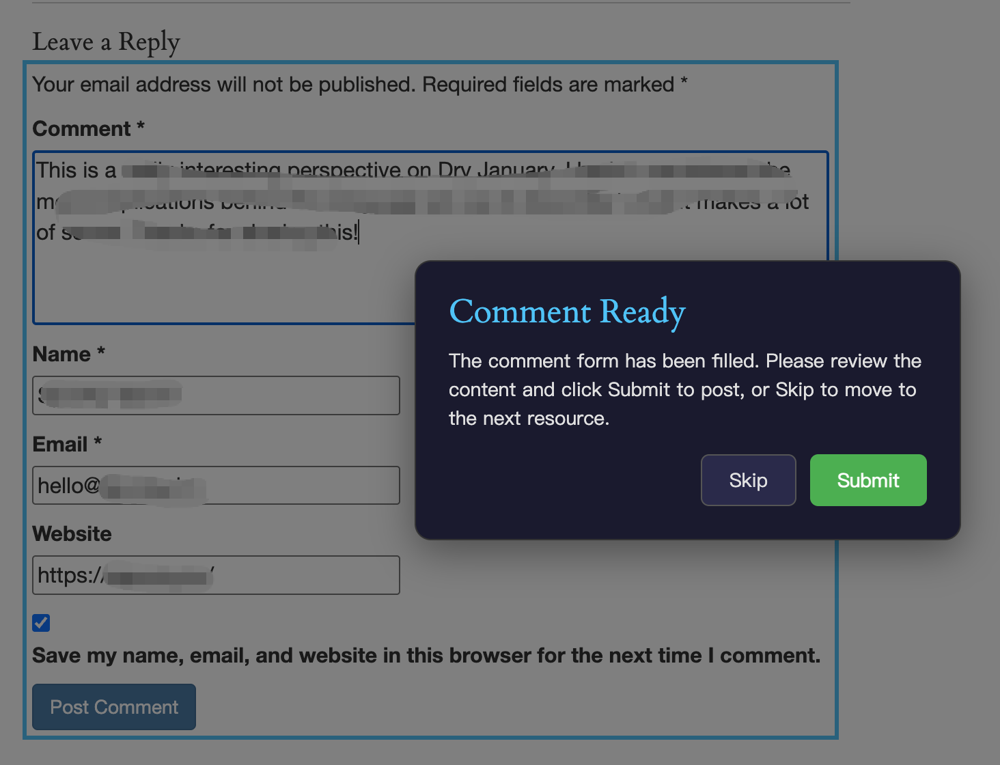
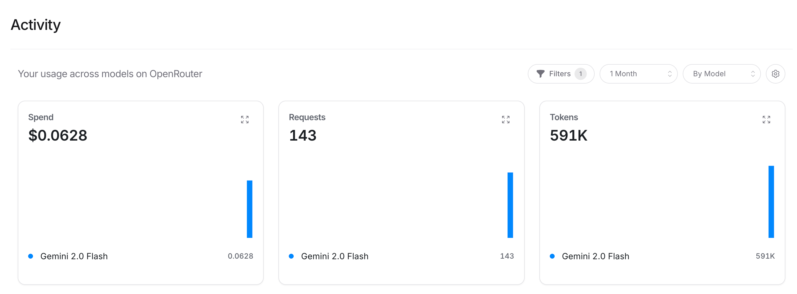
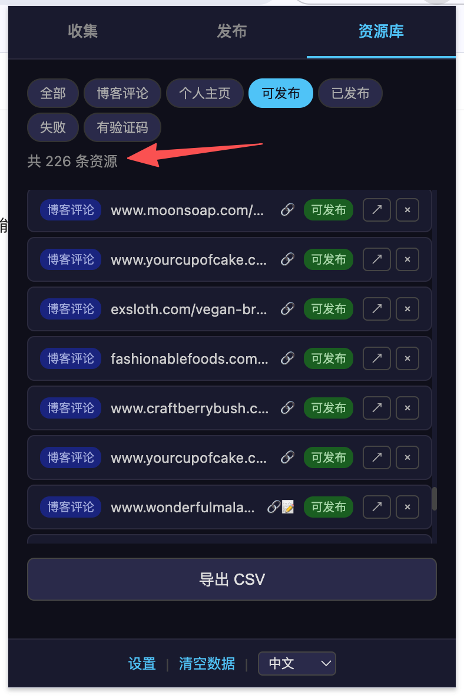
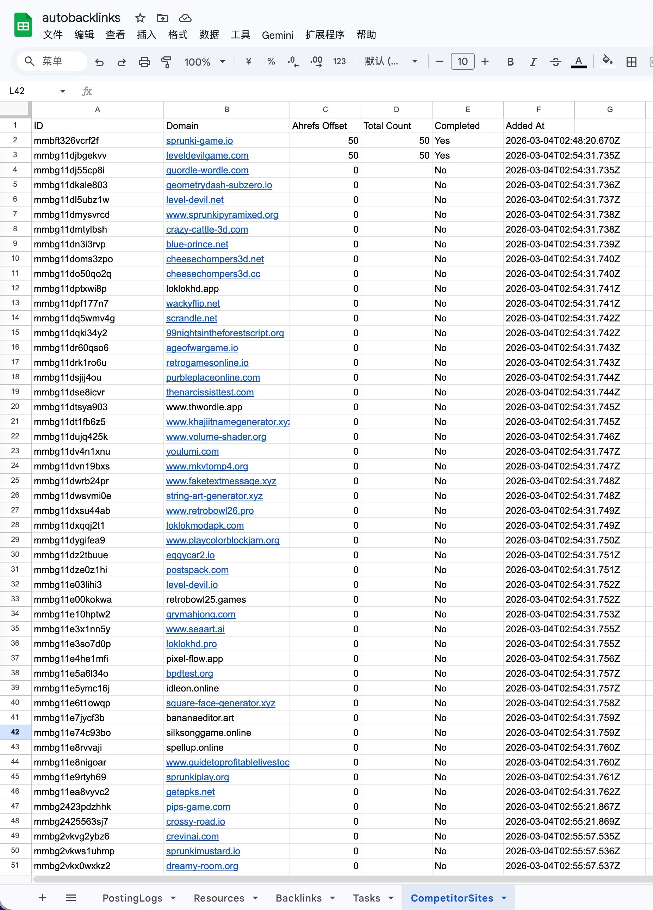

> 本文内容整理自[哥飞](https://x.com/gefei55)老师在社群中的分享，感谢哥飞老师的无私分享。

## 半自动发布博客评论外链，效果如何？

给大家看一下半自动发布效果，工具会生成评论内容，并且把所有输入框都填写好，我只需要点击提交按钮就可以了。

如果设置成自动发布，则不需要我 review，直接就会发布。

下面是完整的操作演示视频：

<video controls width="100%">
  <source src="/videos/1772632230380204.mp4" type="video/mp4" />
</video>

---

## Gemini 2.0 Flash 成本极低

Claude 给我推荐的 Gemini 2.0 Flash 这个模型，刚才分析加测试评论，总共 143 个请求，才 6 美分钱，就相当于不要钱了。

| 指标 | 数值 | 模型 |
|------|------|------|
| 花费 (Spend) | $0.0628 | Gemini 2.0 Flash |
| 请求数 (Requests) | 143 | Gemini 2.0 Flash |
| Token 数 (Tokens) | 591K | Gemini 2.0 Flash |

---

## 新手不要急于自动化

有些朋友，尤其是新手，可能会有一个思维误区，觉得自己没赚钱是因为没有自动化。

但我觉得，**是因为你在新手期就凡事想自动化，而不是先亲力亲为动手实践练出手感才导致你没有拿到正反馈。**

比如金鱼 Evan，做出海副业，靠的就是一步步亲手实践：

南山电工问金鱼 Evan：目录站、工具站这些提交表单，你现在是手动填，还是已经有自动化方案？

金鱼 Evan 的回答是：**我目前还是手动的哦。**

南山电工则提到自己做了一个浏览器自动填表的小工具，想找真正在做外链的开发者试用。

这说明什么？**即使月入 4000 多美金的人，外链提交也还是手动的。** 先把手感练出来，再考虑自动化。

---

## 自动化的 6 个前提步骤

自动化的前提是你明确的知道一件事情为什么要这么做，并且知道怎么能做好，并且能够拆分步骤，才能一步一步让程序帮你去做好这件事情。

就拿自动筛选清洗博客评论外链，以及自动发博客评论外链插件来说，你得知道并且做过这些：

1. **Semrush 和 Ahrefs 查外链** —— 都可以看到某个域名的外链列表，并且知道怎么筛选非 SPAM 外链；
2. **浏览器插件模拟操作** —— Semrush 和 Ahrefs 的 API 很难搞，但浏览器插件可以模拟人类操作，打开指定网页，拦截 API 请求获取数据，执行翻页操作等；
3. **识别博客评论外链** —— 什么是博客评论外链，如何识别，如何发布，如何获取；
4. **抓取评论发现更多资源** —— 在一个博客文章里抓取所有评论内容，可以得到别的站长留下的更多会去发博客评论外链的网站；
5. **循环扩展资源库** —— 拿到这些网站再去 Semrush 或者 Ahrefs 查他们的外链，就可以回到第 1 步，得到更多可以发布博客评论外链文章资源；
6. **半自动发布评论** —— 有哪些注意事项，不同的网站有不同的留链接方式，如何让 AI 识别。

**如果你没有亲手发过博客评论外链，并且发得足够多，你就不会知道以上这些，于是也无法让 AI 去帮你写出插件来帮你自动抓取和发布外链。**

如果你什么都不懂，只是告诉你的 AI Agent，帮我发博客评论外链，他是不知道怎么高效且高质量的做好这件事的。

---

## 外链资源筛选成果

跑了一上午的结果，分析了几个网站的 **841 个外链**，得到了 **226 条**不需要登录注册就可以发布的外链资源，其中大部分是博客评论外链，小部分是个人主页外链。

特别提醒一下，不要去看 841 这个数字，我们只需要有 226 个可用资源就够了。而且继续这样爬下去，是可以得到更多的可用资源的。

之前总有群友说，不知道怎么找可以发的外链资源，我总是回答说，其实方法就在我们社群里，只是你没有去实践而已。

**你看，只需要一上午的时间，都不需要我看着，程序自己就筛选出来了 226 个可用资源。**

### 资源类型分布

| 类型 | 数量 |
|------|------|
| 博客评论 (blog_comment) | 159 |
| 个人主页 (profile) | 67 |
| **合计** | **226** |

### 来源网站 Top 10

以下是通过 Ahrefs 分析的竞品网站，按发现的可用外链资源数量排序：

| 来源网站 | 可用资源数 |
|----------|-----------|
| loklokhd.app | 24 |
| level-devil.net | 18 |
| purbleplaceonline.com | 18 |
| ageofwargame.io | 16 |
| leveldevilgame.com | 15 |
| quordle-wordle.com | 15 |
| geometrydash-subzero.io | 15 |
| thenarcissisttest.com | 14 |
| crazy-cattle-3d.com | 13 |
| thwordle.app | 12 |

### 资源样例

以下是部分筛选出来的外链资源，可以直观感受数据质量：

| 类型 | URL |
|------|-----|
| blog_comment | https://joaniesimon.com/grilled-lemon-garlic-potato-kabobs/grilled-potato-kabobs-with-lemon-and-garlic/ |
| blog_comment | https://syncedreview.com/2024/09/09/microsofts-fully-pipelined-distributed-transformer-processes-16x-sequence-length-with-extreme-hardware-efficiency/ |
| blog_comment | https://www.madrimasd.org/blogs/matematicas/2024/02/11/150483 |
| blog_comment | https://pixel77.com/typography-rules-technique/ |
| blog_comment | https://www.bakerella.com/sweets-for-the-season/ |
| profile | https://www.mycomics.de/profil/tedcrane.html |
| profile | https://wallhaven.cc/user/lauralehman |
| profile | https://bordeaux.onvasortir.com/profil_msg_inexistant.php |
| profile | https://jobs.hyperisland.com/company/georgiana-al-usa |
| profile | https://snipplr.com/users/mcleanross?language=all |

---

## 新版插件升级：自动同步到 Google Sheet

这两天我又让 Claude Code 把这套外链自动发现与发布插件升级了一版。最大的变化是：**数据会自动同步到 Google Sheet**，不再只停留在本地。

浏览器插件在这里是一个很实用的“中间桥梁”——它既能模拟人工操作网页，又能直接复用你已经登录的账号状态。很多 AI Agent 在执行任务时卡在登录环节（验证码、风控、Cookie 管理），而插件天然能绕开一部分这类问题。

我这边的做法是：通过 Google 授权给插件读写某个 Sheet 的权限，然后把关键数据（域名、偏移、状态、完成标记、时间戳等）持续写进去。

---

## 把 Google Sheet 当成“共享数据库”

一个很实用的思路：把 Google Sheet 作为轻量级共享数据库，让不同执行端都读写同一份数据：

- 浏览器插件（负责网页操作与数据抓取）
- 本地程序（负责清洗、聚合、补全）
- 服务器任务（负责批处理、定时执行、分发）

这样就能把原本零散的动作，串成可复用的流水线。

例如：

1. 抓取推特热门内容；
2. 用 AI 转写/改写；
3. 生成小红书笔记草稿；
4. 浏览器插件读取草稿并发布到已登录账号。

这个过程中，Sheet 就是“中间态总线”与“状态看板”。

---

## API 不开放怎么办？用插件拦截网络请求

很多网站不提供公开 API，或者 API 成本高、权限难拿。这时可行方案是：

1. 让插件打开指定页面；
2. 在页面请求过程中拦截目标接口；
3. 直接读取返回数据并结构化保存。

我现在抓一个域名的外链列表，就是用这个方法：让插件打开 Ahrefs 的指定页面，拦截请求后获取返回数据，再交给程序做清洗与筛选。

如果你的 Agent（比如“龙虾”）不方便直接做浏览器自动化，也可以让它协作开发一个浏览器插件。只要把插件与 Agent 的通信打通，本质上就是给 Agent 装上了“网页世界里的眼睛和手”。

---

## 为什么“博客评论外链”能自动发现 + 自动发布？

先讲一个现实：这套打法在全球小游戏站生态里长期存在，而且依然有效。你不一定认同它的价值观，但如果做 SEO，就需要先理解它为什么成立。

### 1）供给侧：大量可利用的存量站点

很多小游戏站并非自研游戏，而是通过 iframe 聚合第三方游戏快速上线。与此同时，互联网早期大量博客程序默认“开放评论 + 可填个人网站”，并未强制注册登录。

结果就是：

- 评论区可以留链接；
- 许多老站点维护不足；
- 仍有大量历史页面可以发布评论并保留外链。

### 2）需求侧：低竞争赛道里“够用即有效”

单条博客评论外链通常权重不高，但胜在：

- 成本低；
- 可批量；
- 可自动化放大。

在小游戏这类竞争相对没那么惨烈的细分赛道，很多时候“够用”就能产生排名收益。

而在 AI 视频等高商业价值赛道，只靠评论外链往往不够——同行会投入高质量、强权重外链，竞争强度完全不同。

---

## 自动发现的核心：从同行外链反向扩散

自动发现能跑起来，核心是一个“可递归扩散”的过程：

1. 从一个目标站拿到外链列表；
2. 识别其中可评论的博客文章；
3. 抓取这些文章评论区里其他站长留下的网站；
4. 再回到这些网站继续抓外链；
5. 循环执行，资源池不断变大。

因为可以批量发，且这套玩法被很多站长长期使用，所以常常能在评论区看到跨越十几年时间的历史链接痕迹。只要流程稳定，几百上千网站、几千上万可发布页面并不罕见。

---

## 先手动跑通，再让 AI 全自动

这件事很枯燥，天然适合程序；但真正的前提是：**你自己至少手动跑通过几轮**。

不理解原理、没有体感，只靠一句“帮我自动发外链”，AI 很难写出高质量、可持续运行的流程。

你需要先知道：

- 什么页面值得发；
- 什么评论会被拦截；
- 什么链接形式更稳；
- 哪些站点值得长期维护。

把这些经验喂给 AI，自动化才会越来越像“成熟操作员”，而不是“随机脚本”。

---

## 最后一句：所谓“抄作业”，本质是同行优选

社群里常说“抄作业”，真正含义不是照抄文案或品牌，而是借鉴同行已经验证过的路径：

- 抄外链来源；
- 抄关键词方向；
- 抄页面结构与转化逻辑；
- 抄定价与交互策略中的可复用部分。

通过“同行优选”，你能更快找到可做的需求和可打的词。搞懂这套逻辑之后，外链资源和关键词都不会再是“无从下手”的问题。
