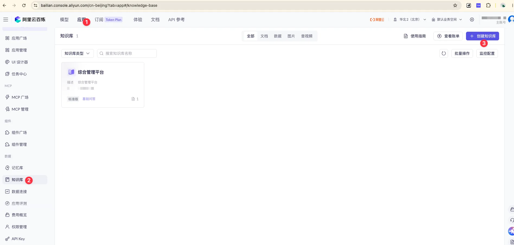
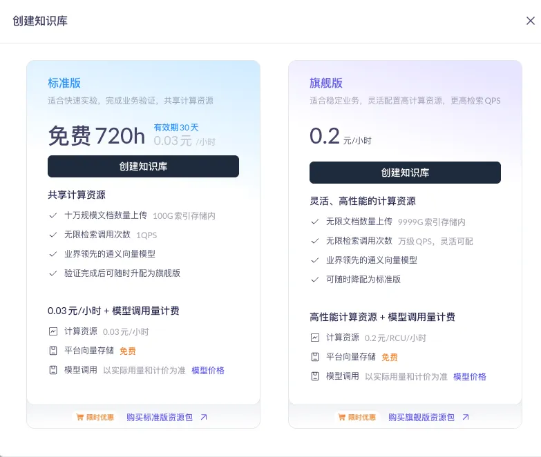
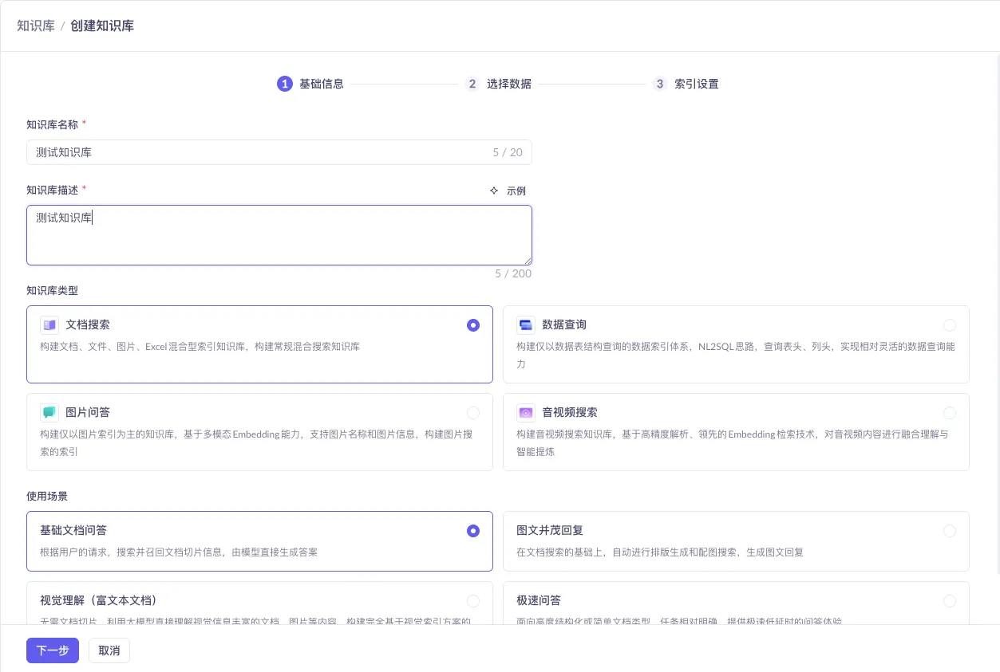
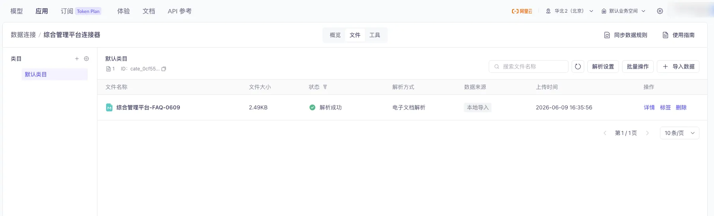
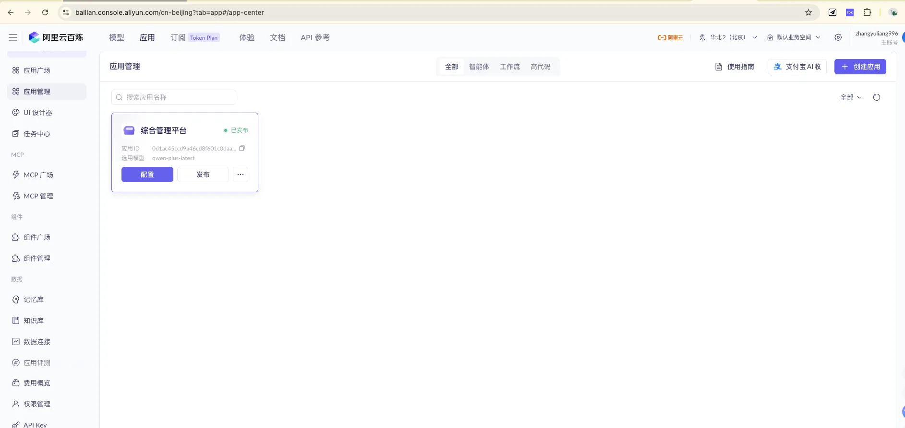
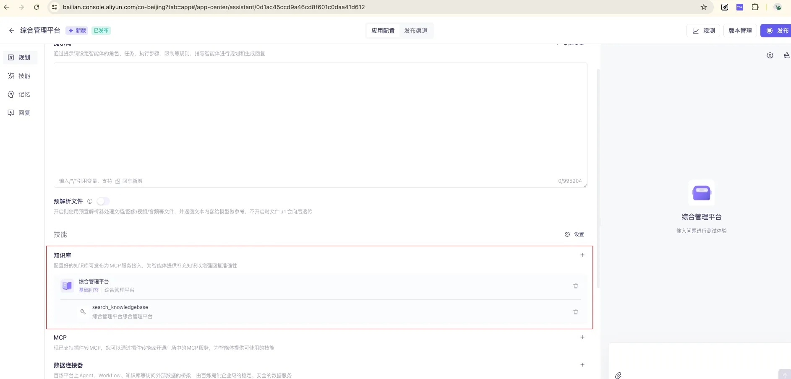
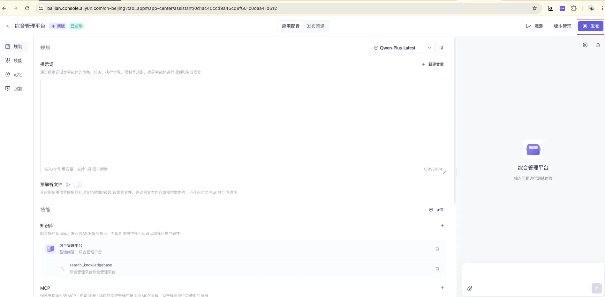
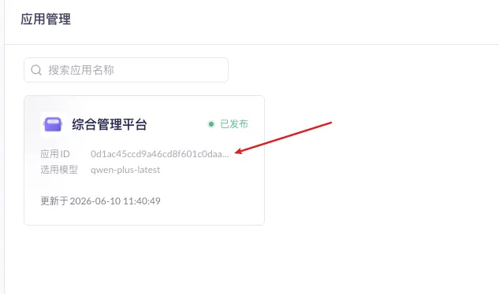
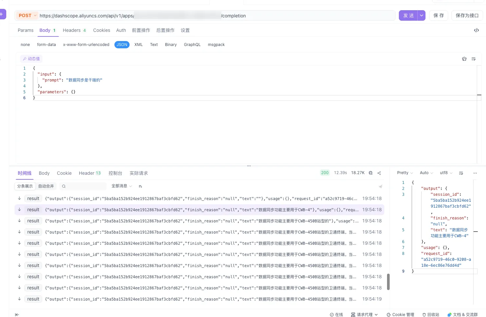

> 把公司的产品手册、操作流程、报错对照表喂给大模型，让它变成一个 7×24 小时在线、答得准的"业务客服 / 运维助手"——这篇就是我从 0 把这套东西搭起来的完整记录，照着做就能跑通。
>
> 全文偏长，建议先收藏。涉及平台操作的地方都配了截图，进阶部分给了可直接用的 Spring Boot 代码。

## 这篇你会得到什么

- 在**阿里云百炼**上从零创建一个知识库（RAG）并绑定到智能体应用
- 把这个 AI 应用通过 **HTTP / SSE 流式接口**接进自己的系统
- 用**自定义插件**让 AI 不止会查文档，还能查**实时业务数据**（某设备在不在线、某站点今天告警几条）
- 用 **Spring Boot 写一个后端 SSE 代理**：藏好 API Key、统一鉴权，并**记录每一条用户查询日志**
- 一套让知识库"越用越准"的**内容编写与维护心法**，以及上传前必看的**合规红线**

---

## 一、先搞懂：知识库 / RAG 到底是什么

知识库的作用，是给大模型补充它本来不知道的**私有资料**（你公司的产品手册、操作流程、内部规章）。底层技术叫 **RAG（检索增强生成）**：模型在回答前，先从知识库里检索相关内容，再结合这些资料生成答案，因此更准确。

一句话记住关键认知：

> **模型不会读你的系统代码，也不会读你的数据库。它只知道我们喂给知识库的那些文字。**

所以回答质量的天花板 = 知识库内容质量。内容写清楚了，它就答得准；没写到的，它要么答不出、要么瞎编。好消息是：**答案准不准，完全掌握在我们手里**——不需要懂算法，只要把业务知识用清楚的文字表达出来。

这也引出后面两块能力的分工，先记住这张分工表，后面会反复用到：

| 问题类型 | 交给谁 | 例子 |
| --- | --- | --- |
| 静态、解释性、流程性 | **知识库** | "设备怎么添加？""这个报错码什么意思？" |
| 动态、实时、要现查现算 | **插件** | "A 设备现在在线吗？""3 号站点今天告警几条？" |

---

## 二、动手搭：在百炼创建知识库

### 2.1 进入知识库管理

登录**阿里云百炼平台**，依次点击 **应用 → 知识库**，进入知识库管理页，点右上角 **「+ 创建知识库」**。



> 顶部「应用」激活（①），左侧选「知识库」（②），右上角蓝色「+ 创建知识库」（③）开始创建。

### 2.2 费用说明：建议买资源包

> 💡 **推荐购买资源包**，比按量付费划算。


> 标准版资源包：720 个 H ¥18.00（原价 ¥20.00），有效期 1 年，适合新用户测试验证或轻量级应用。容量有 720 / 2160 / 8760 / 87600 多档可选。



> 知识库分两档：**旗舰版**支持无限文档、万级 QPS，适合高并发；**标准版**共享计算资源，适合快速实验和业务验证。前期用标准版足够。

### 2.3 基础信息配置

这一步只需记住两个关键选择：

- **知识库类型**：选 **「文档搜索」**（支持文档、图片、Excel 混合，涵盖面最广）
- **使用场景**：选 **「基础文档问答」**（切片检索，和"标题分条目"的写法是绝配，又快又省、最可控）



> 其他类型（数据查询 / 图片问答 / 音视频搜索）和其他场景（图文并茂回复 / 视觉理解 / 极速问答）是专用场景，综合 FAQ 前期都用不上。

### 2.4 选择数据：先建自己的文件连接器

在「选择数据」这一步，**建议创建自己的文件连接器**。点 **「数据连接 ↗」** 进入连接器配置页。


> 点「选择连接器」区域下方的「数据连接 ↗」文字链接，跳转到连接器配置页。

创建好连接器后，把你的知识库文件上传进去。



> 连接器的文件列表页：顶部「导入数据」上传新文件，左侧「默认类目」可切换或新增分类。

回到创建流程，选中刚建好的连接器，数据来源选 **「选择类目」**，勾选已上传的文件。


> 勾「默认类目」即可导入该类目下全部文件。⚠️ 可打开**「自动同步知识索引」**开关，类目内文件一变更就自动更新索引（图中为关闭状态，按需开）。

### 2.5 索引设置：默认即可


> 最后一步保持**默认配置**（向量检索 + 默认 embedding 模型），直接点「完成」，知识库就建好了。

---

## 三、建一个智能体应用，并绑定知识库

知识库只是"资料库"，要让用户能对话，得在它上面建一个**应用**。

### 3.1 进入应用管理



> 「应用管理」页右上角点 **「+ 创建应用」**。

### 3.2 选择应用类型：智能体 + Agent 2.0


> 选 **「智能体应用」**，模式选 **Agent 2.0（推荐）**。Agent 2.0 基于 AgentScope 框架，强化了 ReAct 与 Function Call 能力，**适合后面要做多工具调用、多步决策的复杂场景**（也就是我们第五节要用的插件能力）。填好应用名后点「立即创建」。

### 3.3 配置应用：绑定知识库、写人设



> 在「规划」模块里完成三件事：**① 选模型**；**② 写提示词**（给它一个人设和回答规则，比如"你是综合管理平台的运维助手，依据知识库回答，无依据时明确说不知道"）；**③ 关联知识库**（把第二节建的知识库挂上来，可设相似度阈值过滤低相关内容）。

### 3.4 发布与测试



> 完整配置界面包含**规划 / 技能 / 记忆 / 回复**四大模块，右侧可直接输入问题测试效果。调好后点右上角 **「发布」** 完成发布——只有发布后，外部接口才能调到它。

---

## 四、接入自己的系统：HTTP + SSE 流式调用

应用发布后，就能用 HTTP 接口把它接进你自己的网站 / App。

### 4.1 拿到两把"钥匙"：API Key 和 应用 ID


> 在「API Key 管理」创建 / 查看密钥。调用时放进请求头：`Authorization: Bearer <你的 API Key>`。



> 在「应用管理」的应用卡片上拿到**应用 ID**，填进调用地址：`https://dashscope.aliyuncs.com/api/v1/apps/{应用ID}/completion`

### 4.2 接口说明

| 项目 | 内容 |
| --- | --- |
| 请求方法 | `POST` |
| URL | `https://dashscope.aliyuncs.com/api/v1/apps/{应用ID}/completion` |
| 认证 | 请求头 `Authorization: Bearer <API Key>` |
| 流式输出 | 请求头加 `X-DashScope-SSE: enable` |
| 增量输出 | body 的 `parameters` 里加 `"incremental_output": true` |
| 多轮对话 | body 的 `input` 里回传上次的 `session_id`（1 小时无请求自动失效） |

### 4.3 为什么要用 SSE 流式返回？

开启 `X-DashScope-SSE: enable` 后，服务端不再"憋"出完整答案才返回，而是**边生成边推送**，每生成一小段就发一个事件。这样做主要是为了体验：

- **打字机效果**：文字逐字"打"出来，和主流 AI 对话产品一致；
- **降低体感等待**：完整回答常常 10 秒以上，非流式用户要面对 10 多秒白屏；流式下首字通常 1～2 秒就出现；
- **便于中途打断**：用户看开头不对就能停。

> 💡 如果是后台任务、批量处理这类不需要逐字展示的场景，可以不加这个头，改为一次性返回完整结果，处理逻辑更简单。

再补一个关键参数 **`incremental_output`**：

- `false`（默认）：每个数据块返回的是**到目前为止的完整文本**（I → I like → I like apple），前端要自己做覆盖；
- `true`（推荐）：**只返回新增的那一小段**（I → like → apple），前端直接拼接即可。下面后端代理就用 `true`。

### 4.4 调用示例（curl）

```bash
curl --location --request POST \
  'https://dashscope.aliyuncs.com/api/v1/apps/{应用ID}/completion' \
  --header 'Authorization: Bearer sk-xxxxx' \
  --header 'X-DashScope-SSE: enable' \
  --header 'Content-Type: application/json' \
  --data-raw '{
    "input": { "prompt": "数据同步是干啥的" },
    "parameters": { "incremental_output": true }
  }'
```



> 用 Postman 测试时，点右上角「Code」可自动生成 curl 命令，方便集成到代码里。

### 4.5 响应字段说明

```json
{
  "output": {
    "session_id": "5ba5ba152b924ee1912867baf3cbfd62",
    "finish_reason": "null",
    "text": "数据同步功能主要用于 CWB-4..."
  },
  "usage": {},
  "request_id": "a52c9719-46c0-9208-a18e-6ec86e76dd4d"
}
```

| 字段 | 说明 |
| --- | --- |
| `output.text` | AI 回复内容（SSE 模式下逐段返回） |
| `output.session_id` | 会话 ID，多轮对话回传它可保持上下文 |
| `output.finish_reason` | 结束原因，未结束时为 `null` |
| `request_id` | 本次请求 ID（排查问题时给阿里云用） |

---

## 五、进阶 ①：用插件让 AI 查"实时业务数据"

到这里，AI 已经能回答**写进知识库的静态知识**了。但有些问题是**动态**的：

> "A123 这台设备现在在线吗？""3 号站点今天告警几条？"

这些**不该写进知识库**——数据时刻在变，写进去立刻就过时。正确做法是：让 AI **实时去查你的后端接口**。百炼的**自定义插件**就是干这个的。

### 5.1 原理：本质是 Function Call

你把后端的一个 HTTP 接口"注册"成插件，并用自然语言描述它能干嘛。对话时，大模型会**自己判断**要不要调它、从用户问题里**抽出参数**、调用、拿到 JSON 结果，再组织成人话回答。

这里有个和知识库一模一样的规律：

> **插件 / 工具的"描述"写得好不好，直接决定模型调得准不准。** 描述清楚、给示例，它才知道什么时候该调、参数怎么填。

### 5.2 先准备一个业务接口（Spring Boot）

假设我们要让 AI 能查设备实时状态，先写一个普通的查询接口：

```java
@RestController
@RequestMapping("/api/biz")
public class DeviceController {

    private final DeviceService deviceService;

    public DeviceController(DeviceService deviceService) {
        this.deviceService = deviceService;
    }

    /** 供百炼自定义插件调用：查询设备实时状态 */
    @GetMapping("/device/status")
    public DeviceStatus status(@RequestParam String deviceId) {
        return deviceService.getStatus(deviceId);
    }

    /** 出参结构尽量扁平、字段名见名知意，方便大模型理解和组织 */
    public record DeviceStatus(
            String deviceId,
            boolean online,
            int batteryPercent,
            String lastReportTime
    ) {}
}
```

### 5.3 在百炼把它注册成插件

进入百炼控制台的**「插件」**页（应用 Tab 下的"组件管理 / 插件"），按官方流程三步走：

**第一步 · 创建插件**

- **插件名称**：如`设备状态查询工具`
- **插件描述**：用自然语言写清用途，帮大模型判断何时调用。例：`根据设备编号查询某台设备的实时在线状态、电量与最近上报时间。`
- **插件 URL**：你的服务域名，如 `https://api.yourcompany.com`
- **是否鉴权**：如接口需要鉴权，打开开关，选 `bearer`，填入 Token

**第二步 · 创建工具**（一个插件下可挂多个工具，对应多个接口）

| 配置项 | 填什么 |
| --- | --- |
| 工具名称 | `queryDeviceStatus` |
| 工具描述 | 自然语言 + **给示例**，越具体召回越准 |
| 工具路径 | `/api/biz/device/status`（拼在插件 URL 后） |
| 请求方法 | `GET` |
| 输入参数 | `deviceId`，传参方式选 **「大模型识别」** |
| 输出参数 | `online` / `batteryPercent` / `lastReportTime`，逐个写清描述 |

> ⚠️ 两个易踩的坑：
> - **输入参数的"传参方式"**：用户能从嘴里说出来的（设备编号）选 **「大模型识别」**，让模型自动从问题里抽；而像"当前登录用户 ID""租户 ID"这种由**调用方注入、不该让模型猜**的，选 **「业务透传」**，通过 API 调用时用 `biz_params` 字段传进来。
> - **GET 请求的入参不支持 Object 类型**；Object 类型下的子属性也不能为空，否则发布会报错。

**第三步 · 测试 → 发布**

点「测试工具」填入参试跑，通了再点「发布」。**只有"已发布"的工具才能被应用调用。**

### 5.4 把插件接进智能体应用

新版 Agent 2.0 通过 **MCP 服务**来挂插件，两步：

1. 在插件卡片上点 **「发布为 MCP 服务」**；
2. 回到智能体应用的**编排页**，在 **MCP 区块**点「+」，切到「自定义 MCP」，把刚才的服务**添加**进来。

然后在右侧对话框测试："A123 现在在线吗？"——如果模型自动调用了插件并给出实时答案，就成了。最后别忘了**重新发布应用**。

> 小结：**知识库管"是什么、怎么做"，插件管"现在怎么样"。** 两者一静一动，配合起来才是一个真正好用的业务助手。

---

## 六、进阶 ②：Spring Boot 后端 SSE 代理 + 查询日志

第四节我们直接用 curl 调了百炼。但**生产环境绝不能让前端直连百炼**，必须在中间加一层**后端代理**。

### 6.1 为什么一定要加这层代理

1. **API Key 安全**：`sk-xxx` 一旦写进前端，等于公开——会被人扒去盗刷，而模型调用是**真金白银按量计费**的。Key 只能放服务器。
2. **统一鉴权 / 限流**：在代理层校验你自己系统的登录态、按用户限流，挡住恶意刷量。
3. **记录查询日志**（本节重点）：谁、什么时候、问了什么、答了什么、耗时多少，全部落库。
4. **可兜底 / 改写**：敏感词过滤、补充上下文、异常兜底，都在这层做。

架构很简单：

```text
浏览器 ──SSE──> Spring Boot 代理 ──SSE(X-DashScope-SSE)──> 百炼 DashScope
                     │
                     └──> 数据库（记录每条查询日志）
```

代理把上游的 SSE **边收边转发**给前端（打字机效果一点不丢），同时在内存里**累积完整回答**，结束时写一条日志。

技术选型用 **Spring WebFlux**：它天生为流式而生，用 `WebClient` 调上游、返回 `Flux<ServerSentEvent>` 给前端，最顺手。

### 6.2 依赖与配置

```xml
<!-- pom.xml -->
<dependency>
    <groupId>org.springframework.boot</groupId>
    <artifactId>spring-boot-starter-webflux</artifactId>
</dependency>
<dependency>
    <groupId>org.springframework.boot</groupId>
    <artifactId>spring-boot-starter-data-jpa</artifactId>
</dependency>
<dependency>
    <groupId>com.mysql</groupId>
    <artifactId>mysql-connector-j</artifactId>
    <scope>runtime</scope>
</dependency>
```

```yaml
# application.yml
dashscope:
  base-url: https://dashscope.aliyuncs.com
  app-id:  ${DASHSCOPE_APP_ID}
  api-key: ${DASHSCOPE_API_KEY}   # ⚠️ 从环境变量注入，切勿写死、切勿提交到 Git
```

```java
@Configuration
public class WebClientConfig {

    @Bean
    public WebClient dashScopeWebClient(@Value("${dashscope.base-url}") String baseUrl) {
        return WebClient.builder()
                .baseUrl(baseUrl)
                // SSE 累积内容可能较大，调大缓冲区上限
                .codecs(c -> c.defaultCodecs().maxInMemorySize(4 * 1024 * 1024))
                .build();
    }
}
```

### 6.3 核心：流式代理服务

```java
@Service
public class ChatProxyService {

    private static final Logger log = LoggerFactory.getLogger(ChatProxyService.class);

    private final WebClient dashScopeWebClient;
    private final QueryLogRepository logRepository;
    private final ObjectMapper objectMapper = new ObjectMapper();

    @Value("${dashscope.app-id}")  private String appId;
    @Value("${dashscope.api-key}") private String apiKey;

    public ChatProxyService(WebClient dashScopeWebClient, QueryLogRepository logRepository) {
        this.dashScopeWebClient = dashScopeWebClient;
        this.logRepository = logRepository;
    }

    /** 返回"增量文本片段"的流，边转发给前端边在内部累积完整回答 */
    public Flux<String> streamChat(String userId, String prompt, String sessionId) {
        long start = System.currentTimeMillis();
        StringBuilder answer = new StringBuilder();   // 累积完整回答
        String[] session   = { sessionId };           // 闭包里要可变，用长度1的数组
        String[] requestId = { null };

        Map<String, Object> input = new HashMap<>();
        input.put("prompt", prompt);
        if (sessionId != null && !sessionId.isBlank()) {
            input.put("session_id", sessionId);        // 多轮对话
        }
        Map<String, Object> body = Map.of(
                "input", input,
                "parameters", Map.of("incremental_output", true)   // 只要增量
        );

        return dashScopeWebClient.post()
                .uri("/api/v1/apps/{appId}/completion", appId)
                .header(HttpHeaders.AUTHORIZATION, "Bearer " + apiKey)
                .header("X-DashScope-SSE", "enable")
                .contentType(MediaType.APPLICATION_JSON)
                .accept(MediaType.TEXT_EVENT_STREAM)
                .bodyValue(body)
                .retrieve()
                .bodyToFlux(new ParameterizedTypeReference<ServerSentEvent<String>>() {})
                .mapNotNull(sse -> extractText(sse.data(), answer, session, requestId))
                .filter(s -> !s.isEmpty())
                // 正常结束：落一条成功日志
                .doOnComplete(() -> saveLog(userId, prompt, answer.toString(),
                        session[0], requestId[0], System.currentTimeMillis() - start, true))
                // 异常：落一条失败日志，方便排查
                .doOnError(err -> {
                    log.error("调用百炼失败 userId={}, prompt={}", userId, prompt, err);
                    saveLog(userId, prompt, answer.toString(),
                            session[0], requestId[0], System.currentTimeMillis() - start, false);
                });
    }

    /** 解析上游一段 SSE 的 data(JSON)，累积完整答案并返回本次增量片段 */
    private String extractText(String data, StringBuilder answer,
                              String[] session, String[] requestId) {
        if (data == null || data.isBlank()) return "";
        try {
            JsonNode root = objectMapper.readTree(data);
            JsonNode output = root.path("output");
            if (output.hasNonNull("session_id")) session[0]   = output.get("session_id").asText();
            if (root.hasNonNull("request_id"))   requestId[0] = root.get("request_id").asText();
            String fragment = output.path("text").asText("");
            answer.append(fragment);
            return fragment;
        } catch (Exception e) {
            log.warn("解析 SSE 数据失败: {}", data, e);
            return "";
        }
    }

    /** JPA 是阻塞的，放到 boundedElastic 线程，别卡住 WebFlux 事件循环 */
    private void saveLog(String userId, String prompt, String answer, String sessionId,
                         String requestId, long latencyMs, boolean success) {
        Mono.fromRunnable(() -> {
            QueryLog row = new QueryLog();
            row.setUserId(userId);
            row.setPrompt(prompt);
            row.setAnswer(answer);
            row.setSessionId(sessionId);
            row.setRequestId(requestId);
            row.setLatencyMs(latencyMs);
            row.setSuccess(success);
            row.setCreatedAt(LocalDateTime.now());
            logRepository.save(row);
        }).subscribeOn(Schedulers.boundedElastic()).subscribe();
    }
}
```

### 6.4 对外接口（把片段重新包成 SSE 给前端）

```java
public record ChatRequest(String prompt, String sessionId) {}

@RestController
public class ChatController {

    private final ChatProxyService chatProxyService;

    public ChatController(ChatProxyService chatProxyService) {
        this.chatProxyService = chatProxyService;
    }

    @PostMapping(value = "/api/chat/stream", produces = MediaType.TEXT_EVENT_STREAM_VALUE)
    public Flux<ServerSentEvent<String>> stream(
            @RequestBody ChatRequest req,
            @RequestHeader(value = "X-User-Id", defaultValue = "anonymous") String userId) {

        return chatProxyService.streamChat(userId, req.prompt(), req.sessionId())
                .map(fragment -> ServerSentEvent.builder(fragment).event("message").build())
                .concatWithValues(ServerSentEvent.<String>builder().event("done").data("[DONE]").build());
    }
}
```

### 6.5 查询日志落库

```java
@Entity
@Table(name = "query_log", indexes = @Index(name = "idx_user_time", columnList = "userId,createdAt"))
public class QueryLog {

    @Id @GeneratedValue(strategy = GenerationType.IDENTITY)
    private Long id;

    private String userId;
    @Column(length = 1000) private String prompt;
    @Lob   private String answer;
    private String sessionId;
    private String requestId;
    private long   latencyMs;
    private boolean success;
    private LocalDateTime createdAt;

    // 省略 getter / setter
}

public interface QueryLogRepository extends JpaRepository<QueryLog, Long> {}
```

对应建表语句：

```sql
CREATE TABLE query_log (
  id          BIGINT AUTO_INCREMENT PRIMARY KEY,
  user_id     VARCHAR(64),
  prompt      VARCHAR(1000),
  answer      MEDIUMTEXT,
  session_id  VARCHAR(64),
  request_id  VARCHAR(64),
  latency_ms  BIGINT,
  success     TINYINT(1),
  created_at  DATETIME,
  INDEX idx_user_time (user_id, created_at)
);
```

> 想要"全响应式、不阻塞"的同学，可以把 JPA 换成 **Spring Data R2DBC**，省掉 `boundedElastic` 那步。本文为了好懂用了大家更熟的 JPA。

### 6.6 前端：读 SSE，逐字渲染

```javascript
async function ask(prompt, sessionId) {
  const resp = await fetch('/api/chat/stream', {
    method: 'POST',
    headers: { 'Content-Type': 'application/json', 'X-User-Id': currentUserId },
    body: JSON.stringify({ prompt, sessionId })
  });

  const reader = resp.body.getReader();
  const decoder = new TextDecoder();
  let buffer = '';

  while (true) {
    const { value, done } = await reader.read();
    if (done) break;
    buffer += decoder.decode(value, { stream: true });

    // SSE 事件之间以空行分隔，data: 开头是数据
    const events = buffer.split('\n\n');
    buffer = events.pop();                 // 末尾可能是半条，留到下次
    for (const evt of events) {
      const line = evt.split('\n').find(l => l.startsWith('data:'));
      if (!line) continue;
      const text = line.slice(5).trim();
      if (text === '[DONE]') return;
      appendToUI(text);                    // 逐字追加，打字机效果
    }
  }
}
```

### 6.7 日志的真正价值：让知识库越用越准

记日志不是为了存着好看。最值钱的用法是——**把 `success=false` 或答得含糊的查询捞出来**：

- 用户问了、但知识库没覆盖好的 → 正是要**补充的新条目**（这恰好呼应下一节的"用真实提问驱动"维护心法）；
- 高频问题 → 优先打磨、甚至做成快捷入口；
- 平均耗时、调用量 → 容量规划和成本核算的依据。

---

## 七、内功心法：知识库内容怎么写才好用

平台谁都会点，**真正决定体验的是内容怎么写**。这部分是反复踩坑后总结的精华。

### 7.1 内容编写六条核心原则

1. **一问对一答，一答只说一件事**：别在一条答案里塞多个主题，必要时拆成更小的问题。
2. **答案自带上下文、能独立看懂**：检索时片段是被单独抽出来喂给模型的，别写"如上所述""同上"，关键信息写全。
3. **问题写成用户真会问的样子**：检索匹配的是问题（Q），给同一问题列 2～3 种问法（规范、口语、故障式）。
4. **用词准确、避免模糊**：少用"可能""大概""一般来说"，该给的数字、条件、步骤要明确。
5. **适用条件前置**：只在特定情况成立的答案，把条件写在开头并用 ⚠️ 标注。
6. **结构清晰、善用标题**：一个问题一个标题（如 `## 如何退货`），利于切片与检索，也便于维护。

写新条目时，直接复制这个模板照着填：

```text
### [模块/编号] 简短问题标题
**Q（含 2-3 种问法）：** 规范问法？/ 口语问法？/ 故障式问法？
**适用条件：** ⚠️ 仅适用于…（没有就写"无"）
**A：**
1. 步骤一…
2. 步骤二…
**相关：** 见《XXX》
```

### 7.2 目录骨架：从"核心高频"到"外围背景"分层

按优先级分层，新内容放进对应章节。**P0 最先做，P1 其次，P2 按需回填**：

- **第一部分 · 系统使用指南【P0】**：挡掉反复来问"这功能怎么用"
- **第二部分 · 故障排查与运维【P0】**：写法是"现象 → 可能原因 → 排查步骤 → 解决方法"
- **第三部分 · 产品概览【P1】**：让销售 / 新人快速了解"我们有什么"
- **第四部分 · 系统集成与交互【P1~P2】**：数据怎么流、谁和谁对接
- **第五部分 · 行业背景与名词速查【P2】**：作为公共词典，统一术语

> **填充心法**：不要凭空想该写什么，**用真实提问驱动**——每当有人来问，就顺手沉淀成一条。（还记得第六节的日志吗？那就是你的"提问来源"。）

### 7.3 存放结构：连接器 → 类目 → 文件

百炼里是三层结构：

- **连接器**：一个大仓库，对应一个知识来源（如"综合管理平台连接器"）
- **类目**：仓库里的分区，建议对应上面的分层
- **文件**：真正被解析、切片、检索的内容单位

**文件拆分建议**：按"二级模块"一个文件（如 `业务中心.md`、`设备类故障.md`），别一个大文件装全部，也别碎到一条一个文件。好处是检索更精准、维护更方便、单文件出错不牵连其他。

**解析设置**：对用 Markdown 标题分条目的 FAQ，建议**按标题 / 层级切分**，保证每条问答尽量切在一起。

### 7.4 演进路线：别一上来就搭大架子

1. **阶段一（地基）**：打磨单个知识库的内容质量——回答好不好全看内容好不好；
2. **阶段二**：用"分类目 + 多文件"把知识库结构化；
3. **阶段三**：扩展为"按部门组织的多知识库"，由各部门协作维护，维护者从"唯一作者"变成"规则制定者 + 审核者"；
4. **阶段四**：升级体验为"图文并茂 + 工具调用"（也就是本文五、六节做的事）。

> 成熟的多部门知识库是"运营一段时间后的结果"，不是一开始就要搭出的架子。**先做好内容，再谈扩张。**

---

## 八、合规与安全：上传前必读 ⚠️

这一节最容易被忽略，但**踩了就是大事**，务必先看。

1. **数据出域**：上传到阿里云百炼 = 内容进入第三方公有云。涉及技术参数、频率、设备型号、军工相关等敏感内容前，**必须先确认保密等级是否允许上传公有云**。
2. **分级处理**：明确哪些可传、哪些需脱敏、哪些禁止上传，别一刀切。
3. **账号与地域**：确认用哪个企业账号、数据存储地域、是否需走内部审批 / 备案。
4. **权限与共享**：对多部门 / 对外开放时，成员权限按内部规定设置（这类操作请由负责人本人在平台执行）。
5. **删除不可恢复**：删除文件无法找回，请谨慎并由本人操作。

**跟领导 / 相关部门确认清单：**

- [ ] 这类资料的保密等级，是否允许上传到公有云？
- [ ] 若部分允许：哪些可传、哪些需脱敏、哪些禁止？
- [ ] 用哪个公司账号？数据存放地域有无要求？
- [ ] 是否需要走内部审批或备案流程？
- [ ] 后续多部门 / 对外开放时，权限如何界定？

---

## 写在最后

这套东西的搭建顺序，其实就是本文的目录：**建知识库 → 建应用 → 接口接入 → 插件查实时数据 → 后端代理 + 日志 → 持续维护内容**。

但真正的核心只有一句：**回答质量的天花板，就是你内容的质量。** 平台、接口、代理都是脚手架，把业务知识用清楚的文字沉淀下来、并用真实提问不断回填，才是这件事能不能"好用"的关键。

如果这篇对你有帮助，欢迎点赞、在看、转发给同样在折腾 AI 助手的朋友 👇

> 注意事项速记：⚠️ 模型调用费用较高，注意控制频率；💡 向量存储免费，可放心用；🔗 必须创建自己的文件连接器才能上传数据；📊 索引设置保持默认即可；📦 推荐买资源包，比按量付费划算。

（全文完，本教程随平台更新持续修订。）
