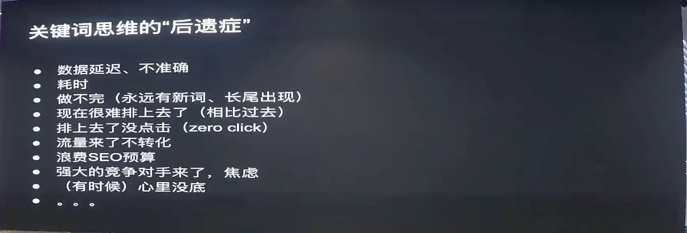
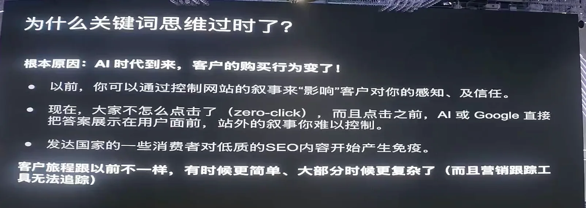
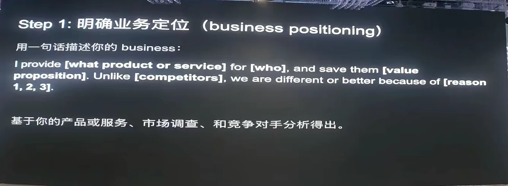
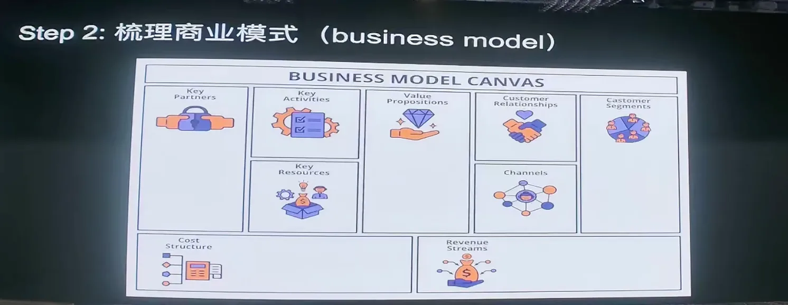
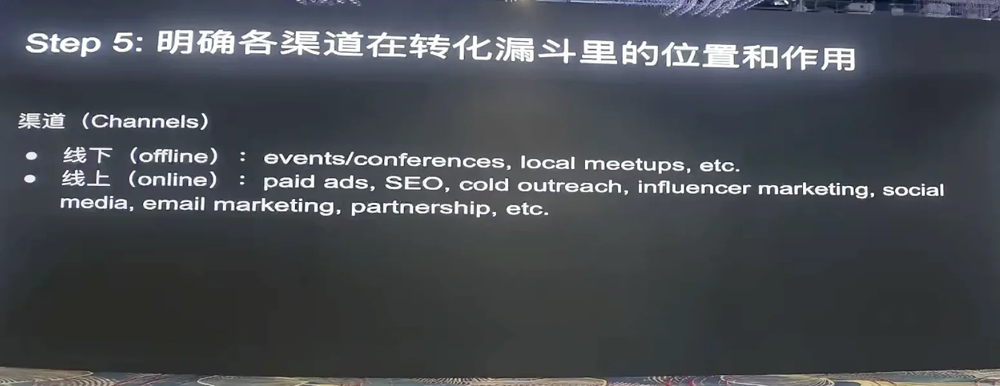
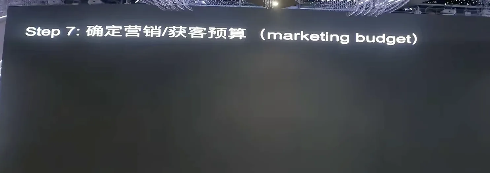
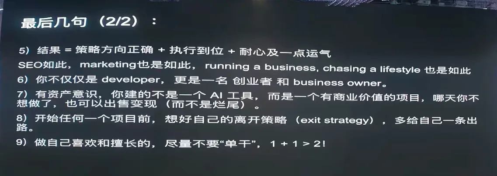

# 放弃关键词思维：出海如何重构 SEO 与获客策略

> 在「**哥飞的朋友们·年中分享交流会·深圳站**」上，SEO实战派创始人 John 带来了一场偏宏观、偏战略层面的分享，并现场用 AI 演示了如何从零重构一套出海获客方案。
>
> 他的核心判断是：**传统"找关键词 → 建页面 → 导流量到网站 → 转化"的本位思维，在 AI 时代正在失效。** 尤其对 B2B、外贸、电商等领域，谷歌 AI Overview 已经"满天飞"；AI 小工具赛道暂时还没那么卷，但这个打法迟早会过时。
>
> 他给出的替代方案，是从"以网站为中心"切换到**全网优化思维**——网站只是触点之一，LinkedIn 上的 profile、YouTube 上的讨论、AI 搜索里的品牌认知，都可能比你的网站更能影响客户决策。

---

## 一、他是谁

John（JP Zhang）从 2013 年开始靠做网站赚钱，在美国读书期间（旧金山）就开始接触 SEO。2014–2016 年分别在硅谷和圣地亚哥两家公司担任 SEO Manager；2017 年回国创办 SEO 相关公司，也是 SEO实战派和 SEO实战学院的发起人。2025 年 4 月前后，他在美国重新创业（full-time SEO），至今约十年。

> 他开场就感谢了哥飞的邀请，并提到这次深圳场是他们 SEO 大会的目标之一——9 月份的大会目标是 600 人规模。

---

## 二、什么是"关键词思维"（本位思维）

John 现场做了两个小调查：大约一半人承认自己的流程是"先找关键词 → 看到工具词有量 → 再建站/写内容"；约八成是"先选产品 → 再选关键词 → 再写内容"的模式。

他把这种模式叫做**本位思维**：

1. 从关键词出发；
2. 写文章或建落地页；
3. 把流量导入网站；
4. 在网站上完成转化。

> 本质：**所有流量手段都围绕"把用户赶到网站上"**，网站是叙事的中心。

---

## 三、本位思维为什么越来越不灵

John 结合十多年 SEO 经验，总结了几个"后遗症"：

**1. 工具数据不准**
Semrush、Ahrefs、GSC 的数据，跟实际追踪工具对不上——有延迟、有偏差。

**2. 关键词永远追不完**
谷歌曾统计：每天搜索词里约 15% 是全新的（现在可能更高）。哥飞社群里也有"新词比赛"——就是因为新词永远找不完。

**3. SERP 越来越挤**
即使排名第一，用户可能要下滑一到两屏才真正看到你的结果——前面是付费广告、AI Overview、YouTube、People Also Ask…… 一个 SEO 同行做过极端测试：工具显示排名第一，实际用户在搜索结果里要滑到第十位左右才能看到。谷歌越来越不想把免费流量给你。

**4. 用户行为变了**
- 客户旅程跟以前不一样，有时更简单，但大部分更复杂；
- B2B 领域 80% 的决策在"冰山下面"，营销工具追踪不到——你能看到的只是冰山露出水面那一角；
- 用户现在大概率**先用 AI 搜索**，AI 不管你网站写得多漂亮，会自己去 YouTube、Reddit 等地方交叉验证；
- 用户来网站往往不是为了"了解产品"，而是**验证 AI 给的答案是否可信**——网站叙事和 AI 答案不一致，信任就崩了。

**5. 欧美用户免疫 SEO 软文**
John 常年在海外，他的观察是：欧美 tag 领域的人一眼就能识别 SEO 推广文/软文，产生免疫。有时候做 SEO 反而比不做更糟——给潜在客户留下"这公司只会写推广文"的坏印象。

> 根本原因：**AI 来了，用户行为变了，你还用"把流量引到网站、在网站上自说自话"的模式，已经不够了。**

---

## 四、新思维：从本位到全网优化

John 提出的替代框架是**全网优化思维**：

> 任何能影响目标客户对你产生感知的地方，都要优化——从"不知道你"到"知道你"，到"考虑你"，到"下单"，到"持续合作不走"。

**网站只是其中一环，不是中心。** 有时候你的 LinkedIn profile 比网站更能影响名望——因为 LinkedIn 上别人怎么讨论你，代表的是第三方视角；而你网站上的内容，在客户眼里都是"营销文案"。

后面他会用九步法教大家怎么重构 SEO 和获客策略。

---

## 五、重构 SEO 与获客的九步法

### 第一步：明确业务定位（Business Positioning）

用一句话说清楚：**我提供什么产品/服务，为谁，带来什么价值，跟竞争对手有什么不同。**

这就是美国商学院常说的 **Elevator Pitch**——你和投资人在电梯里只有 20 秒，能不能讲清楚你是做什么的。

> 关键：**一致性。** 如果这句话不清楚，你网站写的、Reddit 发的、LinkedIn 上的、Twitter 上的可能各说各话——AI 就会犯迷糊：你到底是做什么的？你的客户是谁？

传统做这一步可能要几个月（用户调研 + 竞品分析 + 自我分析）。John 引用了一位英国嘉宾在 SEO 大会上的框架：**Know Your Customer → Know Your Competitor → Know Yourself**，三个的交叉点就是业务定位。

### 第二步：画出商业模式

用商业模式画布的九个格子标准化：客户是谁、价值主张、渠道、合作伙伴、成本结构、收入来源…… 现在有 AI，一句命令就能画出来。

### 第三步：验证产品市场契合（PMF）

定位有了、商业模式画了，还要到真实市场验证——你的理想客户是不是跟你想象的一样？这一步要产出：
- **理想客户画像（ICP）**
- **负面客户画像**（为什么要找负面画像？因为这些人会让你亏钱，要远离他们）

### 第四步：梳理用户旅程 / 转化漏斗

客户怎么走，你就去哪里出现。站在商家角度就是转化漏斗；站在客户角度就是用户旅程——两者相辅相成。

### 第五步：确定渠道

线上 + 线下都要考虑。John 特别提醒：**不要把所有精力砸在线上，线下有时更便宜、更快、ROI 更高。** 西方很多小城市有 local meetup，与其线上触达不如线下面聊，直接拿到第一手反馈。

### 第六步：制定总体获客策略

### 第七步：确定营销预算

- 没钱有时间 → 花时间去换（SEO、内容、冷启动）；
- 有钱没时间 → 花钱买时间（投广告、招人）；
- **老板切记不要亲自做地推**，你是定方向的航海家。

### 第八步：制定细分渠道策略

SEO、社媒、付费广告、Email Marketing、红人、Partnership、Cold Outreach…… SEO 只是 organic 渠道之一；赞助大会、投广告属于 paid 渠道。每个渠道怎么打、怎么配合，依托于第七步的预算分配。

### 第九步：定期策略调整

AI 行业变化太快，建议**每 3 个月小 review 一次，6–9 个月大 review 一次（不超过一年）**。有时候 6–9 个月前还蓝海的市场，已经变成红海——该调头就调头，甚至考虑卖掉可能是比硬扛更好的选择。

---

## 六、现场演示：用 AI 一小时搭一套竞品对抗方案

John 用 15–20 分钟现场演示了完整流程。案例背景：

- 硅谷 SEO 大佬 **Eli Schwartz**（《Product-Led SEO》作者）在 LinkedIn 上给一个叫 **WriteHuman** 的 AI Humanizer 工具打广告；
- John 试用后发现它只是微调几个词，并没有真正保留个人风格；
- 他决定：**一个人、没团队、没预算、来自中国，要跟 WriteHuman 竞争。**
- 产品取名 **JDChumanize**，定位差异化。

### 第一步：业务定位（AI 辅助）

他把 Google 搜索 "AI humanizer" 的前几名丢进 Google Gemini，让 AI 分析竞品定位，然后输入：

> "我是一个人，来自中国，会点编程，没团队没钱，想进入这个领域，怎么跟竞争对手差异化？"

AI 直接输出了定位（他一个字没改）：

- **理想客户**：高频输出的个人 IP 创作者、垂类专家
- **价值主张**：高效保持个人品牌声音，节省人工润色时间
- **差异化**：竞品是"让机器听起来像人类"，我们是**"让机器听起来像用户自己"**
- **定价**：高客单价订阅（因为高频使用者 cancel 成本高）
- **排除**：学生党全部划掉——他们是负面客户画像

> 一句话英文版：*"We provide personal voice AI for high-frequency content creators."*

### 第二步：商业模式画布

同样一句命令，九个格子全部输出——包括免费体验一个"音色胶囊"、专业版 $15–29/月、按胶囊付费、买年送两个月等。

### 第三步：三类理想客户 + 负面画像

**三类 ICP：**
1. **Indie Blogger / Newsletter 作者**——用文字赚钱，AI 出来后想用 AI 但怕失去个人风格；
2. **B2B 创始人 / 职场 leader**——需要在 LinkedIn、Twitter 高频发帖做个人 IP，付费意愿高、愿意花钱买时间；甚至用 EA（Executive Assistant）处理内容，如果 AI 工具更便宜就会用 AI；
3. **Ghost Writer / Agency**——帮大老板代写内容，需要保证文风一致。

**三类人的共同点**：用文字赚钱，对"机器味"有痛觉。

**负面画像（要远离）：**
- **学生党**：白嫖、没忠诚度、不给免费就差评，还会在 Reddit 上喷你是 scam——"点火容易灭火难"，一句差评要十倍代价才能挽回；
- **批量搬运的黑帽站长和货电商**；
- **一次性用户**：找到工作就不回来了。

> John 还分享了一个技巧：学生虽然不该作为付费客户，但可以**利用他们提升网站的用户交互分数和 direct 访问占比**，降低 SEO 流量占比——这样更能抵御谷歌核心算法更新。2023 年 9 月的 Helpful Content Update 和 2024 年 3 月核心更新，把世界上 99% 的内容站打下去了；他有朋友一天赚 5000 美金，算法更新后两天两夜没睡。

### 第四步：B2B 创始人的用户旅程（现场选了这类 ICP）

- **认知阶段**：这个人在刷 LinkedIn/Twitter 时看到你的对比帖——不是去 Google 搜 "AI humanizer"，而是像 John 看到 Eli Schwartz 的帖一样被种草；
- **评估阶段**：不在乎价格，只在乎效率——"能不能让我少花 5 分钟？" 他时间价值 $100–200/小时，省 10 分钟愿意付 $20；
- **决策阶段（Aha Moment）**：丢一段自己的语音转文字进去，系统返回一篇像他本人写的 LinkedIn 爆款帖——"就是这个！"
- **留存阶段**：每天用 3 分钟维持高质量输出，甚至商务邮件都用你的工具，变成你的拥护者，在行业峰会上推荐给其他老板。

### 第五步：各渠道怎么打

| 转化阶段 | 该做什么 |
| --- | --- |
| 认知 | Social Media 持续发帖（LinkedIn 有算法，保持频率和 consistency）；Cold Outreach 给 B2B 大佬发 LinkedIn 私信（不用加好友也能发 InMail） |
| 评估 | 建对比落地页：`JDChumanize vs WriteHuman vs Google Gemini`——**不是为了 Google 排名第一，是为了教育 AI（GEO）** |
| 决策 | 产品驱动 + Email Marketing |
| 留存 | 产品体验 + 社区 |

> 关于 GEO：当用户通过 AI 问"我是 XX 身份，预算 XX，推荐一个 AI humanizer"，AI 第一个推荐你——因为你在网站、外链、社媒上的叙事是一致的。

**SEO 策略（作为渠道之一，不是全部）：**
- 优先做**竞品对比页 + 长尾修饰词**：`quickbar alternative for creators`（不是追大词 `best AI humanizer`，而是在大词后面加 for creators / for personal branding，用户画像更精准、排名难度更小）；
- 场景化长尾：`How to make AI write like me on LinkedIn`、`ChatGPT sounds too robotic for B2B posts`；
- **寄生策略（Parasite SEO）**：新站没权重时，把内容发在 LinkedIn、Medium、Reddit 上，借高权重平台的力量——"寄生"不是贬义词。

**营销预算（零预算版）：**
- 告诉 AI"一分钱都没有，只有时间"，AI 给出 6 个月计划：营销成本约 $600，目标 MRR $2900，6 个月累计营收 $1 万——还没算网站本身的资产价值。

---

## 七、收尾：几条值得带走的认知

### 1. 要精准流量，不要泛流量

流量不是越多越好。吸引来错误流量（负面 ICP）甚至是有毒的——给你带来差评、消耗客服、拉低 AI 对你的品牌感知。

### 2. SEO 不要一开始就 All in

John 两年前的分享说过一个比喻：**SEO 像登山，远看海拔 8000 米，但 SEO 最适合发力的点是 3000 米左右**——当你的品牌有一定知名度、还没到大品牌阶段时，SEO 最多把你带到 6000 米，不可能从 0 直接带到 8848。

> 另一个比喻：苹果树小的时候你得跳上去摘，长大了苹果就在嘴边，再长高就用杆子够——**不要一开始就用 SEO，后面就没有了。**

### 3. 品牌时代，EMD（精确匹配域名）风险极高

注册域名时就期待一直排第一，在谷歌算法更新下非常 risky。现在算法更新利好的大部分都是品牌站。

### 4. 结果 = 方向策略 + 执行 + 运气

- 方向错了，再努力也白搭——要从本位思维转成全网优化思维；
- 方向对了但结果差，可能是执行问题；
- 就算方向对、执行到位，还需要一点耐心和运气——5 年前做跟现在做完全不一样。

### 5. 别把自己当 Developer，要当创业者

你做的不是工具，是**资产**——资产是有商业价值的。

- 今天日入万刀，一年后还能日入万刀的概率很低；
- 要分析你的增长，甚至**增长的增长（Growth of Growth）**——当增长的增长放缓时，可能是变现/出售的最佳时机；
- John 分享过教训：有内容站估值超过 100 万美金，死扛着不卖，最后至少 95% 的价值没了。

### 6. 尽量别单干

创业不是 90 分靠一个人，真做大需要合伙人——提供情绪价值、能力互补，一起扛比一个人扛轻松得多。

---

> 本文根据「哥飞的朋友们·年中分享交流会·深圳站（2026.07.04~07.05，深圳御景国际酒店）」上 SEO实战派创始人 John 的分享整理，内容为现场观点、框架与案例演示的转述与提炼，供哥飞社群伙伴及出海同行参考交流，不代表平台立场。文中涉及 SEO 策略、外链操作、灰帽手法等具体做法，请自行判断合规与风险；如需转载或引用，请注明来源并联系原作者授权。
