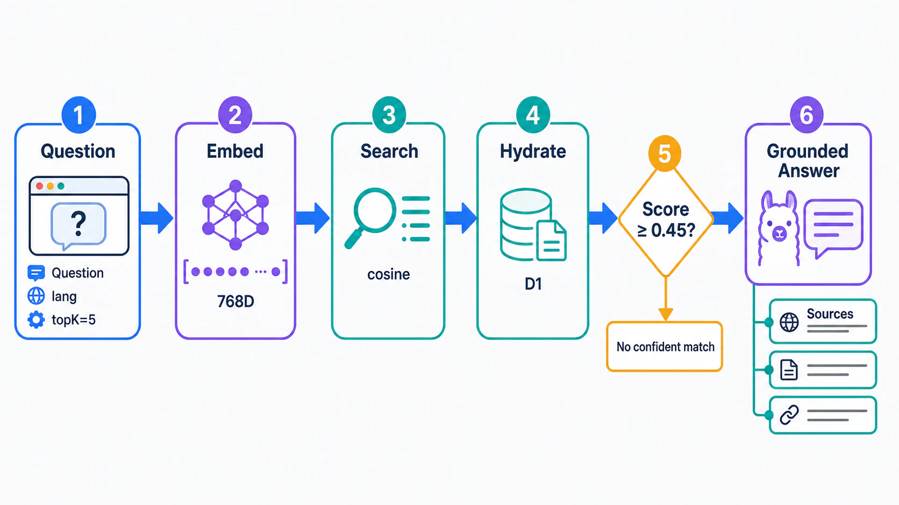
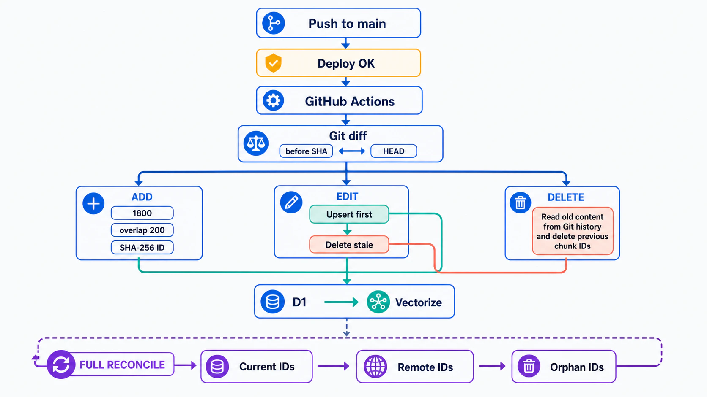

一个双语内容站采用 Astro 静态生成。静态站便宜、稳定、容易缓存，但它天然只会“展示文章”，不会理解文章，更不会回答读者的问题。

为了让读者能够直接问“站内整理过哪些 AI 编程经验”“某篇文章里提到的部署方案是什么”，系统增加了一套 RAG（Retrieval-Augmented Generation，检索增强生成）问答能力。它不是让大模型凭记忆回答，而是先从内容向量库中找出相关原文，再要求模型只根据这些原文作答并返回来源。

真正困难的部分并不是接一个聊天模型，而是让知识库持续跟上博客变化。如果新增文章没有进入向量库，AI 就不知道它；如果文章修改或删除后旧向量还在，AI 又会引用过期内容。因此，这套系统同时解决了两个问题：**运行时如何可靠回答，以及发布时如何自动保持索引一致。**

## 一、整体架构：静态站负责体验，Worker 负责智能


系统被刻意拆成两个独立层次：

- 内容展示层：存放中英文 MDX 文章、静态问答页面和 GitHub Actions；
- RAG 服务层：运行在 Cloudflare Workers，负责检索、问答和受保护的索引管理。

前端仍然是纯静态页面。问答页面只负责收集问题，并向独立的 RAG 服务发送结构化请求：

```json
{
  "lang": "zh-cn",
  "question": "我对 AI 编程有什么看法？",
  "topK": 5
}
```

浏览器不会直接访问数据库，也拿不到任何写入密钥。所有 embedding、检索、数据库读取和模型调用都在服务端完成。

服务端组合了三项 Cloudflare 能力：

1. **Workers AI**：生成查询和文章分块的 embedding，并生成最终回答；
2. **Vectorize**：保存 768 维向量，负责余弦相似度检索；
3. **D1**：保存分块原文、标题、URL、语言、标签等可读数据。

Vectorize 适合回答“哪些分块最相似”，D1 适合回答“这些 ID 对应的原文和链接是什么”。把向量与正文分开保存，既降低了向量元数据负担，也方便调试和返回引用来源。

## 二、文章是怎么进入知识库的

同步脚本扫描 `src/content/blog/{lang}/{slug}/index.mdx`，并对每篇文章执行以下处理：

1. 读取 title、description、date、tags 和 categories；
2. 清理 MDX import、代码块、图片链接、HTML 标签和 Markdown 标记；
3. 按约 1800 个字符切分，相邻分块保留 200 个字符重叠；
4. 使用 `contentId + 分块序号 + 分块正文` 计算 SHA-256；
5. 取哈希前 24 位，加语言前缀，生成稳定的 chunk ID；
6. 通过受保护的管理通道，每批写入 32 个分块。

重叠区域很重要。一段完整观点可能刚好跨越切分边界，没有 overlap 时，两边都只剩半句话；保留少量上下文后，检索命中任何一边都更容易得到完整语义。

服务端收到分块后，用默认模型 `@cf/google/embeddinggemma-300m` 生成 768 维 embedding，然后：

- 将原文及元数据 upsert 到 D1；
- 将向量和 `lang`、`source`、`content_id` 写入 Vectorize。

管理通道单次最多接收 64 个分块，并要求管理员凭据。同步脚本实际使用每批 32 个，以控制单次 embedding 请求和边缘服务的执行压力。

## 三、一次 AI 问答是怎么发生的



一次问答经过六个阶段。

### 1. 校验问题

服务端接收 `question`、`lang` 和 `topK`。问题最长 1000 个字符，`topK` 默认取 5，并限制在 1 到 10 之间。

### 2. 生成查询向量

问题会被格式化为 question-answering 查询，再通过同一个 embedding 模型生成向量。查询和文档使用一致的向量空间，才能比较语义距离。

### 3. 按语言检索 Vectorize

服务端使用余弦相似度搜索，并设置 `filter: { lang }`。中文问题只查中文文章，英文问题只查英文文章，避免翻译版本互相竞争，也让返回链接和读者当前语言保持一致。

### 4. 从 D1 补齐正文

Vectorize 返回匹配 ID 和分数，服务端再批量从 D1 读取标题、URL、正文及其他元数据。这个过程可以理解为先用向量找到候选，再用关系数据库“补齐”可供模型阅读的上下文。

### 5. 置信度闸门

默认最低分数是 `0.45`。如果没有结果，或者最高分低于阈值，系统不会强行让大模型发挥，而是明确告诉读者：索引中没有足够可靠的证据。

这道闸门比一句“不要编造”更有用，因为无关上下文本身就可能诱导模型拼凑答案。

### 6. 基于上下文生成并返回来源

通过阈值后，服务端将命中的标题、URL 和正文组成 Context，要求 `@cf/meta/llama-3.1-8b-instruct-fast`：

- 只能使用提供的博客上下文；
- 上下文不足时明确说不知道；
- 使用 `[1]`、`[2]` 标记引用；
- 不编造事实、链接或观点。

生成参数保持克制：temperature 为 `0.2`，最多 900 tokens。最后按 URL 去重来源，返回答案、标题、链接和相似度。查询及命中分块 ID 还会异步写入 `ask_events`，用于后续观察真实用户在问什么。

### 从界面看完整问答闭环


这张实际运行截图把后端流程变成了读者能够感知的三个区域：顶部输入问题，中间展示基于检索内容生成的回答，底部列出命中的原始文章和相关度。截图中的站点标识已做匿名化处理。

回答区与来源区刻意分开。读者可以先快速获取结论，再根据文章标题和相关度判断是否继续阅读原文。这不仅提升了问答体验，也提醒使用者：答案来自可追溯的内容证据，而不是模型凭空生成。

## 四、GitHub Actions 如何自动同步文章



早期版本已经有 upsert 脚本，但必须手工执行。博客发布和知识库更新是两条独立流程，人很容易忘记，最终就会出现“网站上看得到，AI 却不知道”的断层。

现在，同步被放进内容项目的部署工作流：

```text
push main → 构建 Astro → 部署 GitHub Pages → 同步知识库
```

同步任务通过 `needs: build-and-deploy` 等待网站部署成功；失败的构建不会把未上线内容提前写进知识库。checkout 使用 `fetch-depth: 0`，因为增量计算必须读取完整 Git 历史。

### 新增文章

脚本读取新文件，清理、切分、生成 ID，然后批量 upsert。相同 ID 再次写入是幂等的，因此重跑不会产生重复记录。

### 修改文章

脚本同时读取 `before SHA` 和 `HEAD` 中的文章，分别计算旧、新分块集合：

- 新集合全部 upsert；
- 只存在于旧集合的 ID 视为 stale chunks，并删除。

执行顺序是 **先 upsert、后 delete**。如果同步中途失败，最多暂时保留旧内容，而不会先删掉整篇文章后只写入一半。

### 删除文章

工作区里已经没有被删除的文件，但 Git 历史仍然有。脚本通过 `git show <before SHA>:<path>` 读取旧内容，重新算出所有旧 chunk ID，再通过受保护的管理通道同时清理 D1 和 Vectorize。

### 重试与故障可见性

每次管理请求设置 60 秒超时，失败最多重试 3 次。Actions 中如果没有配置同步凭据，任务会明确失败，而不是悄悄跳过。对知识库来说，“红灯报警”比长期静默过期更安全。

## 五、为什么还需要全量对账

增量同步只比较相邻两次提交。如果某次 Actions 彻底失败，而下一次只处理新的 diff，中间那次变更就可能永远漏掉。

因此手动运行 workflow 时，系统会执行全量对账：

1. 重新扫描并 upsert 当前仓库的全部文章；
2. 通过受保护的分页查询读取远端内容 ID；
3. 对比当前 ID 与远端 ID；
4. 删除只存在于远端的 orphan IDs。

增量同步解决日常效率，全量对账解决最终一致性和自愈。首次启用、同步规则变化、embedding 模型变更或怀疑漏数据时，都应该手动跑一次全量任务。

## 六、安全边界

这套系统把公开能力与管理能力分开：

- 问答和检索能力可以公开访问，但受输入长度和 CORS 限制；
- 写入、删除和索引清单能力必须携带管理员凭据；
- 管理员凭据保存在部署平台的 Secret 中；
- GitHub Actions 使用同一凭据完成自动同步；
- Token 不进入前端构建产物，也不提交到 Git。

即使读者能够访问公开问答入口，也只能提问，不能篡改知识库。

## 七、当前方案的取舍

这套实现已经足够支撑个人博客，但仍有清晰的改进空间：

- 当前按字符切分，可以升级为按标题、段落和 token 的语义切分；
- 清理逻辑会移除代码块，技术文章若要回答具体代码问题，需要保留或单独索引代码；
- Vectorize 写入是异步的，发布完成后可能需要几秒才能检索到新向量；
- 全量对账会重新生成全部 embedding，可靠但比增量同步更耗资源；
- 可以增加索引版本、同步运行记录和文章级校验和，让可观测性更完整。

## 结语

给内容站增加 AI 问答，真正有价值的不是页面上多了一个输入框，而是形成了一条可靠的知识流水线：文章是唯一事实源，GitHub Actions 负责发现变化，RAG 服务负责 embedding 与检索，D1 和 Vectorize 各司其职，大模型只在找到可靠证据后回答。

当新增、修改和删除都能自动传播，失败还能通过全量对账恢复时，这套 AI 问答才不只是一个演示功能，而是博客内容系统真正的一部分。
