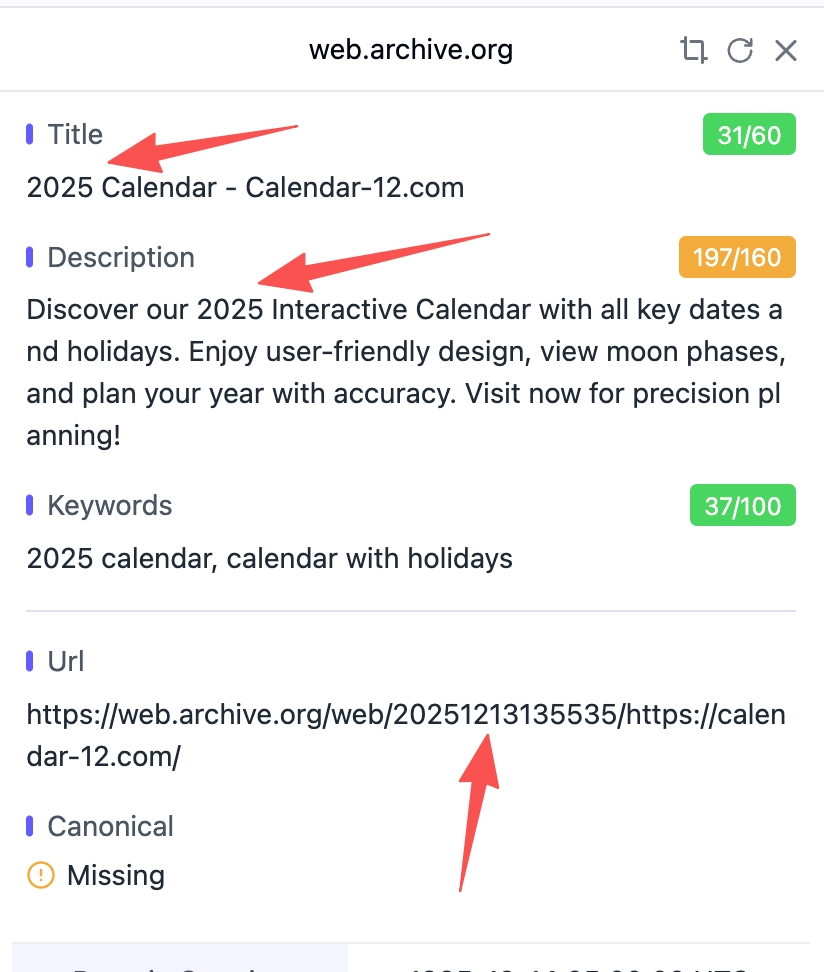
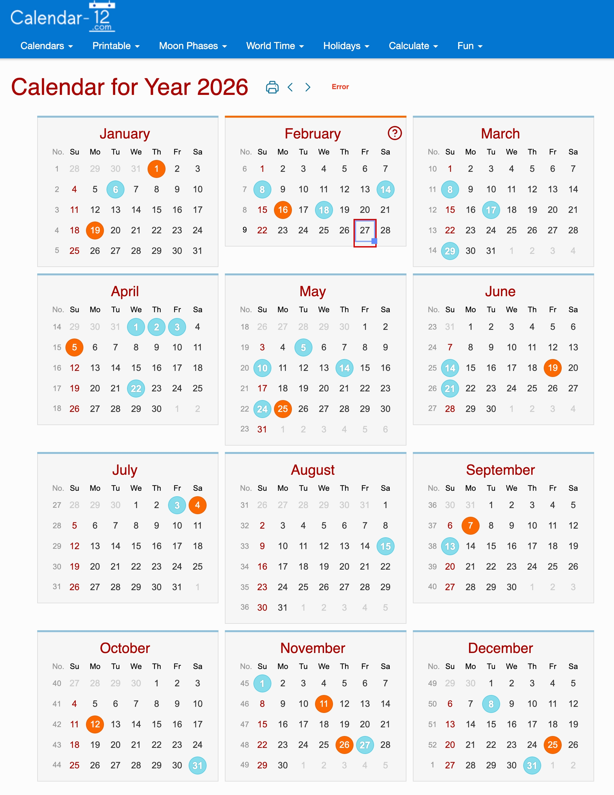
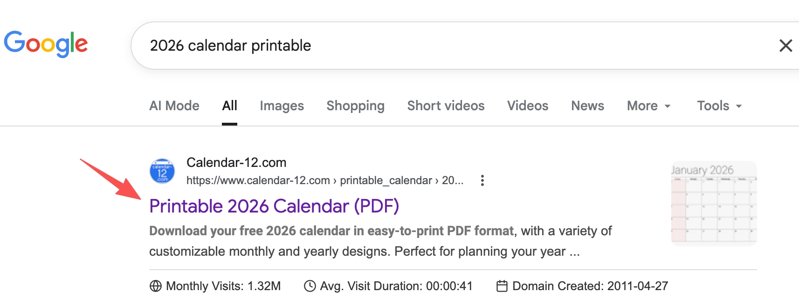
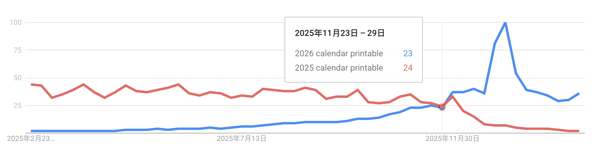

最近看了哥飞老师分享的一个老站案例，我觉得非常值得拆解。

这是一个 2011 年上线的网站：`calendar-12.com`。  
15 年过去了，依然有非常稳定的搜索流量。

---

## 一、这个站到底吃什么流量？

核心就是**年份 + 日历**这类可预判关键词，比如 2026 年：

- `2026 calendar printable`
- `calendar 2026`
- `2026 calendar`
- `printable calendar 2026`
- `2026 printable calendar`

这类词有个特点：  
**每年都会重复出现，而且需求会提前发生。**

---

## 二、首页不是固定文案，而是“动态年份”

你可能会问：  
现在首页 Title 写的是 2026，那去年是不是 2025？

先看当前页面，Title / Description / Keywords 都是 2026：

再看 archive.org 的历史快照，2025-12-13 还是 2025：

这说明它首页策略很清晰：  
**用程序自动填充当年年份，保证首页始终命中“当年词”。**

同时首屏直接展示当年月历，打开就能用：

---

## 三、真正的关键：它不是只有首页，而是“年份内页矩阵”

这个站并不只靠首页，而是每个年份都做了对应内页。  
从导航也能看出已经布局到未来年份：

搜索结果也能验证：

- 搜 `2026 calendar printable`，命中 2026 内页

- 搜 `2025 calendar printable`，命中 2025 内页

- 搜 `2027 calendar printable`，依然有对应页面参与排名

- 搜 `2028 calendar printable`，同样有对应页面

---

## 四、为什么 2027、2028 一定要提前做？

这是这个案例最值钱的地方。

很多人会到 2027 年才做 2027 页面，但真实搜索行为不是这样的。  
需求往往在前一年甚至更早就开始爬升。

比如趋势图里能看到：

- `2026 calendar printable` 在 2025 年就开始走高

- `2027 calendar printable` 也在 2025 年下半年出现需求

---

## 五、方法论总结：可预判关键词，拼的是“时间差”

这个案例不是黑科技，而是长期主义 + 工程化执行：

1. 首页动态年份，吃当年主词
2. 年份内页矩阵，吃长尾和未来词
3. 提前 1~2 年发布，抢低竞争窗口
4. 提前积累用户行为数据（点击、停留、回访）
5. 随着站点整体权重增长，内页排名持续受益

一句话：

> **能预测的需求，不要等需求爆发再做；要在需求启动前把页面挂上去并开始积累。**

---

## 六、给内容站/工具站的可执行清单

如果你做的是“年份型、周期型、可预测型”关键词（不只日历），可以直接套：

- 关键词：按年份批量生成主词 + 变体词
- 页面：首页动态 + 年份内页常驻
- 时机：至少提前 1 年，理想提前 1.5~2 年
- 运营：每季度补充内容，持续内链导流
- 监控：看收录、排名、CTR、停留时间

---

这类站的核心不是追热点，而是**提前卡位 + 长期复利**。  
看起来慢，但一旦跑起来，流量会非常稳。
